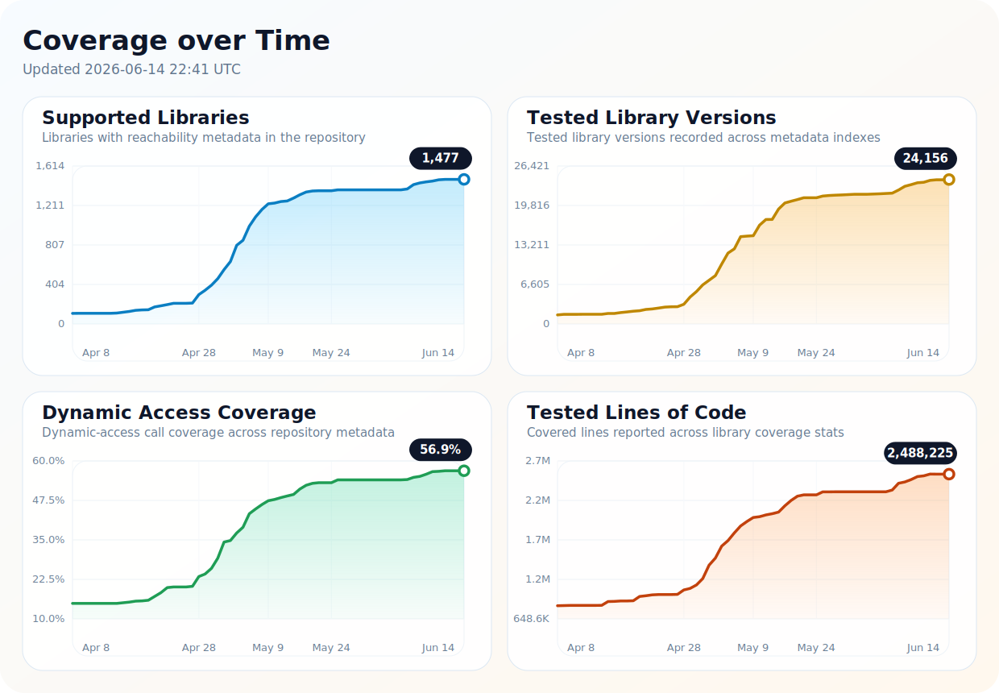

# Coverage

Updated: 2026-05-03

## Libraries

| Library | Description | Dynamic access coverage |
| --- | --- | ---: |
| `antlr:antlr` | ANTLR 2 is a parser generator and runtime for building lexers, parsers, tree parsers, compilers, and translators from grammar files. The antlr artifact provides the Java tool and runtime classes used to generate and run parsers, with code generation support for Java, C++, C#, and Python. | 80.0% (12/15 calls) |
| `aopalliance:aopalliance` | AOP Alliance defines a small set of standard Java interfaces for aspect-oriented programming, especially method and constructor interception. Libraries use these interfaces to expose portable advice and interceptor contracts without depending on a particular AOP implementation. | 100.0% (0/0 calls) |
| `app.cash.sqldelight:coroutines-extensions-jvm` | SQLDelight Coroutines Extensions provides Kotlin extension functions that expose SQLDelight Query objects as kotlinx.coroutines Flow streams. It also supplies Flow mapping helpers that asynchronously collect one row, optional or default rows, non-null rows, or lists from emitted queries. | 100.0% (0/0 calls) |
| `at.yawk.lz4:lz4-java` | lz4-java provides Java bindings and pure Java implementations of the LZ4 compression algorithm and XXHash hashing algorithm. It includes compressors, decompressors, and streaming APIs for high-performance data compression in Java applications. | 50.0% (5/10 calls) |
| `avalon-framework:avalon-framework` | Avalon Framework provides Java interfaces and supporting default implementations for building components that interact with containers through lifecycle, configuration, context, logging, service, and component-manager contracts. It lets applications and containers share a small inversion-of-control style API for wiring, configuring, starting, and managing reusable components. | 100.0% (2/2 calls) |
| `backport-util-concurrent:backport-util-concurrent` | backport-util-concurrent is a backport of the JSR 166 concurrency APIs for pre-Java 5 runtimes. It provides executors, locks, blocking queues, atomics, concurrent collections, and related utilities for applications that need modern Java concurrency support on older Java platforms. | 100.0% (61/61 calls) |
| `berkeleydb:je` | Berkeley DB Java Edition is a pure Java embedded database library that provides a transactional key-value store built on a B+Tree access method. It lets applications persist and query local data using direct database APIs, collections bindings, and an object persistence layer. | 37.6% (53/141 calls) |
| `biz.aQute.bnd:biz.aQute.bnd.annotation` | The biz.aQute.bnd.annotation artifact provides bnd-specific Java annotations for OSGi bundle metadata, package versioning, capabilities, service metadata, JPMS hints, licenses, and plugin declarations. These annotations are consumed by bnd and related tooling to generate or validate bundle headers and metadata without hard-coding that information in build instructions. | 100.0% (9/9 calls) |
| `ch.qos.cal10n:cal10n-api` | CAL10N is a Java localization library that uses enum-based message keys and annotations to improve type safety over string-based ResourceBundle lookups. It also provides verification utilities and a Maven plugin to check that enum keys and locale-specific resource bundles stay synchronized. | 100.0% (2/2 calls) |
| `ch.qos.logback.contrib:logback-jackson` | logback-jackson provides a Jackson-based implementation of Logback Contrib's JSON formatter API. It converts log event data maps into JSON strings and supports optional pretty-printing through Jackson. | 100.0% (0/0 calls) |
| `ch.qos.logback.contrib:logback-json-classic` | Provides a Logback Classic JSON layout that converts logging events into JSON output. It emits standard fields such as timestamp, level, thread, MDC, message, exception, and context. | 100.0% (0/0 calls) |
| `ch.qos.logback.contrib:logback-json-core` | Provides the core abstractions for rendering Logback output as JSON, including base layout support and JSON formatting hooks. It serves as the shared foundation for the Logback JSON modules that produce structured log output. | 100.0% (0/0 calls) |
| `ch.qos.logback:logback-classic` | Logback Classic is the native SLF4J implementation for the Logback logging framework in Java applications. It provides logger configuration, appenders, layouts, and filtering for routing and formatting log events. | 12.7% (7/55 calls) |
| `ch.qos.logback:logback-core` | Logback Core is the foundational module of the Logback logging framework for Java. It provides appenders, encoders, layouts, rolling policies, filters, and support classes used by higher-level Logback modules. | 100.0% (56/56 calls) |
| `com.android.databinding:baseLibrary` | Android Data Binding baseLibrary provides the shared annotation and observable callback APIs used by the Android Data Binding runtime and compiler. It defines types such as @Bindable, @BindingAdapter, @BindingConversion, Observable, ObservableList, ObservableMap, and CallbackRegistry so generated binding code and applications can communicate data changes. | 100.0% (0/0 calls) |
| `com.android.tools.build:builder-model` | builder-model defines the public model interfaces used by the Android Gradle build system to describe projects, variants, artifacts, source providers, dependencies, and build configuration. Consumers such as IDE integrations use these model objects to inspect Android project structure without depending on the full builder implementation. | 100.0% (0/0 calls) |
| `com.android.tools.jack:jack-api` | Jack API provides Java interfaces for discovering and configuring Jack compiler providers at runtime. It exposes versioned compilation configuration, task creation, reporting, multidex, collision-policy, and source-version options used by tools that invoke Jack. | 100.0% (0/0 calls) |
| `com.android.tools:annotations` | com.android.tools:annotations provides the nullability, visibility, and concurrency annotations shared by Android tools libraries. These annotations let Android build and analysis tooling express API contracts for static analysis and documentation without adding runtime behavior. | 100.0% (0/0 calls) |
| `com.atomikos:transactions` | Atomikos Transactions Core provides the core transaction manager and two-phase commit coordination classes used for distributed transactions. It also includes recovery and log persistence components for durable transaction state and crash recovery. | 100.0% (1/1 calls) |
| `com.atomikos:transactions-api` | Atomikos Transactions API defines the public interfaces and configuration contracts for Atomikos-managed distributed transactions, participants, and transactional resources. It also exposes recovery and logging abstractions used to coordinate two-phase commit and crash recovery. | 100.0% (0/0 calls) |
| `com.baomidou:mybatis-plus` | MyBatis-Plus is an enhancement toolkit for MyBatis that reduces boilerplate for CRUD operations, query construction, and mapper development. It adds wrappers, pagination, service utilities, and related extensions to speed up database application development. | 100.0% (0/0 calls) |
| `com.barchart.udt:barchart-udt-bundle` | Barchart UDT Bundle packages the Barchart Java bindings for the UDP-based Data Transfer protocol together with native libraries for multiple platforms. It lets JVM applications use UDT sockets and channels for high-throughput network communication without assembling the core JAR and native NAR artifacts separately. | 100.0% (15/15 calls) |
| `com.clickhouse:org.roaringbitmap` | This artifact repackages RoaringBitmap with JPMS module metadata for use by ClickHouse Java. It provides compressed bitmap data structures for efficient storage and fast set operations over integer and long sets. | 100.0% (0/0 calls) |
| `com.codahale.metrics:metrics-core` | Metrics Core provides the core metric types and registry infrastructure for the Dropwizard Metrics library. It helps Java applications record counters, gauges, histograms, meters, and timers so runtime behavior can be observed in production. | 100.0% (2/2 calls) |
| `com.datastax.oss:java-driver-shaded-guava` | java-driver-shaded-guava packages Guava 25.1-jre under the com.datastax.oss.driver.shaded.guava namespace for use by the DataStax Java Driver for Apache Cassandra. The artifact avoids repeated shading across driver modules and includes GraalVM substitutions for Guava classes used when building native images. | N/A |
| `com.datastax.oss:native-protocol` | DataStax Native Protocol is a Java implementation of the Apache Cassandra native protocol. It provides frame and message model types with serialization and deserialization logic for Cassandra and DataStax Enterprise protocol variants. | 100.0% (0/0 calls) |
| `com.diffplug.durian:durian-swt.os` | Durian SWT OS provides small Java utilities for detecting the current operating system, CPU architecture, windowing system, and SWT platform identifier. It helps SWT-based tools choose the right platform-specific SWT artifact without depending directly on SWT or JFace. | 100.0% (0/0 calls) |
| `com.ecwid.consul:consul-api` | This library is a Java client for the Consul HTTP API. It lets Java applications interact with Consul features such as key-value storage, service registration, health checks, and catalog queries. | 100.0% (0/0 calls) |
| `com.esotericsoftware:minlog` | MinLog is a tiny Java logging library that provides concise static logging methods with runtime-configurable log levels. It is designed for minimal overhead, including fixed-level builds that let javac remove disabled logging statements at compile time. | 100.0% (0/0 calls) |
| `com.fasterxml.jackson.core:jackson-annotations` | Jackson Annotations provides core Java annotation types used by Jackson data-binding and related modules to configure JSON serialization, deserialization, type handling, and property naming. It is a small companion artifact that contains annotation APIs rather than runtime data-binding logic. | 100.0% (0/0 calls) |
| `com.fasterxml.jackson.core:jackson-core` | Jackson Core provides the core abstractions and streaming JSON parser and generator implementation for Jackson. It lets Java applications read and write JSON incrementally with a low-level token-based API. | 100.0% (5/5 calls) |
| `com.fasterxml.jackson.core:jackson-databind` | Jackson Databind provides general-purpose data binding and tree-model APIs for Jackson on top of the core streaming API. It converts between JSON and Java objects and can also work with other data formats when compatible parsers and generators are available. | 30.6% (22/72 calls) |
| `com.fasterxml.jackson.dataformat:jackson-dataformat-cbor` | Jackson Dataformat CBOR adds support for reading and writing Concise Binary Object Representation (CBOR) data through Jackson's streaming, data binding, and tree model APIs. It provides CBOR-specific parser, generator, factory, and mapper implementations so Java applications can serialize and deserialize objects and JSON-like structures in a compact binary format. | 100.0% (0/0 calls) |
| `com.fasterxml.jackson.dataformat:jackson-dataformat-toml` | Jackson Dataformat TOML adds Jackson support for reading and writing TOML documents. It provides TOML parsing and generation through Jackson's streaming and databinding APIs. | 100.0% (0/0 calls) |
| `com.fasterxml.jackson.dataformat:jackson-dataformat-yaml` | Jackson Dataformat YAML provides Jackson-backed reading and writing of YAML data through the standard streaming and data-binding APIs. It integrates SnakeYAML as the underlying YAML parser and generator so Java applications can serialize and deserialize YAML alongside other Jackson data formats. | 100.0% (0/0 calls) |
| `com.fasterxml.jackson.datatype:jackson-datatype-jdk8` | Jackson Datatype JDK8 is an add-on module for Jackson Databind that adds serialization and deserialization support for Java 8 types such as Optional, OptionalInt, OptionalLong, and OptionalDouble. It lets ObjectMapper handle those JDK 8 container types through Jackson's standard module registration mechanism. | 100.0% (0/0 calls) |
| `com.fasterxml.jackson.datatype:jackson-datatype-jsr310` | Jackson Datatype JSR310 is an add-on module for Jackson that adds serialization and deserialization support for Java 8 Date and Time API types. It lets ObjectMapper handle java.time classes such as LocalDate, LocalDateTime, OffsetDateTime, and Instant using Jackson's standard module registration mechanism. | 100.0% (0/0 calls) |
| `com.fasterxml.jackson.jr:jackson-jr-objects` | Jackson Jr Objects is a lightweight data-binding module for reading JSON into maps, lists, strings, wrapper types, arrays, and Java beans, and for writing those values back as JSON. It builds on jackson-core with minimal dependencies and provides immutable JSON entry points plus builder-style composer APIs for direct JSON output. | 0.0% (0/53 calls) |
| `com.fasterxml.jackson.module:jackson-module-kotlin` | Jackson module that adds support for serializing and deserializing Kotlin classes and data classes. It lets Jackson infer constructor parameter names and work with single-constructor classes without requiring explicit property name annotations or default constructors. | 100.0% (19/19 calls) |
| `com.fasterxml.jackson.module:jackson-module-parameter-names` | Jackson Module Parameter Names is an add-on module for Jackson that lets databind inspect Java constructor and method parameter names without requiring explicit property-name annotations. It is intended for classes compiled with Java 8 parameter metadata so JSON creators and immutable types can be bound using their real parameter names. | 100.0% (0/0 calls) |
| `com.fasterxml:aalto-xml` | Aalto XML is a high-performance Java XML processor that implements StAX, StAX2, SAX, and SAX2 APIs. It supports both regular stream processing and non-blocking asynchronous XML parsing for JVM applications. | 100.0% (1/1 calls) |
| `com.fasterxml:classmate` | ClassMate is a Java library for introspecting types with full generic information, including resolved field and method types. It is especially useful for POJO and bean introspection. | 100.0% (5/5 calls) |
| `com.github.ben-manes.caffeine:caffeine` | Caffeine is a high-performance Java caching library that provides an in-memory cache with a Guava-inspired API. It supports automatic loading, size-based eviction, time-based expiration, refresh, reference-based entries, removal notifications, and cache statistics. | 75.9% (22/29 calls) |
| `com.github.docker-java:docker-java-transport` | docker-java-transport provides the core transport abstractions and shared utilities used by docker-java clients to communicate with the Docker Remote API. It defines common request and response plumbing that concrete transport implementations build on. | 100.0% (1/1 calls) |
| `com.github.ghik:silencer-lib_2.13` | This artifact provides the Scala annotation API used by the Silencer compiler plugin to suppress selected compiler warnings in Scala source code. It lets Scala projects mark definitions, statements, or expressions with @silent while the companion compiler plugin performs the warning filtering at compile time. | 100.0% (0/0 calls) |
| `com.github.java-json-tools:btf` | btf provides small Java interfaces for the builder pattern and a freeze/thaw pattern that converts between immutable objects and mutable counterparts. It is intended as a lightweight contract library for projects that want reusable builder-style and reversible mutable/immutable object APIs. | 100.0% (0/0 calls) |
| `com.github.java-json-tools:jackson-coreutils` | jackson-coreutils provides Jackson utilities for JSON Pointer support, JSON numeric equality, precise decimal handling, and stricter JSON node reading. It is intended for JVM applications that use Jackson and need reusable helpers for loading, comparing, and addressing JSON tree data. | 100.0% (2/2 calls) |
| `com.github.java-json-tools:msg-simple` | msg-simple is a lightweight, extensible message bundle API for Java applications that can replace ResourceBundle while also loading legacy ResourceBundles. It adds UTF-8 property file handling, printf-style message formatting, locale-aware message sources, stackable bundles, and built-in precondition helpers. | 100.0% (3/3 calls) |
| `com.github.javaparser:javaparser-core` | JavaParser parses Java source code and builds an abstract syntax tree that applications can inspect and transform. The core artifact provides the parser and AST model without the optional symbol solver. | 100.0% (24/24 calls) |
| `com.github.jknack:handlebars` | Handlebars.java is a Java implementation of the Handlebars template language for rendering logic-less, semantic templates on the JVM. It parses templates and applies them to Java objects with support for helpers, partials, loaders, escaping, and i18n. | 100.0% (53/53 calls) |
| `com.github.jknack:handlebars-helpers` | Handlebars Helpers provides a collection of community-contributed helper functions for Handlebars.java templates. It adds reusable helpers such as assignment, numeric predicates, row striping, include behavior, and Joda-Time helpers on top of the core Handlebars.java engine. | 100.0% (0/0 calls) |
| `com.github.luben:zstd-jni` | zstd-jni provides Java and JVM JNI bindings for the Zstandard compression library, including APIs for compressing and decompressing byte arrays. It also includes stream-based InputStream and OutputStream implementations that transparently read and write Zstandard-compressed data. | 100.0% (5/5 calls) |
| `com.github.mwiede:jsch` | JSch is a pure Java implementation of the SSH2 protocol. It provides client-side APIs for SSH sessions and related operations such as secure file transfer, port forwarding, and command execution. | 100.0% (204/204 calls) |
| `com.github.package-url:packageurl-java` | PackageURL Java is the official Java implementation of the Package URL specification. It parses, builds, canonicalizes, and validates purl identifiers used to describe software packages across ecosystems. | 100.0% (0/0 calls) |
| `com.github.spotbugs:spotbugs-annotations` | SpotBugs Annotations provides Java annotations that SpotBugs understands, such as nullness and warning-suppression markers. Libraries and applications add these annotations to code so SpotBugs can produce more precise static analysis results. | 100.0% (0/0 calls) |
| `com.github.stephenc.jcip:jcip-annotations` | JCIP Annotations is a clean-room, Apache-licensed implementation of the Java Concurrency in Practice annotation types for documenting thread-safety contracts such as @ThreadSafe, @NotThreadSafe, @Immutable, and @GuardedBy. It provides marker annotations only, with no runtime behavior, so developers and tools can express concurrency intent in Java code. | 100.0% (0/0 calls) |
| `com.github.virtuald:curvesapi` | curvesapi provides Java implementations of mathematical curves defined over control points. It supports Bezier, B-Spline, Cardinal Spline, Catmull-Rom Spline, Lagrange, Natural Cubic Spline, and NURBS curve types. | 100.0% (0/0 calls) |
| `com.google.android:annotations` | This library provides the Android platform annotation types used by tools and code, including annotations such as @SuppressLint and @TargetApi. It supplies compile-time metadata for Android APIs without adding runtime implementation behavior. | 100.0% (0/0 calls) |
| `com.google.api.grpc:proto-google-cloud-bigquerystorage-v1` | This artifact provides the generated Java Protocol Buffer classes and .proto descriptors for the Google Cloud BigQuery Storage v1 API. It defines messages, enums, resource names, and service-related types used by Java clients and gRPC stubs to read from and write to BigQuery Storage. | 100.0% (0/0 calls) |
| `com.google.api.grpc:proto-google-cloud-spanner-admin-instance-v1` | This artifact contains the generated Java Protocol Buffer model classes for the Cloud Spanner Instance Admin v1 API. It provides message types, resource-name helpers, and protobuf descriptors used by higher-level Spanner admin gRPC and client libraries to create, list, update, and delete instances, instance configs, and instance partitions. | 100.0% (0/0 calls) |
| `com.google.api.grpc:proto-google-iam-v1` | This artifact contains the generated Java Protocol Buffer classes for Google Cloud IAM v1 policy, binding, audit configuration, and IAM policy request and response messages. It lets JVM clients serialize, deserialize, and reference Google IAM v1 protobuf messages used by Google API and gRPC client libraries. | 100.0% (0/0 calls) |
| `com.google.auth:google-auth-library-credentials` | This artifact provides the base classes and interfaces used to represent Google credentials in Java. It supports authorized identities, request metadata callbacks, and service account signing abstractions for authentication flows. | 100.0% (0/0 calls) |
| `com.google.auto.service:auto-service-annotations` | AutoService Annotations provides the @AutoService annotation used to mark Java service-provider implementations for ServiceLoader registration. It is the compile-time annotation artifact used with the AutoService annotation processor, which generates META-INF/services provider-configuration files. | 100.0% (0/0 calls) |
| `com.google.auto.value:auto-value-annotations` | AutoValue Annotations provides the annotation types used to mark immutable value classes and AutoValue extension points in Java. It lets consumers reference those annotations without depending on the AutoValue processor artifact itself. | 100.0% (0/0 calls) |
| `com.google.cloud.tools:jib-build-plan` |  | 100.0% (0/0 calls) |
| `com.google.cloud:google-cloud-bigquery` | The Google Cloud BigQuery Java client library provides JVM APIs for working with BigQuery datasets, tables, jobs, queries, and results. It wraps BigQuery service operations with Google Cloud authentication, transport, and data model integrations for Java applications. | 100.0% (0/0 calls) |
| `com.google.code.findbugs:annotations` | FindBugs Annotations provides Java annotation types that let developers declare nullability, threading, and other static-analysis contracts in source code. These annotations are consumed by FindBugs-compatible tooling to detect likely defects without changing runtime behavior. | 100.0% (0/0 calls) |
| `com.google.code.findbugs:findbugs-annotations` | FindBugs Annotations provides Java annotations used to describe nullness, obligations, and other code contracts recognized by the FindBugs static analysis tool. These annotations let developers mark APIs and implementations so FindBugs can detect likely defects more accurately. | 100.0% (0/0 calls) |
| `com.google.code.findbugs:jsr305` | FindBugs JSR 305 packages Java annotation types for nullability, taint, regular-expression syntax, concurrency, and type-qualifier metadata. These annotations let Java code expose contracts to FindBugs and other static-analysis tools without adding runtime implementation behavior. | 100.0% (0/0 calls) |
| `com.google.code.gson:gson` | Gson is a Java library for converting Java objects to and from JSON. It provides object mapping, tree, and streaming APIs for JSON serialization and deserialization. | 100.0% (13/13 calls) |
| `com.google.dagger:dagger` | Dagger is a compile-time dependency injection framework for Java and Android applications. It uses annotations to generate type-safe wiring code, reducing runtime reflection and helping applications manage object graphs. | 100.0% (0/0 calls) |
| `com.google.errorprone:error_prone_annotations` | Error Prone Annotations provides Java annotations used by the Error Prone static analysis tool to express contracts, suppress warnings, and mark API behavior. The annotations are compile-time metadata and do not implement checking logic themselves. | 100.0% (0/0 calls) |
| `com.google.flatbuffers:flatbuffers-java` | FlatBuffers Java is the Java runtime API for Google's FlatBuffers serialization format, which stores structured data in compact binary buffers that can be read without unpacking. It provides builders, table/vector accessors, and FlexBuffers support used by generated Java code to create and inspect FlatBuffer messages. | 100.0% (0/0 calls) |
| `com.google.guava:failureaccess` | failureaccess provides Guava's internal classes for optionally exposing the cause of a failed Future through a fast path. It includes InternalFutureFailureAccess and InternalFutures for lightweight failure-cause access used by Guava concurrency utilities. | 100.0% (0/0 calls) |
| `com.google.guava:guava-bootstrap` | Guava Bootstrap provides a JDK 6-like java.util.concurrent.ExecutorService interface compiled with JDK 5 settings for use during Guava's build. It is used on Guava's bootstrap class path so Guava can compile invokeAll and invokeAny signatures consistently across JDK 5 and JDK 6. | 100.0% (0/0 calls) |
| `com.google.guava:listenablefuture` | This artifact is an empty compatibility placeholder that Guava depends on so build tools prefer it over the standalone ListenableFuture artifact. It avoids duplicate ListenableFuture classes when applications depend on Guava and the older standalone coordinate at the same time. | 100.0% (0/0 calls) |
| `com.google.j2objc:j2objc-annotations` |  | 100.0% (0/0 calls) |
| `com.google.javascript:closure-compiler-externs` | Closure Compiler Externs packages JavaScript extern definition files used by Google Closure Compiler to model browser, DOM, ES, and platform APIs during type checking and optimization. These definitions let the compiler recognize externally provided symbols so it can preserve public API names and perform safer JavaScript compilation. | 100.0% (0/0 calls) |
| `com.google.jsinterop:jsinterop-annotations` | JsInterop Annotations provides Java annotations such as @JsType, @JsMethod, and @JsProperty that describe the JavaScript-facing API of Java code. GWT and related Java-to-JavaScript compilers use these annotations to control generated JavaScript names, namespaces, native bindings, overlays, and ignored members. | 100.0% (0/0 calls) |
| `com.google.protobuf:protobuf-java` | Protocol Buffers are Google's language-neutral, platform-neutral, extensible mechanism for serializing structured data. The protobuf-java artifact provides the Java runtime API used by generated Java message classes to parse, serialize, and work with Protocol Buffer messages. | 100.0% (5/5 calls) |
| `com.google.protobuf:protobuf-java-util` | This library provides Java utility APIs for working with Protocol Buffers, including Proto3 JSON parsing and formatting. It also includes helpers for well-known protobuf types such as timestamps, durations, field masks, structs, and values. | 25.0% (1/4 calls) |
| `com.google.re2j:re2j` | RE2/J is a Java implementation of the RE2 regular expression engine that provides predictable linear-time matching. It exposes a Java-style regular expression API for compiling patterns and matching strings without backtracking behavior that can lead to exponential runtime. | 100.0% (0/0 calls) |
| `com.googlecode.concurrent-trees:concurrent-trees` | Concurrent-Trees provides high-concurrency radix, reversed radix, inverted radix, and suffix tree implementations for Java. It supports fast prefix, suffix, contains, autocomplete, keyword-scanning, and longest-common-substring lookup workloads while keeping reads lock-free and consistent during writes. | 100.0% (0/0 calls) |
| `com.googlecode.javaewah:JavaEWAH` |  | 100.0% (0/0 calls) |
| `com.graphql-java:graphql-java` | GraphQL Java is a Java implementation of GraphQL. It provides APIs to define a schema and execute GraphQL queries against it. | 6.1% (4/66 calls) |
| `com.graphql-java:graphql-java-extended-scalars` | This library adds extended scalar types for graphql-java beyond the GraphQL built-in scalars. It provides reusable scalars such as dates, times, UUIDs, JSON-like values, and constrained numeric types for GraphQL schemas. | 100.0% (0/0 calls) |
| `com.graphql-java:graphql-java-extended-validation` | This library adds extended validation for fields, arguments, and input values in graphql-java schemas. It provides directive-based constraints and validation rules that enforce allowable values during GraphQL execution. | 66.7% (2/3 calls) |
| `com.graphql-java:java-dataloader` | Java DataLoader is a pure Java 8 port of Facebook's DataLoader that batches and caches asynchronous data-loading calls. It helps GraphQL Java applications avoid duplicate backend fetches and N+1 query overhead by collecting keys and dispatching them in bulk. | 100.0% (0/0 calls) |
| `com.h2database:h2` | H2 is a Java SQL relational database that can run embedded in an application or as a server-based database. It provides JDBC support and offers both disk-based and in-memory storage options. | 10.9% (11/101 calls) |
| `com.hazelcast:hazelcast` | Hazelcast is a distributed computing and in-memory data platform for storing, querying, and processing data across a cluster. It provides distributed data structures, messaging, and stream processing features for building scalable, fault-tolerant applications. | 11.6% (117/1,008 calls) |
| `com.ibm.async:asyncutil` | AsyncUtil provides Java utilities for composing and coordinating CompletionStage-based asynchronous workflows. It includes helpers for async iteration, locks, queues, and stage collection so applications can build non-blocking control flow on top of CompletableFuture. | 100.0% (2/2 calls) |
| `com.intellij:annotations` | IntelliJ IDEA Annotations provides annotation types such as @NotNull, @Nullable, and @Language for documenting code contracts and guiding IDE inspections. It is a small Java annotation library used to express nullability, localization, formatting, and other static-analysis hints without adding runtime framework behavior. | 100.0% (0/0 calls) |
| `com.itextpdf:forms` | The iText forms module provides APIs for creating, reading, and modifying interactive PDF forms and their fields. It supports AcroForm and XFA processing, including field value updates, annotations, and form flattening. | 100.0% (0/0 calls) |
| `com.itextpdf:io` | Provides iText's core input/output layer for reading and writing binary data, images, colors, and other low-level resources used in PDF processing. It also includes font parsing and encoding support plus random-access stream utilities that higher-level iText modules build on. | 18.2% (2/11 calls) |
| `com.itextpdf:kernel` | The iText kernel module provides the core low-level PDF engine for reading, writing, and manipulating PDF documents in Java. It exposes the foundational PDF object model and processing APIs that higher-level iText modules build on. | 100.0% (2/2 calls) |
| `com.itextpdf:layout` | iText Layout provides iText Core's high-level layout API for building PDF documents with elements such as paragraphs, tables, lists, and images. It handles page-aware composition and formatting on top of iText's lower-level PDF engine. | 0.0% (0/1 calls) |
| `com.itextpdf:svg` | This iText module integrates SVG images into PDF creation and manipulation workflows. It parses and renders SVG content so it can be used within documents generated with iText. | 100.0% (0/0 calls) |
| `com.jamesmurty.utils:java-xmlbuilder` | java-xmlbuilder is a Java utility for constructing XML documents with a fluent, chainable builder API instead of manual string concatenation or verbose JAXP DOM code. It builds on standard JAXP and DOM APIs so callers can serialize the result, parse existing XML, query with XPath, or access the underlying W3C document for further manipulation. | 100.0% (2/2 calls) |
| `com.mchange:mchange-commons-java` | mchange-commons-java is a general-purpose Java utility library that provides reusable support code for configuration, concurrency, I/O, logging, reflection, SQL, and related infrastructure tasks. It supplies low-level helper components used across mchange projects rather than a standalone end-user framework. | 95.6% (86/90 calls) |
| `com.microsoft.sqlserver:mssql-jdbc` | Microsoft JDBC Driver for SQL Server provides a Type 4 JDBC driver for connecting Java applications to Microsoft SQL Server and Azure SQL databases. It implements the JDBC API and supports SQL Server-specific connectivity features such as authentication, encryption, and data access. | 38.5% (5/13 calls) |
| `com.mysema.commons:mysema-commons-lang` | Mysema Commons Lang is a small Java utility library that provides assertion helpers, typed pairs, closeable iterator abstractions, and iterator adapters. It also includes URI resolution and URL encoding utilities for common application code. | 100.0% (0/0 calls) |
| `com.mysql:mysql-connector-j` | MySQL Connector/J is the JDBC Type 4 driver for connecting Java applications to MySQL databases. It implements the JDBC API and provides connection, authentication, and data access support for MySQL servers. | 28.1% (16/57 calls) |
| `com.ning:compress-lzf` | Compress-LZF is a Java codec for reading and writing data encoded with the LZF compression format. It provides streaming and block-oriented compression/decompression utilities based on a Lempel-Ziv algorithm without Huffman or statistical post-encoding. | 100.0% (3/3 calls) |
| `com.rabbitmq:amqp-client` | The RabbitMQ Java client library lets Java applications connect to RabbitMQ brokers and communicate using AMQP 0-9-1. It provides APIs for connections, channels, message publishing, consuming, acknowledgements, and related client-side broker interactions. | 100.0% (16/16 calls) |
| `com.shapesecurity:salvation2` | Salvation2 is a Java library for parsing, representing, validating, manipulating, and rendering Content Security Policy headers. It helps applications inspect what a CSP policy allows or restricts and report policy mistakes, deprecated features, and nonstandard directives. | 100.0% (0/0 calls) |
| `com.softwaremill.magnolia1_3:magnolia_3` | Magnolia is a Scala 3 macro library for automatic typeclass derivation over product types such as case classes and coproduct types such as enums and sealed traits. It gives typeclass authors lightweight APIs for join and split derivations, supports recursive datatypes, and builds on Scala 3 generic derivation. | 100.0% (0/0 calls) |
| `com.softwaremill.sttp.model:core_3` | sttp model provides Scala HTTP model classes such as URI, method, status code, media type, headers, query parameters, multipart parts, and server-sent events. It includes parsing and serialization helpers for these values and is used by sttp client and tapir as a shared HTTP modeling layer. | 100.0% (0/0 calls) |
| `com.spotify:completable-futures` | completable-futures provides utility methods for composing and working with Java CompletableFuture instances. It includes helpers for combining, transforming, and reducing asynchronous computations with Java 8 futures. | 100.0% (0/0 calls) |
| `com.squareup.okio:okio` | Okio complements java.io and java.nio to make it easier to access, store, and process data. It provides efficient byte strings, buffers, sources, and sinks for I/O operations. | 100.0% (1/1 calls) |
| `com.sun.activation:jakarta.activation` | Jakarta Activation provides classes for determining data types, encapsulating data access, and mapping MIME content to handlers. It implements the Activation API used to discover and invoke operations for arbitrary data sources. | 100.0% (8/8 calls) |
| `com.sun.istack:istack-commons-runtime` | Provides the runtime portion of iStack Commons, a small set of shared utility classes used by JAXB and related Java XML and web-services components. It includes reusable support for annotations, localization, logging, XML and SAX helpers, and other common infrastructure. | 100.0% (0/0 calls) |
| `com.sun.mail:jakarta.mail` | Jakarta Mail provides a Java API for composing, sending, receiving, and processing email messages. It models common mail concepts and includes protocol-specific support for internet mail standards such as SMTP, POP3, IMAP, and MIME. | 8.6% (5/58 calls) |
| `com.sun.xml.bind.external:relaxng-datatype` | RelaxNG Datatype provides Java interfaces and helper classes for RELAX NG datatype libraries used during XML schema validation. This artifact is the JAXB RI repackaging of those datatype APIs and service-loading utilities for Java applications. | 100.0% (11/11 calls) |
| `com.sun.xml.bind.external:rngom` | RNGOM provides a Java object model for RELAX NG schemas, analogous to XSOM for XML Schema. It is used by JAXB tooling to parse and work with RELAX NG grammar structures. | 100.0% (1/1 calls) |
| `com.sun.xml.dtd-parser:dtd-parser` | DTD Parser provides a SAX-like API for parsing XML Document Type Definitions. It is used by JVM applications that need to inspect DTD declarations and entities while processing XML-related inputs. | 88.9% (8/9 calls) |
| `com.sun.xml.fastinfoset:FastInfoset` |  | 100.0% (0/0 calls) |
| `com.thoughtworks.paranamer:paranamer` | ParaNamer is a Java library that exposes constructor and method parameter names at runtime. It can read parameter names from generated metadata, annotations, debug symbols, or bytecode so frameworks can bind arguments without manual name declarations. | 100.0% (8/8 calls) |
| `com.thoughtworks.proxytoys:proxytoys` | ProxyToys provides an implementation-neutral Java proxy API that lets applications switch between JDK dynamic proxies and CGLIB proxies. It also includes factory-style utilities for common proxy patterns such as decorators, delegates, dispatchers, failover objects, futures, hot swapping, multicasting, null objects, pooling, and privileged invocation. | 100.0% (28/28 calls) |
| `com.tunnelvisionlabs:antlr4-annotations` | ANTLR 4 Runtime Annotations provides the NotNull and Nullable annotations used by the ANTLR 4 Java runtime to describe nullability contracts. It also includes an annotation processor for checking nullability usage during Java compilation. | 100.0% (0/0 calls) |
| `com.twitter:hpack` | HPACK is Twitter's Java implementation of HPACK, the HTTP/2 header compression format. It provides encoder, decoder, Huffman coding, and header table utilities for compressing and decompressing HTTP/2 header blocks. | 100.0% (0/0 calls) |
| `com.typesafe.netty:netty-reactive-streams` | Netty Reactive Streams provides Reactive Streams Publisher and Subscriber channel handlers for Netty pipelines. It bridges Netty inbound and outbound messages with backpressure-aware reactive streams so applications can stream data through channels safely. | 100.0% (0/0 calls) |
| `com.typesafe.play:play-exceptions` | Play Exceptions provides the core Play Framework exception types used to carry structured error details such as titles, descriptions, source locations, attachments, and rich HTML descriptions. It supports Play's developer error reporting by exposing reusable exception classes that can identify relevant source lines and attach additional diagnostic content. | 100.0% (0/0 calls) |
| `com.typesafe:config` | Typesafe Config is a JVM configuration library for loading and merging settings from Java properties, JSON, and HOCON files. It provides immutable Config objects, classpath and URL/file loading, substitutions, includes, and type conversions for application and library configuration. | 100.0% (10/10 calls) |
| `com.univocity:univocity-parsers` | univocity-parsers provides fast, reliable Java parsers for delimited, fixed-width, and other text-based tabular formats through a consistent API. It also offers a framework for building new parsers and integrating parsed records into application data processing workflows. | 100.0% (32/32 calls) |
| `com.vaadin.external.google:android-json` | This artifact provides the org.json-compatible JSON implementation extracted from the Android SDK for Java applications. It offers core classes such as JSONObject and JSONArray for parsing, generating, and manipulating JSON data. | 100.0% (0/0 calls) |
| `com.zaxxer:HikariCP` | HikariCP is a high-performance JDBC connection pool for Java applications. It manages database connections efficiently to reduce latency and resource overhead. | 80.5% (103/128 calls) |
| `com.zaxxer:HikariCP-java7` | HikariCP is a high-performance JDBC connection pool for Java applications. It manages database connections efficiently to reduce latency and resource overhead. | 100.0% (32/32 calls) |
| `com.zaxxer:SparseBitSet` | SparseBitSet is an efficient Java implementation of a bit set optimized for sparse data. It provides a growable set of bits with familiar bitwise operations while reducing memory use when set bits are spread across a large index range. | 100.0% (0/0 calls) |
| `commons-cli:commons-cli` | Apache Commons CLI provides a simple API for defining, processing, and validating command-line options in Java applications. It helps applications parse arguments, enforce option rules, and generate usage information. | 100.0% (3/3 calls) |
| `commons-codec:commons-codec` | Apache Commons Codec provides implementations of common encoders and decoders such as Base64, hexadecimal, phonetic, and digest utilities. It helps Java applications transform binary and text data using standard encoding, hashing, and checksum algorithms. | 100.0% (5/5 calls) |
| `commons-daemon:commons-daemon` | Apache Commons Daemon provides APIs and native launchers for running Java applications with daemon-style lifecycle control. It supports Unix service execution through jsvc and Windows service execution through procrun. | 100.0% (22/22 calls) |
| `commons-fileupload:commons-fileupload` | Apache Commons FileUpload provides reusable Java APIs for handling multipart file uploads in servlets and web applications. It parses incoming upload requests, exposes uploaded files and form fields, and supports disk- or memory-backed storage strategies. | 100.0% (0/0 calls) |
| `commons-io:commons-io` | Apache Commons IO provides utility classes and stream implementations that simplify working with files, paths, readers, writers, and byte or character streams in Java. It also includes file filters, comparators, and convenience methods for common I/O tasks such as copying, reading, writing, and deleting. | 100.0% (24/24 calls) |
| `commons-logging:commons-logging` | Apache Commons Logging is a thin logging bridge for Java that provides a simple wrapper API over multiple logging implementations. It lets libraries use a common logging API while deferring the choice of concrete logging backend to runtime. | 50.0% (15/30 calls) |
| `commons-logging:commons-logging-api` | Commons Logging API provides the public interfaces and factory classes used by Java code to log through an implementation-neutral abstraction. It lets libraries avoid depending directly on Log4J, JDK logging, LogKit, or another backend while allowing the application to choose the actual logging system at runtime. | 93.8% (30/32 calls) |
| `commons-net:commons-net` | Apache Commons Net provides network protocol clients and utilities for Java applications. It includes implementations for FTP, FTPS, SMTP, SMTPS, POP3, POP3S, IMAP, NNTP, Telnet, TFTP, NTP, Whois, and related socket utilities. | 100.0% (2/2 calls) |
| `dev.failsafe:failsafe` | Failsafe is a Java library for handling transient failures with resilience patterns such as retries, circuit breakers, timeouts, bulkheads, rate limiters, and fallbacks. It lets applications compose synchronous and asynchronous execution policies around operations so failures can be handled consistently. | 100.0% (0/0 calls) |
| `dev.langchain4j:langchain4j` | LangChain4j is an open-source Java library that simplifies integrating large language models into Java applications through a unified API. It provides abstractions and integrations for building AI features such as chat, retrieval-augmented generation, tool calling, and agents. | 100.0% (13/13 calls) |
| `dev.zio:izumi-reflect_3` | izumi-reflect provides a fast, lightweight, portable alternative to scala-reflect TypeTag for capturing Scala type information at runtime. It models important parts of the Scala type system, supports subtype and equality checks, and can create tags for higher-kinded and unapplied type constructors. | 100.0% (3/3 calls) |
| `dev.zio:zio-config_3` | ZIO Config is a Scala library that extends ZIO's Config model with composable tools for reading, documenting, deriving, and validating application configuration. It supports flat and nested configuration sources, automatic documentation generation, automatic derivation for data types, refined validations, accumulated errors, and integrations with common configuration backends. | 100.0% (0/0 calls) |
| `dev.zio:zio-http_3` | ZIO HTTP is a Scala library for building HTTP server and client applications on top of ZIO and Netty. It provides typed, composable APIs for routing, endpoints, middleware, WebSockets, streaming, templating, OpenAPI integration, and test support. | N/A |
| `dev.zio:zio-internal-macros_3` | zio-internal-macros provides internal Scala 3 support classes used by ZIO macros to render layer wiring diagnostics and ANSI-formatted compile-time messages. It is a small ZIO implementation artifact rather than a public end-user API, and it supports macro-generated errors for ZIO layer provisioning and test/spec wiring. | 100.0% (0/0 calls) |
| `dev.zio:zio-schema-derivation_3` | ZIO Schema Derivation provides the Scala 3 derivation layer for ZIO Schema, automatically deriving runtime schemas and related type class instances for Scala data types. It supports ZIO Schema workflows that use those schemas for serialization, validation, transformation, diffing, patching, migration, and generic data processing. | 100.0% (0/0 calls) |
| `dev.zio:zio-schema-macros_3` | zio-schema-macros_3 is the Scala 3 macro helper artifact for ZIO Schema, providing an inline source-location macro used by schema internals. It supports ZIO Schema, a library that represents Scala data-type schemas as runtime values for derivation, serialization, validation, transformation, diffing, patching, and migration workflows. | 100.0% (0/0 calls) |
| `dev.zio:zio-schema_3` | ZIO Schema provides runtime representations of Scala data-type schemas that can be derived, transformed, and inspected by ZIO applications. It supports schema-driven serialization, validation, diffing, patching, migration, and interoperability across data formats. | 100.0% (0/0 calls) |
| `dev.zio:zio-stacktracer_3` | ZIO Stacktracer provides Scala 3 compile-time tracing support used by ZIO to capture source locations and encode call-site traces. It exposes tracer macros, source-location derivation, trace parsing, and opt-out implicits that help ZIO report useful execution diagnostics without manually passing trace data. | 100.0% (0/0 calls) |
| `dom4j:dom4j` | dom4j is an open source Java framework for processing XML with XPath support and integration with DOM, SAX, and JAXP. It provides a flexible object model and APIs for reading, writing, navigating, and manipulating XML documents in Java applications. | 95.2% (40/42 calls) |
| `eu.timepit:refined_3` | refined is a Scala library for defining refinement types whose type-level predicates constrain which runtime values are valid. It provides compile-time and runtime validation helpers, predicate definitions, and inference rules so Scala code can express domain constraints directly in types. | 100.0% (0/0 calls) |
| `findbugs:annotations` | FindBugs annotations provides Java annotations that let developers express nullness, warning-suppression, return-value, and override contracts for the FindBugs static analysis tool. The annotations are compile-time metadata used by FindBugs and related tooling to improve bug detection without adding runtime behavior. | 100.0% (0/0 calls) |
| `info.picocli:picocli` | Picocli is a Java command line parser for building command line applications with annotation-based and programmatic APIs. It generates usage help with ANSI colors, supports nested subcommands and autocomplete, and can be embedded as source or used as a dependency. | 100.0% (41/41 calls) |
| `io.dropwizard.metrics5:metrics-core` | Dropwizard Metrics Core provides the core Java APIs for instrumenting applications with gauges, counters, histograms, meters, and timers. It helps developers collect and expose runtime measurements so they can understand application behavior in production. | 100.0% (0/0 calls) |
| `io.dropwizard.metrics:metrics-core` | Metrics Core provides the core metric types and registry infrastructure for the Dropwizard Metrics library. It helps Java applications record counters, gauges, histograms, meters, and timers to observe runtime behavior in production. | 100.0% (0/0 calls) |
| `io.dropwizard.metrics:metrics-graphite` | Metrics Graphite is a Dropwizard Metrics reporter module that sends measurements from a Metrics registry to a Graphite server. It supports Graphite reporting workflows, including batched pickle reporting, so JVM applications can stream application metrics to Graphite for storage and visualization. | 100.0% (0/0 calls) |
| `io.dropwizard.metrics:metrics-jmx` | Dropwizard Metrics provides Java application instrumentation primitives such as gauges, counters, histograms, meters, and timers. The metrics-jmx module exposes those metrics through JMX MBeans so they can be inspected and monitored with standard JMX tools. | 100.0% (0/0 calls) |
| `io.dropwizard.metrics:metrics-json` | Metrics JSON provides Jackson integration for Dropwizard Metrics. It serializes metric registries, gauges, counters, histograms, meters, timers, and health-check results into JSON-friendly structures. | 100.0% (0/0 calls) |
| `io.dropwizard.metrics:metrics-jvm` | Dropwizard Metrics' metrics-jvm module provides reusable gauges and metric sets for monitoring JVM internals such as memory pools, garbage collection, threads, class loading, buffers, and file descriptors. It integrates those measurements with a Metrics registry so Java applications can report runtime health and performance data through the broader Metrics reporters. | 100.0% (0/0 calls) |
| `io.github.dmlloyd:jdk-classfile-backport` | JDK Classfile API Backport is an unofficial Java 17 backport of the JDK classfile API for parsing, inspecting, transforming, and writing Java class files. It lets applications use classfile API features aligned with newer JDK releases while remaining on Java 17. | 100.0% (6/6 calls) |
| `io.github.oshai:kotlin-logging-jvm` | kotlin-logging-jvm provides an idiomatic Kotlin logging facade for JVM applications with lazy message evaluation, marker support, MDC helpers, and integrations for SLF4J, java.util.logging, and Logback. It lets Kotlin code write concise logger declarations and structured log statements while delegating actual output to the underlying JVM logging framework. | 100.0% (0/0 calls) |
| `io.github.x-stream:mxparser` | MXParser is a small XML pull parser implementation forked from xpp3_min 1.1.7 with changes merged from the Plexus fork. It provides the parser portion of the XML Pull API for Java applications that need lightweight streaming XML parsing. | 100.0% (0/0 calls) |
| `io.grpc:grpc-context` | grpc-context provides gRPC Java's context propagation API for carrying scoped values, deadlines, and cancellation state across API boundaries and threads. It lets applications bind request-scoped state to the current execution and propagate that state through asynchronous work. | 100.0% (0/0 calls) |
| `io.grpc:grpc-core` | Core runtime classes for gRPC Java, including channels, calls, name resolution, load balancing, deadlines, and transport abstractions. It provides the foundational client and server behavior that higher-level gRPC Java transports and stubs build on. | 76.9% (10/13 calls) |
| `io.grpc:grpc-googleapis` | grpc-googleapis provides gRPC Java's google-c2p name resolver for Google Cloud to production traffic routing. It detects Google Cloud environments and delegates to xDS/Traffic Director when appropriate, falling back to DNS outside GCP. | 100.0% (0/0 calls) |
| `io.grpc:grpc-netty` | grpc-netty is gRPC Java's main Netty-based transport implementation for both clients and servers. It provides HTTP/2 networking integration on top of Netty for gRPC communication. | 0.0% (0/2 calls) |
| `io.grpc:grpc-rls` | grpc-rls provides the gRPC Java Route Lookup Service load-balancing plugin. It lets gRPC clients use route lookup configuration and generated RLS service types to choose routing targets for RPCs. | 100.0% (0/0 calls) |
| `io.javaslang:javaslang-match` | Javaslang Match provides annotations and an annotation processor that generate support code for structural pattern matching in Java. It is part of the Javaslang functional programming library and helps Java applications express match-style control flow with generated pattern helpers. | 100.0% (0/0 calls) |
| `io.jsonwebtoken:jjwt-api` | JJWT provides APIs for creating, parsing, and verifying JSON Web Tokens and JSON Web Keys in Java and Android applications. The `jjwt-api` artifact exposes the library's stable public interfaces and fluent builders for JOSE-compliant JWT processing. | 95.5% (21/22 calls) |
| `io.jsonwebtoken:jjwt-gson` | Provides Gson-based JSON serialization and deserialization support for the JJWT library. When present on the runtime classpath, it lets JJWT automatically use Gson to process JWT headers and claims. | 100.0% (0/0 calls) |
| `io.jsonwebtoken:jjwt-impl` | JJWT is a Java library for creating, parsing, and validating JSON Web Tokens on the JVM and Android. The jjwt-impl artifact provides the internal runtime implementation behind the public jjwt-api interfaces, including builders, parsers, signature algorithms, and compression support. | 100.0% (2/2 calls) |
| `io.jsonwebtoken:jjwt-jackson` | jjwt-jackson provides Jackson-based JSON serializer and deserializer implementations for JJWT. It lets JJWT encode JWT headers and claims to JSON and parse them back using Jackson. | 100.0% (0/0 calls) |
| `io.jsonwebtoken:jjwt-orgjson` | The jjwt-orgjson module provides JJWT's org.json-based serializer and deserializer so JWT headers and claims can be read and written using JSON-Java. It is the recommended JSON backend for Android applications and supports simple object-to-JSON marshaling instead of POJO unmarshalling. | 100.0% (0/0 calls) |
| `io.lettuce:lettuce-core` | Lettuce Core is an advanced, thread-safe Redis client for Java that supports synchronous, asynchronous, and reactive APIs. It also supports Redis Cluster, Sentinel, pipelining, auto-reconnect, codecs, and optional integrations such as Kotlin coroutines and metrics. | N/A |
| `io.micrometer:micrometer-commons` | Micrometer Commons provides shared utility code used by Micrometer projects, including common conventions, logging helpers, diagnostics, and context utilities. It is a support module that other Micrometer components depend on rather than an end-user metrics backend or registry. | 100.0% (0/0 calls) |
| `io.micrometer:micrometer-observation` | Micrometer Observation provides APIs for creating and propagating observations that can be transformed into metrics, traces, and logs across instrumentation code. It supplies observation contexts, handlers, predicates, filters, conventions, and scopes so libraries and applications can instrument operations independently of a specific monitoring backend. | 100.0% (0/0 calls) |
| `io.nats:jnats` | jnats is the Java client for NATS, providing APIs to connect to NATS servers and publish, subscribe, and request messages. It also supports JetStream features such as streaming, key-value, and object store access for Java applications. | 100.0% (3/3 calls) |
| `io.netty.incubator:netty-incubator-codec-classes-quic` | Netty incubator codec classes for QUIC provide the Java API and implementation classes for Netty's experimental QUIC codec built on Cloudflare quiche. The artifact is paired with platform-specific native QUIC artifacts to build asynchronous Netty clients and servers that speak QUIC streams and datagrams. | 100.0% (0/0 calls) |
| `io.netty.incubator:netty-incubator-transport-classes-io_uring` | Netty incubator transport classes for io_uring provide the Java-side channel, event loop, buffer, and socket integration used by Netty's Linux io_uring native transport. The artifact lets Netty applications use the io_uring transport API with the matching native classifier artifact for high-performance asynchronous network I/O on supported Linux kernels. | 100.0% (0/0 calls) |
| `io.netty:netty-buffer` |  | N/A |
| `io.netty:netty-codec` | Netty Codec provides encoders and decoders for transforming byte streams and messages within Netty channel pipelines. It includes reusable frame decoders, compression handlers, serialization codecs, and protocol-building primitives used by Netty-based network applications. | 100.0% (13/13 calls) |
| `io.netty:netty-codec-dns` | Netty Codec DNS provides DNS protocol message types, encoders, and decoders for Netty's asynchronous networking framework. It supports building and parsing DNS queries and responses for resolver and DNS-related network components. | 100.0% (0/0 calls) |
| `io.netty:netty-codec-haproxy` | Netty Codec HAProxy provides encoders, decoders, and message model classes for the HAProxy PROXY protocol in Netty pipelines. It lets Netty-based servers and clients parse and emit proxy protocol headers so original client connection metadata can be preserved through load balancers and proxies. | 100.0% (0/0 calls) |
| `io.netty:netty-codec-http` |  | N/A |
| `io.netty:netty-codec-http2` |  | N/A |
| `io.netty:netty-codec-memcache` | Netty Codec Memcache provides encoders, decoders, message types, and aggregation support for the memcached binary and text protocols. It lets Netty-based clients and servers parse and produce Memcache requests and responses in asynchronous channel pipelines. | 100.0% (0/0 calls) |
| `io.netty:netty-codec-mqtt` | Netty Codec MQTT provides MQTT protocol encoder, decoder, and message model classes for Netty pipelines. It lets Java applications implement MQTT clients or servers on top of Netty by translating MQTT wire frames to and from Netty message objects. | 100.0% (0/0 calls) |
| `io.netty:netty-codec-smtp` | Netty Codec SMTP provides SMTP protocol support for Netty by modeling SMTP commands, requests, responses, and message content. It includes an SMTP request encoder and response decoder for implementing asynchronous SMTP clients on Netty's channel pipeline. | 100.0% (0/0 calls) |
| `io.netty:netty-codec-socks` | Netty Codec SOCKS provides encoders, decoders, and message types for SOCKS protocol support in Netty pipelines. It lets Netty applications implement SOCKS client or server handshakes and proxy-related messaging on top of Netty's asynchronous networking framework. | 100.0% (0/0 calls) |
| `io.netty:netty-codec-stomp` | Netty Codec STOMP provides Netty encoders, decoders, frame types, headers, and aggregators for the STOMP messaging protocol. It lets Netty-based clients and servers parse and produce STOMP frames over asynchronous network channels. | 100.0% (0/0 calls) |
| `io.netty:netty-codec-xml` | Netty Codec XML provides XML codec handlers for Netty pipelines, built on Netty's asynchronous event-driven networking framework. It helps applications decode and process XML-based protocols as part of high-performance client and server networking stacks. | 100.0% (0/0 calls) |
| `io.netty:netty-common` | Provides Netty's core utility classes, concurrency abstractions, collections, timers, and internal logging infrastructure. It supplies the shared low-level building blocks that other Netty modules use for asynchronous network applications. | 40.0% (56/140 calls) |
| `io.netty:netty-handler` |  | N/A |
| `io.netty:netty-handler-proxy` | Netty Handler Proxy adds client-side support for connecting through proxy protocols such as SOCKS and HTTP CONNECT tunneling. It provides proxy channel handlers and connection events that integrate with Netty's asynchronous networking pipeline. | 100.0% (0/0 calls) |
| `io.netty:netty-resolver` | Netty Resolver provides asynchronous name resolution abstractions used by Netty networking components. It supplies resolver groups and default or no-op InetSocketAddress resolvers that integrate with Netty's Future and EventExecutor APIs. | 100.0% (0/0 calls) |
| `io.netty:netty-resolver-dns` |  | N/A |
| `io.netty:netty-resolver-dns-classes-macos` | Netty Resolver DNS Classes for macOS provides the Java-side classes used by Netty's macOS DNS resolver integration. It exposes a DNS server address stream provider that loads Netty's native macOS resolver library and reads the system nameserver configuration for DNS resolution. | 100.0% (0/0 calls) |
| `io.netty:netty-tcnative-classes` | Netty tcnative classes provide Java bindings for Netty's fork of Tomcat Native, exposing native TLS and SSL functionality to Netty-based applications. The artifact supplies the shared class definitions that Netty's platform-specific tcnative libraries use to access OpenSSL and Apache APR capabilities. | 100.0% (1/1 calls) |
| `io.netty:netty-transport` | Netty Transport provides the core channel and transport infrastructure used to build asynchronous event-driven network clients and servers. It supplies abstractions and implementations for I/O operations, event loops, channels, and bootstrapping within the Netty framework. | 38.1% (16/42 calls) |
| `io.netty:netty-transport-classes-epoll` | Provides the Java classes for Netty's Linux epoll transport, integrating epoll-based channels and event loops with Netty's transport APIs. It is used to build high-performance non-blocking network clients and servers on Linux when paired with the corresponding native epoll artifacts. | 100.0% (0/0 calls) |
| `io.netty:netty-transport-classes-kqueue` | Netty Transport Classes KQueue provides the Java classes that implement Netty's kqueue-based transport integration on BSD-derived operating systems such as macOS. It enables Netty applications to use the native kqueue event notification mechanism for high-performance asynchronous network I/O when paired with the matching native transport artifacts. | 100.0% (0/0 calls) |
| `io.netty:netty-transport-native-epoll` | Netty Transport Native Epoll provides Linux epoll-based native transport support for Netty. It gives Netty applications high-performance event loops, channels, and JNI-backed native socket features on Linux. | 100.0% (0/0 calls) |
| `io.netty:netty-transport-native-kqueue` | Netty Transport Native KQueue provides Netty's native kqueue-based transport implementation for macOS, FreeBSD, and OpenBSD. It packages JNI/native code and Java channel and event-loop classes so Netty applications can use the operating system's kqueue event notification API for high-performance asynchronous networking. | 100.0% (0/0 calls) |
| `io.netty:netty-transport-native-unix-common` | Netty Transport Native Unix Common provides shared JNI-backed Unix utility classes and native support used by Netty's Unix-based transport modules. It supplies common Unix socket address, file descriptor, and native library plumbing that higher-level Netty transports build on for asynchronous network clients and servers. | 100.0% (0/0 calls) |
| `io.netty:netty-transport-sctp` | Netty Transport SCTP provides Netty channel abstractions and implementations for Stream Control Transmission Protocol networking. It includes SCTP message types, client and server channel APIs, NIO/OIO transport implementations, and handlers for SCTP message completion and byte-stream encoding. | N/A |
| `io.netty:netty-transport-udt` | Netty Transport UDT provides Netty channel implementations and configuration types for the UDT transport over NIO. It integrates Netty's asynchronous event-driven networking model with the Barchart UDT bundle, although the UDT transport was deprecated as no longer maintained in this release. | 100.0% (0/0 calls) |
| `io.opencensus:opencensus-api` | OpenCensus API provides Java APIs for collecting application metrics, distributed traces, and tags. It lets libraries and applications record telemetry data that can be exported by OpenCensus implementations. | 100.0% (2/2 calls) |
| `io.opentelemetry.instrumentation:opentelemetry-instrumentation-api` | OpenTelemetry Instrumentation API provides reusable Java APIs for building library instrumentation that creates telemetry and manages context around instrumented operations. It includes instrumenter builders, attribute extractors, span naming and status helpers, semantic-convention utilities, and virtual-field support for integrating instrumented libraries with OpenTelemetry. | N/A |
| `io.opentelemetry:opentelemetry-api` | Provides the OpenTelemetry Java API for creating and interacting with telemetry such as traces, metrics, baggage, and context propagation in instrumentation code. It defines the core interfaces and data types used to record telemetry without including an SDK implementation. | 100.0% (1/1 calls) |
| `io.opentelemetry:opentelemetry-api-events` | OpenTelemetry API Events provides the experimental Java API surface for creating and recording OpenTelemetry event telemetry. It supplies event-related interfaces and builders that integrate with the broader OpenTelemetry Java API so applications and instrumentation can emit structured events consistently. | 100.0% (0/0 calls) |
| `io.opentelemetry:opentelemetry-api-incubator` | OpenTelemetry API Incubator provides Java APIs for experimental OpenTelemetry features that are not yet part of the stable API. It includes incubating components such as extended telemetry APIs, declarative configuration helpers, and extended attribute support for instrumentation. | 100.0% (0/0 calls) |
| `io.opentelemetry:opentelemetry-api-logs` | OpenTelemetry API Logs provides Java API types for creating loggers and log records within the OpenTelemetry telemetry model. It is intended for emitting events and for log appenders that bridge existing Java logging frameworks to OpenTelemetry log data. | 100.0% (0/0 calls) |
| `io.opentelemetry:opentelemetry-context` | Provides OpenTelemetry's context propagation API for carrying scoped values across API boundaries and between threads. It lets code scope immutable context state to the current execution and propagate that state through wrapped tasks and propagators. | 100.0% (0/0 calls) |
| `io.opentelemetry:opentelemetry-exporter-common` | OpenTelemetry Exporter Common provides shared Java helper code used by OpenTelemetry exporters. It contains common internal exporter utilities for building telemetry export integrations without forcing optional transport dependencies onto every consumer. | 50.0% (2/4 calls) |
| `io.opentelemetry:opentelemetry-exporter-jaeger` | This library exports OpenTelemetry span data to Jaeger over gRPC. It lets Java applications send collected traces to a Jaeger endpoint. | 100.0% (0/0 calls) |
| `io.opentelemetry:opentelemetry-exporter-logging` | Provides OpenTelemetry exporters that write spans and metrics via java.util.logging and emit log records to standard output. It is intended for debugging and local inspection of telemetry rather than production export pipelines. | 100.0% (0/0 calls) |
| `io.opentelemetry:opentelemetry-exporter-otlp` | Provides OpenTelemetry exporters that send traces and metrics to OTLP-compatible backends. This artifact packages the OTLP gRPC exporters used by Java applications to emit telemetry data to collectors and observability platforms. | 100.0% (0/0 calls) |
| `io.opentelemetry:opentelemetry-exporter-zipkin` | This library exports OpenTelemetry span data to a Zipkin-compatible backend using the Zipkin reporter. By default it sends spans in Zipkin JSON format over HTTP to a configured endpoint, with support for alternate encodings or custom senders. | 100.0% (0/0 calls) |
| `io.opentelemetry:opentelemetry-extension-incubator` | OpenTelemetry Extension Incubator provides experimental Java helper APIs that extend the stable OpenTelemetry API before they are promoted or removed. It includes incubating utilities for traces, metrics, logs, and context propagation so application and instrumentation code can try emerging OpenTelemetry features. | 100.0% (0/0 calls) |
| `io.opentelemetry:opentelemetry-sdk` | OpenTelemetry SDK provides the Java implementation of the OpenTelemetry SDK for configuring telemetry providers and processing trace, metric, and log data. It bundles the core SDK components that applications use to produce and manage telemetry data before exporting it to observability backends. | 100.0% (0/0 calls) |
| `io.opentelemetry:opentelemetry-sdk-common` | OpenTelemetry SDK Common provides shared SDK support classes for Java telemetry implementations, including resources, instrumentation scope information, clocks, and asynchronous export result handling. It is used by other OpenTelemetry Java SDK modules to represent common metadata and utility behavior consistently across traces, metrics, logs, and exporters. | 100.0% (0/0 calls) |
| `io.opentelemetry:opentelemetry-sdk-extension-autoconfigure` | The OpenTelemetry SDK autoconfigure module builds and configures an OpenTelemetry SDK instance from environment variables and Java system properties. It wires exporters, propagators, resources, processors, samplers, limits, and SPI-based customizers so applications can enable telemetry without hand-building the SDK. | 100.0% (1/1 calls) |
| `io.opentelemetry:opentelemetry-sdk-extension-autoconfigure-spi` | This library defines service provider interfaces for customizing OpenTelemetry Java SDK auto-configuration. It lets extensions contribute configuration properties, resource providers, propagators, exporters, samplers, and tracer provider configuration hooks that are discovered by the autoconfigure module. | 100.0% (0/0 calls) |
| `io.opentelemetry:opentelemetry-sdk-logs` | OpenTelemetry SDK Logs provides the SDK implementation for creating, processing, and exporting log records in OpenTelemetry Java. It lets applications and logging adapters correlate logs with traces and metrics and send them through OpenTelemetry exporters or collectors. | 100.0% (0/0 calls) |
| `io.opentelemetry:opentelemetry-sdk-metrics` | This module provides the OpenTelemetry Java SDK implementation for metrics, including the meter provider, metric readers, views, and aggregation pipeline. Applications and instrumentation use it to configure metric collection and produce metric data that can be exported through OpenTelemetry. | 76.9% (10/13 calls) |
| `io.opentelemetry:opentelemetry-sdk-trace` | OpenTelemetry SDK Trace provides the Java SDK implementation for distributed tracing. It creates and manages tracers, spans, and trace processing and export pipelines for instrumented applications. | 85.7% (6/7 calls) |
| `io.opentelemetry:opentelemetry-semconv` | OpenTelemetry Semantic Conventions provides generated Java constants for the attributes defined by the OpenTelemetry specification. Applications and instrumentation libraries use it to refer to trace and resource semantic attributes consistently when producing telemetry. | 100.0% (0/0 calls) |
| `io.perfmark:perfmark-api` | PerfMark is a low-overhead, manually instrumented tracing API for Java applications. It lets callers mark tasks, events, and cross-thread links so timing data can be gathered by PerfMark implementations and exported for analysis. | 100.0% (3/3 calls) |
| `io.projectreactor:reactor-core` | Reactor Core provides a non-blocking reactive programming foundation for JVM applications, implementing Reactive Streams with Flux and Mono types for composing asynchronous data pipelines. It supplies operators, schedulers, backpressure support, and integrations that help build event-driven systems with predictable resource usage. | 100.0% (4/4 calls) |
| `io.prometheus:simpleclient_tracer_common` | This artifact defines common tracing interfaces used by Prometheus Java client exemplars to obtain the current trace and span context. It exposes the SpanContextSupplier contract for trace ID, span ID, and sampling state so tracer-specific integrations can share a common API. | 100.0% (0/0 calls) |
| `io.prometheus:simpleclient_tracer_otel` | simpleclient_tracer_otel connects the Prometheus Java simpleclient exemplar support to OpenTelemetry by reading the current trace and span context from the OpenTelemetry API. It lets Prometheus metrics include exemplars correlated with OpenTelemetry traces while remaining optional when OpenTelemetry is not available. | 100.0% (0/0 calls) |
| `io.prometheus:simpleclient_tracer_otel_agent` | This artifact provides the Prometheus Java client SpanContextSupplier implementation for applications using the OpenTelemetry Java agent. It reads the current OpenTelemetry span context from the agent-shaded OpenTelemetry API so Prometheus exemplars can include valid trace and span IDs and sampled state. | 100.0% (0/0 calls) |
| `io.quarkus:quarkus-bootstrap-app-model` | Quarkus Bootstrap App Model provides Java classes for representing the dependency graph, workspace modules, platform imports, capabilities, JVM options, and other metadata used while Quarkus bootstraps and builds an application. It is part of Quarkus' bootstrap infrastructure and is used by resolvers, build tools, and extension tooling to exchange a structured model of an application and its artifacts. | 100.0% (15/15 calls) |
| `io.quarkus:quarkus-bootstrap-json` | Quarkus Bootstrap JSON is a small utility module that provides builders and value classes for generating JSON arrays, objects, and primitive values used by Quarkus bootstrap code. It also includes a lightweight JSON reader and transformation hook for parsing JSON text into its own value model and filtering or rewriting values while building output. | 100.0% (0/0 calls) |
| `io.quarkus:quarkus-class-change-agent` | Quarkus Class Change Agent is a Java agent that exposes the JVM instrumentation API for Quarkus development mode. It enables faster hot reload when class bytecode changes do not alter class structure, acting as an optional optimization rather than a required runtime component. | 100.0% (0/0 calls) |
| `io.quarkus:quarkus-classloader-commons` | Quarkus Classloader Commons provides small shared utilities for Quarkus bootstrap class loading. It converts between Java class names and .class resource names and identifies JDK-internal package names used by class loader logic. | 100.0% (0/0 calls) |
| `io.quarkus:quarkus-fs-util` | Quarkus FS Util provides helper classes for low-level filesystem operations in Java. It wraps and adapts Java NIO file system APIs to support efficient path, provider, and ZIP filesystem handling used by Quarkus tooling. | 100.0% (0/0 calls) |
| `io.quarkus:quarkus-value-registry` | Quarkus Value Registry provides a low-level API for registering and retrieving immutable runtime values generated by Quarkus or its extensions, such as application state that is only known at startup. It keeps those values outside the configuration system and lets unrelated services share runtime information through typed keys without introducing dependency cycles or exposing internal APIs. | 100.0% (0/0 calls) |
| `io.r2dbc:r2dbc-spi` | R2DBC SPI defines the service provider interfaces and core contracts for reactive relational database connectivity on the JVM. It lets database driver vendors expose non-blocking, Reactive Streams-based access to SQL databases while giving clients a common API to discover connections, execute statements, and consume results. | 100.0% (0/0 calls) |
| `io.reactivex.rxjava3:rxjava` | RxJava is a Reactive Extensions implementation for the JVM that composes asynchronous and event-based programs using observable sequences. It provides reactive types such as Flowable, Observable, Single, Maybe, and Completable with operators, schedulers, backpressure handling, and test utilities for building reactive pipelines. | 100.0% (6/6 calls) |
| `io.smallrye.beanbag:smallrye-beanbag` | SmallRye BeanBag is a simple programmatic bean container for registering and resolving beans in Java applications. It provides the core container used by the project's Sisu integration and Maven Resolver factory to wire components. | 100.0% (3/3 calls) |
| `io.smallrye.beanbag:smallrye-beanbag-sisu` | SmallRye BeanBag SISU integrates the SmallRye BeanBag programmatic bean container with Eclipse SISU metadata and annotations. It scans SISU and Plexus component resources from class loaders and registers the discovered beans with a BeanBag builder. | 100.0% (12/12 calls) |
| `io.smallrye.classfile:jdk-classfile-backport` | JDK Classfile API Backport provides a Java 17-compatible backport of the JDK Classfile API from JDK 21 and later. It lets JVM applications parse, inspect, transform, and generate Java class files through the io.smallrye.classfile API. | 100.0% (6/6 calls) |
| `io.smallrye.common:smallrye-common-constraint` | SmallRye Common Constraint provides Java annotations and assertion utilities for documenting nullability and validating method parameters. It offers @NotNull, @Nullable, and reusable checks for null, empty, range, and argument constraints with standard exception messages. | 100.0% (0/0 calls) |
| `io.smallrye.common:smallrye-common-cpu` | SmallRye Common CPU provides Java utilities for identifying the host CPU architecture and basic processor characteristics. It also exposes cache level, cache type, cache size, and cache line information when the platform can supply it. | 100.0% (0/0 calls) |
| `io.smallrye.common:smallrye-common-expression` | SmallRye Common Expression provides a Java API for compiling property-expansion expression strings that mix literal text with `${...}` segments. It evaluates those compiled expressions with custom resolvers or built-in system property and environment variable lookup, including support for defaults and recursion-related parsing flags. | 100.0% (0/0 calls) |
| `io.smallrye.common:smallrye-common-function` | SmallRye Common Function provides Java functional interfaces and utility methods for composing and adapting functions, consumers, suppliers, predicates, and runnables. It includes exception-aware variants of common functional types so callers can work with checked exceptions in functional-style APIs. | 100.0% (0/0 calls) |
| `io.smallrye.common:smallrye-common-io` | SmallRye Common IO provides utility classes that extend Java file-system operations, including secure and recursive deletion helpers. It also includes JAR-file helpers for creating and inspecting runtime-aware multi-release JARs. | 100.0% (0/0 calls) |
| `io.smallrye.common:smallrye-common-net` | SmallRye Common Net provides Java utilities for working with network addresses, including IPv4/IPv6 parsing and compact formatting. It also supports CIDR address creation, matching, broadcast calculation, and CIDR address tables for network lookup. | 100.0% (1/1 calls) |
| `io.smallrye.common:smallrye-common-os` | SmallRye Common OS provides Java utilities for detecting and representing the current operating system. It also exposes helpers for current-process information, including process name and legacy process ID APIs. | 100.0% (0/0 calls) |
| `io.smallrye.common:smallrye-common-process` | SmallRye Common Process provides Java utilities for launching and managing subprocesses. It wraps process I/O, pipelines, timeouts, exit-code handling, and cleanup to reduce common deadlocks and failure-handling mistakes. | 100.0% (0/0 calls) |
| `io.smallrye.common:smallrye-common-ref` | SmallRye Common Ref provides Java reference abstractions for strong, weak, soft, phantom, and null references with optional typed attachments. It includes factory utilities and reaper/cleaner support for automatically handling queued references in the background. | 100.0% (0/0 calls) |
| `io.smallrye.common:smallrye-common-resource` | SmallRye Common Resource provides abstractions for locating and reading resources from file system paths, URLs, JAR files, and memory. It includes utilities for canonicalizing resource paths and exposing resources as streams, buffers, directories, URLs, or copied content. | 100.0% (0/0 calls) |
| `io.swagger.core.v3:swagger-annotations` | Swagger Annotations provides Java annotation types for describing OpenAPI metadata on application classes, resources, operations, parameters, schemas, responses, security, and related API elements. It is the annotations-only module used by Swagger Core and compatible tooling to derive OpenAPI definitions from Java code. | 100.0% (0/0 calls) |
| `io.swagger:swagger-annotations` | Swagger Annotations provides Java annotations used by swagger-core to describe REST APIs, operations, models, parameters, responses, and security metadata for Swagger/OpenAPI 2.0 generation. It contains annotation types under io.swagger.annotations so JVM applications and frameworks can decorate code without bringing in the full swagger-core runtime. | 100.0% (0/0 calls) |
| `io.undertow:undertow-core` | Undertow Core is a high-performance Java web server library built on non-blocking I/O. It provides the core HTTP server and protocol handling used to build embedded servers and web applications. | 30.9% (25/81 calls) |
| `io.undertow:undertow-parser-generator` | Undertow Parser Generator is an annotation processor that generates Undertow's HTTP parser classes. It supports build-time parser code generation for the Undertow web server. | 100.0% (0/0 calls) |
| `io.zipkin.reporter2:zipkin-reporter` | Zipkin Reporter is the core library for asynchronously buffering and reporting Zipkin spans to pluggable sender implementations. It provides reporter APIs, batching, metrics hooks, and delivery handling used by Zipkin transport integrations. | 100.0% (1/1 calls) |
| `io.zipkin.zipkin2:zipkin` | Zipkin Core Library provides the core data model and codecs for representing and encoding distributed tracing spans. It includes APIs and utilities for traces, endpoints, annotations, dependency links, and query-related types used by Zipkin. | 100.0% (0/0 calls) |
| `jakarta.annotation:jakarta.annotation-api` | Jakarta Annotations defines standard Java annotations for common semantic concepts used across Jakarta EE and related Java technologies. This artifact provides the version 3.0.0 API types in the jakarta.annotation package, including lifecycle, security, resource, nullability, priority, and generated-code annotations. | 100.0% (0/0 calls) |
| `jakarta.authentication:jakarta.authentication-api` | Jakarta Authentication defines a low-level SPI for authentication mechanisms that interact with callers and container environments to obtain credentials, validate them, and pass authenticated identities to the container. It also defines integration profiles that describe how containers such as Jakarta Servlet adapt to and use that SPI. | 100.0% (3/3 calls) |
| `jakarta.enterprise:jakarta.enterprise.lang-model` | Jakarta Enterprise Language Model provides the reflection-free Java language model used by CDI build compatible extensions. It exposes APIs for representing classes, methods, fields, constructors, annotations, and types so CDI tooling can analyze application code at build time. | 100.0% (0/0 calls) |
| `jakarta.inject:jakarta.inject-api` | Jakarta Inject API defines standard dependency injection annotations and the Provider contract for Java and Jakarta applications. It offers a small, container-agnostic API for declaring injectable constructors, fields, methods, qualifiers, and scopes. | 100.0% (0/0 calls) |
| `jakarta.interceptor:jakarta.interceptor-api` | Jakarta Interceptors API defines annotations and interfaces for interposing behavior around business method invocations, constructors, lifecycle callbacks, and timeout events in Jakarta EE components and managed classes. It lets containers and compatible frameworks apply cross-cutting concerns through interceptor bindings, declarations, and the InvocationContext contract. | 100.0% (0/0 calls) |
| `jakarta.jms:jakarta.jms-api` | Jakarta Messaging API defines interfaces and annotations for Java applications to create, send, receive, and read messages through messaging providers. It standardizes loosely coupled, reliable asynchronous communication while leaving the concrete broker or provider implementation to separate runtimes. | 100.0% (0/0 calls) |
| `jakarta.json.bind:jakarta.json.bind-api` | Jakarta JSON Binding (JSON-B) is a standard API for converting Java objects to and from JSON documents. It defines default object mapping behavior and annotations and SPIs that allow applications and implementations to customize serialization and deserialization. | 100.0% (1/1 calls) |
| `jakarta.json:jakarta.json-api` | Jakarta JSON Processing API defines the standard Java API for parsing, generating, transforming, and querying JSON documents. It provides object-model and streaming APIs that applications and Jakarta EE implementations use while relying on a separate provider for the runtime implementation. | 100.0% (3/3 calls) |
| `jakarta.persistence:jakarta.persistence-api` | Jakarta Persistence API defines the standard Java API for persistence and object/relational mapping in Jakarta EE and Java SE environments. It provides annotations and interfaces for mapping domain objects to relational data, managing entity lifecycle, querying, transactions, caching, and schema-related metadata. | 100.0% (0/0 calls) |
| `jakarta.servlet:jakarta.servlet-api` | Jakarta Servlet defines the standard server-side API for Java web applications to process HTTP requests and generate responses. It provides interfaces and classes for servlets, filters, listeners, sessions, and deployment descriptors in Jakarta EE 9. | 61.1% (11/18 calls) |
| `jakarta.validation:jakarta.validation-api` | Jakarta Validation defines a metadata model and API for JavaBean and method validation. It lets applications declare constraints on objects, method parameters, and return values and validate them through a standard Validator API. | 100.0% (1/1 calls) |
| `jakarta.websocket:jakarta.websocket-api` | Jakarta WebSocket API provides the standard server-side WebSocket contract for declaring endpoints and configuring WebSocket handshakes in Java and Jakarta applications. It defines server annotations and interfaces such as ServerEndpoint, ServerContainer, ServerEndpointConfig, HandshakeRequest, and PathParam while leaving runtime behavior to a compatible implementation. | 100.0% (0/0 calls) |
| `jakarta.websocket:jakarta.websocket-client-api` | Jakarta WebSocket Client API provides the standard client-side API for opening and interacting with WebSocket connections from Jakarta and Java applications. It defines annotations and interfaces for endpoints, sessions, message handling, encoders, decoders, and container access while leaving the runtime implementation to a compatible WebSocket provider. | 100.0% (0/0 calls) |
| `jakarta.xml.bind:jakarta.xml.bind-api` | Jakarta XML Binding API defines the standard Jakarta API for binding Java classes to XML representations. It provides annotations and runtime interfaces for marshalling, unmarshalling, and validating XML content in Java applications. | 95.9% (47/49 calls) |
| `javax.activation:activation` | JavaBeans Activation Framework provides a standard API for detecting data types, accessing arbitrary data through DataSource abstractions, and locating content handlers for that data. It is commonly used by JavaMail to process MIME content and dispatch operations such as viewing, editing, or transferring data. | 72.7% (8/11 calls) |
| `javax.activation:javax.activation-api` | JavaBeans Activation Framework API defines the javax.activation types for describing data sources, determining MIME types, and dispatching data to content handlers. It provides the standard activation API that other libraries use to work with arbitrary data without bundling the implementation classes. | 100.0% (7/7 calls) |
| `javax.annotation:javax.annotation-api` | Provides the JSR-250 Common Annotations API for Java, including lifecycle, resource, security, and SQL data source annotations. It defines standard annotation types used by frameworks and containers without providing their runtime implementations. | 100.0% (0/0 calls) |
| `javax.annotation:jsr250-api` | Provides the JSR-250 Common Annotations API for the Java platform, including lifecycle, resource injection, and security annotations. It defines annotations such as @Resource, @PostConstruct, @PreDestroy, and role-based security markers for use by compliant runtimes and applications. | 100.0% (0/0 calls) |
| `javax.cache:cache-api` | JSR107 (JCache) defines the standard Java API and SPI for interacting with caches. It lets applications use a common caching abstraction while enabling providers to implement compatible cache integrations. | 75.0% (6/8 calls) |
| `javax.el:el-api` | The Java Unified Expression Language API defines interfaces and base classes for parsing and evaluating value and method expressions used by JSP 2.1 and JSF 1.2. It provides pluggable contexts, resolvers, function mapping, and variable mapping so web frameworks and applications can access and manipulate model data through EL expressions. | 100.0% (10/10 calls) |
| `javax.el:javax.el-api` |  | 100.0% (27/27 calls) |
| `javax.enterprise:cdi-api` | CDI API provides the Java EE Contexts and Dependency Injection annotations and service provider interfaces defined by JSR-299. It lets applications and containers describe injectable beans, scopes, qualifiers, events, interceptors, decorators, and extension points without depending on a particular CDI implementation. | 100.0% (2/2 calls) |
| `javax.inject:javax.inject` | javax.inject provides the standard JSR-330 dependency injection annotations and Provider interface for Java. It defines portable injection contracts such as @Inject, @Named, @Qualifier, @Scope, and @Singleton for use by dependency injection frameworks. | 100.0% (0/0 calls) |
| `javax.interceptor:javax.interceptor-api` | This library defines the Java Interceptors API in the `javax.interceptor` package, including interceptor bindings, interceptor declarations, and the invocation context contract. It is used by Java EE containers and compatible frameworks to apply cross-cutting behavior such as lifecycle, method, and timeout interception around application code. | 100.0% (0/0 calls) |
| `javax.jcr:jcr` | Defines the Java Content Repository (JCR) 1.0 API for accessing content repositories independently of a specific implementation. It provides the standard javax.jcr interfaces, classes, and exceptions for sessions, workspaces, nodes, properties, queries, observation, locking, and versioning. | 100.0% (0/0 calls) |
| `javax.money:money-api` | JSR 354 Money and Currency API defines Java interfaces and types for representing currencies, monetary amounts, monetary contexts, rounding, and exchange queries. It provides a standard SPI-oriented API that applications and implementations can use to model, transport, and perform monetary calculations without depending on a particular provider. | 100.0% (0/0 calls) |
| `javax.persistence:javax.persistence-api` |  | 100.0% (0/0 calls) |
| `javax.portlet:portlet-api` | Portlet API 2.0 defines the standard Java interfaces, classes, and annotations from JSR 286 for building portal portlets. It specifies the portable contracts for portlet requests, responses, sessions, preferences, filters, events, and resource serving that portlet containers and applications use to interact. | 80.0% (4/5 calls) |
| `javax.servlet.jsp:jsp-api` | This artifact provides the JavaServer Pages 2.1 API contracts, including core JSP, tag extension, and expression language interfaces used by JSP containers and applications. It defines standard types that JSP engines and custom tag libraries implement at compile time and runtime. | 100.0% (4/4 calls) |
| `javax.servlet:javax.servlet-api` | Defines the Java Servlet 3.1 API for handling HTTP requests and responses in Java web applications. It provides the standard interfaces, classes, annotations, and asynchronous processing contracts used by servlet containers and web components. | 100.0% (8/8 calls) |
| `javax.servlet:servlet-api` | Provides the Java Servlet public draft API interfaces and classes used by Java web applications and servlet containers to handle requests, responses, sessions, filters, and listeners. It lets applications compile against the standard javax.servlet contracts without bundling a servlet container implementation. | 95.2% (20/21 calls) |
| `javax.transaction:jta` | This artifact provides the Java Transaction API 1.1 interfaces and exceptions in the javax.transaction and javax.transaction.xa packages. It defines the standard contracts used by Java transaction managers, application servers, resource managers, and applications to coordinate distributed transactions. | 100.0% (0/0 calls) |
| `javax.transaction:transaction-api` | The Java Transaction API defines standard interfaces and exceptions for demarcating and coordinating transactions in Java applications and application servers. It covers user-managed transactions, transaction manager operations, synchronization callbacks, and XA resource integration contracts used by compliant transaction implementations. | 100.0% (0/0 calls) |
| `javax.validation:validation-api` | Bean Validation API defines the standard Java annotations and interfaces for declaring and inspecting constraints on objects, properties, method parameters, return values, and container elements. It provides the JSR 380 contracts that validation providers implement so applications can use a portable validation model without depending on a specific provider. | 100.0% (5/5 calls) |
| `javax.xml.bind:jaxb-api` | JAXB API defines the standard Java API for binding Java objects to XML and for unmarshalling XML back into Java content trees. It provides the annotations and interfaces used by JAXB implementations to marshal, unmarshal, and validate XML data. | 84.0% (21/25 calls) |
| `jline:jline` | JLine is a Java library for handling console input in interactive command-line applications. It provides line editing, command history, and tab completion across platforms. | 92.0% (23/25 calls) |
| `joda-time:joda-time` | Joda-Time is a Java library that provides a comprehensive and immutable date and time API as an alternative to the legacy java.util.Date and Calendar classes. It offers rich types for instants, durations, intervals, and time zones, with parsing and formatting utilities for robust temporal handling. | 100.0% (33/33 calls) |
| `junit:junit` | JUnit 4 provides the classic Java unit testing framework, including annotations, assertions, assumptions, runners, and rules used directly by tests and by compatibility layers in newer JUnit Platform engines. | 0.0% (0/70 calls) |
| `log4j:log4j` | Apache Log4j 1.2 is a Java logging framework that lets applications route log events to appenders such as the console, files, sockets, JDBC, and JMS. It provides hierarchical loggers plus configurable layouts, filters, and XML or properties-based configuration. | 9.4% (13/138 calls) |
| `logkit:logkit` | Apache Avalon LogKit is a lightweight logging toolkit for Java applications. It provides loggers, priorities, formatters, filters, and output targets for files, streams, sockets, datagrams, JDBC, JMS, and related destinations. | 50.0% (1/2 calls) |
| `mysql:mysql-connector-java` | MySQL Connector/J is a JDBC Type 4 driver that lets Java applications connect to MySQL databases. It also includes support for MySQL X DevAPI for working with MySQL as a document store. | 24.6% (14/57 calls) |
| `nekohtml:xercesMinimal` | xercesMinimal is a minimized package of Apache Xerces classes distributed with NekoHTML. It supplies the XNI parser interfaces and supporting utilities that NekoHTML needs without requiring the full Xerces implementation JAR. | 100.0% (0/0 calls) |
| `net.i2p.crypto:eddsa` | EdDSA-Java implements the Edwards-curve Digital Signature Algorithm in Java. It provides Ed25519 key, signature, and security-provider classes for signing and verifying data. | 100.0% (0/0 calls) |
| `net.java.dev.jna:jna` | JNA provides Java programs with easy access to native shared libraries without requiring JNI code. It lets Java code call native functions and map native data structures through Java interfaces and classes. | 10.4% (5/48 calls) |
| `net.javacrumbs.json-unit:json-unit-core` | JsonUnit Core provides the shared comparison engine and configuration APIs used to assert that JSON values match expected structures in tests. It supports tolerant JSON comparisons such as ignored paths, placeholders, numeric tolerances, and multiple optional JSON parser backends. | 100.0% (2/2 calls) |
| `net.jcip:jcip-annotations` | JCIP Annotations provides marker annotations from Java Concurrency in Practice to document thread-safety contracts such as @ThreadSafe, @NotThreadSafe, @Immutable, and @GuardedBy. The library contains only annotation types and adds no runtime behavior, helping tools and developers reason about concurrent code. | 100.0% (0/0 calls) |
| `net.razorvine:pickle` | Pickle is a Java implementation of Python's pickle serialization protocol for reading and writing pickle data. It maps common Python objects to Java types during unpickling and can serialize Java values back into Python-compatible pickle streams. | 100.0% (12/12 calls) |
| `net.razorvine:pyrolite` | Pyrolite provides a Java client implementation for the Pyro5 protocol, allowing Java programs to call methods on remote Python objects. It implements the lightweight client-side pieces needed for Java-to-Python integration and uses the Serpent serializer for data exchange. | 100.0% (16/16 calls) |
| `net.razorvine:serpent` | Serpent serializes Java object trees into Python ast.literal_eval-compatible literal expressions and parses those expressions back into Java objects. It provides a safer, more expressive alternative to JSON for exchanging structured data between Java and Python systems. | 100.0% (40/40 calls) |
| `net.sf.jopt-simple:jopt-simple` | JOpt Simple is a Java library for parsing command-line options. It provides a fluent API for declaring accepted options, parsing arguments, and retrieving option values for command-line applications. | 100.0% (6/6 calls) |
| `net.sf.kxml:kxml2` | kXML 2 is a small XML pull parser based on the common XML Pull API. It is designed for constrained Java environments such as applets, PersonalJava, and MIDP devices and includes XML serialization, kDOM, and WBXML support. | 100.0% (5/5 calls) |
| `net.sf.proguard:proguard-base` | ProGuard Base provides the core ProGuard engine for shrinking, optimizing, obfuscating, and pre-verifying Java bytecode. It includes the command-line processing logic and class-file manipulation APIs used to analyze and transform Java applications and libraries. | 100.0% (2/2 calls) |
| `net.sf.py4j:py4j` | Py4J lets Python programs dynamically access Java objects running in a JVM through a gateway interface. It also supports callbacks so Java code can call back into Python objects. | 100.0% (23/23 calls) |
| `net.sourceforge.htmlunit:htmlunit-cssparser` | HtmlUnit CSS Parser is a Java library that parses CSS for the HtmlUnit browser automation project. It provides CSS syntax parsing components used to read and process stylesheets in Java applications. | 100.0% (12/12 calls) |
| `net.sourceforge.htmlunit:neko-htmlunit` | NekoHtmlUnit is HtmlUnit's adaptation of NekoHTML, a tolerant HTML parser for Java. It preserves NekoHTML-style parsing while exposing HTML element classes in a way HtmlUnit can override and integrate into its browser simulation stack. | 100.0% (6/6 calls) |
| `org.abego.treelayout:org.abego.treelayout.core` | abego TreeLayout Core provides an efficient and customizable Java implementation of a tree layout algorithm for computing node positions in tree diagrams. It supplies generic tree, configuration, and node extent abstractions plus default utilities for arranging trees in multiple orientations and alignments. | 100.0% (0/0 calls) |
| `org.antlr:ST4` | StringTemplate 4 is a Java template engine for generating source code, web pages, emails, and other formatted text. It focuses on strict model-view separation, which makes it useful for multi-target code generation, site skins, and localization. | 100.0% (10/10 calls) |
| `org.antlr:antlr-runtime` | ANTLR 3 Runtime provides the Java runtime support needed by lexers, parsers, and tree parsers generated by ANTLR 3. It includes token streams, recognizer base classes, error handling, and tree APIs used to execute grammars generated from language descriptions. | 100.0% (2/2 calls) |
| `org.antlr:antlr4-runtime` | ANTLR 4 Runtime is the Java runtime library that supplies the core classes needed to execute parsers and lexers generated by ANTLR 4. It provides token streams, parse tree support, error handling, and other infrastructure used by generated language recognizers. | 100.0% (0/0 calls) |
| `org.apache-extras.beanshell:bsh` | BeanShell is an embeddable Java source interpreter and scripting language that executes standard Java syntax dynamically. It adds scripting conveniences such as loose typing, commands, method closures, and interactive or embedded execution for Java applications. | 100.0% (53/53 calls) |
| `org.apache.activemq:activemq-broker` | ActiveMQ Broker provides the core Apache ActiveMQ Classic message broker implementation for routing, storing, and managing messages. It includes broker services such as destinations, persistence, security, transactions, and network-of-brokers support. | 6.3% (10/160 calls) |
| `org.apache.activemq:activemq-client` | Apache ActiveMQ Client is the Java client library for Apache ActiveMQ Classic. It provides the Jakarta Messaging (JMS) client and transport classes applications use to connect to brokers and send or receive messages. | 18.8% (26/138 calls) |
| `org.apache.activemq:activemq-openwire-legacy` | ActiveMQ OpenWire Legacy Support provides the protocol marshalling classes needed by Apache ActiveMQ clients and brokers to handle older OpenWire wire-format versions. It helps maintain compatibility with legacy OpenWire clients and messages while relying on the core ActiveMQ client library. | 100.0% (35/35 calls) |
| `org.apache.activemq:artemis-jms-client` | ActiveMQ Artemis JMS Client provides the Jakarta Messaging client implementation for connecting Java applications to Apache ActiveMQ Artemis brokers. It lets applications create JMS connections, sessions, producers, and consumers to send and receive messages over Artemis. | 0.0% (0/28 calls) |
| `org.apache.activemq:artemis-log-annotation-processor` | ActiveMQ Artemis Log Annotation Processor is a Java annotation processor for Artemis logging annotations such as LogBundle, Message, LogMessage, and GetLogger. It generates SLF4J-backed implementation classes at compile time and validates message identifiers and placeholders for annotated logging interfaces. | 100.0% (0/0 calls) |
| `org.apache.ant:ant-antlr` | Apache Ant ANTLR provides the optional Ant task that invokes the ANTLR translator generator on grammar files. It configures the grammar target, output directory, classpath, and ANTLR generation flags while running the ANTLR tool from Ant builds. | 0.0% (0/1 calls) |
| `org.apache.arrow:arrow-format` | Apache Arrow Format provides generated Java classes for Apache Arrow IPC FlatBuffer metadata definitions. It lets Java applications work with the schema, record batch, dictionary batch, and message structures used by Arrow's columnar interchange format. | 100.0% (0/0 calls) |
| `org.apache.camel:camel-util-json` | Camel Util JSON provides Apache Camel's lightweight JSON parser and serializer utilities. It preserves map insertion order when reading JSON so Camel tooling and applications can process JSON object fields deterministically. | 100.0% (3/3 calls) |
| `org.apache.camel:camel-xml-jaxp-util` | Camel XML JAXP Util provides Apache Camel's JAXP-based XML utility classes, including a secure SAX-driven pretty printer for XML text. It is used by Camel code that needs lightweight XML formatting and colorization support without pulling in a full XML component. | 100.0% (0/0 calls) |
| `org.apache.camel:spi-annotations` | Apache Camel SPI Annotations provides annotation types used by Camel endpoint developers to describe URI endpoints, paths, parameters, and metadata. These annotations support Camel tooling and documentation generation by exposing endpoint configuration details in a structured form. | 100.0% (0/0 calls) |
| `org.apache.commons:commons-collections4` | Apache Commons Collections extends and augments the Java Collections Framework with additional collection types, decorators, iterators, and utilities. It provides richer data structures and algorithms for working with maps, sets, lists, bags, and related collection patterns. | 100.0% (117/117 calls) |
| `org.apache.commons:commons-compress` | Apache Commons Compress provides APIs for reading and writing common archive and compression formats. It supports formats such as ZIP, TAR, 7z, AR, CPIO, GZIP, BZIP2, XZ, LZ4, Brotli, and Zstandard. | 75.0% (9/12 calls) |
| `org.apache.commons:commons-configuration2` | Apache Commons Configuration provides APIs for reading and writing configuration data from formats such as properties, XML, INI, and other hierarchical sources. It also supports configuration builders, interpolation, conversion, reloading, and combined configurations for Java applications. | 100.0% (30/30 calls) |
| `org.apache.commons:commons-dbcp2` | Apache Commons DBCP implements database connection pooling for Java applications. It manages and reuses JDBC connections to improve efficiency and resource usage. | 28.6% (4/14 calls) |
| `org.apache.commons:commons-exec` | Apache Commons Exec provides Java APIs for reliably launching and controlling external operating-system processes from JVM applications. It handles command-line construction, stream pumping, watchdog timeouts, exit-value handling, and asynchronous execution helpers. | 100.0% (0/0 calls) |
| `org.apache.commons:commons-fileupload2-core` | Apache Commons FileUpload Core provides the core API and implementation for parsing multipart file upload requests in Java applications. It supports streamed or disk-backed processing of uploaded form fields and file items for web frameworks and server integrations. | 100.0% (0/0 calls) |
| `org.apache.commons:commons-fileupload2-javax` | Apache Commons FileUpload Javax provides integration classes for handling multipart file uploads in Javax Servlet based web applications. It builds on Commons FileUpload 2 Core to parse form fields and uploaded files through the legacy javax.servlet API. | 100.0% (0/0 calls) |
| `org.apache.commons:commons-lang3` | Apache Commons Lang provides reusable Java utility classes that extend core `java.lang` functionality with helpers for strings, numbers, objects, reflection, concurrency, and more. It helps Java applications avoid reimplementing common low-level programming tasks by packaging widely used language-level utilities. | 94.7% (72/76 calls) |
| `org.apache.commons:commons-math` | Apache Commons Math is a Java library of lightweight, self-contained mathematics and statistics components for common practical problems not covered by the core JDK. Version 2.1 includes packages for analysis, linear algebra, optimization, random data generation, statistics, special functions, and related numerical algorithms. | 100.0% (22/22 calls) |
| `org.apache.commons:commons-pool2` | Apache Commons Pool provides an object-pooling API and several pool implementations for managing reusable objects. It helps Java applications reduce the cost of creating expensive objects by controlling their lifecycle, validation, and reuse. | 33.3% (3/9 calls) |
| `org.apache.commons:commons-text` | Apache Commons Text provides reusable utilities and algorithms for processing and manipulating strings. It includes features such as string escaping, variable substitution, similarity and distance calculations, and text translation. | 100.0% (3/3 calls) |
| `org.apache.directory.api:api-i18n` | Apache Directory LDAP API I18n provides the internationalized message and error-code resources used by the Apache Directory LDAP API modules. It exposes the I18n enum and resource bundles that format localized diagnostics for LDAP, ASN1, DSML, and related Directory API components. | 100.0% (4/4 calls) |
| `org.apache.directory.api:api-util` | Apache Directory LDAP API Utilities provides shared helper classes for the Apache Directory LDAP API, including string and Unicode processing, hexadecimal and Base64 handling, generalized time parsing, collections, reflection, and OSGi helpers. It is a Java utility module used by the broader Directory API components rather than a standalone LDAP client or server. | 100.0% (3/3 calls) |
| `org.apache.directory.server:apacheds-i18n` | ApacheDS I18n provides the internationalization message bundle used by Apache Directory Server for localized errors and other messages. It exposes Java constants and resource bundles for server messages, including default, German, and French translations in the org.apache.directory.server.i18n package. | 100.0% (2/2 calls) |
| `org.apache.geronimo.specs:geronimo-annotation_1.1_spec` | This artifact provides Apache Geronimo's implementation of the JSR-250 Common Annotations 1.1 API in the javax.annotation packages. It supplies annotation types and annotation processing contracts used by Java EE components, dependency injection, security roles, lifecycle callbacks, generated code markers, and data source declarations. | 100.0% (0/0 calls) |
| `org.apache.geronimo.specs:geronimo-annotation_1.3_spec` | Apache Geronimo Annotation Spec 1.3 provides the JSR-250 Common Annotations 1.3 API in the javax.annotation packages. It supplies standard annotations for lifecycle callbacks, resource injection metadata, security roles, generated-code markers, priorities, and SQL data source declarations. | 100.0% (0/0 calls) |
| `org.apache.geronimo.specs:geronimo-atinject_1.0_spec` | This artifact provides Apache Geronimo's implementation of the JSR-330 Dependency Injection for Java API in the javax.inject package. It contains standard annotations and contracts such as @Inject, @Named, @Qualifier, @Scope, @Singleton, and Provider that frameworks use to describe and supply injectable dependencies. | 100.0% (0/0 calls) |
| `org.apache.geronimo.specs:geronimo-interceptor_1.2_spec` | Apache Geronimo Interceptor Spec provides the Java javax.interceptor API classes and annotations for defining interceptor bindings and lifecycle or method-invocation interception. It supplies standard types such as InvocationContext, AroundInvoke, AroundTimeout, Interceptor, and Interceptors for Java EE containers and frameworks that implement interceptor behavior. | 100.0% (0/0 calls) |
| `org.apache.geronimo.specs:geronimo-jta_1.1_spec` | This artifact provides Apache Geronimo's Java Transaction API (JTA) 1.1 specification classes in the javax.transaction and javax.transaction.xa packages. It supplies the standard transaction contracts, status constants, exceptions, synchronization callbacks, and XA resource types used by transaction managers and Java EE applications. | 100.0% (0/0 calls) |
| `org.apache.geronimo.specs:geronimo-osgi-registry` | Geronimo OSGi Registry provides an extender that lets Geronimo specification provider bundles register factory implementations discovered through service metadata. It maintains a registry that spec bundles can use to locate factory classes supplied by other OSGi bundles. | 100.0% (1/1 calls) |
| `org.apache.hadoop.thirdparty:hadoop-shaded-protobuf_3_7` | This artifact packages Google Protocol Buffers Java 3.7.1 with its classes relocated under the org.apache.hadoop.thirdparty.protobuf namespace for Hadoop. The shading lets Hadoop use protobuf internally without conflicting with applications that depend on their own com.google.protobuf classes. | 100.0% (31/31 calls) |
| `org.apache.httpcomponents:httpclient` | Apache HttpClient is a client-side HTTP library for sending requests and handling responses in Java applications. It provides APIs for connection management, authentication, cookies, redirects, and other common HTTP features. | 64.3% (18/28 calls) |
| `org.apache.httpcomponents:httpcore` | Apache HttpCore provides low-level components for building HTTP clients and servers with blocking I/O. It implements core HTTP message parsing, transport, and connection management primitives used by higher-level HttpComponents libraries. | 100.0% (38/38 calls) |
| `org.apache.httpcomponents:httpmime` | Apache HttpMime is the MIME multipart entity module for Apache HttpComponents HttpClient. It provides support for building and handling MIME multipart encoded HTTP entities, such as form-data uploads, used by HttpClient applications. | 100.0% (0/0 calls) |
| `org.apache.jackrabbit:jackrabbit-jcr-commons` | Jackrabbit JCR Commons provides general-purpose utility classes for applications that use the Java Content Repository (JCR) API. It supplies shared helpers for working with repositories, names, paths, values, XML handling, and other common JCR integration tasks. | 100.0% (2/2 calls) |
| `org.apache.james:apache-mime4j-core` | Apache James Mime4j Core provides a stream-based parser for RFC 822 and MIME email messages. It reports message structure through parsing events and supports tolerant handling of malformed real-world messages. | 100.0% (0/0 calls) |
| `org.apache.james:apache-mime4j-dom` | Apache Mime4j DOM provides a Java document object model for representing and manipulating MIME messages. It complements Mime4j's stream parser by exposing structured message, body part, header, and entity APIs for Java applications. | 100.0% (3/3 calls) |
| `org.apache.james:apache-mime4j-storage` | Apache James Mime4j Storage provides storage implementations and body factories for Mime4j's Java MIME document object model. It supports in-memory, temporary-file, threshold-based, and encrypted storage strategies for message body content. | 100.0% (2/2 calls) |
| `org.apache.kafka:kafka-clients` | Apache Kafka's Java client library provides APIs for producing records to Kafka, consuming records from Kafka, and administering Kafka clusters. It lets Java applications interact with Kafka brokers through the producer, consumer, and AdminClient APIs. | 8.5% (5/59 calls) |
| `org.apache.kafka:kafka-streams` | Apache Kafka Streams is a client library for building applications and microservices that process data stored in Kafka clusters. It lets Java applications define stream-processing topologies to transform, join, aggregate, and materialize event streams and tables. | 24.2% (15/62 calls) |
| `org.apache.kerby:kerby-asn1` | Apache Kerby ASN.1 provides Java classes for encoding, decoding, parsing, and dumping ASN.1 data structures. It includes primitive and constructed ASN.1 types plus BER, DER, and CER support used by Kerby and other protocol or security code. | 100.0% (5/5 calls) |
| `org.apache.kerby:kerby-config` | Kerby Config is Apache Kerby's configuration library, providing a unified API for loading and accessing configuration data. It supports common formats such as XML, JSON, INI, properties, and map-based configuration sources. | 100.0% (3/3 calls) |
| `org.apache.kerby:kerby-pkix` | Kerby PKIX provides Java ASN.1 model classes and helpers for PKI structures such as X.509 certificates, attribute certificates, CRLs, X.500 names, and CMS content. It is part of Apache Kerby and supplies certificate and message type definitions plus basic PKI utility hooks built on Kerby's ASN.1 and utility modules. | 100.0% (0/0 calls) |
| `org.apache.kerby:kerby-util` | Kerby Util provides common utility classes for Apache Kerby, including Base64, hex, byte and line I/O, network address parsing, public-key derivation, and OS or system helpers. It is designed as a lightweight shared utility module without third-party dependencies for Kerby components. | 100.0% (0/0 calls) |
| `org.apache.kerby:kerby-xdr` | Apache Kerby Kerby XDR provides Java support for encoding and decoding External Data Representation (XDR) data structures within the Apache Kerby project. It supplies XDR primitive and structured types plus stream utilities used by Kerby components that need interoperable binary serialization. | 100.0% (0/0 calls) |
| `org.apache.lucene:lucene-core` | Apache Lucene Core provides the core indexing, search, storage, and query APIs for the Lucene full-text search engine. It lets JVM applications create and query inverted indexes with analyzers, codecs, scoring, and low-level index management primitives. | 100.0% (103/103 calls) |
| `org.apache.maven.resolver:maven-resolver-api` | Maven Resolver API defines the core Java interfaces and domain types used by Maven Artifact Resolver to collect dependencies, resolve artifacts, and interact with repositories. It is the public contract implemented by resolver components and consumed by Maven and tools that need repository-system services. | 100.0% (0/0 calls) |
| `org.apache.maven.resolver:maven-resolver-connector-basic` | Maven Resolver Connector Basic provides the standard repository connector implementation for Maven Artifact Resolver repositories that use URI-based layouts. It coordinates artifact and metadata transfers through the Resolver connector SPI and configured transport implementations. | 100.0% (0/0 calls) |
| `org.apache.maven.resolver:maven-resolver-named-locks` | Maven Resolver Named Locks provides synchronization primitives for named lock coordination within Maven Artifact Resolver. It includes local, file-based, and no-op named lock factories used to guard concurrent access to shared resolver resources. | 100.0% (0/0 calls) |
| `org.apache.maven.resolver:maven-resolver-spi` | Maven Resolver SPI defines service-provider interfaces for repository system implementations, repository connectors, transporters, checksum policies, local repository managers, and related extension points. It is used by Maven Artifact Resolver components and integrations to plug in artifact transfer, repository layout, logging, file processing, synchronization, and post-resolution behavior. | 100.0% (0/0 calls) |
| `org.apache.maven.resolver:maven-resolver-transport-apache` | Maven Resolver Transport Apache provides an HTTP and HTTPS repository transport implementation for Maven Artifact Resolver using Apache HttpClient. It lets resolver-based applications transfer artifacts and metadata from remote Maven repositories through the resolver transport SPI. | 100.0% (0/0 calls) |
| `org.apache.maven.resolver:maven-resolver-transport-file` | Maven Artifact Resolver Transport File is a transport implementation that lets Maven Resolver access repositories addressed with file:// URLs. It integrates with the Resolver API and SPI so artifact and metadata transfers can be performed against local filesystem-backed repositories. | 100.0% (0/0 calls) |
| `org.apache.maven.resolver:maven-resolver-transport-http` | Maven Artifact Resolver Transport HTTP provides an HTTP and HTTPS transport implementation for Maven Resolver repositories. It lets Maven Resolver clients transfer artifacts and metadata over HTTP-based repository URLs. | 100.0% (0/0 calls) |
| `org.apache.maven.resolver:maven-resolver-util` | Maven Resolver Util provides utility classes that simplify working with Maven's repository system. It includes helpers for artifacts, dependency filters, dependency graph management, version handling, repository policies, and related resolver support tasks. | 100.0% (0/0 calls) |
| `org.apache.maven.surefire:surefire-logger-api` | Surefire Logger API provides dependency-free logging interfaces and utility classes used internally by Apache Maven Surefire components. It centralizes console logging levels, decorators, null logging, and print-stream-backed logging for Surefire and Failsafe runtime code. | 100.0% (20/20 calls) |
| `org.apache.maven:maven-api-di` | maven-api-di provides Maven 4's public dependency injection annotations and related API types for declaring injectable components, scopes, qualifiers, and providers. It also includes the annotation processor that indexes Maven DI metadata at compile time for Maven's runtime container. | 100.0% (0/0 calls) |
| `org.apache.maven:maven-api-meta` | Maven API Meta provides the annotation types used by Maven 4's immutable API, including nullability, threading, provider, consumer, generated, and experimental markers. These annotations help Maven APIs and integrations communicate intended usage contracts without adding runtime behavior. | 100.0% (0/0 calls) |
| `org.apache.maven:maven-monitor` | Maven Monitor provides Maven 2 event monitoring APIs for dispatching start, end, and error notifications during build execution. It lets Maven components register event monitors for reactor, project, phase, and mojo execution events without depending on a larger monitoring implementation. | 100.0% (0/0 calls) |
| `org.apache.openejb:javaee-api` | This artifact bundles the Java EE 5 API classes used by Apache OpenEJB into a single jar. It provides the standard javax.* interfaces and annotations needed to compile Java EE applications. | N/A |
| `org.apache.parquet:parquet-format-structures` | Apache Parquet Format Structures provides Java classes used by parquet-mr to work with the parquet-format Thrift structures. It packages generated model code for Parquet schema and metadata structures so Parquet Java components can read and write the format consistently. | 100.0% (4/4 calls) |
| `org.apache.santuario:xmlsec` | Apache Santuario XML Security for Java implements XML Signature and XML Encryption standards for Java applications. It provides the JSR-105 API along with DOM-based and StAX-based implementations for signing, encrypting, and processing XML security data. | 12.5% (3/24 calls) |
| `org.apache.thrift:libthrift` | Apache Thrift libthrift provides the Java runtime library for applications that use Apache Thrift generated service and data-type code. It supplies transports, protocols, servers, clients, and support utilities for building scalable cross-language RPC services. | 100.0% (13/13 calls) |
| `org.apache.tomcat.embed:tomcat-embed-core` | Apache Tomcat Embed provides the core Tomcat server implementation for embedding a servlet container in a Java application. It supplies the runtime components needed to run Jakarta Servlet-based web applications without deploying to a separate Tomcat installation. | 10.1% (105/1,037 calls) |
| `org.apache.tomcat.embed:tomcat-embed-el` | Tomcat Embed EL provides Apache Tomcat's embeddable implementation of the Java Unified Expression Language used by Tomcat 9. It parses and evaluates EL expressions for JSP and servlet-based applications running with embedded Tomcat. | 100.0% (41/41 calls) |
| `org.apache.tomcat:annotations-api` | Apache Tomcat Annotations API is the Tomcat 6 distribution of common Java EE annotation classes, including lifecycle, resource, security, EJB, JPA, and web-service reference annotations. It lets applications compile against those annotation APIs without depending on the full Tomcat server. | 100.0% (0/0 calls) |
| `org.apache.tomcat:tomcat-annotations-api` | Apache Tomcat Annotations API provides the Jakarta Annotations API classes distributed by the Tomcat project. It supplies common annotations for lifecycle callbacks, resource injection, security constraints, and data source definitions without requiring the full Tomcat server. | 100.0% (0/0 calls) |
| `org.apache.tomcat:tomcat-jdbc` | Tomcat JDBC is Apache Tomcat's JDBC connection pool implementation for creating, managing, and monitoring pooled database connections. It provides a DataSource API with pooling, validation, JMX integration, and interceptors for Java applications running inside or outside Tomcat. | 35.7% (30/84 calls) |
| `org.apache.tomcat:tomcat-juli` | Apache Tomcat JULI is Tomcat's packaged logging implementation built on java.util.logging and a renamed fork of Apache Commons Logging. It provides a container-friendly LogManager, handlers, formatters, and per-classloader configuration so Tomcat and web applications can keep logging isolated. | 80.6% (25/31 calls) |
| `org.apache.velocity:velocity-engine-core` | Apache Velocity Engine Core is the runtime for Apache Velocity, a Java template engine that merges templates with context data to produce text output. It provides the parser, template rendering engine, resource loading, introspection, and macro support used to embed Velocity templating in JVM applications. | 100.0% (36/36 calls) |
| `org.apache.xbean:xbean-asm7-shaded` | Apache XBean xbean-asm7-shaded repackages and shades ASM 7 classes under the org.apache.xbean.asm7 namespace. It provides an isolated bytecode manipulation dependency for XBean and consumers that need ASM without package conflicts. | 100.0% (5/5 calls) |
| `org.apache.xbean:xbean-asm9-shaded` | Apache XBean xbean-asm9-shaded repackages and shades ASM 9 classes under the org.apache.xbean.asm9 namespace. It provides an isolated bytecode manipulation dependency for XBean and consumers that need ASM without package conflicts. | 92.9% (13/14 calls) |
| `org.apache.xbean:xbean-reflect` | Apache XBean Reflect provides utilities for constructing and configuring Java objects from recipes, resolving dependencies, references, collections, maps, and factory methods through reflection. It also includes property editors and converters that coerce string or generic values into Java types used during object assembly. | 100.0% (48/48 calls) |
| `org.apache.yetus:audience-annotations` | Apache Yetus Audience Annotations provides Java annotations for declaring intended API audience and stability, such as public, limited-private, private, stable, evolving, and unstable. It also includes doclet tooling that can include or exclude annotated elements when generating audience-specific Javadocs. | 100.0% (0/0 calls) |
| `org.apache.zookeeper:zookeeper` | Apache ZooKeeper is a centralized coordination service for distributed applications. It provides primitives for configuration management, naming, distributed synchronization, and group services. | 24.0% (6/25 calls) |
| `org.apache.zookeeper:zookeeper-jute` | Apache ZooKeeper Jute provides ZooKeeper's binary serialization and code-generation layer. It defines and generates the record classes used to marshal and unmarshal ZooKeeper protocol messages and related data structures. | 100.0% (2/2 calls) |
| `org.apiguardian:apiguardian-api` | API Guardian provides the @API annotation for marking public types, methods, constructors, fields, and packages with stability status and intended consumers. Framework and library authors use it to communicate API lifecycle guarantees such as internal, deprecated, experimental, maintained, or stable to downstream users. | 100.0% (0/0 calls) |
| `org.aspectj:aspectjweaver` | AspectJ Weaver applies AspectJ aspects to Java classes at compile time, post-compile time, or load time. The artifact can run as a Java agent for load-time weaving and includes the runtime classes needed by woven AspectJ code. | 99.4% (155/156 calls) |
| `org.asynchttpclient:async-http-client-netty-utils` | Provides Netty utility classes for AsyncHttpClient, including helpers for converting Netty ByteBuf instances to byte arrays and strings. It supports AsyncHttpClient's nonblocking HTTP implementation by centralizing low-level Netty buffer handling used by the client modules. | 100.0% (0/0 calls) |
| `org.atteo.classindex:classindex` | ClassIndex is a Java annotation processor and runtime API that builds indexes of annotated classes, subclasses, implementors, and package classes at compile time. Applications can query those generated indexes at runtime to avoid slower classpath scanning while remaining compatible with standard Java mechanisms such as ServiceLoader. | 100.0% (5/5 calls) |
| `org.attoparser:attoparser` | attoparser is a Java library for parsing HTML and XML markup quickly and with low overhead. It provides event-based, DOM, selection, and output-oriented APIs for reading, transforming, and writing markup. | 100.0% (2/2 calls) |
| `org.awaitility:awaitility` | Awaitility is a Java DSL for waiting on asynchronous operations in tests without manual sleeps or polling loops. It lets assertions poll until conditions are satisfied or time out, making concurrent and eventually consistent behavior easier to verify. | 100.0% (19/19 calls) |
| `org.bouncycastle:bcpkix-jdk15on` | Bouncy Castle PKIX provides Java APIs for CMS, PKCS, EAC, TSP, CMP, CRMF, OCSP, and certificate generation. It supports parsing, creating, and processing PKIX- and certificate-related cryptographic structures on JDK 1.5 and later. | 0.0% (0/6 calls) |
| `org.bouncycastle:bcpkix-jdk15to18` | Provides Bouncy Castle Java APIs for PKIX, CMS, PKCS, EAC, TSP, CMP, CRMF, OCSP, and certificate generation. It targets JDK 1.5 through JDK 1.8 and is typically used alongside a JCE/JCA provider such as Bouncy Castle's cryptography provider. | 0.0% (0/12 calls) |
| `org.bouncycastle:bcpkix-jdk18on` | Bouncy Castle PKIX provides Java APIs for CMS, PKCS, EAC, TSP, CMP, CRMF, OCSP, and X.509 certificate generation on JDK 1.8 and later. It is typically used with a JCE/JCA provider such as Bouncy Castle to build and process public-key infrastructure and related cryptographic message formats. | 0.0% (0/8 calls) |
| `org.brotli:dec` | Brotli is a lossless compression algorithm designed for compact web content and general-purpose data compression. This artifact provides the Java decoder implementation, including InputStream-based APIs for decompressing Brotli-compressed data. | 100.0% (0/0 calls) |
| `org.cache2k:cache2k-core` | cache2k-core provides the core implementation of cache2k, a lightweight high-performance caching library for Java applications. It implements cache storage, expiry, loading, and event behavior behind the stable cache2k API while keeping implementation classes internal to the release. | 100.0% (1/1 calls) |
| `org.ccil.cowan.tagsoup:tagsoup` | TagSoup is a SAX-compliant Java parser for handling malformed real-world HTML through standard XML processing APIs. It also includes a command-line processor that can turn HTML input into clean HTML or well-formed XML approximating XHTML. | 100.0% (0/0 calls) |
| `org.checkerframework:checker-compat-qual` | This artifact provides compatibility annotations from the Checker Framework, including declaration-only nullness and key qualifiers such as @NullableDecl, @NonNullDecl, and @KeyForDecl, for use in Java 7 code. It lets code use these qualifiers without depending on Java 8 type-annotation classes. | 100.0% (0/0 calls) |
| `org.checkerframework:checker-qual` | checker-qual packages the Checker Framework's type qualifier annotations for Java. Developers use these annotations to specify code properties that can be verified by the Checker Framework's pluggable type-checkers. | 100.0% (0/0 calls) |
| `org.clojure:google-closure-library-third-party` | Google Closure Library Third-Party Extensions packages optional third-party JavaScript modules used with the Google Closure Library, including Dojo DOM query helpers and MochiKit async utilities. This Maven artifact is a non-official ClojureScript-maintained distribution of those files for consumers that resolve Closure Library dependencies through Maven. | 100.0% (0/0 calls) |
| `org.codehaus.jackson:jackson-core-asl` | Jackson Core ASL 1.x provides the streaming JSON parser and generator APIs used by the original Jackson JSON processor. It lets Java applications read and write JSON content efficiently and forms the lower-level core used by Jackson's data-binding modules. | 100.0% (1/1 calls) |
| `org.codehaus.mojo:animal-sniffer-annotations` | Animal Sniffer Annotations provides Java annotations that mark APIs Animal Sniffer should ignore when checking JRE compatibility. It is used to selectively suppress compatibility checks for classes, methods, or constructors that intentionally reference newer platform APIs. | 100.0% (0/0 calls) |
| `org.codehaus.plexus:plexus-component-annotations` | Plexus Component Annotations provides Java annotations for declaring Plexus components, configuration values, and requirements directly in source code. It lets Plexus metadata tools read standard annotations instead of older Javadoc-style tags when describing component properties. | 100.0% (0/0 calls) |
| `org.codehaus.plexus:plexus-interpolation` | Plexus Interpolation is a Java utility library for resolving and substituting expression placeholders in strings from pluggable value sources such as maps, properties, objects, and environment variables. It provides interpolator implementations, recursion handling, prefix-aware lookups, and reflection-based value extraction for tools that need Maven or Plexus-style configuration interpolation. | 100.0% (5/5 calls) |
| `org.codehaus.plexus:plexus-xml` | Plexus XML provides utility classes for reading, writing, and manipulating XML in Maven and Plexus-based projects. It includes XML writer helpers, stream reader and writer utilities, XPP3 DOM support, and XML pull-parser classes. | 100.0% (0/0 calls) |
| `org.codehaus.woodstox:stax2-api` | Stax2 API extends the standard StAX API for streaming XML processing with additional reader, writer, validation, and utility interfaces. It provides a common higher-level API for features such as typed access and XML validation used by StAX implementations like Woodstox. | 100.0% (5/5 calls) |
| `org.crac:crac` | org.crac provides a compatibility wrapper for the OpenJDK CRaC API so applications can compile and run across JDKs with jdk.crac, javax.crac, or no CRaC implementation. At runtime it detects an available CRaC implementation and delegates to it, otherwise it uses a dummy implementation that lets applications run while checkpoint requests fail. | 100.0% (17/17 calls) |
| `org.datanucleus:javax.jdo` | Java Data Objects (JDO) API defines standard interfaces and annotations for Java object persistence. This artifact provides the JDO 3.2 API classes used by applications and persistence providers to model, query, and manage persistent Java objects. | 100.0% (12/12 calls) |
| `org.dom4j:dom4j` | dom4j is an open source Java framework for processing XML with XPath support and integration with DOM, SAX, and JAXP. It provides a flexible object model and APIs for reading, writing, navigating, and manipulating XML documents in Java applications. | 100.0% (28/28 calls) |
| `org.eclipse.aether:aether-api` | Aether API defines the public interfaces and value types for Eclipse Aether's repository system. It models artifacts, dependencies, repositories, sessions, metadata, transfers, and the requests and results used to collect, install, deploy, and resolve repository content. | 100.0% (0/0 calls) |
| `org.eclipse.aether:aether-impl` | Aether Implementation provides the default services that implement Eclipse Aether's repository system. It handles dependency collection and resolution, artifact and metadata installation and deployment, repository layout selection, and integration points for service locators and dependency injection. | 100.0% (3/3 calls) |
| `org.eclipse.aether:aether-spi` | Aether SPI defines the service provider interfaces used by Eclipse Aether repository system implementations and repository connectors. It supplies extension contracts for connector layout, metadata generation, local repository management, and version resolution within the artifact repository system. | 100.0% (0/0 calls) |
| `org.eclipse.aether:aether-util` | Aether Util provides utility classes that make it easier to work with the Eclipse Aether repository system. It includes helpers for artifacts, dependency graph filtering and transformation, listeners, repository authentication, proxy selection, and version handling. | 100.0% (0/0 calls) |
| `org.eclipse.angus:jakarta.mail` | Angus Mail is the Eclipse implementation of the Jakarta Mail 2.1 specification. It provides the Jakarta Mail API together with SMTP, IMAP, and POP3 providers for building Java mail and messaging applications. | 7.9% (5/63 calls) |
| `org.eclipse.jdt.core.compiler:ecj` | Eclipse ECJ is the Eclipse JDT Core batch compiler, a standalone Java compiler used to compile Java source code outside the Eclipse IDE. It provides compiler APIs and command-line batch compilation support for parsing, type checking, diagnostics, and bytecode generation. | 100.0% (138/138 calls) |
| `org.eclipse.jdt:ecj` | Eclipse Compiler for Java (ECJ) is the Java compiler implementation from the Eclipse JDT project, packaged for standalone use through Maven. It can compile Java source programmatically or from the command line and includes Eclipse's incremental compiler and batch compiler infrastructure. | 100.0% (335/335 calls) |
| `org.eclipse.jetty.alpn:alpn-api` | Jetty ALPN API provides interfaces for using Application-Layer Protocol Negotiation (ALPN) over TLS with SSLSocket and SSLEngine. It lets client and server applications register providers that advertise, select, and react to negotiated application protocols. | 100.0% (0/0 calls) |
| `org.eclipse.jetty.http2:http2-hpack` | Jetty HTTP2 HPACK provides Jetty's implementation of HPACK header compression for HTTP/2. It encodes and decodes HTTP header fields using the HPACK dynamic and static table mechanisms used by Jetty's HTTP/2 client and server components. | 100.0% (0/0 calls) |
| `org.eclipse.jetty.toolchain:jetty-jakarta-servlet-api` | Jetty Jakarta Servlet API packages the Jakarta Servlet 5.0 API together with related XML schema resources. It is tailored for JPMS and OSGi environments so applications can use the servlet API and deployment descriptors from a single artifact. | 100.0% (9/9 calls) |
| `org.eclipse.jetty.websocket:websocket-api` | Jetty WebSocket API provides the public interfaces and annotations used to define WebSocket endpoints, sessions, frames, and message handling for Jetty 9. It is the standalone API layer for Jetty's WebSocket implementation and intentionally avoids depending on other Jetty modules for web application classloader isolation. | 100.0% (0/0 calls) |
| `org.eclipse.jetty.websocket:websocket-client` | Jetty WebSocket Client provides Jetty 9's Java client implementation for opening, configuring, and managing WebSocket connections from applications. It builds on Jetty's HTTP client and WebSocket common runtime to perform handshakes, create sessions, and send or receive WebSocket messages asynchronously. | 100.0% (1/1 calls) |
| `org.eclipse.jetty.websocket:websocket-common` | Jetty WebSocket Common provides the internal implementation classes used by Jetty 9's WebSocket API, including session handling, frame parsing and generation, message streams, and extension support. It is intended as the shared runtime layer behind Jetty's WebSocket client, server, and servlet integrations rather than as an application-facing API. | 100.0% (5/5 calls) |
| `org.eclipse.jetty:jetty-alpn-java-server` | Jetty ALPN Java Server provides the JDK 9+ server-side ALPN processor used by Eclipse Jetty to negotiate application protocols during TLS handshakes. It integrates Jetty's Java ALPN implementation with server connections so secure sessions can select HTTP/1.1, HTTP/2, or other supported protocols. | 100.0% (0/0 calls) |
| `org.eclipse.jetty:jetty-alpn-server` | Jetty ALPN Server provides the server-side connection factory used by Eclipse Jetty to negotiate application protocols such as HTTP/1.1 and HTTP/2 during TLS handshakes. It integrates Jetty's server connector layer with ALPN so the server can select the correct protocol implementation for each secure connection. | 100.0% (0/0 calls) |
| `org.eclipse.jetty:jetty-client` | Jetty Client is an efficient, asynchronous, non-blocking HTTP client library for Java that also supports blocking request workflows through a simple API. It provides the HttpClient implementation, request and response APIs, connection pooling, and central configuration for network parameters, redirects, and cookies. | 100.0% (0/0 calls) |
| `org.eclipse.jetty:jetty-ee` | Jetty EE provides common Eclipse Jetty support for enterprise web application class loading. It defines defaults and helper methods for protected and hidden class patterns used by Jetty web application environments and server instances. | 100.0% (0/0 calls) |
| `org.eclipse.jetty:jetty-http` | Jetty HTTP provides core HTTP utilities for Eclipse Jetty, including request and response metadata, headers, cookies, MIME types, and URI handling. It is used by Jetty server and client components to parse, represent, and generate HTTP protocol data. | 100.0% (6/6 calls) |
| `org.eclipse.jetty:jetty-io` | Jetty IO Utility provides core non-blocking I/O abstractions and utilities for Eclipse Jetty, including buffers, endpoints, and connection support. It underpins Jetty's network transport layer for Java applications that embed or extend the server. | 100.0% (0/0 calls) |
| `org.eclipse.jetty:jetty-server` | Jetty Server provides the core Eclipse Jetty server components for accepting connections, handling requests, and serving HTTP-based applications. It can be embedded in Java applications as the foundation for Jetty-based HTTP servers, handlers, and higher-level web modules. | 5.6% (7/125 calls) |
| `org.eclipse.jetty:jetty-session` | Jetty Session provides the core session management implementation used by Eclipse Jetty servers. It includes session managers, caches, ID management, and data store implementations for file, JDBC, object stream, and null-backed session persistence. | 100.0% (5/5 calls) |
| `org.eclipse.jetty:jetty-util` | Utility classes for Jetty. It provides foundational helpers for resources, security, SSL, threading, statistics, and other shared infrastructure used across Jetty components. | 7.3% (4/55 calls) |
| `org.eclipse.jetty:jetty-util-ajax` | Jetty Util Ajax provides JSON and Ajax utility classes for Jetty applications. It includes parsers, generators, and converters for mapping Java objects, collections, dates, enums, and POJOs to and from JSON. | 100.0% (50/50 calls) |
| `org.eclipse.jgit:org.eclipse.jgit` | JGit is a pure Java implementation of Git that lets Java applications read, write, and manage Git repositories and working trees. It provides APIs for repository access, object storage, transport protocols, and common Git operations without requiring native Git binaries. | 57.1% (16/28 calls) |
| `org.eclipse.microprofile.openapi:microprofile-openapi-api` | MicroProfile OpenAPI API defines annotations, models, and SPI contracts that Java applications use to describe REST endpoints as OpenAPI documents. It is a specification API artifact consumed by MicroProfile runtimes and tools rather than a standalone OpenAPI implementation. | 100.0% (0/0 calls) |
| `org.eclipse.paho:org.eclipse.paho.client.mqttv3` | Eclipse Paho Java MQTTv3 Client is a Java library for connecting applications to MQTT brokers using the MQTT 3.x protocol. It provides synchronous and asynchronous client APIs for publishing messages, subscribing to topics, and managing MQTT connections. | 18.8% (3/16 calls) |
| `org.eclipse.paho:org.eclipse.paho.mqttv5.client` | Eclipse Paho MQTT v5 Client is a Java library for connecting JVM and Android applications to MQTT brokers using the MQTT 5 protocol. It provides asynchronous and synchronous client APIs for publishing, subscribing, and managing MQTT messaging workflows. | 16.7% (3/18 calls) |
| `org.ehcache:ehcache` | Ehcache is an open source, standards-based Java cache that improves performance, reduces database load, and simplifies scalability. It supports both the Ehcache API and the JSR-107 cache API, with configurations ranging from in-process caches to larger tiered deployments. | 33.7% (33/98 calls) |
| `org.flywaydb:flyway-core` | Flyway Core is a database migration library that manages and applies versioned schema changes across supported databases. It tracks migration history and helps keep database schemas consistent with application releases. | 16.8% (46/273 calls) |
| `org.flywaydb:flyway-database-postgresql` | This Flyway module adds PostgreSQL and CockroachDB database support by providing database type detection, SQL parsing, and JDBC integration for PostgreSQL-compatible systems. It enables Flyway migrations to run with PostgreSQL-specific connection handling, schema support, table operations, and advisory locking behavior. | 0.0% (0/18 calls) |
| `org.flywaydb:flyway-sqlserver` | Flyway SQL Server support module adds Microsoft SQL Server and Azure Synapse database-specific support to Flyway. It provides the SQL Server database type, parser, schema handling, and clean-mode integrations used to run Flyway migrations against those platforms. | 100.0% (0/0 calls) |
| `org.freemarker:freemarker` | FreeMarker is a Java template engine for generating text output such as HTML pages, emails, configuration files, and source code from templates and data models. It separates presentation templates from application logic so applications can produce dynamic content for web and non-web use cases. | 13.9% (14/101 calls) |
| `org.fusesource.hawtbuf:hawtbuf` | HawtBuf is a rich byte buffer library for Java. It provides buffer types, streams, and codecs for efficiently working with binary data and encoded values. | 100.0% (2/2 calls) |
| `org.fusesource.hawtjni:hawtjni-runtime` | HawtJNI Runtime provides the annotations and helper API that projects using HawtJNI compile against. It includes the runtime classes used to describe JNI bindings and load bundled native libraries from Java. | 100.0% (1/1 calls) |
| `org.fusesource.jansi:jansi` | Jansi is a Java library for generating and interpreting ANSI escape sequences in console output. It wraps output streams and native terminal support so Java applications can emit styled text and interact with terminal capabilities across platforms. | 100.0% (17/17 calls) |
| `org.glassfish.hk2.external:jakarta.inject` | This artifact repackages the javax.inject JSR 330 dependency injection API as an OSGi bundle for use by HK2 and related Jakarta/GlassFish components. It provides the standard injection annotations and Provider interface while preserving OSGi metadata and package exports for modular runtimes. | 100.0% (0/0 calls) |
| `org.glassfish.hk2.external:javax.inject` | This artifact repackages the JSR 330 javax.inject dependency injection API as an OSGi bundle for HK2 and GlassFish-based runtimes. It provides the standard dependency injection annotations and types, such as Inject, Qualifier, Scope, and Provider, with bundle metadata for modular Java environments. | 100.0% (0/0 calls) |
| `org.glassfish.hk2:hk2-utils` | HK2 Utils provides utility classes used by the HK2 dependency injection framework, including reflection helpers, cache abstractions, weak-reference collections, and general-purpose support code. It supports HK2 internals and applications built on HK2 by centralizing reusable Java utilities for type inspection, cache management, and lightweight data structures. | 100.0% (38/38 calls) |
| `org.glassfish.jaxb:jaxb-runtime` | JAXB Runtime is the reference implementation of JAXB for marshalling Java objects to XML and unmarshalling XML back into Java objects. It provides the runtime binding engine and supporting infrastructure used by applications built on Jakarta XML Binding. | 10.1% (7/69 calls) |
| `org.glassfish.jaxb:txw2` | TXW2 is a typed XML writer library that lets Java code generate XML documents through annotated writer interfaces. It provides runtime support for building structured XML output with SAX, StAX, DOM, and stream-based serializers. | 100.0% (2/2 calls) |
| `org.glassfish.jaxb:xsom` | XSOM is a Java library for parsing XML Schema documents into an object model that applications can inspect programmatically. It is useful for tools and frameworks that need to read schema definitions, types, elements, and constraints as input. | N/A |
| `org.glassfish:javax.annotation` | This artifact provides the JSR-250 Common Annotations API as an OSGi bundle for GlassFish. It defines standard javax.annotation lifecycle, resource-injection, security, generated-code, and SQL data-source annotations used by Java EE components. | 100.0% (0/0 calls) |
| `org.glassfish:javax.ejb` | Provides the Java EE Enterprise JavaBeans API classes and annotations for declaring and interacting with EJB components. It defines contracts between enterprise beans, their clients, and the EJB container, including sessions, messages, timers, transactions, interceptors, and embeddable-container integration. | 100.0% (0/0 calls) |
| `org.glassfish:javax.servlet` | This artifact provides the Java Servlet API interfaces, classes, and annotations used by web containers and web applications. It defines the contracts for servlets, filters, listeners, request and response handling, sessions, multipart uploads, asynchronous processing, and servlet security metadata. | 100.0% (8/8 calls) |
| `org.glassfish:javax.transaction` | The GlassFish javax.transaction artifact provides the Java Transaction API types for coordinating transactions between applications, application servers, transaction managers, and resource managers. It defines standard interfaces and exceptions for transaction demarcation, synchronization callbacks, and XA resource enlistment without providing a transaction manager implementation. | 100.0% (0/0 calls) |
| `org.hamcrest:hamcrest` | Hamcrest provides a matcher framework for writing declarative assertions and object matching rules in Java tests. It supplies core matcher APIs and reusable matcher implementations that integrate with testing tools such as JUnit. | 100.0% (5/5 calls) |
| `org.hamcrest:hamcrest-core` | Hamcrest Core provides the stable core API for the Hamcrest matcher framework, including matcher interfaces, assertion helpers, and common matcher implementations. It lets testing tools and applications build composable, readable assertions that express expected conditions in tests. | 100.0% (1/1 calls) |
| `org.hamcrest:hamcrest-library` | Hamcrest Library provides additional matcher implementations for the Hamcrest matcher framework, covering beans, collections, numbers, objects, text, and XML. It extends Hamcrest Core with reusable matchers that help write readable, declarative assertions in Java tests. | 100.0% (2/2 calls) |
| `org.hdrhistogram:HdrHistogram` | HdrHistogram records and analyzes sampled value distributions across a wide integer range with configurable precision. It is commonly used for latency and performance measurements because it provides fast recording with predictable space and time costs. | 50.0% (8/16 calls) |
| `org.hibernate.models:hibernate-models` | Hibernate Models provides a de-typed abstraction over Java reflection and annotations for modeling an application's managed classes and related metadata. The base hibernate-models artifact lets consumers inspect class, member, type, and annotation details through a unified API backed by Java reflection. | 100.0% (30/30 calls) |
| `org.hibernate.orm:hibernate-core` | Hibernate ORM provides object-relational mapping for Java applications and relational databases. It implements Jakarta Persistence (JPA) and also exposes native Hibernate APIs for querying, transactions, and entity lifecycle management. | 12.7% (487/3,822 calls) |
| `org.hibernate.orm:hibernate-envers` | Hibernate Envers adds auditing and history tracking to Hibernate ORM entities by recording entity revisions and changes over time. It lets applications query historical versions of audited data and inspect which properties changed in each revision. | 15.8% (3/19 calls) |
| `org.hibernate.orm:hibernate-jcache` | Hibernate JCache integrates the JCache (JSR 107) API with Hibernate ORM as a second-level cache provider. It lets Hibernate use compliant caches for entity, collection, and query caching. | 100.0% (1/1 calls) |
| `org.hibernate.reactive:hibernate-reactive-core` | Hibernate Reactive Core is the core module of Hibernate Reactive. It adds a reactive API to Hibernate ORM for non-blocking interaction with databases using reactive drivers. | 0.0% (0/12 calls) |
| `org.hibernate.validator:hibernate-validator` | Hibernate Validator is the reference implementation of Jakarta Bean Validation and provides annotation-based and programmatic constraint validation for Java applications. It validates beans, method parameters, and return values and includes support for custom constraints and message interpolation. | 39.6% (19/48 calls) |
| `org.hibernate:hibernate-core` | Hibernate Core is the main module of Hibernate ORM, providing object-relational mapping between Java domain models and relational databases. It implements Jakarta Persistence and adds native APIs for mapping, querying, caching, and managing persistence. | 12.7% (100/787 calls) |
| `org.hibernate:hibernate-jpamodelgen` | Hibernate JPAMetaModelGen is an annotation processor that generates JPA static metamodel classes from annotated entity classes. It supports type-safe Criteria API queries by producing canonical model classes during Java compilation. | 100.0% (5/5 calls) |
| `org.hibernate:hibernate-spatial` | Hibernate Spatial integrates Spatial/GIS data support into Hibernate ORM. It lets Hibernate map and query geospatial types and functions through supported spatial databases. | 100.0% (0/0 calls) |
| `org.immutables:value` | Immutables Value provides compile-time annotations and an annotation processor that generate consistent immutable value objects from abstract classes, interfaces, or annotations. It helps Java projects define type-safe, fluent value types with less handwritten boilerplate. | 96.7% (148/153 calls) |
| `org.iq80.leveldb:leveldb-api` | leveldb-api provides the high-level Java API for interacting with LevelDB-style key-value databases. It defines the database, iterator, options, snapshot, and batch-write interfaces used by the iq80 pure-Java LevelDB implementation. | 100.0% (0/0 calls) |
| `org.iq80.snappy:snappy` | Snappy is a pure Java port of Google's Snappy compression library. It provides APIs and stream classes for compressing and decompressing data in Snappy block and framed formats. | 66.7% (4/6 calls) |
| `org.javamoney.moneta:moneta-core` | Moneta Core is the core implementation module of JavaMoney's JSR 354 reference implementation. It provides monetary amount, currency, formatting, loading, and SPI support for Java applications that use the javax.money API. | 100.0% (7/7 calls) |
| `org.jboss.arquillian.core:arquillian-core-api` | Arquillian Core API provides the core public contracts used by the Arquillian test platform. It defines APIs for injection, event observation, lifecycle events, and execution context management across Arquillian components. | 100.0% (0/0 calls) |
| `org.jboss.arquillian.test:arquillian-test-api` | Arquillian Test API provides the public annotation used by Arquillian tests to request runtime-managed test resources. It is a small Java API module that integrates Arquillian test code with the Arquillian Core resource injection model. | 100.0% (0/0 calls) |
| `org.jboss.classfilewriter:jboss-classfilewriter` | JBoss ClassFileWriter is a Java library for generating JVM bytecode and writing .class files at runtime. It provides APIs for defining classes, methods, fields, annotations, and related classfile structures programmatically. | 33.3% (2/6 calls) |
| `org.jboss.interceptor:jboss-interceptor-api` | This library provides the EJB 3.1 Interceptor API annotations and interfaces in the javax.interceptor package. It defines interceptor bindings, invocation lifecycle annotations, and InvocationContext contracts used by containers and applications to intercept method calls and lifecycle events. | 100.0% (0/0 calls) |
| `org.jboss.interceptor:jboss-interceptor-spi` | JBoss Interceptor SPI is the service provider interface module for the JBoss EJB 3.1 Common Interceptor Library. It defines contracts for interceptor metadata, interception models, invocation context creation, interception chains, and interceptor instantiation used by interceptor implementations and containers. | 100.0% (0/0 calls) |
| `org.jboss.jdeparser:jdeparser` | JDeparser is a Java source code generation library. It provides an API for programmatically building Java source files, types, methods, expressions, and documentation. | 100.0% (1/1 calls) |
| `org.jboss.logging:commons-logging-jboss-logging` | Commons Logging to JBoss Logging is an Apache Commons Logging implementation that routes log messages through JBoss Logging. It provides Commons Logging API-compatible classes backed by JBoss Logging so applications using Commons Logging can integrate with the JBoss logging stack. | 100.0% (2/2 calls) |
| `org.jboss.logging:jboss-logging` | JBoss Logging is a Java logging facade that lets applications log through a common API while remaining independent of the underlying log manager. It can bind to providers such as JBoss Log Manager, Log4j 2, SLF4J and Logback, log4j, or java.util.logging. | 13.3% (2/15 calls) |
| `org.jboss.logging:jboss-logging-annotations` | JBoss Logging Annotations provides Java annotations used by JBoss Logging Tools to define typed loggers, message bundles, message IDs, and formatting metadata. Annotation processors consume these declarations to generate logging and internationalization helper code for Java applications. | 100.0% (0/0 calls) |
| `org.jboss.logging:jboss-logging-processor` | JBoss Logging Processor is the annotation processor for JBoss Logging Tools that processes annotated message bundle and logger interfaces. It validates logging metadata and generates typed implementation classes and translation resources at compile time. | 100.0% (0/0 calls) |
| `org.jboss.logmanager:jboss-logmanager` | JBoss Log Manager is an implementation of java.util.logging.LogManager for applications and containers that need a replacement for the JDK log manager. It provides JBoss-specific logging infrastructure, including logger, handler, formatter, and configuration support. | 96.0% (97/101 calls) |
| `org.jboss.narayana.jta:jta` | Narayana JTA provides a Java Transaction API implementation built on the Narayana transaction manager. It coordinates transactional work and recovery across local resources, application servers, and XA-capable systems. | 100.0% (17/17 calls) |
| `org.jboss.netty:netty` | Netty is an asynchronous event-driven network application framework for building high-performance protocol servers and clients. It provides NIO-based transports, channel pipelines, codecs, buffers, and handlers that simplify TCP, UDP, HTTP, WebSocket, and related network programming. | 100.0% (18/18 calls) |
| `org.jboss.resteasy:resteasy-client` |  | 94.7% (18/19 calls) |
| `org.jboss.slf4j:slf4j-jboss-logmanager` | slf4j-jboss-logmanager provides an SLF4J binding that routes SLF4J logging calls to the JBoss LogManager backend. It supplies the SLF4J logger factory, MDC, marker, and static binder classes needed for applications running with JBoss LogManager. | 100.0% (0/0 calls) |
| `org.jboss.spec.javax.interceptor:jboss-interceptors-api_1.1_spec` | Provides the Java EE Interceptors 1.1 API classes in the javax.interceptor package. It defines the annotations and interfaces used to declare interceptor bindings and interception methods such as AroundInvoke and InvocationContext. | 100.0% (0/0 calls) |
| `org.jboss.spec.javax.interceptor:jboss-interceptors-api_1.2_spec` | This library provides the Java EE Interceptors 1.2 API classes from JSR 318. It defines the javax.interceptor annotations and interfaces used to declare interceptor bindings and invocation contexts. | 100.0% (0/0 calls) |
| `org.jboss.spec.javax.servlet:jboss-servlet-api_4.0_spec` | Provides the Jakarta Servlet 4.0 specification API as a JBoss-packaged artifact for Java web applications. It defines the standard server-side interfaces for handling HTTP requests, responses, and related web container interactions. | 12.5% (1/8 calls) |
| `org.jboss.spec.javax.transaction:jboss-transaction-api_1.2_spec` | This library provides the Java Transaction API 1.2 interfaces and annotations under javax.transaction for application-managed and container-managed transaction coordination. It supplies the standard exception types and contracts such as UserTransaction, TransactionManager, Transaction, Transactional, and TransactionSynchronizationRegistry used by Java EE runtimes and applications. | 100.0% (0/0 calls) |
| `org.jboss.weld:weld-api` | Weld API provides Weld-specific extensions to the CDI API for Java applications. It defines context, conversation, servlet, and related dependency injection integration interfaces used by Weld-based runtimes. | 100.0% (0/0 calls) |
| `org.jboss.weld:weld-spi` | Weld SPI provides the service-provider interfaces used to integrate Weld, the CDI reference implementation, with Java EE containers and runtime services. It defines bootstrap, deployment, resource, transaction, security, validation, EJB, injection, servlet, and serialization contracts for container integration. | 100.0% (4/4 calls) |
| `org.jboss:jandex` | Jandex indexes Java class metadata and annotations into a compact structure for fast offline lookup. It also provides APIs and tools to query, persist, and reload that index without relying on runtime reflection. | 100.0% (3/3 calls) |
| `org.jctools:jctools-core` | JCTools Core provides high-performance concurrent data structures for the JVM, especially lock-free and wait-free queues for different producer and consumer patterns. It extends the Java concurrency toolbox with queue APIs and implementations tuned for throughput, contention, allocation, and memory footprint. | 10.5% (2/19 calls) |
| `org.jetbrains.kotlin:kotlin-android-extensions-runtime` | Kotlin Android Extensions Runtime provides the runtime annotations and interfaces used by the Kotlin Android Extensions compiler plugin for synthetic Android view access and Parcelable generation. It defines cache configuration, layout container support, and parcelization marker types that generated Kotlin Android code depends on at runtime. | 100.0% (0/0 calls) |
| `org.jetbrains.kotlin:kotlin-daemon-embeddable` | This artifact packages the Kotlin compiler daemon implementation for use with the embeddable compiler. It runs compilation work in a separate process so build tools and IDE integrations can invoke Kotlin compilation out of process. | 0.0% (0/1 calls) |
| `org.jetbrains.kotlin:kotlin-parcelize-runtime` | Kotlin Parcelize Runtime provides the annotations and helper types used by Kotlin's Parcelize compiler plugin to generate Android Parcelable implementations. It supplies APIs such as @Parcelize, Parceler, TypeParceler, RawValue, and parcelableCreator that generated Kotlin Android code references at compile time and runtime. | 100.0% (0/0 calls) |
| `org.jetbrains.kotlin:kotlin-reflect` | kotlin-reflect is Kotlin's optional JVM runtime reflection library, providing full support for the kotlin.reflect API and related reflection extensions. It lets applications inspect Kotlin classes, functions, properties, and types at runtime without requiring reflection support in deployments that do not use it. | N/A |
| `org.jetbrains.kotlin:kotlin-script-runtime` | Provides the core Kotlin scripting runtime types, including standard script templates and dependency-resolution APIs used by Kotlin scripts. It supplies the classes that other Kotlin scripting components and hosts rely on to compile, configure, and run .kts scripts. | 100.0% (0/0 calls) |
| `org.jetbrains.kotlin:kotlin-stdlib` | Kotlin Standard Library for JVM provides the core runtime classes, collections, and extension APIs used by Kotlin applications on the JVM. It supports common programming tasks such as text handling, sequences, and Java interoperability required by compiled Kotlin code. | 48.6% (17/35 calls) |
| `org.jetbrains.kotlin:kotlin-stdlib-common` | Kotlin Standard Library Common provides the platform-independent portion of Kotlin's standard library for multiplatform projects. It supplies common APIs and core language support that are shared across Kotlin/JVM, Kotlin/JS, and Kotlin/Native. | 100.0% (0/0 calls) |
| `org.jetbrains.kotlin:kotlin-stdlib-jdk7` | Kotlin Standard Library JDK 7 adds JVM standard library extensions that rely on Java 7 APIs, including helpers for paths and closeable resources. It complements kotlin-stdlib for Kotlin/JVM applications that need Java 7 platform integration. | 100.0% (0/0 calls) |
| `org.jetbrains.kotlin:kotlin-test` | kotlin-test is Kotlin's multiplatform testing library, providing common assertion functions and test annotations for Kotlin code. It integrates the shared kotlin.test API with platform test runners such as JUnit, JUnit 5, TestNG, JavaScript frameworks, and WebAssembly targets. | 100.0% (0/0 calls) |
| `org.jetbrains.kotlinx:atomicfu-jvm` | kotlinx.atomicfu provides Kotlin APIs for atomic values, atomic arrays, locks, and tracing so multiplatform code can express lock-free concurrency idiomatically. On the JVM, the AtomicFU tooling transforms those declarations to efficient java.util.concurrent.atomic field updaters or related platform primitives while preserving a small Kotlin-facing API. | 100.0% (0/0 calls) |
| `org.jetbrains.kotlinx:kotlinx-datetime-jvm` | kotlinx-datetime-jvm is the JVM artifact of kotlinx-datetime, a Kotlin multiplatform library for working with date and time values. It provides Kotlin APIs for instants, local dates and times, time zones, offsets, periods, and date-time arithmetic while keeping a clear boundary between physical time and local civil time. | 100.0% (0/0 calls) |
| `org.jetbrains.kotlinx:kotlinx-io-bytestring-jvm` | kotlinx-io-bytestring-jvm is the JVM artifact of the kotlinx-io ByteString module, providing an immutable byte sequence and Kotlin extensions for working with bytes. It supports the ByteString portion of kotlinx-io's multiplatform IO primitives on the JVM, including operations such as encoding, decoding, comparison, and conversion with platform-specific types. | 100.0% (0/0 calls) |
| `org.jetbrains.kotlinx:kotlinx-io-core-jvm` | kotlinx-io-core-jvm is the JVM artifact of kotlinx-io's core module, providing Kotlin IO primitives such as Buffer, Source, Sink, and platform file-system helpers. It supports queue-like byte buffers and stream-style reading and writing on the JVM, with APIs derived from the multiplatform kotlinx-io core. | 100.0% (0/0 calls) |
| `org.jetbrains.kotlinx:kotlinx-serialization-core-jvm` | kotlinx-serialization-core-jvm is the JVM runtime core for Kotlin serialization, providing serializers, descriptors, encoding and decoding abstractions, and module support used by format implementations. It supports Kotlin multiplatform serialization on the JVM and is used together with format modules such as JSON, CBOR, ProtoBuf, and Properties. | 100.0% (13/13 calls) |
| `org.jetbrains:annotations` |  | 100.0% (0/0 calls) |
| `org.jetbrains:annotations-java5` | JetBrains Java Annotations is a set of annotations for code inspection support and code documentation. It provides annotations for nullability, contracts, API status, language injection, and related metadata used by IDEs and static analysis tools. | 100.0% (0/0 calls) |
| `org.jline:jline` | JLine is a Java library for building interactive command-line applications with terminal abstraction, line editing, history, and completion support. The jline bundle packages the core JLine modules, including terminal, reader, builtins, console, style, and remote shell components. | 4.3% (1/23 calls) |
| `org.jline:jline-console` | JLine Console provides higher-level console framework APIs for building interactive command-line applications on top of JLine. It includes command registry, console engine, system registry, printer, widget, and built-in command support for managing command execution, scripting, completion, and terminal output. | 100.0% (2/2 calls) |
| `org.jline:jline-native` | JLine Native Library packages JNI bindings and platform-specific native binaries used by JLine to access low-level terminal functionality. It provides Java APIs and native resources for POSIX and Windows console operations, including metadata needed when the library is used in GraalVM Native Image builds. | 100.0% (4/4 calls) |
| `org.jline:jline-reader` | JLine Reader provides the line-editing, history, completion, key binding, and prompt-reading APIs used to build interactive command-line interfaces on the JVM. It sits on top of JLine terminal abstractions so Java applications can implement shell-like input behavior across supported consoles and terminal backends. | 100.0% (0/0 calls) |
| `org.jline:jline-terminal` |  | N/A |
| `org.jline:jline-terminal-jna` | This module adds a JNA-backed terminal provider for JLine. It uses native platform APIs to manage terminals and pseudoterminals on supported operating systems. | 100.0% (1/1 calls) |
| `org.jline:jline-terminal-jni` | JLine JNI Terminal provides the JLine terminal provider implementation that uses JLine's JNI native library for low-level terminal and pseudoterminal access. It plugs into the JLine terminal API to support native console operations across supported platforms without relying on JNA or external process execution. | 100.0% (0/0 calls) |
| `org.jooq:jooq` | jOOQ is a Java library for building and executing type-safe SQL against relational databases. It models SQL as a fluent DSL and can generate Java classes from database schemas to improve query safety and developer ergonomics. | 6.4% (34/528 calls) |
| `org.json4s:json4s-ast_3` | Json4s AST provides Scala data types and utilities for representing JSON documents as an abstract syntax tree. It is the shared core used by Json4s modules for building, transforming, querying, diffing, merging, and rendering JSON values. | 100.0% (0/0 calls) |
| `org.json4s:json4s-scalap_3` | json4s-scalap provides json4s' embedded scalap implementation for reading Scala signature metadata from compiled classes. It parses class files and ScalaSig information so json4s reflection-based extraction and serialization can understand Scala symbols, types, and constructors. | 100.0% (1/1 calls) |
| `org.json:json` | JSON-java is a reference implementation of JSON for Java that parses JSON text into Java objects and generates JSON text from Java classes. It also provides encoders and decoders plus conversion utilities for JSON, XML, HTTP headers, cookies, and CDL. | 100.0% (10/10 calls) |
| `org.jsoup:jsoup` | jsoup is a Java library for parsing, cleaning, extracting, and manipulating real-world HTML. It provides a DOM API with CSS selector and jQuery-like methods while following the WHATWG HTML5 parsing model. | 100.0% (0/0 calls) |
| `org.jspecify:jspecify` | JSpecify provides annotations that let Java and other JVM libraries express nullness and related type-use contracts for static analysis. The org.jspecify:jspecify artifact contains the standard annotation API used by tools and libraries to publish those contracts without bundling an analyzer. | 100.0% (0/0 calls) |
| `org.junit.jupiter:junit-jupiter-params` | JUnit Jupiter Params provides parameterized test support for JUnit Jupiter, including argument source annotations, built-in arguments providers, converters, aggregators, and extension support used to execute test templates with multiple argument sets. | 0.0% (0/34 calls) |
| `org.junit.platform:junit-platform-commons` | JUnit Platform Commons provides shared utility APIs used across JUnit 5, including support for reflection, annotation lookup, classpath scanning, logging, and precondition checks. It belongs to the JUnit Platform layer and supports test discovery and execution infrastructure rather than acting as a test engine itself. | 100.0% (28/28 calls) |
| `org.junit.platform:junit-platform-engine` | JUnit Platform Engine defines the API and support classes for test engines that plug into the JUnit Platform. It provides discovery selectors, filters, test descriptors, execution listeners, reporting types, and hierarchical execution support used by engines to discover and run tests. | 100.0% (2/2 calls) |
| `org.junit.platform:junit-platform-launcher` | JUnit Platform Launcher provides the public API and default implementation for discovering and executing tests through JUnit Platform test engines. It builds test plans, coordinates engine discovery and execution, and reports progress and results through registered listeners. | 100.0% (2/2 calls) |
| `org.junit.platform:junit-platform-reporting` | JUnit Platform Reporting provides listeners and XML writers for legacy and Open Test Reporting formats. It is used by JUnit Platform launchers and native test integrations to generate test execution reports. | 100.0% (0/0 calls) |
| `org.jvnet.staxex:stax-ex` | stax-ex extends the JSR-173 StAX API with support for parser reuse, non-text XML infosets, and improved namespace handling. It provides Java interfaces and helpers used by JAXB and Metro to stream XML data efficiently, including binary content. | 100.0% (0/0 calls) |
| `org.jvnet:animal-sniffer-annotation` | This artifact provides the @IgnoreJRERequirement annotation used by Animal Sniffer to mark code that should be excluded from JRE API compatibility checks. It lets libraries document members that intentionally rely on newer JDK APIs while still validating their minimum runtime requirements. | 100.0% (0/0 calls) |
| `org.latencyutils:LatencyUtils` | LatencyUtils provides Java utilities for recording, tracking, and reporting latency measurements, including latency statistics and interval estimation. It also includes pause-detection support for compensating coordinated omission effects in latency measurements. | 100.0% (0/0 calls) |
| `org.liquibase:liquibase-core` | Liquibase tracks, versions, and deploys database schema changes for applications. It orders database change sets for deployment, supports rollbacks, and integrates with build and CI/CD tools. | 28.5% (410/1,441 calls) |
| `org.lz4:lz4-java` | lz4-java provides Java ports and bindings for the LZ4 compression algorithm and the xxHash hashing algorithm. It offers JNI, pure Java, and Unsafe-based implementations for fast compression, decompression, and hashing. | 100.0% (10/10 calls) |
| `org.mariadb.jdbc:mariadb-java-client` | MariaDB Connector/J is a JDBC 4.2 compatible driver for connecting Java applications to MariaDB and MySQL databases. It provides the client library needed for standard JDBC access from Java code. | 47.2% (25/53 calls) |
| `org.mariadb:r2dbc-mariadb` | MariaDB Connector/R2DBC is a non-blocking Java driver that implements the R2DBC API for MariaDB and MySQL databases. It lets reactive applications create connections and execute SQL asynchronously against those databases. | 50.0% (1/2 calls) |
| `org.mockito:mockito-core` | Mockito Core is a Java mocking framework for creating, stubbing, and verifying mock objects in tests. It helps isolate code under test by simulating collaborators and asserting interactions. | 15.5% (32/207 calls) |
| `org.mongodb:mongo-java-driver` | MongoDB Java Driver provides Java APIs for connecting applications to MongoDB and performing database, collection, query, and write operations. The 3.9.0 uber-artifact bundles the legacy driver, mongodb-driver, mongodb-driver-core, and bson, including client APIs, protocol support, and BSON encoding and decoding. | 65.9% (27/41 calls) |
| `org.mortbay.jetty:servlet-api` | Provides the Java Servlet 2.5 API interfaces, classes, and deployment descriptor resources used by servlet containers and Java web applications. It packages the standard javax.servlet and javax.servlet.http contracts so applications can compile against the servlet specification without bundling a container implementation. | 100.0% (8/8 calls) |
| `org.objenesis:objenesis` | Objenesis is a Java library for instantiating objects without invoking their constructors. It is commonly used by serialization, proxying, and mocking frameworks that need to create objects beyond standard reflection. | 81.8% (27/33 calls) |
| `org.opengauss:opengauss-jdbc` | This artifact is the Java JDBC driver for openGauss. It enables Java applications to connect to openGauss databases and execute SQL through the standard JDBC API. | 8.6% (7/81 calls) |
| `org.openjfx:javafx-base` | JavaFX Base defines the core APIs that underpin the JavaFX toolkit, including properties, bindings, collections, and events. It provides the foundational observable and event infrastructure that higher-level JavaFX modules build on. | 1.8% (1/55 calls) |
| `org.opentest4j:opentest4j` | OpenTest4J provides a small common set of exceptions and errors for testing and assertion frameworks on the JVM. It helps frameworks, IDEs, and build tools handle failed assertions, aborted tests, and related test outcomes consistently. | 100.0% (0/0 calls) |
| `org.osgi:org.osgi.annotation.bundle` | org.osgi.annotation.bundle provides OSGi bundle annotations for declaring manifest headers, package exports, requirements, capabilities, attributes, and directives in source code. The annotations are intended for build-time processing and are not used at runtime. | 100.0% (0/0 calls) |
| `org.osgi:org.osgi.annotation.versioning` | This library provides OSGi annotations for declaring package versions and marking API types as provider or consumer roles. The annotations are intended for tooling and manifest generation rather than runtime behavior. | 100.0% (0/0 calls) |
| `org.osgi:org.osgi.compendium` |  | 100.0% (32/32 calls) |
| `org.osgi:org.osgi.core` | This artifact provides the OSGi Core Release 4.3.1 API interfaces and classes used to compile OSGi bundles. It defines the framework contracts for bundles, module lifecycle, service registration, and runtime interaction in OSGi-based applications. | 60.0% (9/15 calls) |
| `org.osgi:org.osgi.dto` | org.osgi.dto provides the OSGi Data Transfer Object base type used by OSGi APIs to expose simple, serializable state. The DTO contract restricts public fields to primitive wrappers, strings, DTOs, and simple aggregate types, and its base class supplies a reflective debugging string representation. | 100.0% (2/2 calls) |
| `org.osgi:org.osgi.namespace.extender` | org.osgi.namespace.extender provides the OSGi ExtenderNamespace constants used to declare and require extender capabilities in OSGi resource metadata. It is a small companion API package for naming the osgi.extender namespace and its version attribute, not an extender implementation. | 100.0% (0/0 calls) |
| `org.osgi:org.osgi.namespace.implementation` | org.osgi.namespace.implementation provides the OSGi ImplementationNamespace constants used to declare and require implementation capabilities in OSGi resource metadata. It is a small companion API package for naming the osgi.implementation namespace and its version attribute, not a runtime implementation. | 100.0% (0/0 calls) |
| `org.osgi:org.osgi.namespace.service` | This artifact defines the OSGi service namespace constants used to describe service capabilities and requirements in OSGi resource metadata. It provides the ServiceNamespace API for expressing service object class attributes and matching metadata rather than a runtime service implementation. | 100.0% (0/0 calls) |
| `org.osgi:org.osgi.resource` | org.osgi.resource provides the OSGi Resource API, a set of interfaces for describing resources, their capabilities, requirements, wires, and wirings. It is used by OSGi frameworks and related services to model dependency resolution and the resolved wiring state of bundles or repository resources. | 100.0% (0/0 calls) |
| `org.osgi:org.osgi.service.repository` | This OSGi companion API defines the Repository service for discovering resources and the capabilities that satisfy OSGi requirements. It also provides requirement expression and builder types used by resolvers and repository implementations to describe and query repository contents. | 100.0% (0/0 calls) |
| `org.osgi:org.osgi.service.serviceloader` | This OSGi companion API defines the Service Loader capability and requirement namespace used to advertise Java ServiceLoader providers in OSGi bundles. It provides constants and package metadata that let OSGi runtimes mediate and register service-provider implementations as OSGi services. | 100.0% (0/0 calls) |
| `org.osgi:org.osgi.util.function` | This artifact provides the OSGi org.osgi.util.function package, a small set of checked-exception-friendly functional interfaces such as Function, Predicate, and Consumer. It is used by OSGi APIs and bundles that need lambda or method-reference compatible callbacks while preserving OSGi package versioning metadata. | 100.0% (0/0 calls) |
| `org.osgi:osgi.annotation` | osgi.annotation is the OSGi Release 8 aggregate annotation artifact used when compiling OSGi bundles. It packages bundle and versioning annotations for declaring manifest headers, requirements, capabilities, exports, package versions, and provider or consumer API roles in source code. | 100.0% (0/0 calls) |
| `org.osgi:osgi.core` | OSGi Core provides the Release 8 Java API interfaces and classes used to compile bundles for the OSGi module and service platform. It defines the framework contracts for bundle lifecycle management, service registration, permissions, resource wiring, and related behaviors implemented by OSGi-compliant runtimes. | 100.0% (21/21 calls) |
| `org.ow2.asm:asm` | ASM is a small and fast Java bytecode manipulation framework for reading, writing, and transforming Java class files. The core asm artifact provides the event-based visitor API used to generate bytecode, inspect classes, and implement tools such as compilers, profilers, and code generators. | 100.0% (7/7 calls) |
| `org.ow2.asm:asm-analysis` | ASM Analysis provides the static analysis API for ASM's Java bytecode manipulation framework. It supplies analyzers, interpreters, frames, and value abstractions that help inspect and verify method bytecode. | 100.0% (2/2 calls) |
| `org.ow2.asm:asm-tree` | ASM Tree provides an object-model API for reading, generating, and transforming Java bytecode as mutable class, method, and instruction nodes. It is part of the ASM framework and is useful when bytecode transformations need random access to class structure instead of ASM's streaming visitor API. | 100.0% (0/0 calls) |
| `org.ow2.asm:asm-util` | ASM Util provides utility classes and command-line-oriented tools for ASM's Java bytecode manipulation framework, including bytecode checking, tracing, textification, and ASMifier generation. It helps developers inspect compiled classes and generate ASM visitor code that reproduces equivalent bytecode structures. | 100.0% (0/0 calls) |
| `org.playframework:play-build-link` | Play Build Link defines the Java interfaces used by the Play build plugin to communicate with an embedded Play server during development. It supports application reloading, source lookup for error reporting, project path discovery, forced reloads, and build-provided settings while avoiding Scala-version coupling between the plugin and server. | 100.0% (0/0 calls) |
| `org.playframework:play-exceptions` | Play Exceptions provides the core Play Framework exception types used to carry structured error details such as titles, descriptions, source locations, attachments, and rich HTML descriptions. It supports Play's developer error reporting by exposing reusable exception classes that can identify relevant source lines and attach additional diagnostic content. | 100.0% (0/0 calls) |
| `org.postgresql:postgresql` | PostgreSQL JDBC Driver lets Java applications connect to PostgreSQL databases through the standard JDBC API. It is a pure Java Type 4 driver that communicates using PostgreSQL's native network protocol. | 51.5% (51/99 calls) |
| `org.quartz-scheduler:quartz` | Quartz is a Java job scheduling library for defining, storing, and running scheduled jobs. It supports cron-like triggers, persistence, clustering, and integration with application servers and databases. | 16.7% (15/90 calls) |
| `org.reactivestreams:reactive-streams` |  | 100.0% (0/0 calls) |
| `org.rnorth.duct-tape:duct-tape` | Duct Tape is a Java 8 fault-tolerance library for code that calls external APIs and other unreliable components. It provides resilience utilities such as circuit breakers, retries, timeouts, rate limiters, and handling for inconsistent results. | 100.0% (0/0 calls) |
| `org.roaringbitmap:shims` | The shims artifact provides RoaringBitmap compatibility helpers for JDK array APIs used by the main RoaringBitmap library. It supplies fallback implementations and multi-release Java 11 variants for range equality and mismatch operations so RoaringBitmap can run efficiently across supported Java versions. | 100.0% (0/0 calls) |
| `org.rocksdb:rocksdbjni` | RocksDB JNI provides Java bindings for RocksDB, an embeddable persistent key-value store optimized for fast storage. The rocksdbjni artifact packages the native RocksDB libraries for supported platforms so Java applications can use RocksDB without building native binaries separately. | 83.3% (5/6 calls) |
| `org.sangria-graphql:macro-visit_3` | macro-visit is a Scala macro library that generates type-safe visitor code for sealed case-class hierarchies. It supports non-recursive traversal, immutable transformations, skipping or breaking traversal, and visiting supported collection and option fields, making it useful for AST processing. | 100.0% (0/0 calls) |
| `org.sangria-graphql:sangria-ast_3` | Sangria AST provides the Scala data model for representing GraphQL documents, operations, schema definitions, values, directives, fragments, and source locations. It is the abstract syntax tree layer used by the Sangria parser and GraphQL implementation to pass parsed GraphQL structures through rendering, validation, and execution workflows. | 100.0% (0/0 calls) |
| `org.sangria-graphql:sangria-marshalling-api_3` | Sangria Marshalling API defines the common marshalling and unmarshalling abstractions used by Sangria GraphQL integrations. It lets JSON or other data-format modules plug into Sangria by converting GraphQL inputs and results to and from Scala values. | 100.0% (0/0 calls) |
| `org.sangria-graphql:sangria-streaming-api_3` | Sangria Streaming API defines the common streaming abstraction used by Sangria GraphQL subscriptions. It is intended for implementations provided by streaming integrations such as sangria-akka-streams and sangria-monix. | 100.0% (0/0 calls) |
| `org.scala-js:scalajs-javalib-intf` | Scala.js Java library interface provides Java-facing stubs for Scala.js-specific extensions to selected Java standard library classes. It exposes APIs for stack trace column numbers and for wrapping JavaScript TypedArrays as direct java.nio buffers so Java code can interoperate with Scala.js runtime facilities. | 100.0% (0/0 calls) |
| `org.scala-lang:scala3-interfaces` | scala3-interfaces provides Java interfaces used by the Scala 3 compiler for compiler callbacks, diagnostics, source files, and source positions. These interfaces define the API surface that tools and integrations use to communicate with the Scala 3 compiler without depending on compiler implementation classes. | 100.0% (0/0 calls) |
| `org.scala-sbt:compiler-interface` | compiler-interface defines the xsbti APIs that Zinc and sbt use to communicate with Scala and Java compilers during incremental compilation. It exposes compile configuration, analysis, reporting, classfile management, and compiler bridge interfaces while keeping the published API usable from JVM bytecode. | 100.0% (4/4 calls) |
| `org.scala-sbt:test-interface` | test-interface defines the common sbt testing API that test frameworks implement and clients use to run tests and receive results. It provides Java interfaces and selectors for framework discovery, task execution, event reporting, logging, and optional throwable details. | 100.0% (0/0 calls) |
| `org.scala-sbt:util-interface` | util-interface provides Java interfaces and simple data types used by sbt utility modules for logging, problem reporting, source positions, severities, and tuple values. It keeps these APIs independent of a particular Scala binary version so sbt components can share diagnostic and compiler-analysis data across module boundaries. | 100.0% (0/0 calls) |
| `org.scalatest:scalatest-compatible` | scalatest-compatible provides the org.scalatest.compatible.Assertion marker interface used by ScalaTest-compatible assertion types. It lets third-party libraries define assertion results that can appear as the final expression in ScalaTest test bodies while avoiding Scala binary compatibility concerns. | 100.0% (0/0 calls) |
| `org.scalatra:scalatra-common_3` | Scalatra Common provides shared servlet-facing types and lifecycle contracts used by Scalatra modules, including handler initialization, servlet compatibility, async support, and multipart mount configuration. This Scala 3 javax variant supplies the common foundation that Scalatra applications and higher-level Scalatra artifacts build on when running against the Java Servlet API. | 100.0% (0/0 calls) |
| `org.scoverage:scalac-scoverage-runtime_2.13` | scalac-scoverage-runtime provides the runtime support used by the scoverage Scala compiler plugin to record coverage measurements from instrumented Scala code. It writes and reads invoked statement identifiers so scoverage can calculate statement and branch coverage after tests run. | 100.0% (0/0 calls) |
| `org.seleniumhq.selenium:selenium-api` | Selenium API provides the core Java interfaces and exceptions used by Selenium WebDriver to automate browsers. It defines browser automation contracts such as WebDriver, WebElement, By, capabilities, and related support types that client libraries and drivers implement. | 100.0% (0/0 calls) |
| `org.seleniumhq.selenium:selenium-json` | Selenium JSON provides the JSON serialization and deserialization utilities used by Selenium's Java components. It reads and writes JSON values, maps, collections, and Selenium domain objects so WebDriver commands and responses can be converted between Java objects and wire-format JSON. | 100.0% (11/11 calls) |
| `org.skyscreamer:jsonassert` | JSONassert provides assertions for comparing expected and actual JSON documents in Java tests while supporting strict or lenient comparison modes. It reduces brittle REST/API tests by comparing JSON structure and values rather than requiring exact string equality or fixed object ordering. | 100.0% (0/0 calls) |
| `org.slf4j:jcl-over-slf4j` | jcl-over-slf4j provides a drop-in implementation of the Jakarta Commons Logging API that redirects logging calls to SLF4J. It lets applications and dependencies written for Commons Logging use the SLF4J-selected backend without keeping the original Commons Logging runtime on the classpath. | 100.0% (17/17 calls) |
| `org.slf4j:jul-to-slf4j` | jul-to-slf4j bridges java.util.logging (JUL) records into SLF4J by installing SLF4JBridgeHandler as a JUL handler. It lets applications route logs emitted through the JDK logging API to the configured SLF4J backend alongside the rest of their logging. | 100.0% (0/0 calls) |
| `org.slf4j:log4j-over-slf4j` | log4j-over-slf4j provides replacement classes for the Log4j version 1 API that route logging calls to SLF4J. It lets applications and dependencies written against Log4j use the SLF4J binding selected by the application without keeping a Log4j version 1 runtime implementation on the classpath. | 100.0% (0/0 calls) |
| `org.slf4j:slf4j-api` | SLF4J defines a common logging API for Java applications and libraries. It lets code route log messages to different logging implementations without changing application code. | 100.0% (3/3 calls) |
| `org.slf4j:slf4j-ext` | slf4j-ext provides optional extensions for SLF4J, including extended logger APIs, event logging, nested diagnostic contexts, CAL10N-based localized logging, profiling utilities, and bytecode-based instrumentation support. It supplements the SLF4J facade while delegating actual log output to the application-selected SLF4J binding. | 100.0% (1/1 calls) |
| `org.slf4j:slf4j-jdk14` | SLF4J JDK14 is an SLF4J binding that routes SLF4J API logging calls to Java's built-in java.util.logging backend. It provides the runtime implementation needed for applications using SLF4J to emit log records through the JDK logging system. | 100.0% (12/12 calls) |
| `org.slf4j:slf4j-nop` | SLF4J NOP is a no-operation binding implementation for the SLF4J logging facade. It fulfills the required SLF4J backend dependency while intentionally discarding all log output. | 100.0% (6/6 calls) |
| `org.slf4j:slf4j-simple` | SLF4J Simple is a lightweight SLF4J binding that routes SLF4J logging calls to a simple logger implementation. It writes log output to System.err by default and is intended as a basic logging backend for applications or tests that do not need a full logging framework. | 100.0% (6/6 calls) |
| `org.snakeyaml:snakeyaml-engine` | SnakeYAML Engine is a Java library for parsing and emitting YAML 1.2 documents. It provides core APIs for loading, composing, serializing, and writing YAML data on the JVM. | 100.0% (0/0 calls) |
| `org.sonatype.aether:aether-api` | Aether API defines the core interfaces for artifact resolution and repository access in a Maven-style dependency system. It provides contracts for dependency collection, version resolution, and local or remote repository interactions that implementations execute. | 100.0% (0/0 calls) |
| `org.sonatype.aether:aether-spi` | Aether SPI defines service provider interfaces for repository system implementations and repository connectors. It lets implementations plug repository services and connector behavior into the Aether repository system behind its public API. | 100.0% (0/0 calls) |
| `org.sonatype.aether:aether-util` | Aether Util provides utility classes that simplify use of the Sonatype Aether repository system. It supports common repository operations such as artifact, dependency, and metadata handling for applications built on Aether. | 100.0% (0/0 calls) |
| `org.springframework.boot:spring-boot-configuration-processor` | Spring Boot Configuration Processor is a compile-time Java annotation processor that generates configuration metadata from Spring Boot configuration property classes. The generated metadata helps IDEs and other tools provide contextual documentation, validation hints, and property completion for Spring Boot application configuration. | 100.0% (19/19 calls) |
| `org.springframework.security:spring-security-crypto` | Spring Security Crypto provides password encoding, key generation, and cryptographic utility classes used by Spring Security and standalone Java applications. It includes implementations for algorithms such as BCrypt, PBKDF2, SCrypt, Argon2, and symmetric text encryption helpers. | 100.0% (0/0 calls) |
| `org.springframework:spring-aspects` | Spring Aspects provides AspectJ aspects that let Spring facilities such as dependency injection, transaction management, caching, and asynchronous execution participate in AspectJ-weaved applications. It is part of the Spring Framework and supplies runtime support for applying those cross-cutting concerns outside standard proxy-based Spring AOP. | 100.0% (0/0 calls) |
| `org.springframework:spring-instrument` | Spring Instrument provides a Java instrumentation agent that captures and exposes the JVM Instrumentation instance for later use by Spring-based applications. It supports Spring features that need load-time class transformation or other access to the JVM instrumentation API. | 100.0% (0/0 calls) |
| `org.springframework:spring-jcl` | Spring JCL is Spring Framework's Commons Logging bridge, providing the org.apache.commons.logging API used by Spring while routing log calls to Log4j 2, SLF4J, or java.util.logging based on the runtime classpath. It lets Spring and applications use a small logging facade without depending on the external commons-logging artifact. | 100.0% (1/1 calls) |
| `org.testcontainers:junit-jupiter` | Testcontainers JUnit Jupiter provides a JUnit 5 extension for managing Testcontainers-managed Docker containers during tests. It supplies the @Testcontainers and @Container annotations so containers can be started and stopped per test method or shared across a test class. | 100.0% (1/1 calls) |
| `org.testcontainers:testcontainers` | Testcontainers is a Java library for JUnit tests that provides lightweight, throwaway Docker containers for databases, web browsers, and other services. It helps integration tests run against real dependencies instead of mocks or in-memory substitutes. | 4.3% (43/1,008 calls) |
| `org.threeten:threeten-extra` | ThreeTen-Extra provides additional date and time classes that complement the java.time API introduced in Java SE 8. It covers specialized temporal types and utilities that are useful outside the JDK's core date-time library. | 100.0% (5/5 calls) |
| `org.threeten:threetenbp` | ThreeTen Backport provides the JSR-310 date and time API from Java SE 8 for Java SE 6 and 7. It includes temporal, chronology, formatting, time-zone, and clock classes under org.threeten.bp so older Java applications can use the modern date/time model. | 100.0% (3/3 calls) |
| `org.thymeleaf.extras:thymeleaf-extras-springsecurity6` | Thymeleaf Extras Spring Security 6 integrates Thymeleaf templates with Spring Security 6 by adding the SpringSecurityDialect and security expression utility objects. It lets views access authentication details and conditionally render content based on authorization expressions, URLs, and ACL permissions. | 50.0% (2/4 calls) |
| `org.thymeleaf:thymeleaf` | Thymeleaf is a server-side Java template engine for processing templates in web and standalone applications. It renders dynamic output through configurable template resolvers, dialects, and message resolvers. | 41.5% (34/82 calls) |
| `org.thymeleaf:thymeleaf-spring6` | Thymeleaf Spring6 integrates the Thymeleaf template engine with Spring Framework 6 for server-side view rendering in Spring MVC and WebFlux applications. It adds Spring-aware expression evaluation, data binding, form handling, and related view-layer infrastructure on top of core Thymeleaf. | 100.0% (2/2 calls) |
| `org.tpolecat:sourcepos_3` | SourcePos is a Scala micro-library that provides a SourcePos value containing the source file path and line number for a call site. Its inline macro supplies an implicit SourcePos automatically when one is not already available, making it useful for diagnostics, logging, and error reporting. | 100.0% (0/0 calls) |
| `org.tukaani:xz` | XZ for Java is a pure Java implementation of XZ data compression, including streaming compression and decompression for .xz data. It also supports random-access decompression and raw LZMA2 streams for applications that need lower-level compression primitives. | 100.0% (0/0 calls) |
| `org.unbescape:unbescape` | Unbescape is a Java library for escaping and unescaping text in formats such as HTML, XML, JSON, JavaScript, CSS, CSV, Java, URIs, and properties files. It provides configurable escaping levels and types for safe text encoding and decoding in applications. | 100.0% (2/2 calls) |
| `org.w3c.css:sac` | SAC is a standard Java interface for CSS parsers, defining events, selectors, lexical units, and parser callbacks for CSS and CSS-derived languages. The org.w3c.css:sac artifact provides the version 1.3 API classes that parser implementations and applications can use to exchange CSS parsing data. | 100.0% (2/2 calls) |
| `org.wildfly.openssl:wildfly-openssl-java` | WildFly OpenSSL Java provides Java bindings for OpenSSL and exposes them through JSSE-compatible SSLContext and security provider APIs. The java artifact contains the Java side of the binding and expects the native library to be supplied separately or through a platform-specific WildFly OpenSSL artifact. | 100.0% (44/44 calls) |
| `org.xerial:sqlite-jdbc` | SQLite JDBC is a JDBC driver for accessing and creating SQLite database files from Java applications. It packages native SQLite libraries for major operating systems into a single JAR so applications can use SQLite without separate native setup. | 100.0% (24/24 calls) |
| `org.xmlunit:xmlunit-core` | XMLUnit Core provides Java APIs for comparing, validating, and inspecting XML documents in tests and application code. It offers diffing, matching, and source/input helpers that let projects assert XML equivalence while ignoring irrelevant formatting or ordering differences. | 100.0% (0/0 calls) |
| `org.xmlunit:xmlunit-placeholders` | XMLUnit Placeholders adds an experimental placeholder DSL to XMLUnit comparisons, letting control XML use tokens such as ${xmlunit.ignore}, ${xmlunit.isNumber}, ${xmlunit.matchesRegex}, and ${xmlunit.isDateTime} in element text or attribute values. The module integrates this behavior through placeholder difference evaluators and helper methods for DiffBuilder or CompareMatcher so tests can tolerate dynamic XML values while still comparing document structure. | 100.0% (0/0 calls) |
| `org.yaml:snakeyaml` | SnakeYAML is a Java library for parsing and emitting YAML 1.1 documents. It lets applications load YAML into Java objects and serialize Java data structures back to YAML. | 100.0% (73/73 calls) |
| `oro:oro` | Jakarta ORO is a Java text-processing library that provides Perl5-compatible regular expressions, AWK-like regular expressions, glob expressions, and utilities for substitutions, splits, and filename filtering. It is the Apache Jakarta successor to the OROMatcher, AwkTools, PerlTools, and TextTools libraries originally from ORO, Inc. | 100.0% (0/0 calls) |
| `portlet-api:portlet-api` | Portlet API 1.0 provides the Java interfaces and base classes defined by JSR 168 for building portal portlets. It defines the request, response, session, preferences, URL, mode, and lifecycle contracts that portal containers and portlet applications use to interact. | 100.0% (0/0 calls) |
| `redis.clients:jedis` | Jedis is a Java client library for Redis that provides synchronous APIs for commands, pooling, transactions, pipelining, and Redis cluster usage. It lets Java applications communicate with Redis servers while exposing Redis data structures and operations through a compact client interface. | 100.0% (12/12 calls) |
| `ru.vyarus:generics-resolver` | Generics Resolver resolves Java generic type information at runtime for class hierarchies, methods, constructors, fields, and nested contexts. It provides a context-oriented API for reflection and introspection utilities to compare, track, and convert resolved types safely. | 100.0% (2/2 calls) |
| `software.amazon.awssdk:annotations` | This module provides shared Java annotations used by the AWS SDK for Java 2.x to mark API stability, internal APIs, generated code, thread safety, and related contracts. These annotations are metadata helpers for SDK code and consumers; they do not implement AWS service clients or runtime behavior themselves. | 100.0% (0/0 calls) |
| `software.amazon.awssdk:checksums-spi` | The Checksums SPI module defines the checksum service-provider interface used by AWS SDK for Java v2 components. It exposes the checksum algorithm contract that lets SDK modules identify and plug in checksum implementations for protocols and services that require checksum handling. | 100.0% (0/0 calls) |
| `software.amazon.awssdk:endpoints-spi` | Provides the AWS SDK for Java v2 service-provider interfaces and value types used to compute service endpoints from service-specific parameters. It defines endpoint representations, typed endpoint attributes, and the endpoint provider marker API shared by generated AWS service clients. | 100.0% (0/0 calls) |
| `software.amazon.awssdk:s3` | This module provides the AWS SDK for Java v2 client classes for Amazon S3. It lets Java applications interact with Amazon Simple Storage Service to manage buckets and objects. | 100.0% (0/0 calls) |
| `software.amazon.awssdk:utils-lite` | AWS Java SDK Utils Lite provides lightweight utility support for AWS SDK for Java 2.x modules with minimal external dependencies. It contains small shared Java helpers, such as SDK-internal thread-local handling, for use by other AWS SDK components. | 100.0% (0/0 calls) |
| `tools.jackson.core:jackson-core` | Jackson Core provides the foundational streaming JSON parser and generator APIs used by the Jackson data-processing suite. It implements low-level token-based reading and writing for JSON, enabling higher-level Jackson modules and applications to process JSON efficiently. | 100.0% (3/3 calls) |
| `werken-xpath:werken-xpath` | Werken XPath is a Java XPath engine that parses XPath expressions and evaluates them by walking JDOM trees. It is intended as a reusable XPath layer for higher-level XML tools such as XPointer, XSLT, or other XPath-based specifications. | 100.0% (0/0 calls) |
| `xalan:xalan` | Xalan-Java is an XSLT processor for transforming XML documents into HTML, text, or other XML document types. It includes XPath support and Java APIs, including JAXP/TRAX integration, for applying stylesheets and running transformations. | N/A |
| `xml-apis:xml-apis` | XML Commons External Components XML APIs packages Apache-hosted copies of standard DOM, SAX, and JAXP interfaces used by XML-based Java projects. It lets projects depend on a common version and packaging scheme for these XML standards APIs. | 100.0% (0/0 calls) |
| `xmlpull:xmlpull` | XML Pull Parsing API defines a small Java API for streaming XML pull parsers and serializers. It supplies interfaces and factory classes that parser implementations use so applications can read and write XML through a common pull-based contract. | 100.0% (5/5 calls) |
| `xpp3:xpp3` | XPP3 is a Java XML Pull Parser implementation that provides the XmlPull v1 API, MXP1 parser classes, serializer support, and helper utilities for streaming XML processing. It lets applications parse and write XML incrementally with a lightweight pull-based model suited to older and modern JVMs. | 100.0% (16/16 calls) |
