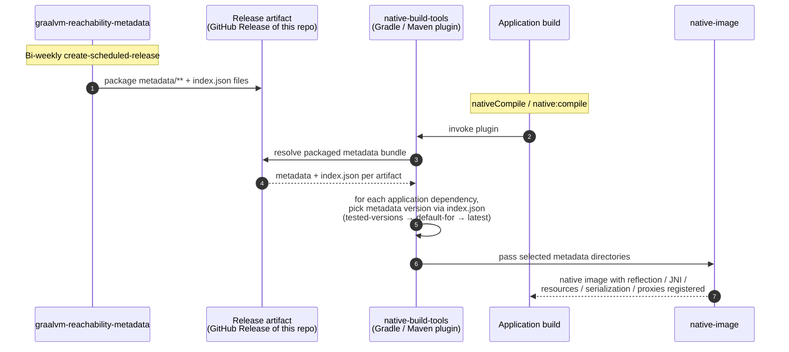
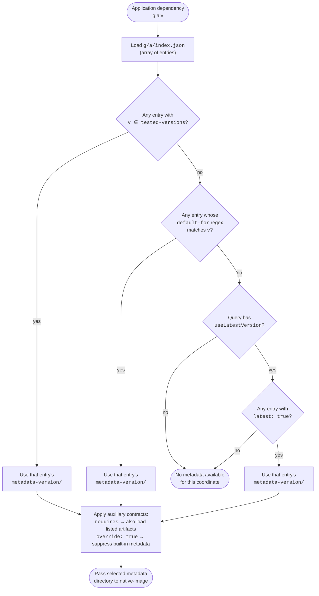

# Functional Specification

This document describes what the **GraalVM Reachability Metadata Repository** does for its users, who those users are, and the functional requirements that the repository, its build infrastructure, and its automation (Metadata Forge) must meet.

It is intended for agents, contributors, and downstream tooling owners who need a single, behavior-focused description of the system.

---

## 1. Purpose

The repository hosts curated, versioned **GraalVM reachability metadata** for community JVM libraries and frameworks, plus the test harness, CI, and AI automation that keep the metadata correct and up to date.

Reachability metadata describes reflection, JNI, resource access, serialization, and proxy use that GraalVM `native-image` cannot determine through static analysis. By centralizing this metadata, the repository allows libraries that are not yet self-contained for native compilation to "just work" with `native-image` when consumed via the GraalVM Gradle and Maven plugins.

## 2. Users and Use Cases

| User | Goal | How they interact |
| --- | --- | --- |
| **Application developer** using GraalVM Native Image | Build a native image of an application that depends on third-party libraries without writing reachability metadata by hand; check whether a given library is supported; request support for a missing library. | Consumes metadata indirectly — the GraalVM Gradle/Maven plugin downloads it from this repository at build time. Checks support via `curl … check-library-support.sh \| bash -s "<group>:<artifact>:<version>"` or by browsing [the libraries-and-frameworks page](https://www.graalvm.org/native-image/libraries-and-frameworks/). Requests a new library by filing a [`01_support_new_library`](../.github/ISSUE_TEMPLATE/01_support_new_library.yml) issue, or updates an existing one via [`02_update_existing_library`](../.github/ISSUE_TEMPLATE/02_update_existing_library.yml). |
| **Community contributor** | Add support for a missing library or update an existing entry to a newer library version. | Files a "library-new-request" or "update existing library" issue; the automation picks it up, optionally guided by custom instructions the contributor supplies. |
| **Reviewer / Maintainer** of this repo | Sign off on PRs after automated review has enforced licensing, security, and metadata quality rules. | Agents run the review skills under [skills/](../skills/) (e.g. `review-library-new-request`, `review-fixes-javac-fail`, `review-fixes-java-run-fail`, `review-fixes-native-image-run-fail`, `review-library-bulk-update`, `close-new-library-support-pr`) against the [REVIEWING.md](REVIEWING.md) checklist; CI runs the same gates. The reviewer does the final human check before merge. |
| **Repository automation (Metadata Forge)** | Generate or repair metadata using LLM-driven pipelines. | Per coordinate, the toolkit can: (1) **add support for a new library** — generate a JUnit / Kotlin / Scala test suite, scaffold metadata, and iterate until JVM-mode tests pass and dynamic-access is collected ([`add_new_library_support.py`](../forge/ai_workflows/add_new_library_support.py)); (2) **fix a Java compilation (`javac`) failure** raised by a library version bump ([`fix_javac_fail.py`](../forge/ai_workflows/fix_javac_fail.py)); (3) **fix a JVM-mode (`javaTest`) runtime failure** raised by a version bump ([`fix_java_run_fail.py`](../forge/ai_workflows/fix_java_run_fail.py)); (4) **fix a `native-image` runtime failure** raised by a version bump ([`fix_ni_run.py`](../forge/ai_workflows/fix_ni_run.py)); (5) **improve dynamic-access coverage** of already-supported libraries by targeting uncovered call sites; (6) **post-generation repair** of the metadata produced by a previous run ([`fix_post_generation_pi.py`](../forge/ai_workflows/fix_post_generation_pi.py), [`fix_metadata_codex.py`](../forge/ai_workflows/fix_metadata_codex.py)). Each task runs Gradle tasks against a worktree of this repo, appends a schema-validated metrics record, and — when invoked through [`forge/git_scripts/make_pr_*.py`](../forge/git_scripts/) — opens a PR for human review. See [forge/docs/architecture.md](../forge/docs/architecture.md). |

## 3. Hard Constraints

Application developers consume this repository indirectly: native-build-tools resolves metadata for every dependency in their build and passes it to `native-image`. The user never opts into individual metadata entries. Because of that, the repository's overarching invariant is:

> **Adding this repository to a user's build must never change how the user's code runs.** The metadata is purely additive — it can only fill in registrations `native-image` would otherwise miss; it cannot alter class initialization, replace user bytecode, or execute code at image-build time.

Two properties make this achievable: the reachability-metadata schema is itself additive (every entry is gated on `typeReachable`, FR-M-2), and `native-image` defaults to runtime initialization when no build-time directives are supplied. The hard constraints below preserve that additivity — they are not editorial scope choices but direct consequences of the invariant.

- **HC-1 No build-time-initialization tweaks.** Metadata bundles must not ship `native-image.properties` or any other directive that moves class `<clinit>` execution into the image builder. Build-time initialization captures state from a non-user environment into the image and breaks additivity. Every library is runtime-initialized by default (FR-M-1).
- **HC-2 No library patching.** No substitutions, bytecode rewrites, or shaded forks of upstream libraries. Patching ships a different version than the one the user resolved through Maven Central, is invisible at the dependency-resolution layer, and is unstable across upstream releases.
- **HC-3 No `Feature` classes.** Metadata bundles must not ship `org.graalvm.nativeimage.hosted.Feature` implementations or any other artifact that runs arbitrary Java inside the image builder. `Feature`s are a security concern (full filesystem / network / reflective access at build time) and break additivity because their effect is whatever code the author wrote.
- **HC-4 No untested metadata.** Metadata that has not passed the test gates defined in [§5.2 Tests](#52-tests-fr-t) and [§5.4 CI gates](#54-ci-gates-fr-ci) is not published from this repository, regardless of provenance (human or Forge).

These constraints apply uniformly to human-authored PRs and to Metadata Forge output, and are enforced by `checkMetadataFiles` plus the reviewer skills.

## 4. What the System Provides

### 4.1 Metadata distribution

- A directory tree under `metadata/<groupId>/<artifactId>/<metadata-version>/` containing JSON files in the format described by GraalVM's [Native Image Manual Configuration](https://www.graalvm.org/latest/reference-manual/native-image/dynamic-features/Reflection/#manual-configuration) reference.
- An artifact-level `metadata/<groupId>/<artifactId>/index.json` that records, per metadata version: tested library versions, allowed packages, source/test/documentation URLs, optional `requires`, `default-for`, `skipped-versions`, and `override` flags.
- A repository-level `metadata/library-and-framework-list.json` enumerating every supported library, with `test_level` ∈ `{untested, community-tested, fully-tested}`.
- A `stats/<groupId>/<artifactId>/<metadata-version>/stats.json` mirror of per-version metrics (dynamic-access call sites, coverage, lines of code, dependency information).

### 4.2 Test harness

A Gradle-based TCK that, given a library coordinate `group:artifact:version`, runs:

- Validation of `index.json` schema and `metadata-version`/`tested-versions` integrity.
- Validation that every metadata entry uses `typeReachable` and stays inside `allowed-packages`.
- Compilation, JVM-mode tests (`javaTest`), and native-image tests (`nativeTest`).
- Coverage collection (JaCoCo) and dynamic-access reporting per coordinate.

The harness uses a single coordinates filter `-Pcoordinates=` accepting `all`, `group:artifact`, `group:artifact:version`, or shard `k/n`. It also exposes authoring helpers (`generateMetadata`, `splitTestOnlyMetadata`, `fixTestNativeImageRun`, `addTestedVersion`, `fetchExistingLibrariesWithNewerVersions`), reporting tasks (`jacocoTestReport`, `generateDynamicAccessCoverageReport`, `generateLibraryStats`, `analyzeExternalLibraryDynamicAccess`), and the `package` release task. The full task reference lives in [DEVELOPING.md](DEVELOPING.md).

### 4.3 Continuous integration

GitHub Actions, configured by [`ci.json`](../ci.json) as the single source of truth for OS/JDK matrix, run the workflows enumerated in [CI.md](CI.md):
- PR-scoped: changed-metadata, changed-infrastructure, new-library-version, Spring AOT smoke, library-stats validation, library-and-framework-list validation, checkstyle.
- Schedule-driven: full metadata sweep, new-library-version compatibility (every 4 hours), Docker image vulnerability scans, scheduled release every two weeks, scheduled coverage publication.

CI must pass before any merge, and is the authoritative gate — local runs are best-effort.

### 4.4 Releases

Every two weeks the `create-scheduled-release` workflow packages metadata if it has changed. The packaged artifact is what the GraalVM Gradle/Maven plugins consume.

### 4.5 Coverage and metrics dashboard

`publish-scheduled-coverage.yml` derives, from committed `stats/` and `metadata/**/index.json`:
- `latest/badges.json` — badges shown in the README (libraries supported, tested versions, dynamic-access coverage, tested LOC).
- `latest/libraries.json` — per-library metrics.
- `latest/metrics-over-time.svg` and `latest/metrics-over-time-dark.svg` — light and dark historical charts referenced from [COVERAGE.md](../COVERAGE.md).
- `history/history.json` — append-only history.

These are force-pushed to the `stats/coverage` branch.

### 4.6 Metadata Forge automation

The `forge/` toolkit composes LLM agents (Aider, Codex, Pi) with deterministic Gradle pipelines to:
1. **Add new library support** — generate a JUnit test suite, scaffold metadata, iterate until JVM-mode tests pass and dynamic-access metadata is collected.
2. **Fix `javac` failures** raised by a library version bump.
3. **Fix native-image runtime failures** raised by a library version bump.
4. **Improve coverage** of already-supported libraries by targeting uncovered dynamic-access call sites.

Each Forge run produces a schema-validated metrics record (under `metrics_repo/...`) and, when invoked through `complete_pipelines/` or `git_scripts/make_pr_*.py`, opens a PR ready for human review. See [forge/README.md](../forge/README.md) and [forge/docs/architecture.md](../forge/docs/architecture.md).

#### GitHub label contract

GitHub labels are part of the public triage surface for issues and PRs. Pipeline labels are exact and case-sensitive.

| Label | Applies to | Meaning |
| --- | --- | --- |
| `library-new-request` | Issue | Request to add support for a library that is not covered yet. |
| `library-update-request` | Issue / PR | Request or PR to improve support for an already-covered library, including coverage-improvement work. |
| `library-unsupported-version` | Issue | Compatibility automation found a newer upstream library version that is not currently supported by the existing metadata and tests. |
| `library-add-new` | PR | PR adds a newly tested library to the repository. |
| `library-bulk-update` | PR | PR records newly tested upstream versions for already-supported libraries when no repair is required. |
| `fails-javac-compile` | Issue | New-version compatibility failed during the `compileTestJava` / Java compilation stage. |
| `fails-java-run` | Issue | New-version compatibility failed during the `javaTest` / JVM runtime stage. |
| `fails-native-image-build` | Issue | New-version compatibility failed while building the native image. These issues are assigned for maintainer follow-up. |
| `fails-native-image-run` | Issue | New-version compatibility failed while running the native image. |
| `fixes-javac-fail` | PR | PR repairs a `fails-javac-compile` compatibility issue. |
| `fixes-java-run-fail` | PR | PR repairs a `fails-java-run` compatibility issue. |
| `fixes-native-image-build-fail` | PR | PR repairs a `fails-native-image-build` compatibility issue. |
| `fixes-native-image-run-fail` | PR | PR repairs a `fails-native-image-run` compatibility issue. |
| `docker` | PR | PR updates allowed Docker images used by tests. |
| `GenAI` | PR | PR was produced by generative-AI automation. Generated PR titles also use a `[GenAI]` prefix when created by the corresponding Forge scripts. |
| `priority` | Issue | Work-queue priority marker. Forge processes matching issues with this label before regular issues in the same pipeline batch; issue triage also adds it to eligible native-build-tools-created support requests. |
| `high-priority` | Issue | Manual urgency marker for issues that should be handled immediately. |
| `human-intervention` | Issue / PR | Automation could not safely complete the work without manual follow-up, or automated PR review requested changes. |
| `human-intervention-fixed` | PR | Manual follow-up has fixed a PR previously requiring intervention; review automation may approve and merge it after merge gates pass. |

### 4.7 Consumption by native-build-tools

Application developers consume this repository indirectly, through the `org.graalvm.buildtools` Gradle plugin or its Maven counterpart (collectively *native-build-tools*). They never check this repository out themselves.



#### Interface contract

native-build-tools consumes this repository through exactly four observable elements. Changes to any of them are breaking changes for plugin users.

**1. Distribution artifact.** The `package` Gradle task produces `graalvm-reachability-metadata-<repo-version>.zip`, which the scheduled release workflow attaches as a GitHub Release asset on a `<repo-version>` tag every two weeks. The ZIP is a verbatim copy of the repository's `metadata/` tree — there is no separate top-level manifest. Its contents at the ZIP root are exactly:

```text
library-and-framework-list.json                          # the master list of supported libraries (NFR-4 schema-validated)
schemas/                                                 # vendored JSON schemas for offline validation
    library-and-framework-list-schema-vX.Y.Z.json
    metadata-library-index-schema-vX.Y.Z.json
    reachability-metadata-schema-vX.Y.Z.json
<groupId>/<artifactId>/index.json                        # one per supported artifact (element 2)
<groupId>/<artifactId>/<metadata-version>/
    reachability-metadata.json                           # the only file native-image loads (element 3)
```

Plugin-relevant content is `<groupId>/<artifactId>/index.json` and the per-version `reachability-metadata.json` files; the plugin discovers libraries by directory walk. `library-and-framework-list.json` and `schemas/` are present for downstream tooling (the libraries-and-frameworks page and offline validators) and are not consumed by native-build-tools at native-image time.

**2. `<groupId>/<artifactId>/index.json`** — one per supported artifact, schema [metadata-library-index-schema-v2.0.1.json](../metadata/schemas/metadata-library-index-schema-v2.0.1.json). It is a JSON **array** of entries; each entry's required fields are `metadata-version`, `tested-versions`, and `allowed-packages`, with optional `default-for` (Java regex), `latest: true`, `override: true`, `requires: ["<group>:<artifact>", …]`, `test-version`, `skipped-versions`, `language`, and the four URL fields. Plugin-relevant fields are the first six.

The schema follows semver, and **minor- and patch-version bumps** (e.g., `v2.0.1` → `v2.0.2` or `v2.0.x` → `v2.1.0`) are guaranteed to be backward-compatible with native-build-tools. Minor bumps add new optional fields used by the website, the test harness, or future tooling (`requires`, `test-version`, `skipped-versions`, `language`, `source-code-url`, `test-code-url`, `documentation-url`, `repository-url`); patch bumps refine validation of those same auxiliary fields. The plugin reads only the six fields enumerated above, so an older native-build-tools release continues to resolve metadata correctly against any newer minor or patch version of the schema. Only a **major-version bump** can break the contract, which NFR-4 forbids — schema changes are additive only.

**3. `<groupId>/<artifactId>/<metadata-version>/reachability-metadata.json`** — the only file the plugin loads at native-image time. Schema [reachability-metadata-schema-v1.2.0.json](../metadata/schemas/reachability-metadata-schema-v1.2.0.json) (a vendored copy of the upstream GraalVM schema), with top-level keys `reflection`, `jni`, `resources`, `bundles`, `serialization`, and `foreignCalls`. Every entry must carry a `condition.typeReachable` clause (FR-M-2) so the plugin can rely on conditional registration. The legacy split-config layout (`reflect-config.json`, `jni-config.json`, …) is no longer present.

**4. Version-selection algorithm.** Given an application dependency `g:a:v`, native-build-tools loads the `index.json` array of `g/a/` and applies a primary lookup, picking the first entry that matches in this order:

1. `v ∈ tested-versions` → use that entry's `metadata-version` directory directly.
2. `default-for` regex matches `v` → use that entry.

If neither matches and the user has enabled `useLatestVersion` on the query (Gradle: `useLatestMetadataVersion()`), the plugin falls back to the entry with `latest: true` (at most one per file, FR-M-6). Otherwise no metadata is loaded for that coordinate. `skipped-versions` is consumed by the test harness and the libraries-and-frameworks page, not by the plugin at native-image time.



Auxiliary contracts: `requires` triggers the plugin to also load metadata for the listed `group:artifact` pair; `override: true` instructs the plugin to suppress any built-in metadata that ships inside `native-image` itself for the matched versions.

All four elements are versioned through the schema `$id` URLs and the GitHub Release tag — the plugin is expected to tolerate older repository releases, so schema changes are additive only (new optional fields, never renamed or removed required fields). NFR-4 (schema fidelity) and the bi-weekly release cadence (3.4) keep this contract live.

## 5. Functional Requirements

### 5.1 Metadata content (FR-M)

- **FR-M-1** Metadata files contain only JSON entries described by GraalVM's manual-configuration reference. Native-image properties (`native-image.properties`) and other build-time tweaks are forbidden — by default every library is runtime-initialized.
- **FR-M-2** Every metadata entry must use [Conditional Configuration](https://www.graalvm.org/latest/reference-manual/native-image/metadata/#specifying-reflection-metadata-in-json) (`typeReachable`) so registration is gated on actual reachability.
- **FR-M-3** Every metadata entry's `typeReachable` condition must reference a class inside the artifact's `allowed-packages`.
- **FR-M-4** No metadata entry may target a class or resource that exists only for testing.
- **FR-M-5** Each `metadata/<group>/<artifact>/` directory must include a valid `index.json` enumerating its metadata versions and tested library versions.
- **FR-M-6** Exactly one entry in a non-empty `index.json` must carry `latest: true`. If a library version is not in `tested-versions`, the harness selects an entry by matching the optional `default-for` regex.
- **FR-M-7** Metadata can declare dependencies on other artifacts via `requires`. Test-only metadata must be moved to the test resources file (via `splitTestOnlyMetadata`).

### 5.2 Tests (FR-T)

- **FR-T-1** Every supported library version must have tests that exercise the library's reachable surface enough to fail when metadata is wrong or missing.
- **FR-T-2** Tests live under `tests/src/<group>/<artifact>/<version>` unless an `index.json` entry sets `test-version` to share a suite across versions.
- **FR-T-3** Tests must not pin to specific library versions or bypass the library's public API in ways that would mask metadata gaps. Scaffold-only tests are not acceptable.
- **FR-T-4** Tests that use Docker must declare every image they need in `required-docker-images.txt`. Each image must already appear in `tests/tck-build-logic/src/main/resources/allowed-docker-images/Dockerfile-<dockerImageName>`. Tests fail otherwise.
- **FR-T-5** Tests must compile under JDK 25 and pass both `javaTest` and `nativeTest` lanes on every JDK/OS combination listed in `ci.json`.
- **FR-T-6** Newly added `tested-versions` entries are recorded in `index.json` only after they pass on **every** required environment (enforced by `verify-new-library-version-compatibility`).
- **FR-T-7** Dynamic-access coverage between consecutive tested versions of a library must not regress (enforced by reviewer skills `review-fixes-javac-fail`, `review-fixes-native-image-run-fail`, `review-fixes-java-run-fail`).

### 5.3 Contributions and review (FR-R)

- **FR-R-1** Contributors must be the original authors of all included tests; PRs containing third-party test code must be rejected.
- **FR-R-2** Each PR must be confined to a single library. PRs that spread changes across multiple libraries must be split or closed.
- **FR-R-3** PRs that extend `allowed-docker-images` must:
  - Include a `Dockerfile-<dockerImageName>` containing only `FROM <dockerImageName>`.
  - Add `@jormundur00` as a reviewer.
  - Post `grype <dockerImageName>` output in the PR description.
- **FR-R-4** Network access, file access, executable invocation, and external process spawns inside tests must be justified, statically scoped where possible, and subject to the security review rules in [REVIEWING.md](REVIEWING.md).
- **FR-R-5** Library support requests are filed via the `01_support_new_library` issue template; updates via `02_update_existing_library`.

### 5.4 CI gates (FR-CI)

- **FR-CI-1** Every PR is gated on the relevant subset of: `checkstyle`, `spotlessCheck`, `validateIndexFiles`, `checkMetadataFiles`, `validateLibraryStats`, `library-and-framework-list-validation`, and the appropriate `test-*` workflow.
- **FR-CI-2** Docker images used in tests are pre-pulled from `allowed-docker-images`, after which the runner disables Docker networking for deterministic, isolated test runs.
- **FR-CI-3** The release workflow runs `spotlessCheck` before packaging.
- **FR-CI-4** The Spring AOT smoke matrix runs only when `metadata/` changes affect a Spring AOT project.
- **FR-CI-5** `verify-new-library-version-compatibility` caps each scheduled run at a fixed library budget and at most 30 newer versions per library, expanding across the configured GraalVM JDK/OS combinations, and creates one aggregated GitHub issue per failed `(library, version)` pair.
- **FR-CI-6** Dependabot updates to `allowed-docker-images` trigger `sync-docker-tags.yml`, which back-commits the synchronized tags into the Dependabot PR.

### 5.5 Native-image modes (FR-NI)

- **FR-NI-1** Local runs default to `current-defaults`.
- **FR-NI-2** `future-defaults-all` is run only against early-access / `latest` / `dev` GraalVM builds, both locally (via `GVM_TCK_NATIVE_IMAGE_MODE=future-defaults-all`) and in scheduled CI lanes that explicitly opt in via `ci.json`'s `nativeImageModeJavaVersions`.

### 5.6 Metadata Forge (FR-F)

Forge's functional requirements are specified in [forge/docs/functional-spec.md](../forge/docs/functional-spec.md).

## 6. Non-Functional Requirements

- **NFR-1 Determinism.** Tests must be reproducible. Network-dependent tests are not allowed except where they declare an `allowed-docker-image` and run against that pre-pulled image with networking disabled.
- **NFR-2 Isolation.** Per-coordinate test execution must not depend on or affect other coordinates' build outputs.
- **NFR-3 Image-size discipline.** Conditional configuration (`typeReachable`) is mandatory so consumers do not pay for metadata they do not exercise.
- **NFR-4 Schema fidelity.** Every JSON file under `metadata/`, `stats/`, and `metadata/library-and-framework-list.json` must validate against the corresponding schema in `schemas/` or `stats/schemas/`.
- **NFR-5 Style consistency.** All Java/Groovy/Gradle/shell sources must pass `spotlessCheck` (CC0 license header) and `checkstyle`. JSON is sorted by keys, indented with two spaces.
- **NFR-6 Sharded scalability.** Any Gradle task that accepts `-Pcoordinates=` must accept `k/n` shards so CI can parallelize. The harness must handle adding a new library without code changes (purely metadata-driven discovery).
- **NFR-7 Auditability.** Every Forge run produces a schema-validated metrics record; every coverage publish writes to a force-pushed branch with retained history.

## 7. Inputs and Outputs

### 7.1 Inputs

- A library coordinate `group:artifact:version` (or shard `k/n`, or `all`).
- Metadata JSON files contributed by a human or generated by Forge.
- Test sources contributed by a human or generated by Forge.
- An `index.json` describing metadata versions and tested versions.
- For Forge: a predefined strategy name selecting agent + workflow + prompts.

### 7.2 Outputs

- Validated metadata + tests + index.json under `metadata/` and `tests/src/`.
- Mirrored stats under `stats/` and aggregated coverage artifacts on `stats/coverage`.
- Bi-weekly release artifacts consumed by the GraalVM Gradle/Maven plugins.
- Forge metrics records under `metrics_repo_path` (or `metadata-forge/{script_run_metrics,benchmark_run_metrics}/` in merged-repo mode).
- GitHub PRs (only when initiated through Forge `complete_pipelines/` or `git_scripts/`).
- GitHub issues for new-version compatibility failures, one per `(library, version)`.

## 8. References

- [README.md](../README.md) — quick lookup, contributing entry points.
- [CONTRIBUTING.md](CONTRIBUTING.md) — how to add or update metadata.
- [REVIEWING.md](REVIEWING.md) — reviewer checklist (licensing, security, metadata quality).
- [DEVELOPING.md](DEVELOPING.md) — Gradle task reference for development.
- [CI.md](CI.md) — workflow inventory and triggers.
- [CollectingMetadata.md](CollectingMetadata.md) — using the Native Image Agent to collect metadata.
- [SECURITY.md](SECURITY.md) — vulnerability disclosure.
- [forge/README.md](../forge/README.md) — Metadata Forge user manual.
- [forge/docs/architecture.md](../forge/docs/architecture.md) — Forge architecture and contracts.
