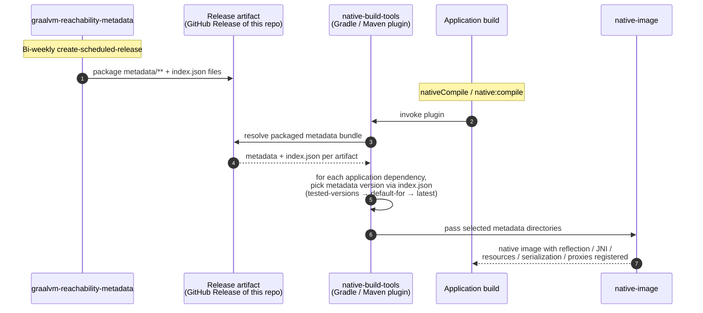
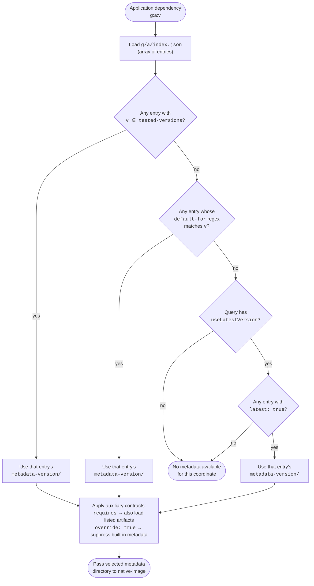

# FS-repository-functional-spec: Repository functional specification

This document describes what the **GraalVM Reachability Metadata Repository** does for its users, who those users are, and the requirements that the repository, its build infrastructure, and its automation (Forge) must meet. For the structural and implementation overview that organizes these behaviors into components, see §AR-repository-architecture.
§GOAL-tested-metadata §GOAL-broad-version-coverage §GOAL-fresh-metadata §GOAL-protect-shipped-metadata

It is intended for agents, contributors, and downstream tooling owners who need a single, behavior-focused description of the system. The repository's moving parts are documented as modules that this spec cites at the point each behavior is stated: the test harness (§TCK-test-harness), the CI workflows (§CI-repository-ci), and the metadata and tests suites (§METADATA-suite, §TESTS-suite). Forge automation has its own functional spec in its namespace (§forge/FS-forge-functional-spec) and owns the derived metrics under `stats/` (§forge/FS-forge-run-metrics). For the task-oriented "what do I run, and when" view rather than the requirements, see [§8 How this repository is used](#8-how-this-repository-is-used).

---

## 1. Purpose

The repository hosts curated, versioned **GraalVM reachability metadata** for community JVM libraries and frameworks, plus the test harness, CI, and AI automation that keep the metadata correct and up to date.

Reachability metadata describes reflection, JNI, resource access, serialization, and proxy use that GraalVM `native-image` cannot determine through static analysis. By centralizing this metadata, the repository allows libraries that are not yet self-contained for native compilation to "just work" with `native-image` when consumed via the GraalVM Gradle and Maven plugins.

## 2. Users and Use Cases

| User | Goal | How they interact |
| --- | --- | --- |
| **Application developer** using GraalVM Native Image | Build a native image of an application that depends on third-party libraries without writing reachability metadata by hand; check whether a given library is supported; request support for a missing library. | Consumes metadata indirectly — the GraalVM Gradle/Maven plugin downloads it from this repository at build time. Checks support via `curl … check-library-support.sh \| bash -s "<group>:<artifact>:<version>"` or by browsing [the libraries-and-frameworks page](https://www.graalvm.org/native-image/libraries-and-frameworks/). Requests a new library by filing a [`01_support_new_library`](../.github/ISSUE_TEMPLATE/01_support_new_library.yml) issue, or updates an existing one via [`02_update_existing_library`](../.github/ISSUE_TEMPLATE/02_update_existing_library.yml). |
| **Community contributor** | Add support for a missing library or update an existing entry to a newer library version. | Files a "library-new-request" or "update existing library" issue; the automation picks it up, optionally guided by custom instructions the contributor supplies. |
| **Reviewer / Maintainer** of this repo | Sign off on PRs after automated review has enforced licensing, security, and metadata quality rules. | Agents run the review skills under [skills/](../skills/) (e.g. `review-library-new-request`, `review-fixes-javac-fail`, `review-fixes-java-run-fail`, `review-fixes-native-image-run-fail`, `review-library-bulk-update`, `close-new-library-support-pr`) against the [REVIEWING.md](REVIEWING.md) checklist; CI runs the same gates. The reviewer does the final human check before merge. |
| **Repository automation (Forge)** | Generate or repair metadata using LLM-driven pipelines. | Per coordinate, the toolkit can: (1) **add support for a new library** — generate a JUnit / Kotlin / Scala test suite, scaffold metadata, and iterate until JVM-mode tests pass and dynamic-access is collected ([`add_new_library_support.py`](../forge/ai_workflows/drivers/add_new_library_support.py)); (2) **fix a Java compilation (`javac`) failure** raised by a library version bump ([`fix_javac_fail.py`](../forge/ai_workflows/drivers/fix_javac_fail.py)); (3) **fix a JVM-mode (`javaTest`) runtime failure** raised by a version bump ([`fix_java_run_fail.py`](../forge/ai_workflows/drivers/fix_java_run_fail.py)); (4) **fix a `native-image` runtime failure** raised by a version bump ([`fix_ni_run.py`](../forge/ai_workflows/drivers/fix_ni_run.py)); (5) **improve dynamic-access coverage** of already-supported libraries by targeting uncovered call sites; (6) **post-generation repair** of the metadata produced by a previous run ([`fix_post_generation_pi.py`](../forge/ai_workflows/core/fix_post_generation_pi.py), [`fix_metadata_codex.py`](../forge/ai_workflows/core/fix_metadata_codex.py)). Each task runs Gradle tasks against a worktree of this repo, appends a schema-validated metrics record, and — when invoked through [`forge/git_scripts/make_pr_*.py`](../forge/git_scripts/) — opens a PR for human review. See [forge/docs/functional-spec.md](../forge/docs/functional-spec.md). |

## 3. Hard Constraints

Application developers consume this repository indirectly: native-build-tools resolves metadata for every dependency in their build and passes it to `native-image`. The user never opts into individual metadata entries. Because of that, the repository's overarching invariant is:

> **Adding this repository to a user's build must never change how the user's code runs.** The metadata is purely additive — it can only fill in registrations `native-image` would otherwise miss; it cannot alter class initialization, replace user bytecode, or execute code at image-build time.

Two properties make this achievable: the reachability-metadata schema is itself additive (every entry is gated on `typeReached`), and `native-image` defaults to runtime initialization when no build-time directives are supplied. The hard constraints below preserve that additivity — they are not editorial scope choices but direct consequences of the invariant.

- **No build-time-initialization tweaks.** Metadata bundles must not ship `native-image.properties` or any other directive that moves class `<clinit>` execution into the image builder. Build-time initialization captures state from a non-user environment into the image and breaks additivity. Every library is runtime-initialized by default.
- **No library patching.** No substitutions, bytecode rewrites, or shaded forks of upstream libraries. Patching ships a different version than the one the user resolved through Maven Central, is invisible at the dependency-resolution layer, and is unstable across upstream releases.
- **No `Feature` classes.** Metadata bundles must not ship `org.graalvm.nativeimage.hosted.Feature` implementations or any other artifact that runs arbitrary Java inside the image builder. `Feature`s are a security concern (full filesystem / network / reflective access at build time) and break additivity because their effect is whatever code the author wrote.
- **No untested metadata.** Metadata that has not passed the test gates defined in [§5.2 Tests](#52-tests) and [§5.3 CI gates](#53-ci-gates) is not published from this repository, regardless of provenance (human or Forge).

These constraints apply uniformly to human-authored PRs and to Forge output, and are enforced by `checkMetadataFiles` plus the reviewer skills.

## 4. What the System Provides

### 4.1 Metadata distribution

- A directory hierarchy under `metadata/<groupId>/<artifactId>/<metadata-version>/` containing JSON files in the format described by GraalVM's [Native Image Manual Configuration](https://www.graalvm.org/latest/reference-manual/native-image/dynamic-features/Reflection/#manual-configuration) reference.
- An artifact-level `metadata/<groupId>/<artifactId>/index.json` that records, per metadata version: tested library versions, allowed packages, source/test/documentation URLs, optional `requires`, `default-for`, `skipped-versions`, and `override` flags.
- A repository-level `metadata/library-and-framework-list.json` enumerating every supported library, with `test_level` ∈ `{untested, community-tested, fully-tested}`.
- A `stats/<groupId>/<artifactId>/<metadata-version>/` mirror of per-version metrics — `stats.json` (dynamic-access call sites, coverage, lines of code, dependency information) produced by the harness, alongside the schema-validated `execution-metrics.json` each Forge run records.

The metadata directory and its index/list/schema contracts are specified in §METADATA-suite. The derived `stats/` metrics are not consumed by native-build-tools; what each entry holds and how a run produces it are specified in the Forge spec (§forge/FS-forge-run-metrics), and the dashboard built from them is §4.5.

### 4.2 Test harness
§TCK-test-harness

A Gradle-based TCK that, given a library coordinate `group:artifact:version`, runs:

- Validation of `index.json` schema and `metadata-version`/`tested-versions` integrity.
- Validation that every metadata entry uses `typeReached` and stays inside `allowed-packages`.
- Compilation, JVM-mode tests (`javaTest`), and native-image tests (`nativeTest`).
- Coverage collection (JaCoCo) and dynamic-access reporting per coordinate.

The harness uses a single coordinates filter `-Pcoordinates=` accepting `all`, `group:artifact`, `group:artifact:version`, or shard `k/n`. It also exposes authoring helpers (`generateMetadata`, `splitTestOnlyMetadata`, `fixTestNativeImageRun`, `addTestedVersion`, `fetchExistingLibrariesWithNewerVersions`), reporting tasks (`jacocoTestReport`, `generateDynamicAccessCoverageReport`, `generateLibraryStats`, `analyzeExternalLibraryDynamicAccess`), and the `package` release task. Its task groups and the Gradle harness that delegates `-Pcoordinates=` to per-coordinate sub-builds are specified in §TCK-test-harness; the test sources it drives in §TESTS-suite. The full task reference lives in [DEVELOPING.md](DEVELOPING.md).

### 4.3 Continuous integration
§CI-repository-ci

GitHub Actions, configured by [`ci.json`](../ci.json) as the single source of truth for OS/JDK matrix, run the workflows enumerated in [ci.md](ci.md):
- PR-scoped: changed-metadata, changed-infrastructure, new-library-version, Spring AOT smoke, library-stats validation, library-and-framework-list validation, checkstyle.
- Schedule-driven: weekly full metadata sweep to prevent incomplete or breaking metadata from shipping in releases, new-library-version compatibility (every six hours), Docker image vulnerability scans, scheduled release every two weeks, scheduled coverage publication.

CI must pass before any merge, and is the authoritative gate — local runs are best-effort.

### 4.4 Releases

Every two weeks the `create-scheduled-release` workflow packages metadata if it has changed and the latest completed test-all metadata workflow passed. Manual release dispatches bypass this test-all gate. The packaged artifact is what the GraalVM Gradle/Maven plugins consume.

### 4.5 Coverage and metrics dashboard

`publish-scheduled-coverage.yml` derives, from committed `stats/` and `metadata/**/index.json`:
- `latest/badges.json` — badges shown in the README (libraries supported, tested versions, dynamic-access coverage, tested LOC).
- `COVERAGE.md` — the per-library coverage table linked from the README. Each
  table row must link the tested versions to the artifact's
  `metadata/<group>/<artifact>/index.json` file and the dynamic-access coverage
  value to the artifact's `stats/<group>/<artifact>/` directory.
- `latest/metrics-over-time.svg` and `latest/metrics-over-time-dark.svg` — light and dark historical charts referenced from [COVERAGE.md](../COVERAGE.md).
- `history/history.json` — append-only history.

CI must keep the root [COVERAGE.md](../COVERAGE.md) on the source branch in
sync with the generated coverage table through the bulk-update PRs created by
`verify-new-library-version-compatibility.yml`. The same `COVERAGE.md` and the
badge, graph, and history artifacts are published to the `stats/coverage` branch.

### 4.6 Forge automation
§forge/GOAL-forge-direction

The `forge/` toolkit composes LLM agents (Aider, Codex, Pi) with deterministic Gradle pipelines to:
1. **Add new library support** — generate a JUnit test suite, scaffold metadata, iterate until JVM-mode tests pass and dynamic-access metadata is collected.
2. **Fix `javac` failures** raised by a library version bump.
3. **Fix native-image runtime failures** raised by a library version bump.
4. **Improve coverage** of already-supported libraries by targeting uncovered dynamic-access call sites.

Each Forge run records per-library metrics under `stats/<group>/<artifact>/<version>/execution-metrics.json` and, when invoked through `git_scripts/make_pr_*.py`, opens a PR ready for human review. See [forge/README.md](../forge/README.md) and [forge/docs/functional-spec.md](../forge/docs/functional-spec.md).

#### GitHub label contract

GitHub labels are part of the public triage surface for issues and PRs. Pipeline labels are exact and case-sensitive.

| Label | Applies to | Meaning |
| --- | --- | --- |
| `library-new-request` | Issue | Request to add support for a library that is not covered yet. |
| `library-update-request` | Issue / PR | Request or PR to improve support for an already-covered library, including coverage-improvement work. |
| `library-unsupported-version` | Issue | Compatibility automation found a newer upstream library version that is not currently supported by the existing metadata and tests. |
| `library-add-new` | PR | PR adds a newly tested library to the repository. |
| `library-bulk-update` | PR | PR records newly tested upstream versions for already-supported libraries when no repair is required. |
| `fails-javac-compile` | Issue | New-version compatibility failed during the `compileTestJava` / Java compilation stage. |
| `fails-java-run` | Issue | New-version compatibility failed during the `javaTest` / JVM runtime stage. |
| `fails-native-image-build` | Issue | New-version compatibility failed while building the native image. These issues are assigned for maintainer follow-up. |
| `fails-native-image-run` | Issue | New-version compatibility failed while running the native image. |
| `fixes-javac-fail` | PR | PR repairs a `fails-javac-compile` compatibility issue. |
| `fixes-java-run-fail` | PR | PR repairs a `fails-java-run` compatibility issue. |
| `fixes-native-image-build-fail` | PR | PR repairs a `fails-native-image-build` compatibility issue. |
| `fixes-native-image-run-fail` | PR | PR repairs a `fails-native-image-run` compatibility issue. |
| `docker` | PR | PR updates allowed Docker images used by tests. |
| `GenAI` | PR | PR was produced by generative-AI automation. Generated PR titles also use a `[GenAI]` prefix when created by the corresponding Forge scripts. |
| `priority` | Issue | Work-queue priority marker. Forge processes matching issues with this label before regular issues in the same pipeline batch; issue triage also adds it to eligible native-build-tools-created support requests. |
| `high-priority` | Issue | Manual urgency marker for issues that should be handled immediately. |
| `chunked-dynamic-access` | Issue | Forge split dynamic-access generation for this issue into class-aligned chunks because the uncovered class count exceeded the configured threshold. Normal project status controls whether Forge may claim the next chunk. |
| `human-intervention` | Issue / PR | Automation could not safely complete the work without manual follow-up, or automated PR review requested changes. |
| `human-intervention-fixed` | PR | Manual follow-up has fixed a PR previously requiring intervention; review automation may approve and merge it after merge gates pass. |

### 4.7 Consumption by native-build-tools

Application developers consume this repository indirectly, through the `org.graalvm.buildtools` Gradle plugin or its Maven counterpart (collectively *native-build-tools*). They never check this repository out themselves.



#### Interface contract

native-build-tools consumes this repository through exactly four observable elements. Changes to any of them are breaking changes for plugin users.

**1. Distribution artifact.** The `package` Gradle task produces `graalvm-reachability-metadata-<repo-version>.zip`, which the scheduled release workflow attaches as a GitHub Release asset on a `<repo-version>` tag every two weeks. The ZIP is a verbatim copy of the repository's `metadata/` directory — there is no separate top-level manifest. Its contents at the ZIP root are exactly:

```text
library-and-framework-list.json                          # the master list of supported libraries (schema-validated)
schemas/                                                 # vendored JSON schemas for offline validation
    library-and-framework-list-schema-vX.Y.Z.json
    metadata-library-index-schema-vX.Y.Z.json
    reachability-metadata-schema-vX.Y.Z.json
<groupId>/<artifactId>/index.json                        # one per supported artifact (element 2)
<groupId>/<artifactId>/<metadata-version>/
    reachability-metadata.json                           # the only file native-image loads (element 3)
```

Plugin-relevant content is `<groupId>/<artifactId>/index.json` and the per-version `reachability-metadata.json` files; the plugin discovers libraries by directory walk. `library-and-framework-list.json` and `schemas/` are present for downstream tooling (the libraries-and-frameworks page and offline validators) and are not consumed by native-build-tools at native-image time.

**2. `<groupId>/<artifactId>/index.json`** — one per supported artifact, schema [metadata-library-index-schema-v2.1.0.json](../metadata/schemas/metadata-library-index-schema-v2.1.0.json). It is a JSON **array** of entries. Metadata entries require `metadata-version`, `tested-versions`, and `allowed-packages`, with optional `default-for` (Java regex), `latest: true`, `override: true`, `requires: ["<group>:<artifact>", …]`, `test-version`, `skipped-versions`, `language`, and the four URL fields. Plugin-relevant fields are the first six.

Alternatively, the array can hold a single `not-for-native-image: true` entry with a required `reason` and an optional `replacement`, and no other fields. This marks an artifact that is intentionally not a native-image metadata target — a Scala.js artifact, a pure test framework, or a coordinate superseded by another — so the absence of any `metadata-version` directory is a recorded decision rather than missing support. native-build-tools loads no metadata for such a coordinate; the `reason`/`replacement` are surfaced to humans and the libraries-and-frameworks page.

The schema follows semver. **Minor- and patch-version bumps** (e.g., `v2.1.0` → `v2.1.1` or `v2.1.x` → `v2.2.0`) are guaranteed backward-compatible with native-build-tools: minor bumps add new optional fields or non-plugin index formats used by the website, the test harness, or future tooling (`requires`, `test-version`, `skipped-versions`, `language`, `source-code-url`, `test-code-url`, `documentation-url`, `repository-url`, `not-for-native-image`); patch bumps refine validation of those same auxiliary fields and formats. The plugin reads only the six fields enumerated above, so an older native-build-tools release continues to resolve metadata correctly against any newer minor or patch version of the schema. A **major-version bump** (e.g., `v2.x` → `v3.0.0`) is reserved for changes that native-build-tools itself must adopt; it is shipped in lockstep with a plugin release rather than absorbed silently by older plugins.

**3. `<groupId>/<artifactId>/<metadata-version>/reachability-metadata.json`** — the only file the plugin loads at native-image time. Schema [reachability-metadata-schema-v1.2.0.json](../metadata/schemas/reachability-metadata-schema-v1.2.0.json) (a vendored copy of the upstream GraalVM schema), with top-level keys `reflection`, `jni`, `resources`, `bundles`, `serialization`, and `foreignCalls`. Every entry's `condition` carries exactly one key, `typeReached`, so the plugin can rely on conditional registration; `typeReached` is the schema's only condition form. The legacy split-config layout (`reflect-config.json`, `jni-config.json`, …) is no longer present.

**4. Version-selection algorithm.** Given an application dependency `g:a:v`, native-build-tools loads the `index.json` array of `g/a/` and applies a primary lookup, picking the first entry that matches in this order:

1. `v ∈ tested-versions` → use that entry's `metadata-version` directory directly.
2. `default-for` regex matches `v` → use that entry.

If neither matches and the user has enabled `useLatestVersion` on the query (Gradle: `useLatestMetadataVersion()`), the plugin falls back to the entry with `latest: true` (at most one per file). Otherwise no metadata is loaded for that coordinate. `skipped-versions` is consumed by the test harness and the libraries-and-frameworks page, not by the plugin at native-image time.



Auxiliary contracts: `requires` triggers the plugin to also load metadata for the listed `group:artifact` pair; `override: true` instructs the plugin to suppress any built-in metadata that ships inside `native-image` itself for the matched versions.

All four elements are versioned through the schema `$id` URLs and the GitHub Release tag. Newer plugins keep reading older repository releases, and older plugins keep reading newer **minor and patch** schema versions, which only add optional fields or non-plugin formats. A **major** schema bump (e.g. `reachability-metadata` 1.2.0 → 2.0.0, or `metadata-library-index` 2.x → 3.0.0) represents a change native-build-tools must adopt and is released together with a coordinated plugin update — it is not something older plugins absorb. Schema fidelity (§6) and the bi-weekly release cadence (§4.4) keep this contract live.

## 5. Repository Requirements

### 5.1 Metadata content

- **Metadata-only bundles.** Metadata files contain only JSON entries described by GraalVM's manual-configuration reference. Native-image properties (`native-image.properties`) and other build-time tweaks are forbidden — by default every library is runtime-initialized.
- **Conditional registration.** Every metadata entry must use [Conditional Configuration](https://www.graalvm.org/latest/reference-manual/native-image/metadata/#specifying-reflection-metadata-in-json): a `condition` whose only key is `typeReached`, so registration is gated on actual reachability. `typeReached` is the sole condition form the vendored schema accepts; the older `typeReachable` is not valid and is rejected by `checkMetadataFiles`.
- **Allowed-package conditions.** Every metadata entry's `typeReached` condition must reference a class inside the artifact's `allowed-packages`.
- **No test-only shipped entries.** No metadata entry may target a class or resource that exists only for testing.
- **Index coverage.** Each `metadata/<group>/<artifact>/` directory must include a valid `index.json` enumerating its metadata versions and tested library versions.
- **Single latest entry.** Exactly one entry in a non-empty `index.json` must carry `latest: true`. If a library version is not in `tested-versions`, the harness selects an entry by matching the optional `default-for` regex.
- **Dependency and test-only split.** Metadata can declare dependencies on other artifacts via `requires`. Metadata needed only by the tests — entries whose type or `typeReached` names a test package, or whose resource is a test resource — must not ship to consumers; `splitTestOnlyMetadata` moves them out of the library's `reachability-metadata.json` into the test project's `src/test/resources/META-INF/native-image/reachability-metadata.json`, keeping the shipped metadata free of test-only types (§METADATA-suite).

### 5.2 Tests

- **Coverage-backed support.** Every supported library version must have tests that exercise the library's reachable surface enough to fail when metadata is wrong or missing.
- **Per-coordinate layout.** Tests live under `tests/src/<group>/<artifact>/<version>` unless an `index.json` entry sets `test-version` to share a suite across versions.
- **Consumer-like exercise.** Tests must not pin to specific library versions or bypass the library's public API in ways that would mask metadata gaps. Scaffold-only tests are not acceptable.
- **Declared Docker images.** Tests that use Docker must declare every image they need in `required-docker-images.txt`. Each image must already appear in `tests/tck-build-logic/src/main/resources/allowed-docker-images/Dockerfile-<dockerImageName>`. Tests fail otherwise.
- **Required lanes.** Tests must compile under JDK 25 and pass both `javaTest` and `nativeTest` lanes on every JDK/OS combination listed in `ci.json`.
- **Recorded passing versions.** Newly added `tested-versions` entries are recorded in `index.json` only after they pass on **every** required environment (enforced by `verify-new-library-version-compatibility`).
- **Coverage non-regression.** Dynamic-access coverage between consecutive tested versions of a library must not regress (enforced by reviewer skills `review-fixes-javac-fail`, `review-fixes-native-image-run-fail`, `review-fixes-java-run-fail`).

### 5.3 CI gates

- **PR gates.** Every PR is gated on the relevant subset of: `checkstyle`, `spotlessCheck`, `validateIndexFiles`, `checkMetadataFiles`, `validateLibraryStats`, `library-and-framework-list-validation`, and the appropriate `test-*` workflow.
- **Docker isolation.** Docker images used in tests are pre-pulled from `allowed-docker-images`, after which the runner disables Docker networking for deterministic, isolated test runs.
- **Release style gate.** The release workflow runs `spotlessCheck` before packaging.
- **Spring AOT scope.** The Spring AOT smoke matrix runs only when `metadata/` changes affect a Spring AOT project.
- **Compatibility budget.** `verify-new-library-version-compatibility` caps each scheduled run at a fixed library budget and at most 30 newer versions per library, expanding across the configured GraalVM JDK/OS combinations, and creates one aggregated GitHub issue per failed `(library, version)` pair.
- **Docker tag sync.** Dependabot updates to `allowed-docker-images` trigger `sync-docker-tags.yml`, which back-commits the synchronized tags into the Dependabot PR.
- **Full sweep.** `test-all-metadata` runs only on a weekly Sunday schedule or manual dispatch in the main repository, uses 85 batches, isolates failed batches down to concrete library versions, publishes result and failure-log artifacts, fails affected matrix batches, and is release-blocking when failures are found.

### 5.4 Native-image modes

- **Local default.** Local runs default to `current-defaults`.
- **Future-defaults lane.** `future-defaults-all` is run only against early-access / `latest` / `dev` GraalVM builds, both locally (via `GVM_TCK_NATIVE_IMAGE_MODE=future-defaults-all`) and in scheduled CI lanes that explicitly opt in via `ci.json`'s `nativeImageModeJavaVersions`.

### 5.5 Forge

Forge's requirements are specified in [forge/docs/functional-spec.md](../forge/docs/functional-spec.md).
§forge/FS-forge-functional-spec

## 6. Operational Guarantees

- **Determinism.** Tests must be reproducible. Network-dependent tests are not allowed except where they declare an `allowed-docker-image` and run against that pre-pulled image with networking disabled.
- **Isolation.** Per-coordinate test execution must not depend on or affect other coordinates' build outputs.
- **Image-size discipline.** Conditional configuration (`typeReached`) is mandatory so consumers do not pay for metadata they do not exercise.
- **Schema fidelity.** Every JSON file under `metadata/`, `stats/`, and `metadata/library-and-framework-list.json` must validate against the corresponding schema in `schemas/` or `stats/schemas/`.
- **Style consistency.** All Java/Groovy/Gradle/shell sources must pass `spotlessCheck` (CC0 license header) and `checkstyle`. JSON is sorted by keys, indented with two spaces.
- **Sharded scalability.** Any Gradle task that accepts `-Pcoordinates=` must accept `k/n` shards so CI can parallelize. The harness must handle adding a new library without code changes (purely metadata-driven discovery).
- **Auditability.** Every Forge run produces a schema-validated metrics record; every coverage publish writes to a force-pushed branch with retained history.

## 7. Inputs and Outputs

### 7.1 Inputs

- A library coordinate `group:artifact:version` (or shard `k/n`, or `all`).
- Metadata JSON files contributed by a human or generated by Forge.
- Test sources contributed by a human or generated by Forge.
- An `index.json` describing metadata versions and tested versions.
- For Forge: a predefined strategy name selecting workflow engine, agent,
  model, prompts, and workflow parameters.

### 7.2 Outputs

- Validated metadata + tests + index.json under `metadata/` and `tests/src/`.
- Mirrored stats under `stats/`, a generated root `COVERAGE.md`, and aggregated coverage artifacts on `stats/coverage`.
- Bi-weekly release artifacts consumed by the GraalVM Gradle/Maven plugins.
- Forge run metrics committed under `stats/<group>/<artifact>/<version>/execution-metrics.json`.
- GitHub PRs (only when initiated through Forge `git_scripts/`).
- GitHub issues for new-version compatibility failures, one per `(library, version)`.

## 8. How this repository is used

The sections above state *what* the system guarantees; this section is the
task-oriented view of *how* each audience actually interacts with it. Every
entry point below is a consequence of a requirement stated earlier — none of it
is new behavior.

### 8.1 Application developer — consume metadata

You almost never touch this repository directly. The `org.graalvm.buildtools`
Gradle plugin or its Maven counterpart resolves the packaged metadata bundle for
every dependency in your build and passes it to `native-image` (§4.7). Concretely:

- **Build a native image.** Run your normal `nativeCompile` / `native:compile`.
  native-build-tools downloads the latest released bundle (§4.4) and selects a
  metadata version per dependency using the version-selection algorithm (§4.7).
  Adding this repository to your build never changes how your code runs (§3).
- **Check whether a library is supported.**
  `curl -sSL …/check-library-support.sh | bash -s "<group>:<artifact>:<version>"`,
  or browse the [libraries-and-frameworks page](https://www.graalvm.org/native-image/libraries-and-frameworks/),
  which is derived from `metadata/library-and-framework-list.json` (§METADATA-suite).
  The script checks the published `index.json` tested-version contract (§4.7).
- **Request a missing library.** File a
  [`01_support_new_library`](../.github/ISSUE_TEMPLATE/01_support_new_library.yml)
  issue, or `02_update_existing_library` to extend an existing entry.
  native-build-tools can open these issues for you via
  `listLibrariesMissingMetadata -PcreateIssues=true`.

### 8.2 Contributor — add or update metadata

Work begins from an issue and normally stays inside the Forge-controlled
automation path, not a hand-edited metadata file (§3, §5.2,
§forge/GOAL-improve-automation-first). Contributors guide the process by filing
or refining the issue, supplying reproduction details or custom instructions,
running Forge workflows, and reviewing the generated PR evidence. When Forge
hits a recurring or systematic problem, the preferred fix is to improve the
workflow logic, prompts, strategy, or deterministic harness support so the next
similar issue is handled automatically, rather than patching only the one
coordinate that exposed the gap (§forge/GOAL-improve-automation-first).

Direct human edits to metadata or tests are reserved for high-priority work that
the automation cannot safely resolve yet. Those edits are still bound by the
same additivity constraints (§3), test requirements (§5.2), metadata rules
(§5.1), and CI gates (§4.3, §CI-repository-ci) as Forge output. The usual local
verification is coordinate-scoped:
`./gradlew pullAllowedDockerImages checkMetadataFiles test -Pcoordinates=<group:artifact:version>`.

See [CONTRIBUTING.md](CONTRIBUTING.md) for the full walkthrough,
[DEVELOPING.md](DEVELOPING.md) for the complete task reference, and the Forge
entry points in §8.4.

### 8.3 Reviewer / maintainer — sign off

Reviewers run the agent skills under [../skills/](../skills/) against the
[REVIEWING.md](REVIEWING.md) checklist before the final human approval. CI
enforces the same gates, so review is a judgment layer on top of automated
checks, not a substitute for them.

### 8.4 Repository automation (Forge) — generate and repair

Forge claims labeled issues from the queues that compatibility automation files
(§9) and produces review-ready PRs by running the same harness tasks a human
would (§4.6). Its own entry points, strategies, and contracts are documented in
its namespace (§forge/FS-forge-functional-spec); from this repository's side,
Forge is just another contributor bound by every constraint in §3 and every gate
in §5.3.

## 9. Library Version Compatibility Automation

### FS-library-version-update-automation: Library version update automation
§GOAL-broad-version-coverage §GOAL-fresh-metadata

The repository must keep its tested-version coverage current as upstream
libraries release new versions, without a human watching Maven Central. The
[`verify-new-library-version-compatibility`](../.github/workflows/verify-new-library-version-compatibility.yml)
GitHub Actions workflow owns this loop. It runs on a schedule (every six hours)
and on manual `workflow_dispatch`, and performs its mutating steps only on the
canonical `oracle/graalvm-reachability-metadata` repository. Each run discovers
newer upstream versions, tests every candidate across the supported environment
matrix, records the versions that pass as a single bulk-update pull request, and
files one tracking issue per version that fails. The failure issues are the
entry point of the Forge repair queue (§forge/FS-forge-functional-spec,
§forge/ORCH-forge-orchestration-spec); the bulk-update PR is reviewed by the
`review-library-bulk-update` skill. This section is the behavioral contract for
that workflow; the run-size limits are stated in §FS-repository-functional-spec.5.3
and the recording precondition in §FS-repository-functional-spec.5.2, and every
label it applies is defined in the
§4.6 GitHub label contract.

#### 1. Discovery of newer versions

`./gradlew fetchExistingLibrariesWithNewerVersions` lists every already-supported
library whose newest upstream release is ahead of its highest tested version,
emitting candidate versions newest-first. Before a candidate enters the run it
is de-duplicated against open issues: a library whose newest candidate version
already has an open `[Automation] … fails for <group:artifact:version>` issue is
skipped, so a known-failing version is not re-tested every six hours.
`generateNewLibraryVersionCompatibilityMatrix` turns the surviving candidates
into the CI test matrix, bounded by the per-run library budget and the
≤ 30-newer-versions-per-library cap (§FS-repository-functional-spec.5.3). When
candidates remain, the run creates a timestamped working branch
`check-new-library-versions/<timestamp>` that later steps commit to.

#### 2. Bulk compatibility testing

A matrix job expands every candidate library across the configured GraalVM
JDK/OS combinations and native-image modes (`ci.json`). For each cell,
[`run-consecutive-tests.sh`](../.github/workflows/scripts/run-consecutive-tests.sh)
walks the candidate versions in ascending order and runs the full `test` lane
per version. On failure it bisects the failing stage in order —
`compileTestJava` (javac), `javaTest` (JVM run), `nativeTestCompile`
(native-image build), then `test` again (native-image run, retried) — to
classify the failure, records the first failing version, and stops walking that
library (versions are validated consecutively, so a break in compatibility ends
the chain). Each cell reports the versions that passed plus, if any, the first
failure with its stage, failing version, reproducer command, runner-log URL, and
a bounded log tail.

#### 3. Recording newly supported versions

Results from all matrix cells are aggregated. A candidate version counts as
supported only when it passed in **every** required environment
(§FS-repository-functional-spec.5.2); the supported set is the intersection
across cells. For each newly supported version the workflow runs
`./gradlew addTestedVersion -Pcoordinates=<group:artifact:version> --lastSupportedVersion=<previous>`,
which appends the version to the artifact's `index.json` and refreshes the
mirrored `stats/` and shared test sources. The updates are committed to the
working branch (staging only `metadata`, `stats`, and `tests/src`) under a
fetch-rebase-retry loop so concurrent scheduled runs do not clobber each other.
When the branch carries changes, the workflow opens one pull request labeled
`library-bulk-update` (reviewers `kimeta`, `vjovanov`, `jormundur00`; assignee
`vjovanov`) summarizing the added tested versions per library. This PR records
already-tested upstream versions and requires no metadata repair, which is what
distinguishes `library-bulk-update` from the per-version repair PRs.

#### 4. Opening failure tickets

For every `(library, failing version)` pair the workflow files one aggregated
GitHub issue. The title is `[Automation] <primary failure stage> fails for
<group:artifact:version>` and the labels are `library-unsupported-version` plus
the stage-specific `fails-*` label — `fails-javac-compile`, `fails-java-run`,
`fails-native-image-build`, or `fails-native-image-run` — derived from the stage
that `run-consecutive-tests.sh` isolated. `fails-native-image-build` issues are
assigned to a maintainer for follow-up; the other three are the queue that Forge
claims and resolves into `fixes-*` repair PRs. The body collects one section per
failing environment (OS, JDK, native-image mode, reproducer command, runner-log
URL, and the log tail), proportionally truncated to stay within GitHub's issue
size limit. Issue creation is idempotent: a pair that already has a matching open
`[Automation] … fails for …` issue is skipped, and a pair that the latest
`origin/master` already supports is treated as a stale failure and skipped.

#### 5. Stale-issue hygiene

After recording results, the workflow closes superseded automation issues. When
a full release of a base version is now handled, older pre-release issues
(`alpha`, `beta`, `rc`, milestone, etc.) for the same library are closed as
`not planned`, so the queue reflects only versions that still need attention.

## References

- [README.md](../README.md) — quick lookup, contributing entry points.
- [CONTRIBUTING.md](CONTRIBUTING.md) — how to add or update metadata.
- [REVIEWING.md](REVIEWING.md) — reviewer checklist (licensing, security, metadata quality).
- [DEVELOPING.md](DEVELOPING.md) — Gradle task reference for development.
- [ci.md](ci.md) — recurring CI workflows and composite actions (§CI-repository-ci).
- [tck.md](tck.md) — test harness task groups and Gradle harness (§TCK-test-harness).
- [metadata.md](metadata.md), [tests.md](tests.md) — the metadata and tests suites (§METADATA-suite, §TESTS-suite).
- [CollectingMetadata.md](CollectingMetadata.md) — using the Native Image Agent to collect metadata.
- [SECURITY.md](SECURITY.md) — vulnerability disclosure.
- [forge/README.md](../forge/README.md) — Forge user manual.
- [forge/docs/functional-spec.md](../forge/docs/functional-spec.md) — Forge functional requirements and workflow contracts.
