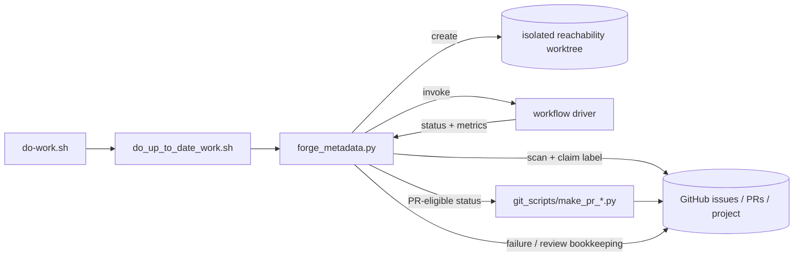

# AR-forge-architecture: Forge architecture

This document describes the high-level implementation shape of Forge:
which component owns each phase of the issue resolution defined in
§FS-forge-issue-resolution-goal, where extensibility lives, and which
boundaries keep generated work reviewable. The behavior Forge must satisfy is
defined by §FS-forge-functional-spec; this file records the implementation
structure chosen to satisfy it, with the workflow catalog in
§FS-forge-workflow-spec-catalog as the behavior surface.

## Architecture Map

| ID | Concern |
| --- | --- |
| §AR-forge-architecture | overview of Forge implementation boundaries |
| §DW-do-work-loop | worker bootstrap, self-update, stop markers, and cycle scheduling |
| §ORCH-forge-orchestration-spec | orchestration scripts: GitHub queue claiming, worktree setup, workflow dispatch, publication handoff, and issue/project bookkeeping |
| §GIT-forge-publication | git-scripts publication: staging, commit, PR body, labels, and issue linking |
| §WF-forge-workflow-system | behavioral contract for the workflow layer |
| §WF-forge-workflow-architecture | implementation split for workflow drivers, strategy configuration, workflow engines, utilities, and publication handoff |
| §WF-forge-workflow-drivers | behavioral contract for deterministic workflow drivers |
| §STRAT-forge-predefined-strategy-contract | behavioral contract for named strategy configuration bundles |
| §AR-forge-control-plane | how the worker loop, dispatcher, GitHub queues, and worktrees compose |
| §AR-forge-workflow-boundary | how workflow drivers turn a claimed issue into an isolated workflow run |
| §AR-forge-strategy-agent-boundary | how strategy configuration, workflow engines, agents, and post-generation interventions are separated |
| §AR-forge-verification-publication-boundary | why PR creation is a publication step after verification, not part of generation |
| §AR-forge-extension-points | where new issue queues, strategies, agents, and PR types plug in |
| §STRAT-workflow-strategy-registry | strategy registry and predefined strategy wiring |
| §WF-forge-workflow-engine | workflow engines as state-machine-like run executors |
| §WF-forge-workflow-strategy-config | predefined strategy bundles as workflow run configuration |

## AR-forge-control-plane: Worker loop and dispatcher own queue control

Forge is shaped as a small control plane around independent workflow entry
scripts, serving §FS-forge-issue-resolution-goal. `do-work.sh` is the stable
shell entrypoint. It forwards arguments to `do_up_to_date_work.sh`, which keeps
the local Forge checkout up to date, honors stop files, applies worker limits,
and invokes `forge_metadata.py` for one work cycle, as described in
§DW-do-work-loop. The dispatcher owns GitHub queue scanning, issue claiming,
worktree creation, workflow routing, review queues, project status updates, and
cleanup; its behavior and implementation are specified in
§ORCH-forge-orchestration-spec. PR publication is delegated to the
git-scripts component (§GIT-forge-publication) after the dispatcher
observes a PR-eligible status; the dispatched workflows themselves are defined
separately, in §WF-forge-workflow-system and §WF-forge-workflow-architecture.

The dispatcher routes issue work by issue labels, not by PR labels:

| Issue label | Workflow driver | Successful PR label |
| --- | --- | --- |
| `library-new-request` | `ai_workflows/drivers/add_new_library_support.py` | `library-new-request` |
| `library-update-request` | coverage driver or router | route-selected, see below |
| `fails-javac-compile` | `ai_workflows/drivers/fix_javac_fail.py` | `fixes-javac-fail` |
| `fails-java-run` | `ai_workflows/drivers/fix_java_run_fail.py` | `fixes-java-run-fail` |
| `fails-native-image-run` | `ai_workflows/drivers/fix_ni_run.py` | `fixes-native-image-run-fail` |

For `library-update-request`, queue ownership does not change when the requested
version is missing. `forge_metadata.py` keeps the original issue claimed and
owns its bookkeeping, but the missing-version router selects the downstream
driver and publication lane required by the route: `compatible` publishes as
`library-update-request`, `javac-failure` publishes as `fixes-javac-fail`, and
`java-run-failure` publishes as `fixes-java-run-fail`
(§ROADMAP-forge-missing-version-router).

The control plane treats a claimed issue as exclusive work. Claiming,
assignment checks, worktree creation, and final unassignment all belong in
`forge_metadata.py` and the GitHub helper layer rather than in individual
workflow engines. Workflow drivers should receive already-resolved
coordinates, paths, and strategy names; they should not reimplement queue
policy.

## AR-forge-workflow-boundary: Workflow drivers compose setup, workflow engine, and metrics

Workflow drivers are single-run boundaries, as defined by
§WF-forge-workflow-drivers. They translate a claimed issue into one isolated
run by resolving repository
paths, pinning the GraalVM environment, creating or checking out the feature
branch, preparing source context and required directories, loading the named
predefined strategy, running the selected workflow engine, finalizing metadata,
and writing schema-validated metrics.

The workflow driver owns run setup and finalization; the workflow engine owns
the state-machine-like issue-resolution process described in
§WF-forge-workflow-architecture. The predefined strategy supplies configuration:
which workflow engine, agent backend, model, prompt set, and workflow
parameters are used for the run. This keeps every workflow aligned with the
same repository, metrics, and local verification contracts
(§FS-local-ci-equivalent-verification) while letting operators select different
service profiles through configuration.

The reachability repository must be present as a complete checkout or worktree
for every generated artifact. Forge does not run Gradle-backed testing,
dynamic-access reporting, metadata generation, or native tracing inside copied
per-library fragments. That architecture keeps generated tests, metadata,
Gradle build logic, stats, and Forge logs in one filesystem context.

## AR-forge-strategy-agent-boundary: Strategies configure workflows, agents edit code

Registered workflow implementations own the generation loop. The codebase
currently names their base class `WorkflowStrategy`, but architecturally those
classes are workflow engines: they decide which prompt to send next, which
Gradle command to run, how to interpret output, when to reset to a checkpoint,
and which terminal status to return. Agents own only the editing and
command-execution interface exposed by `Agent`: prompts, context management,
token accounting, and test-command execution.

This boundary lets a predefined strategy bind a workflow engine, agent, model,
prompt-template set, workflow parameters, MCPs, and optional persistent
instructions without changing the workflow driver or the workflow implementation.
The workflow driver loads that bundle from `strategies/predefined_strategies.json`;
it does not hard-code model-specific behavior.

Post-generation recovery is built into the workflow base class, not a pluggable
registry and not selected per strategy. When the post-iteration `./gradlew test`
still fails during finalization, the base class runs a fixed Codex-then-Pi lane:
a Codex metadata fix first, then Pi removing the offending failing tests as a
last resort (see the post-generation intervention glossary in
§FS-forge-functional-spec).

Dynamic-access and native-test behavior stay in workflow specs, not in this
architecture file. The architecture only fixes the boundaries: workflow engines
call shared utilities for dynamic-access reports, and native test verification
is a reusable gate (§WF-native-test-verification-gate) that drives native
tracing and Codex recovery through the Gradle task contract in
§WF-native-trace-gradle-tasks. The concrete agent API and Pi adapter are
documented in §AR-agent-api, and the
strategy bundles that bind these pieces live in the strategy registry
(§STRAT-forge-predefined-strategy-contract, §STRAT-workflow-strategy-registry).

## AR-forge-verification-publication-boundary: Git scripts publish verified work

Forge separates generation from publication. A workflow may edit tests,
metadata, index files, stats, metrics, and logs while it runs, but PR creation
is delegated to `git_scripts/make_pr_*.py` only after the dispatcher observes a
PR-eligible status, as required by §FS-local-ci-equivalent-verification and
§GIT-forge-publication. The publication script
stages the expected paths, writes a commit message with metrics context, opens
the pull request, applies the workflow-specific PR label, and links the result
back to the issue.

This boundary is especially important for chunked dynamic-access work. A
non-final chunk publishes a reviewable PR that references the issue and carries
the exhaust-report state needed by the next run, as specified in
§WF-dynamic-access-exhaust-report. The final chunk is the only one allowed to
close the issue. The publication layer must preserve that issue linking
contract instead of treating every successful chunk as a completed issue
(§WF-chunked-dynamic-access-pr-linking).

It is also route-aware for missing requested-version `library-update-request`
runs. Existing requested-version work still publishes through
`git_scripts/make_pr_improve_coverage.py`; missing-version runs publish through
the selected downstream route: `git_scripts/make_pr_improve_coverage.py` for
`compatible`, `git_scripts/make_pr_javac_fix.py` for `javac-failure`, and
`git_scripts/make_pr_java_run_fix.py` for `java-run-failure`. The original
`library-update-request` issue remains the claimed issue and bookkeeping owner
even when publication uses a Java fail-fix PR lane
(§ROADMAP-forge-missing-version-router).

Shared repository edits are allowed only when local verification proves they
are necessary, and they must be surfaced in metrics and PR text for maintainer
review. Publication is therefore not a blind `git add .`; it is the point where
workflow-specific expected paths, labels, metrics, and human-intervention flags
become visible to reviewers.

## AR-forge-extension-points: New behavior plugs into one boundary at a time

Forge extension points are intentionally narrow:

- Add an issue queue by adding a label route in `forge_metadata.py` (see
  §ORCH-forge-orchestration-spec), a workflow driver under `ai_workflows/drivers/`, and
  a matching git script under `git_scripts/` (see
  §GIT-forge-publication).
- Add a workflow engine by subclassing the current `WorkflowStrategy` base
  class, registering it, documenting the workflow behavior, and adding
  predefined strategy entries that select it.
- Add or swap an editor backend by implementing `Agent` (see §AR-agent-api) and
  referencing it from predefined strategies.
- Change post-generation recovery by editing the shared Codex-then-Pi lane in
  the workflow base class (`_run_test_with_retry`); it is built in rather than a
  per-strategy plug-in, so recovery changes apply to every workflow at once.
- Add a prompt shape by adding a template and binding it through
  `strategies/predefined_strategies.json`.

New extensions should cite the workflow or functional spec that explains why
the behavior exists before adding architecture. Architecture declarations record
where a behavior lives in the implementation; workflow specs record the
operational contract; functional specs record the user-visible reason (see
§FS-forge-issue-resolution-goal).
