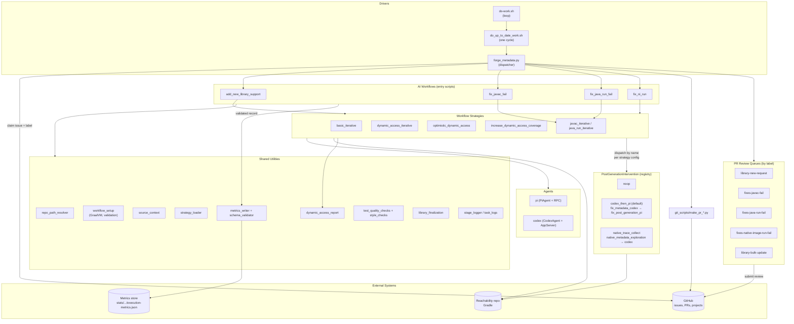

# Metadata Forge — Architecture

> **See also:** [Functional specification](functional-spec.md)

This document describes **how** Metadata Forge runs. The
[functional spec](functional-spec.md) covers **what** it does and the contracts
it must satisfy. Components are grouped by responsibility; each is described
once and referenced from the diagrams.

## 1. Component Layout

```text
forge/
├─ do-work.sh                  # Long-running worker loop
├─ do_up_to_date_work.sh       # One cycle: pull, dispatch, sleep
├─ forge_metadata.py           # Top-level dispatcher (issues, PRs, reviews)
├─ ai_workflows/
│  ├─ add_new_library_support.py   # Entry: new-library generation
│  ├─ fix_javac_fail.py            # Entry: fix Java compile failures
│  ├─ fix_java_run_fail.py         # Entry: fix JVM runtime failures
│  ├─ fix_ni_run.py                # Entry: fix native-image runtime failures
│  ├─ fix_metadata_codex.py        # Post-gen: Codex metadata repair
│  ├─ fix_post_generation_pi.py    # Post-gen: Pi intervention fallback
│  ├─ agents/                      # Pluggable LLM agents (pi, codex)
│  └─ workflow_strategies/         # Pluggable control loops
├─ git_scripts/                # Branch/commit/PR + GitHub helpers
├─ utility_scripts/            # Shared support modules (paths, metrics, …)
├─ strategies/
│  └─ predefined_strategies.json   # Named agent + workflow + prompts bundles
├─ prompt_templates/           # Loaded by strategies at runtime
├─ schemas/                    # JSON schemas for run metrics
└─ docs/                       # Specifications and this document
```

## 2. High-Level Architecture



Key invariants (unchanged from the functional spec):

- Agents **never** invoke Gradle directly. Strategies issue build/test
  commands through `agent.run_test_command(...)` and analyze the combined
  output.
- Generated changes must live under the per-library directory
  `tests/src/<group>/<artifact>/<version>` in the reachability repo, plus the
  library's `metadata/<group>/<artifact>/index.json`.
- Every successful run writes a metrics record validated against
  [schemas/](../schemas/) before any PR is opened.

## 3. Components

### 3.1 Drivers

- **[do-work.sh](../do-work.sh)** — long-running loop. Updates the Forge
  checkout, runs one cycle, sleeps `DO_WORK_SLEEP_SECONDS`, repeats. Reads
  per-queue limits from `FORGE_*` env vars and forwards them to the cycle
  script.
- **[do_up_to_date_work.sh](../do_up_to_date_work.sh)** — one cycle.
  Materializes env vars and invokes `forge_metadata.py` to drain each
  configured work queue once.
- **[forge_metadata.py](../forge_metadata.py)** — dispatcher. Fetches GitHub
  issues by label, claims them via optimistic locking (assignee + verify),
  creates an isolated worktree, routes the claim to the matching workflow
  entry script, and afterwards either opens a PR or preserves failed work and
  posts a human-intervention comment. Also runs the PR review queues.

### 3.2 AI Workflow Entry Scripts

Each script is a thin orchestrator over the shared utilities and a workflow
strategy. They share a common skeleton: resolve paths and GraalVM, scaffold
the per-library directory, prepare source contexts, load the strategy, run
it, optionally apply post-generation intervention, validate and write
metrics.

| Script | GitHub label | Workflow concern |
| --- | --- | --- |
| [add_new_library_support.py](../ai_workflows/add_new_library_support.py) | `library-new-request` | Generate tests + metadata for an unsupported library. |
| [fix_javac_fail.py](../ai_workflows/fix_javac_fail.py) | `fixes-javac-fail` | Repair test sources that no longer compile. |
| [fix_java_run_fail.py](../ai_workflows/fix_java_run_fail.py) | `fixes-java-run-fail` | Repair JVM runtime test failures. |
| [fix_ni_run.py](../ai_workflows/fix_ni_run.py) | `fixes-native-image-run-fail` | Refresh metadata for `nativeTest` failures. |

### 3.3 Agents

Agents implement the [`Agent`](../ai_workflows/agents/agent.py) base
interface (`send_prompt`, `run_test_command`, `fork`, context management,
token tracking) and self-register via `@Agent.register("name")`.

- **[`pi`](../ai_workflows/agents/pi_agent.py)** — uses
  [`PiRpcClient`](../ai_workflows/agents/pi_rpc_client.py) over JSON-RPC.
- **[`codex`](../ai_workflows/agents/codex_agent.py)** — uses
  [`CodexAppServerClient`](../ai_workflows/agents/codex_app_server.py) over
  HTTP.

A predefined strategy names the agent it requires; the entry script
instantiates it through the registry.

### 3.4 Workflow Strategies

> Detailed reference: [Workflow strategies](workflow-strategies.md) — base
> class contract, per-strategy loop semantics, predefined-strategy bundles,
> and how to add a new one.

Strategies inherit from
[`WorkflowStrategy`](../ai_workflows/workflow_strategies/workflow_strategy.py)
and self-register via `@WorkflowStrategy.register("name")`. The base class
validates required prompts/parameters and exposes the post-generation
intervention hook.

| Name | Implementation | Role |
| --- | --- | --- |
| `basic_iterative` | [basic_iterative_strategy.py](../ai_workflows/workflow_strategies/basic_iterative_strategy.py) | Run-test → on failure, send error to agent → loop until pass or max iterations. |
| `dynamic_access_iterative` | [dynamic_access_iterative_strategy.py](../ai_workflows/workflow_strategies/dynamic_access_iterative_strategy.py) | Coverage-driven loop using the dynamic-access report; targets uncovered call sites. |
| `optimistic_dynamic_access` | [optimistic_dynamic_access_strategy.py](../ai_workflows/workflow_strategies/optimistic_dynamic_access_strategy.py) | Variant of dynamic-access that primes coverage from source analysis. |
| `increase_dynamic_access_coverage` | [increase_dynamic_access_coverage_strategy.py](../ai_workflows/workflow_strategies/increase_dynamic_access_coverage_strategy.py) | Composite: chain a primary workflow with a coverage-improvement phase. |
| `javac_iterative`, `java_run_iterative` | [java_fix_iterative_strategy.py](../ai_workflows/workflow_strategies/java_fix_iterative_strategy.py) | Specializations of a shared base for compile vs. runtime fixes. |

### 3.5 Post-Generation Interventions

> Detailed reference: [workflow-strategies.md §5](workflow-strategies.md#5-post-generation-interventions) ·
> Trace-loop spec: [native-metadata-exploration.md](native-metadata-exploration.md).

`PostGenerationIntervention` is a separate plug-in registry from
`WorkflowStrategy`. The base class `_run_test_with_retry` dispatches to the
intervention named in each predefined strategy's
`post-generation-intervention` block. Default: `codex_then_pi` (preserves
historical behaviour). Concrete interventions:

| Name | Implementation | Role |
| --- | --- | --- |
| `codex_then_pi` | wraps [`fix_metadata_codex`](../ai_workflows/fix_metadata_codex.py) and [`fix_post_generation_pi`](../ai_workflows/fix_post_generation_pi.py) | Run Codex on missing metadata; if tests still fail, run Pi to remove failing tests and emit an intervention report. Yields `SUCCESS_WITH_INTERVENTION_STATUS` on the Pi path. |
| `native_trace_collect` | wraps `utility_scripts/native_metadata_exploration.py` plus the codex/pi cascade | Build with `MetadataTracingSupport`, run, merge, optionally verify with `--exact-reachability-metadata`, then route the result (every status, including `BUILD_FAILED`) into Codex with the trace dir as context, falling back to Pi. |
| `noop` | — | Skip recovery; treat any test failure as hard failure. |

The intervention contract (`InterventionContext` → `InterventionResult`)
and concrete sub-step semantics are documented in
[workflow-strategies.md §5.1](workflow-strategies.md#51-interface). The
shared trace-loop primitive used by `native_trace_collect` is fully
specified in [native-metadata-exploration.md](native-metadata-exploration.md)
— including the convergence rule, status enum, Gradle task surface, and the
codex hand-off contract for non-`SUCCESS` outcomes.

### 3.6 Shared Utilities (`utility_scripts/`)

| Module | Role |
| --- | --- |
| `repo_path_resolver` | Resolve and validate Forge, reachability, and metrics repo paths. |
| `workflow_setup` | Resolve `GRAALVM_HOME`/`JAVA_HOME`, validate environment, drive metadata fixup orchestration. |
| `source_context` | Fetch library source / tests / docs JARs and prepare read-only context for the agent. |
| `strategy_loader` | Load named entries from `predefined_strategies.json` and substitute prompt template variables. |
| `dynamic_access_report` | Parse `dynamic-access-coverage.json`, compute deltas, format prompts. |
| `library_finalization` | Run final Gradle metadata-collection and validation tasks. |
| `metrics_writer` | Assemble the per-run record (tokens, iterations, coverage, timestamps). |
| `schema_validator` | Validate metrics against [schemas/](../schemas/). |
| `test_quality_checks` | Detect/remove scaffold-only placeholder tests. |
| `style_checks` | Style and lint guards. |
| `library_stats` | Test LOC, artifact counts, and other per-library statistics. |
| `stage_logger`, `task_logs`, `pi_logs` | Stage transitions and per-task log paths. |
| `count_native_image_config_entries`, `count_reachability_entries` | Count metadata entries (legacy and current formats). |
| `jacoco_parser` | Parse JaCoCo coverage reports. |

### 3.7 Git Scripts (`git_scripts/`)

- **[common_git.py](../git_scripts/common_git.py)** — GitHub API helpers:
  fetch issues/PRs, optimistic-lock claim, comments, labels, branch names,
  `gh` auth checks.
- **`make_pr_*.py`** — one per workflow
  ([new_library_support](../git_scripts/make_pr_new_library_support.py),
  [javac_fix](../git_scripts/make_pr_javac_fix.py),
  [java_run_fix](../git_scripts/make_pr_java_run_fix.py),
  [ni_run_fix](../git_scripts/make_pr_ni_run_fix.py)). Each stages changes,
  commits with metrics embedded in the message, and opens a PR with a
  formatted description.

### 3.8 Configuration & Templates

- **[strategies/predefined_strategies.json](../strategies/predefined_strategies.json)**
  is the central wiring file. Each entry binds an agent + workflow strategy +
  model + prompt template paths + parameters into a name passed via
  `--strategy-name`.
- **[prompt_templates/](../prompt_templates/)** holds the templates loaded by
  `strategy_loader` (initial scaffold, post-pass refinement, post-fail
  recovery, dynamic-access iteration, javac/java-run failure prompts).
- **[schemas/](../schemas/)** holds the JSON Schemas for run metrics and
  benchmark records.

## 4. Top-Level Run Sequence (`library-new-request`)

```mermaid
sequenceDiagram
    autonumber
    participant U as User / CI
    participant Loop as do-work.sh
    participant Disp as forge_metadata.py
    participant GH as GitHub
    participant Entry as add_new_library_support.py
    participant Util as workflow_setup / source_context
    participant Strat as Workflow strategy
    participant Agent as Registered agent
    participant Repo as Reachability repo (Gradle)
    participant Post as Post-gen intervention
    participant Met as Metrics store
    participant PR as git_scripts/make_pr_*

    U->>Loop: ./do-work.sh
    Loop->>Disp: do_up_to_date_work.sh → forge_metadata.py
    Disp->>GH: Fetch issues, claim by label
    Disp->>Entry: Invoke with --coordinates, --strategy-name
    Entry->>Util: Resolve paths, GraalVM/Java home
    Entry->>Repo: Create branch, run scaffold task
    Entry->>Util: prepare_source_contexts(...)
    Entry->>Strat: Instantiate from predefined_strategies.json
    Entry->>Agent: Initialize via Agent.get_class(name)
    Entry->>Strat: run(agent, checkpoint_commit_hash)
    loop iteration
        Strat->>Agent: send_prompt / run_test_command
        Agent->>Repo: Edit files; Strat triggers Gradle
    end
    alt strategy declares post-generation intervention
        Strat->>Post: Codex metadata fix
        opt Codex did not converge
            Post->>Post: Pi removes failing tests
        end
    end
    Strat-->>Entry: status, iteration counts
    Entry->>Met: Validated run-metrics record
    alt success / success-with-intervention
        Disp->>PR: make_pr_new_library_support
        PR->>GH: Commit + open PR
        Disp->>GH: Project status → Done, unassign
    else failure
        Disp->>GH: Push preserve branch + human-intervention comment
        Disp->>GH: Project status → Todo, unassign
    end
    Entry-->>U: Exit 0 (success or success-with-intervention) / 1 (failure)
```

## 5. Extension Points

- **Add an agent**: implement `Agent`, decorate with
  `@Agent.register("name")`, reference it in a `predefined_strategies.json`
  entry.
- **Add a workflow strategy**: subclass `WorkflowStrategy`, decorate with
  `@WorkflowStrategy.register("name")`, declare required prompts/parameters.
- **Add a workflow type**: add an entry script under `ai_workflows/`, wire a
  matching `make_pr_*.py`, and register the label routing in
  `forge_metadata.py`.
- **Add a predefined strategy**: append an entry to
  `strategies/predefined_strategies.json` referencing existing agent +
  workflow names and prompt templates.
