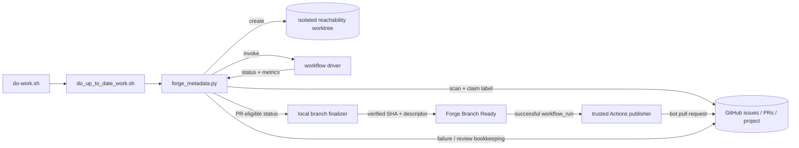

# AR-forge-architecture: Forge architecture

This document describes the high-level implementation shape of Forge:
which component owns each phase of the issue resolution defined in
§FS-forge-issue-resolution-goal, where extensibility lives, and which
boundaries keep generated work reviewable. The behavior Forge must satisfy is
defined by §FS-forge-functional-spec; this file records the implementation
structure chosen to satisfy it, with the workflow catalog in
§FS-forge-workflow-spec-catalog as the behavior surface.

## Architecture Map

| ID | Concern |
| --- | --- |
| §AR-forge-workflow-pipeline | the end-to-end pipeline of one workflow run, step by step |
| §AR-forge-run-location | how progress output and failure output share one phase/step vocabulary |
| §AR-forge-control-plane | how the worker loop, dispatcher, GitHub queues, and worktrees compose |
| §AR-forge-workflow-boundary | how workflow drivers turn a claimed issue into an isolated workflow run |
| §AR-forge-strategy-agent-boundary | how strategy configuration, workflow engines, agents, and post-generation interventions are separated |
| §AR-forge-verification-publication-boundary | why PR creation is a publication step after verification, not part of generation |

## AR-forge-workflow-pipeline: Forge Workflow architecture

This section is the single authoritative picture of what runs during one Forge
workflow, in order, and which component owns each step. It is the diagram
contributors should trust when they ask *what actually happens between a labeled
issue and a bot pull request* (§FS-forge-issue-resolution-goal). Steps that are
gates rather than components are written below as pseudo-methods: the name fixes
the contract, the contract text fixes what the step must do, and the citation
fixes where the behavior is specified. Code coverage improvement
(§AR-code-coverage-improvement) has its own pipeline and is not covered here.

Every method carries one label: **Algorithmic** — deterministic code decides,
no model is involved; **Neural** — a model decides, by design, because the
decision cannot be made mechanically; **Neural in the worst case** — a
deterministic path runs first and a model is reached only when that path does
not converge. The labels are the standing audit that judgment is spent only
where it is unavoidable (§root/PRCPL-prefer-algorithmic), and a step that drifts
from `Algorithmic` to `Neural` is a design regression, not an implementation
detail.

The run is shown as a sequence. Every step is a method with a contract below;
GitHub covers both the API surface and the repository Actions, which publish
asynchronously after the run has finished:

```mermaid
%%{init: {"themeVariables": {"noteBkgColor": "#eef2f7", "noteTextColor": "#0f172a", "noteBorderColor": "#94a3b8"}}}%%
sequenceDiagram
    autonumber
    participant D as forge_metadata
    participant DR as workflow driver
    participant WC as workflow core
    participant AG as agent
    participant GH as GitHub

    rect rgba(148, 163, 184, 0.12)
    Note over D,GH: claim
    D->>D: check_host_requirements()
    D->>D: check_strategy_and_model()
    D->>GH: scan_issue_queue(label, priority)
    GH-->>D: candidate issues
    D->>GH: claim_issue()
    GH-->>D: assigned, status In Progress
    D->>D: check_issue_form()
    alt issue is malformed
        D->>GH: post the predefined comment for the failed rule
        D->>GH: close_issue()
        D->>GH: clear Forge assignee
    else artifact repository did not answer
        D->>GH: release_claim()
    else issue form is valid
        D->>D: create_issue_workspace()
        D->>DR: route_to_driver(coordinates, strategy)
    end
    end

    rect rgba(148, 163, 184, 0.12)
    Note over D,GH: setup
    DR->>DR: normal_setup(coordinates, strategy)
    DR->>AG: neural_setup(coordinates, strategy, PreparedRun)
    AG-->>DR: prepared or failed
    opt agent timed out, or returned an unusable setup result
        AG-->>DR: RUN_STATUS_FAILURE
        DR-->>D: failed
    end
    DR->>DR: check_setup(NeuralSetupResult)
    opt a required setup input or action is missing
        DR-->>D: failed
    end
    DR->>WC: run_workflow_engine(agent)
    end

    rect rgba(148, 163, 184, 0.12)
    Note over D,GH: fix
    opt issue reports a failure to repair (fails-* queue)
        WC->>AG: fix_reported_failure()
        AG-->>WC: reported failure passes, or budget exhausted
        WC->>WC: native_trace_gate()
        opt native trace gate still reports missing metadata
            WC->>AG: agent_fix()
            AG-->>WC: repaired or failed
            opt agent could not repair the gate failure
                WC-->>DR: RUN_STATUS_FAILURE
                DR-->>D: failed
            end
        end
    end
    end

    rect rgba(148, 163, 184, 0.12)
    Note over D,GH: explore
    alt report lists classes with uncovered dynamic access
        loop bulk pass, up to max-optimistic-iterations
            WC->>AG: generate_tests(report_with_every_class)
            AG-->>WC: failed task or pass
            WC->>WC: refresh_dynamic_access_report()
            alt bulk pass gained coverage
                WC->>WC: commit_bulk_pass()
                WC->>WC: native_trace_gate()
                opt native trace gate still reports missing metadata
                    WC->>AG: agent_fix()
                    AG-->>WC: repaired or failed
                    opt agent could not repair the gate failure
                        WC-->>DR: RUN_STATUS_FAILURE
                        DR-->>D: failed
                    end
                end
            else bulk pass reached no nativeTest in its budget
                WC->>WC: reset_to_bulk_checkpoint()
            end
        end
        loop each class still uncovered
            WC->>WC: select_next_uncovered_class()
            WC->>AG: generate_tests(single_class_report)
            AG-->>WC: failed task or pass
            alt test task fails before nativeTest is reached
                WC->>AG: send_failure_output(class budget)
            else nativeTest ran, metadata is observable
                WC->>WC: refresh_dynamic_access_report()
            end
            alt class gained covered dynamic access
                WC->>WC: commit_class()
            else class exhausted its iteration budget
                WC->>WC: reset_to_class_checkpoint()
            end
            opt batch of 5 committed classes, or all classes terminal
                WC->>WC: native_trace_gate()
                opt native trace gate still reports missing metadata
                    WC->>AG: agent_fix()
                    AG-->>WC: repaired or failed
                    opt agent could not repair the gate failure
                        WC-->>DR: RUN_STATUS_FAILURE
                        DR-->>D: failed
                    end
                end
            end
        end
    else library produces no dynamic-access report
        WC->>AG: run_basic_iterative_fallback()
    end
    end

    rect rgba(148, 163, 184, 0.12)
    Note over D,GH: finalization
    WC-->>DR: terminal run status
    DR->>DR: finalize_run()
    opt a repairable finalization check fails
        DR->>AG: agent_fix(failing step records)
        AG-->>DR: repaired or failed
        DR->>DR: rerun_failed_step()
        opt the step still fails
            DR-->>D: failed
        end
    end
    DR->>DR: local_ci_check()
    opt gate fails
        DR->>AG: agent_fix(gate records)
        AG-->>DR: repaired or failed
        DR->>DR: local_ci_check()
        opt gate still fails
            DR-->>D: human-intervention handoff
        end
    end
    DR->>AG: local_review(diff, gate records, descriptor stats)
    AG-->>DR: approved, or finding filed and repaired
    opt the review repaired the branch
        DR->>DR: finalize_run() + local_ci_check()
        opt either fails over the repaired tree
            DR->>AG: agent_fix(failing step records)
            AG-->>DR: repaired or failed
            DR->>DR: finalize_run() + local_ci_check()
            opt either still fails
                DR->>DR: local_review_checkpoint_reset()
            end
        end
    end
    end

    rect rgba(148, 163, 184, 0.12)
    Note over D,GH: publication
    DR->>GH: push_verified_branch(descriptor)
    DR-->>D: finished
    D->>D: close_out_issue()
    GH->>GH: validate_publication_sha()
    GH->>GH: open_pull_request()
    end
```

The banded segments in the sequence are the run's logical phases. A phase is the
unit a run resumes at and the unit a failure names, so each one has a single
purpose and a boundary a reader can point at:

| Phase | Owner | Purpose | Begins when | Ends when |
| --- | --- | --- | --- | --- |
| `claim` | dispatcher (§AR-forge-control-plane) | Turn a labeled issue into one run that is safe to start: prove the host and the strategy, take exactly one issue, and prepare the ground the run executes on | The worker loop reaches an eligible queue | A driver is invoked with resolved coordinates, a validated strategy, and the prepared workspace — or the claim is released back to the queue |
| `setup` | workflow driver (§AR-forge-driver-contract) | Put the coordinate's inputs on disk — index entry, source context, preflight decisions — so the workflow engine starts from a tree that is already correct | The dispatcher routes the claimed issue to the driver | `check_setup()` accepts every artifact the setup steps were supposed to produce and returns `ReadyRun` |
| `fix` | workflow core (§AR-java-fail-fix-workflow) | Repair the failure the issue reports, and prove the repair under Native Image | A `fails-*` issue reaches the workflow engine | The reported failure passes and the trace gate is clean; `skipped` on workflows with no reported failure to repair |
| `explore` | workflow core (§AR-dynamic-access-iterative) | Raise dynamic-access coverage by writing tests that reach uncovered call sites, keeping only what actually gained coverage | The dynamic-access report lists classes with uncovered access | Every class is terminal — committed or exhausted; `skipped` on workflows that do not explore, and deferred when the uncovered-class count exceeds the threshold |
| `finalization` | workflow driver (§AR-forge-driver-finalization) | Turn generated work into a verified tree: the terminal gate, the three native lanes, the repository checks, the local CI equivalent, and the local review | The workflow engine returns a terminal run status | The tree that will be pushed has passed `local_ci_check()` and `local_review()` |
| `publication` | driver, then GitHub Actions (§AR-forge-verification-publication-boundary) | Make the verified tree PR-eligible and hand the privileged half to Actions, which opens the pull request | The verified branch is ready to push | The pull request is open and the issue is closed out |

The five durable phases — `setup`, `fix`, `explore`, `finalization`,
`publication` — are recorded in the continuation marker, so a failed run resumes
at the phase that failed rather than from the start; that marker also fixes each
phase's resume *shape* (§FS-forge-run-continuation.1). `claim` is not one of
them: it runs before a run exists, in the dispatcher
(§AR-forge-control-plane). The same six names are the phase half of a failure
report (§ROADMAP-forge-failure-locates-phase-and-step).

### check_host_requirements()

**Algorithmic.**

A blocking, deterministic host gate that runs before any issue is claimed, so a
misconfigured host never consumes a queue item (§FS-forge-host-requirements).
This is the host half of the two requirement gates (§FS-forge-requirements); the
run half is checked per issue, below.
Every capability the run depends on is verified at the process boundary before
the first side effect (§root/PRCPL-verify-inputs). It must verify, and report as
one manifest:

- **Tooling on PATH**: Python, `git`, `gh`, `pi`, `codex`, the Docker CLI,
  `grype`, and the repository's Gradle wrapper.
- **Agents are really usable**, not merely installed: every backend the enabled
  roles select, authenticated against its provider and configured for unattended
  runs (§FS-forge-agent-runtime-selection).
- **GitHub is alive and authorized**: `gh` authenticated, repository
  Contents/Issues/Pull-requests write, and Projects write on the tracked
  project board.
- **Every Java lane**: `GRAALVM_HOME`, `GRAALVM_HOME_25_0`, and
  `GRAALVM_HOME_LATEST_EA` must each point at a GraalVM containing Native Image
  and the reachability-metadata schema. Version matching against the repository
  pin is `strict` by default and can be relaxed per run with
  `--graalvm-version-check {strict,warn,off}`; Native Image and the schema stay
  mandatory in every mode.
- **Filesystem writability** for the Forge checkout, both `.git` directories,
  `local_repositories/`, and temporary Gradle state.
- **Network reachability** on 443, through the configured proxy when one is
  set: `github.com`, `api.github.com`, `chatgpt.com`, `services.gradle.org`,
  `plugins.gradle.org`, `registry-1.docker.io`, `auth.docker.io`. Each base URL
  in `ARTIFACT_REPOSITORY_URLS` is checked separately with HTTP `HEAD` and must
  return `200`; this currently covers `repo1.maven.org` and
  `packages.confluent.io`, the exact hosts used by `check_issue_form()`.
- **Git transport** to the monitored branch from each checkout, and access to
  the Docker daemon.

Checks are scoped to the queues the run actually enables: a review-only run does
not require the issue-work GraalVM lanes or Docker.

### check_strategy_and_model()

**Algorithmic.**

Every enabled issue queue resolves its configured strategy name against the
registry before scanning starts, and a strategy bundle is rejected on load
unless it names a model and carries the prompts and parameters its workflow
engine declares as required (§FS-forge-run-requirements.1,
§FS-forge-predefined-strategy-contract). The bundle is an input like any
other and is validated before scanning rather than at first use
(§root/PRCPL-verify-inputs). An unknown strategy is a worker
configuration error, not a per-issue failure.

### check_issue_form()

**Algorithmic.**

The queue label decides the workflow, so the issue must be unambiguous before a
driver starts (§FS-forge-run-requirements.3, §AR-forge-driver-queues). The
issue is the run's input, and a malformed one is rejected at the boundary
instead of failing inside a driver (§root/PRCPL-verify-inputs). The gate runs
after `claim_issue()` holds the exclusive claim and before
`create_issue_workspace()`, so a rejected issue is never given a worktree and
never reaches a driver:

- `single-workflow-label` — **exactly one workflow label.** An issue carrying
  two queue labels is processed once per queue that matches it, so it would be
  claimed, worked, and published once per label by drivers with different
  assumptions.
- `maven-coordinates` — **the title must resolve to** `group:artifact:version`.
- `current-latest-version` — **a `fails-*` issue must resolve a current
  `latest` metadata version** for the coordinate, because a repair workflow is
  defined as a move from the currently supported version to the requested one.
- `newer-than-latest` — **a `fails-*` issue must request a version strictly
  above that `latest`**, decided by the same
  `is_newer_than_latest_metadata_version()` predicate the repair drivers use to
  index a version.
- `published-artifact` — **the coordinate must be fetchable.** Parsing is not
  resolution: the gate requests the coordinate's POM from Maven Central and then
  from the Confluent fallback (§root/AR-build-infrastructure.1), and a
  coordinate no repository publishes is rejected. This reuses the artifact fetch
  that Native Image eligibility already performs
  (`utility_scripts/native_image_artifact.py`) and asks it only whether the
  artifact exists, so the answer costs one request against a URL derived
  entirely from the coordinate. A repository that cannot be reached leaves the
  answer undecided; an undecided answer releases the claim without rejecting,
  so the issue is left in `Todo` for a later cycle.

The rules are evaluated in that order and the gate stops at the first failure,
so `published-artifact` — the only rule that leaves the machine — is reached
only by an issue every local rule accepts.

The gate does not make the repair drivers stop deciding whether a prepared
version is the new `latest`. `fix_javac_fail` and `fix_java_run_fail` also serve
`library-update-request` issues routed to them for a version backfill, and a
backfilled version may legitimately sit below `latest`, so
`java_fail_workflow.metadata_index_update_task()` keeps its own use of the
predicate (§AR-forge-driver-queues.3). What the gate removes is the *late
rejection*, not the indexing decision.

Which driver a `library-update-request` runs is decided after the claim, not
here: when the requested version already has a test suite it routes to coverage
improvement; otherwise the nearest compatible supported suite is probed with
compile, JVM test, and native test, and the first failing stage selects the
repair driver (`fix_javac_fail`, `fix_java_run_fail`, `fix_ni_run`). The probe
needs the prepared worktree the gate protects, so the decision belongs to
routing; it is persisted as a route sidecar so publication reports the same
workflow that ran.

Each rule is a named check, and the gate returns the name of the one that
failed together with the value that failed it — the rules are decided one at a
time from the payload, so no inference is needed to say which one it was. That
name selects a predefined comment posted to the issue, so the reporter learns
what to fix (§FS-forge-run-requirements.3). The claim remains held while the
comment is posted and the issue is closed; only then is the Forge assignee
cleared. Releasing the claim first would admit another worker between the
comment and close operations. The comment carries a marker keyed on rule and
offending value so a reopened, unedited issue is closed again without a second
comment. A form rejection applies no `human-intervention` label and preserves
no branch: the defect is in the issue, not in anything Forge generated
(§FS-human-intervention-policy).

The live worker output states the failed rule and offending value, then says
whether it posted the matching comment or skipped a duplicate, and finally says
that it is closing the issue (§FS-forge-run-output-legibility).

Fixture-backed runs are the one ordering exception. Fixture masking rewinds the
metadata index inside the isolated fixture worktree, and no live GitHub state is
mutated, so fixture setup creates and masks that worktree before it runs the
same gate against the repository state the fixture run would consume. A
rejection still comments on and closes the fixture issue, cleans the worktree,
and never invokes a driver (§FS-forge-run-requirements.3).

### claim_issue() → check_issue_claimable()

**Algorithmic.**

Claiming is orchestration, never workflow logic (§AR-forge-control-plane,
§AR-forge-orchestration). The issue payload is re-read at claim time against
live GitHub state rather than trusted from the scan
(§FS-forge-run-requirements.2), and must still be open, still carry the queue
label, be unassigned or assigned only to the authenticated user, have no open
blockers, and sit in project status `Todo`. Only then is it assigned and moved
to `In Progress`. The issue-form gate runs while that exclusive claim is held;
only an accepted form is given an isolated worktree plus scratch metrics
repository. A `resumable` issue additionally requires a valid continuation
marker on a preserved branch (§FS-forge-run-continuation), and a
`chunked-dynamic-access` issue requires its exhaust report
(§AR-dynamic-access-exhaust-report).

### create_issue_workspace()

**Algorithmic.**

The dispatcher, not the driver, prepares the ground a run executes on: an
isolated worktree of the reachability repository, a scratch metrics repository,
and the per-run setup-evidence directory. It also validates that the issue
GraalVM lanes are present before any driver is invoked
(§FS-forge-run-requirements.4, §AR-forge-control-plane,
§AR-forge-orchestration). Drivers are given the resulting paths.

### route_to_driver()

**Algorithmic.**

Routing and driver invocation are one step: the dispatcher resolves the issue
label to exactly one driver script under `ai_workflows/drivers/` and calls it
with two explicit run inputs — resolved coordinates and the validated strategy —
plus the worktree, metrics and setup-evidence paths, issue context, and
continuation marker (§AR-forge-orchestration). Routing is by issue label
only, never by PR label, and the driver does not re-implement queue policy. The
driver returns a terminal status and its durable run evidence.

### normal_setup()

**Algorithmic.**

`normal_setup(coordinates, strategy, run_context) -> PreparedRun` performs the
run-shaped work that requires no model: create or check out the feature branch,
scaffold a new library or copy the supported version for a repair, resolve the
test and metadata directories (§AR-forge-workflow-boundary). Its output is the
only valid input to `neural_setup()`.

Two things in the current implementation sit on the wrong side of this line:
drivers re-resolve repository paths (with a clone fallback, because a driver is
still runnable standalone), and each driver pins the GraalVM environment per
Gradle command instead of inheriting one environment decided at claim time.
Ownership as specified here is dispatcher-side, and closing the gap — including
removing standalone driver execution entirely — is
§ROADMAP-forge-dispatcher-owned-run-preconditions.

### neural_setup()

**Neural.** The artifact and source preparation inside the segment is
algorithmic, but the segment is neural because the agent decides what
additional library preparation is required.

`neural_setup(PreparedRun) -> NeuralSetupResult` is one call across the agent
boundary, and it is where **every** setup step performed by a model happens:
artifact URL population, source-context download, the library-preparation
decision, and application of its typed actions. No model-driven setup work runs
before `normal_setup()` or between `neural_setup()` and `check_setup()`. The
agent receives the coordinates, strategy, prepared tree, issue context, artifact
evidence, and source context. Returned dependency, Docker-image, and advisory
fields are typed and structurally validated
(§AR-forge-orchestration.1.1, §root/PRCPL-verify-inputs).

The agent running this step must have web tooling: resolving artifact URLs,
downloading sources, and deciding what a library needs to build require reading
upstream repositories, Maven Central, and library documentation. A strategy that
maps this step onto an agent without web access is misconfigured, and
`check_host_requirements()` verifies the configured setup agent is usable before
any issue is claimed.

Each step writes its artifact to a place fixed by the coordinate: URL population
into the coordinate's `index.json`, source context into the directory that entry
names, the preparation decision into the run's preflight JSON, its typed actions
into the test `build.gradle` and the image allow-list. `NeuralSetupResult` is the
set of those paths, so continuation state and metrics point at the same files —
not a description of what they contain (§AR-forge-driver-contract). The step
fails the same way `agent_fix()` does: a timeout or an unusable response is
`RUN_STATUS_FAILURE` to the driver, and the driver reports the run as failed to
`forge_metadata` — never a successful `no_action` decision. The result is
persisted in continuation state so a resumed run does not repeat a completed
neural setup (§FS-forge-run-continuation).

Today `forge_metadata` invokes the preflight agent before driver dispatch, and the
fix drivers try to apply its decision before copying or creating the target
version. Artifact URL population and source download happen later. Moving the
agent invocation behind `normal_setup()` and making the driver own the whole
neural segment is §ROADMAP-forge-algorithmic-then-neural-setup.

### check_setup()

**Algorithmic.**

`check_setup(NeuralSetupResult) -> ReadyRun | FAILED` opens each artifact the
setup steps were supposed to produce and confirms it was properly generated: the
coordinate's `index.json` parses and carries its four URLs, the source context is
present where that entry names, the preflight JSON parses and validates against
its schema, and each decided action is in the tree
(§AR-forge-driver-contract). Paths come from the coordinate and the run
context, not from anything the agent returned, so the check cannot be pointed
somewhere convenient. A missing, unparseable, or incomplete artifact is a setup
failure.

On success it captures the recovery checkpoint after all setup edits and returns
`ReadyRun`. Only that output may initialize the workflow agent and call
`run_workflow_engine()`. `FAILED` returns to `forge_metadata` with the setup
evidence and leaves the setup phase pending for continuation.

### run_workflow_engine()

**Algorithmic.** The engine is a state machine; the neural work is in the steps
it invokes (§AR-forge-strategy-agent-boundary).

The driver hands the agent, rendered prompts, workflow parameters, repository
paths, and run metadata to the registered workflow engine and gets one terminal
run status back (§AR-forge-workflow-engine). The engine owns run state —
checkpoints, prompt/command cycles, gate interpretation, retry budgets, metrics
— and the driver owns everything around it. The exploration loop the diagrams
above trace — class selection, checkpoints, `commit_class()`,
`reset_to_class_checkpoint()`, `refresh_dynamic_access_report()`, and the
`run_basic_iterative_fallback()` path a library with no dynamic-access signal
takes instead — is engine-owned and specified in full by
§AR-dynamic-access-iterative and
§AR-dynamic-access-fallback-and-failure. Only the steps with a contract of their
own are listed here.

### fix_reported_failure()

**Neural.** Reproduction and the pass/fail verdict are deterministic; the repair
itself is the agent's.

A `fails-*` issue is a repair run: the engine reproduces the reported failure,
sends it to the agent, and iterates until the failing task passes or the budget
is exhausted (§AR-java-fail-fix-workflow, §AR-forge-driver-queues.4).
Whether exploration follows is a strategy decision, not a workflow rule. A bare
repair engine completes the fix phase and marks explore skipped. A composite
bundle — the strategies whose workflow is the composite engine and that name a
`primary-workflow` — runs the repair first and then the dynamic-access loop on
the same run, and defers exploration when the uncovered-class count exceeds the
configured threshold (§AR-dynamic-access-composite). A plain
dynamic-access engine has no repair step and marks the fix phase skipped.

### generate_tests()

**Neural.** Writing a test that reaches an uncovered call site is the judgment
Forge exists to buy; the attempt loop around it is deterministic.

One step, two scopes, decided by the argument: `report_with_every_class` is the
bulk pass over the whole dynamic-access report, and `single_class_report` is one
class of it (§AR-dynamic-access-bulk,
§AR-dynamic-access-iterative). Nothing else differs — same prompt
rendering, same test budget, same verdict rules — so the two exploration stages
are one step called with a different slice of the same report.

One attempt is: render the dynamic-access prompt for that scope and send it
through the agent, which runs `./gradlew test -Pcoordinates=<library>` itself up
to the configured test budget. A failure *before* `nativeTest` is fed back to the
agent as another attempt. Reaching `nativeTest` — passing or failing — ends the
test loop and hands the decision to the coverage report and the native-test gate,
never to the agent.

### agent_fix()

**Neural.** The repair is the agent's; every decision around it is not
(§root/PRCPL-prefer-algorithmic).

Several unrelated steps need the same arrangement — a deterministic check has
failed, let an agent try within that check's budget — so it is written once here
and cited rather than restated at every call site. It is not a phase and has no
slot of its own:
`native_trace_gate()` reaches it as step 3, `finalize_run()` on a failed native
lane, metadata validation, or Checkstyle, `local_ci_check()` on a failed check,
and either of them again when a
`local_review()` repair does not survive them. Wherever it is called the terms
are the same until verification:

1. **Only after a deterministic step has failed.** The agent is never asked for
   something a check, a trace, or a gate could have produced, and never runs
   speculatively ahead of one.
2. **On that step's own evidence.** The failing step's records are the input —
   gate output, verification records, review findings — not a summary of them
   and not the run's history.
3. **A bounded number of attempts**, owned by the failing step. Native lanes
   receive one; metadata validation and Checkstyle retain up to three.
4. **The caller verifies on its own contract.** Finalization checks and
   `local_ci_check()` re-run after a repair, and that deterministic verdict decides
   (§root/PRCPL-verify-inputs). The native trace gate is deliberately terminal:
   its analysis prompt tells the agent to reproduce and verify with the supplied
   command, then maps agent exit `0` to `PASSED_WITH_INTERVENTION` and any
   timeout or non-zero exit to `FAILED`; Forge does not start another trace
   cycle afterwards (§FS-native-test-verification-gate.4).

A repair may only make the failing check pass on its merits. Relaxing an
assertion or removing the coordinate from the lane is not a repair — it is the
failure suppressing its own evidence.

Deleting the failing test is the one exception, and it is an exception the agent
must earn twice. Some generated tests exercise behavior Native Image does not
support, and nothing will ever make them pass; removing such a test is the
correct outcome, and the run is not failing. Two findings have to hold before
that is true, and neither implies the other:

1. **The failure is not a metadata gap.** A command establishes this, not the
   agent: re-running the coordinate under the gate's trace build reports a
   missing registration as the binary's own exit status
   (§FS-native-test-verification-gate.5). A missing-registration exit is metadata, and
   deletion is forbidden outright.
2. **The failure is unsupported Native Image behavior.** Ruling metadata out
   does not make a test deletable. Most non-metadata failures are ordinary
   defects — a wrong assertion, a bad resource path, a container or timing
   problem, a test that never fit the library — and those are repaired like any
   other. Deletion needs a positive finding that the behavior under test is
   unsupported, named in the record. "The repair did not converge" is not that
   finding.

A deletion is therefore never the next rung of a ladder reached because the
previous repair did not work; it is a conclusion the failing step's records
support. When the agent deletes, it must say so: the deletion and the finding
that justified it are recorded on the run and travel in the publication
descriptor, so a branch that ships one ships it visibly
(§FS-forge-functional-spec).

Which repair is correct is decided by the failing step, not by the agent's
position in a sequence. In `finalize_run()`:

| Failing step | What the repair may be |
| --- | --- |
| `native_trace_gate()` | its own step 3: diagnose the residual with the original reproduce-and-verify prompt; repair missing or inactive metadata, repair another code or test defect on its own terms, or remove/rewrite a generated test only on a positive unsupported-Native-Image finding (§FS-native-test-verification-gate.1) |
| A native test lane | re-run the coordinate under the gate's trace build in that lane's environment and let the binary's exit status route the repair: a missing-registration exit is metadata the lane's image mode or toolchain needs and the gate could not observe; any other failure is repaired on its own terms, and only a positive finding of unsupported behavior admits deleting the test; a trace re-run that passes means the lane failure was environmental, and neither repair applies |
| `checkMetadataFiles` | the metadata's own validity — schema, duplicate entries, an illegal `typeReached`, or an `allowed-packages` entry the coordinate genuinely owns |
| Checkstyle | the style violation |

The remaining direct finalization steps do not call this repair.
`splitTestOnlyMetadata`, legacy test-config rejection, Spotless, generated-test
quality screening, `generateLibraryStats`, and the commit are deterministic
production or policy boundaries: their failure stops the run with their own
records. They do not become agent work merely because they occur beside checks
that an agent can repair.

Failure is uniform with the rest of the pipeline: an agent timeout or an
unusable response is `RUN_STATUS_FAILURE` to the driver, which reports the run
as failed to `forge_metadata` — never a degraded pass. What each caller does
with a failed repair is the caller's contract, and they differ because a failed
repair means something different at each: the gate resets to its checkpoint and
fails the run, because metadata it rejected must not publish; `local_ci_check()`
hands off for human intervention, because the branch is not publishable; and
the pair re-run over a `local_review()` repair reaches
`local_review_checkpoint_reset()` and publishes the verified branch with the
review finding recorded, because the branch is publishable and merely flagged.

There is one repair step, and every call site reaches the same one. A second
tool appended behind the first is not a second chance at the same contract: it
is a step whose only remaining move is the one the first step declined to make,
chosen because the sequence ran out, not because the evidence pointed there.

The name is this document's. No symbol reads `agent_fix`: it is a contract the
implementations are measured against, the way `native_trace_gate()` names what
the code calls `native_test_verification_gate`. Each implementation gives the
analysis agent the failed command, the exact environment, and that command's
captured failure output in one prompt. Finalization and local-CI prompts ask for
a diagnosis and the smallest repair supported by that evidence; they do not
preselect metadata repair and append test deletion as a fallback. The native
trace gate retains its reproduce-and-verify prompt and lets the analysis agent
validate the repair itself (§FS-native-test-verification-gate.4). Forge then
reruns the failed check once except at that terminal gate. Adding the terminal
native trace gate to every workflow remains
§ROADMAP-forge-native-finalization.

### native_trace_gate()

**Neural in the worst case.** Steps 1 and 2 observe metadata deterministically;
the agent is reached only for what neither observed
(§root/PRCPL-prefer-algorithmic).

The gate is the one place metadata is produced and proven, and it is the same
ordered contract wherever it runs (§FS-native-test-verification-gate). It is
always:

1. `generateMetadata` — JVM-agent metadata for the coordinate, staged outside
   the durable `metadata/` tree, then validated by a test run.
2. Native tracing — the `runNativeTraceImage` observe-record-rebuild loop,
   built with `--exact-reachability-metadata` and
   `-H:MissingRegistrationReportingMode=Exit` so an access that no metadata
   backs is a hard miss rather than a silent registration. This is the only
   source of metadata a JVM-mode agent run cannot observe
   (§FS-native-test-verification-gate.5).
3. Agent fix — invoked **only** when the coordinate still fails after 1 and 2,
   and only with the runtime-observed metadata from those steps in hand.

The order is the contract: the agent is never asked to invent metadata that a
deterministic step could have observed. Staged metadata becomes durable only
after a passing validation path, and the durable merged form is re-verified
afterwards.

In exploration the gate runs on batches of committed classes rather than after
every class, flushing when the batch reaches
`native-test-verification-batch-size` (default 5), at the end of the class list,
or at a chunk boundary. `FAILED` is a hard error, not a degraded pass: the
calling workflow returns a run failure and resets the branch to its checkpoint.
Because everything upstream is designed to prevent metadata errors from
surviving this far, a run that reaches step 3 — at most once per invocation —
must be failing for one of two reasons: the class iteration budget was exhausted
at an iteration boundary, or the native-image run failed for a reason that is
not a missing-metadata error. Any other routing to the agent is a defect here,
not normal operation.

**Every workflow ends with this gate.** Native Image must always work, so no
run may hand a branch to publication carrying metadata this gate has not passed
— and that holds identically for a new library, a coverage improvement, and each
of the three repair workflows (§AR-forge-driver-queues). The per-batch
invocations exploration makes are extra invocations of the same contract, not a
substitute for the terminal one: a batch gate proves the classes committed so
far, while the terminal gate proves what the run is actually about to publish.
A workflow that ends without it publishes metadata that no native run has ever
checked.

Today it does not run everywhere. It lives in the dynamic-access strategies and
nowhere else, so exploration is the only phase with all three steps; a `java-run`
repair reaches it only when its composite bundle runs the dynamic-access engine,
`javac` and native-image-run repairs never trace at all, and finalization
(§AR-forge-driver-finalization) runs step 1 and then goes straight to the agent.
Making the gate the terminal step of every workflow is
§ROADMAP-forge-native-finalization.

The short name is this document's; the spec ID and the implementation read
`native_test_verification_gate` (§FS-native-test-verification-gate).

### finalize_run()

**Neural in the worst case.** The sequence is fixed Gradle work; an agent enters
only when a step still fails.

Finalization is the fixed end-of-generation sequence and must run in this order
for every finalization library (§AR-forge-driver-finalization):

1. `native_trace_gate()`, once. This is the terminal trace invocation every
   workflow shares — finalization is the one phase all five drivers reach, so it
   is where a repair workflow that never explored still discovers its Native
   Image metadata gaps.
2. The three repair-capable native test lanes, in order: current-defaults on
   the latest GraalVM, `future-defaults-all`, and current-defaults on the
   GraalVM 25 toolchain. Each lane can add evidence-driven metadata.
3. `./gradlew splitTestOnlyMetadata`, then reject any legacy
   `native-image.properties`-era test config the run touched.
4. `./gradlew checkMetadataFiles`. A failure invokes
   `./gradlew routeForeignMetadata` before allowed-package or agent repair, then
   reruns the check. A passing first check never scans or rewrites foreign
   ownership. Continue with style fix and checks, generated-test quality
   screening, and `./gradlew generateLibraryStats`. Ownership routing also
   regenerates statistics for every affected owner coordinate.
5. Commit the iteration, staging the coordinate's `tests/src` and the whole
   `metadata/` and `stats/` trees. The pull request CI matrix provides the
   independent native verification of the committed result.

**The three native lanes, metadata validation, and Checkstyle route failure to
the same repair.** A repairable check that fails calls `agent_fix()` on that
check's own records and lets a deterministic re-run decide. Each native lane
gets one repair; metadata validation and Checkstyle retain their established
budgets of up to three repair attempts. Checkstyle also retains its
post-Checkstyle coordinate-test recovery inside that loop. This is one
arrangement, not a metadata-fix then test-deletion ladder. What the repair *is*
varies with the evidence: a proven missing registration or inactive condition
is repaired as metadata; another defect is repaired on its own terms; deletion
requires a positive unsupported-Native-Image finding and is never selected just
because metadata repair did not converge.

Step 3, step 5's Spotless tasks, and steps 6, 7, and 8 do not call
`agent_fix()`. They transform metadata, enforce a repository policy, screen
generated test purpose, calculate publication evidence, or commit the result.
Their failure is terminal and keeps finalization pending. In particular, generated-test
quality screening asks whether a test should exist at all, not whether a failed
check can be repaired, so it stops for a human.

Run alone, `generateMetadata` produces the JVM agent's
approximation and nothing that checks it, so a lane failure on top of it is
handed to an agent that has never seen a native run — exactly the inversion the
gate's ordering forbids. Step 1 is the gate, backed by tracing, or it is not
run.

A finalization failure leaves the phase pending so a resumed run repeats it
(§FS-forge-run-continuation).

Today the gate does not run here at all. Finalization runs `./gradlew
generateMetadata --agentAllowedPackages=fromJar` once, then each of the three
lanes as a bare `./gradlew test` under its own environment. Native tracing
appears nowhere, so the metadata each lane is judged against is never observed
under any native run. Adding step 1 is §ROADMAP-forge-native-finalization.

### local_ci_check()

**Algorithmic, neural in the worst case.** The checks are deterministic; the
agent is reached only for what a check has already failed
(§root/PRCPL-prefer-algorithmic).

Before the push that makes a branch PR-eligible, the pre-publication gate runs
the cross-cutting checks a single-library generation cannot settle by itself
(§FS-local-ci-equivalent-verification.2): index-file validation against the
rebased master state, and the Docker-image vulnerability scan when the diff
touches image allow-lists. Library-scoped verification belongs to
`finalize_run()`, not here. The gate also classifies paths changed outside the
target library and flags human intervention. Opting into full reproduction adds
the changed-metadata native test matrix and the Spring AOT smoke tests.

A failure gets one `agent_fix()` on the terms that step sets out — after the
check has failed, on that check's own records, one attempt, and the gate re-runs
to decide. An index bucket another merged PR moved and a newly flagged image are
exactly the failures a bounded repair settles; a re-run that still fails is the
human-intervention handoff that happens today (§FS-human-intervention-policy).

### local_review()

**Neural.** Judging whether a diff satisfies the review rules is what no gate can
decide, and neither is the edit that answers a finding.

Specified by §FS-local-branch-review. Except for the temporarily excluded
`code-coverage-improvement` route, a second review of the branch before it is
pushed runs cold — a detached worktree at the verified commit, no shared session
with the run that produced it — over `base_ref..HEAD`, under the same
`skills/review-*/SKILL.md` rules the post-push reviewer applies
(§FS-automated-pr-review), selected by the same `task_type`, with the local
evidence a PR reviewer never sees: the `local_ci_check()` records and the
resolved descriptor statistics. Isolation is the mechanism here and not a
detail — a review that shares a session with the run that produced the branch
inherits every justification that run already talked itself into.

A finding never reaches `agent_fix()`. That step is for a deterministic check
that failed and can re-run to decide, and nothing can re-run to confirm that a
rule violation is gone, so the reviewer that formed the finding is what answers
it: it reports and edits in one pass. The phase records the structured verdict it
returns — decision, comment, finding, fix note — as returned, and derives from
git only which steps run next. A changed tree means `finalize_run()` and
`local_ci_check()` run again, because a review repair can break either tier and
nothing may be pushed that the gates have not seen. Those are deterministic, so
their failure reaches `agent_fix()` on the usual terms, and a repair that still
will not verify reaches `local_review_checkpoint_reset()`.

Three outcomes — approved, repaired, or a finding left open — and none of them
fails the run. The session log stays on the machine, the finding is committed to
`forge/FINDINGS.md`, and the verdict rides the descriptor into the PR body as
**Local Agent Review**. The label follows the reviewer's own non-approval or
Forge's reverted repair, never a rewritten verdict
(§FS-human-intervention-policy).

### local_review_checkpoint_reset()

**Algorithmic.**

The step the run reaches when a review repair could not be made to verify: the
review found something, the reviewer's edit broke finalization or the gate, and
`agent_fix()` could not rescue it. The branch is still the one the run verified
before any of that happened, so the correct outcome is to publish that branch,
not to lose it — a review finding must never destroy a run that was already
publishable (§FS-local-branch-review).

It is the same move `reset_to_class_checkpoint()` makes in exploration: return to
the last commit that a gate actually passed over, which here is the verified
pre-repair commit — the tree `local_ci_check()` cleared just before the review
ran. Everything the review and its repair wrote to gate-covered paths is
discarded, because none of it verifies.

Two things survive the reset, and they are why this is a step of its own rather
than a `git reset --hard`:

- **The findings entry.** `forge/FINDINGS.md` is restored on top of the
  checkpoint and committed. It is not a gate-covered path, nothing about it
  failed, and a finding that cost a repair attempt is exactly the finding worth
  a record. Discarding it would leave the run's most informative output on the
  floor.
- **The review verdict**, exactly as the reviewer wrote it. The reviewer judged
  and repaired in good faith, and a reset does not make its decision wrong, so
  the step edits nothing it returned. What it adds is its own fact — the repair
  was reverted, this step broke, the restored tree is what ships — recorded
  beside the verdict. The pending verification metrics are rewritten to the
  record that describes *that* tree, since the failed re-run described a tree
  that no longer exists.

The reset does not fail the run. The branch publishes, and because the tree it
publishes is no longer the one the reviewer approved, that recorded fact is what
carries the human-intervention signal and opens the PR labeled
(§FS-human-intervention-policy) — a maintainer
gets a green branch, the finding that was not fixed, and the record of what
happened when Forge tried. That is strictly more than the same run would have
produced with no pre-push review at all, which is the bar this step has to clear.

### publish_branch()

**Algorithmic.**

Publication is separated from generation and never runs with publisher
credentials (§AR-forge-verification-publication-boundary,
§AR-forge-publication). "Publish" means *make PR-eligible*, and that is the
push at the end: nothing leaves the machine before `local_ci_check()` and
`local_review()` have passed over the tree that will be pushed, and — when the
review repaired something — before `finalize_run()` and `local_ci_check()` have
passed over the tree that replaced it.

Locally, the run switches to a unique branch named
`ai/<producer>/<suffix>-<publication-id>`, stages only expected paths, rebases
onto the PR base ref — the checks must judge the rebased tree, because index
validation is against current master — then writes the publication descriptor,
which carries library stats, dynamic-access evidence, the verification record,
and the review verdict, commits once, and pushes.

The push is observed by the unprivileged **Forge Branch Ready** workflow, which
validates the descriptor and diff as data. Only its successful completion
triggers the privileged **Forge Open PR** workflow, which loads publisher code
from the default branch, takes a short-lived token, revalidates the exact head
SHA, and opens the pull request as `graalvmbot` with the stats and generation
summary rendered from the descriptor (§AR-actions-publication). For chunked
dynamic-access work, only the final chunk may close the issue
(§AR-chunked-dynamic-access-pr-linking).

### close_out_issue()

**Algorithmic.**

After the driver returns, the dispatcher owns the GitHub bookkeeping the run
must not do for itself: unassign the issue, move the project item to the status
the terminal run status implies, apply review or human-intervention labels, and
clean up the worktree (§AR-forge-orchestration). A chunk-ready run leaves
the issue open for its next chunk (§AR-chunked-dynamic-access-pr-linking).

## AR-forge-run-location: One run location for progress and failure

The pipeline above already names every step; `utility_scripts/run_location.py`
turns those names into the run's single location vocabulary, so progress output
and failure output cannot disagree about what a phase or a step is called
(§FS-forge-run-location-reporting).

**One table, no parallel enum.** The five durable phases are imported from
`utility_scripts/continuation_marker.py`, which already owns them for
continuation (§FS-forge-run-continuation.1); `run_location` adds only `claim`,
the dispatcher-side segment that exists before continuation state does. The
phase-to-steps table is the only place a step name is written, which is what
makes `(<n>/<total>)` derivable rather than hand-counted, and makes an
unregistered step name a hard error at the step boundary instead of a wrong
label in a log.

The table lists the steps the pipeline enters today, in the order it enters
them, not the full set of pseudo-methods §AR-forge-workflow-pipeline names. Two
of those — `check_setup()` and `local_review()` — are still folded into larger
methods, so registering them would make `<total>` count a step that never runs;
they join the table when §ROADMAP-forge-algorithmic-then-neural-setup and the
local-review work split them out. A step name may appear under several phases,
because more than one phase runs `generate_tests()` and `native_trace_gate()`.

**Steps are marked, not narrated.** A step is entered through the `run_step()`
context manager — or the `pipeline_step()` decorator, which is the same thing
applied to a whole function. Entering prints the progress line and pushes the
location onto a run-local stack; leaving pops it. Nothing at a raise site
mentions a step name, because a raise site does not know which step it is in.
The decorator resolves its operand from the call's arguments **by parameter
name**, binding the wrapped signature rather than indexing `args`, so a keyword
call and a positional call of the same function locate identically.

The state is thread-local because runs execute concurrently on a pool
(§AR-forge-control-plane): each lifecycle resets it, names its run, and points
it at that run's continuation marker, so two runs never read each other's
location and interleaved banners say which run they belong to.

**Failures propagate their location, they do not format it.** `run_step()`
annotates a propagating exception with the location it was raised in and
re-raises the original exception object. Annotating rather than wrapping is
required: `forge_metadata` classifies external failures by exception type
(§FS-human-intervention-policy), and a wrapper would erase that type. The
annotation is written once by the innermost step and never overwritten, so a
location survives every intermediate `except` on the way out. A `KeyboardInterrupt`
travels unmarked: an interrupt is not a run failure, and marking it would put a
failure location on the marker of a run the operator stopped.

Status-code failures — the many Forge paths that return `RUN_STATUS_FAILURE`
rather than raise — call `record_step_failure()` instead. Both routes write to
the same run-local failure slot, so the lifecycle boundary reads one location
regardless of how the failure travelled.

**The location crosses process and phase boundaries in the marker.**
`ContinuationMarker` carries a `failure` object with the phase, step, and
operand, written when the failure is recorded. That is what puts the same pair
on the preserved branch, in the resumed run's log, and in the human-intervention
comment.

**An unlocated failure is loud.** When the lifecycle boundary reports a failure
that no step claimed, it reports the step as `<unlocated-step>` and prints a
defect notice: a code path raising outside the pipeline's step boundaries is a
bug in Forge, and the report says so rather than quietly omitting the step.

**The line is printed once.** A run has one terminal failure, and it passes
several boundaries on the way out — the driver's status code, the workflow run
result, the failed-issue handler. The reporter is idempotent for the run, so the
boundary nearest the error owns the line and the rest add nothing.

**Debug narration is separate from failure output.** `stage_logger` gains a
debug level, enabled by `FORGE_DEBUG_LOGGING`, and the human-intervention
handoff's git narration moves onto it. The git commands themselves capture their
output and replay it only on failure or under debug, so the default failed-run
output is the location, the error, and the preserved branch
(§FS-forge-run-location-reporting.4).

## AR-forge-control-plane: Worker loop and dispatcher own queue control

Forge is shaped as a small control plane around independent workflow entry
scripts, serving §FS-forge-issue-resolution-goal. `do-work.sh` is the stable
shell entrypoint. It forwards arguments to `do_up_to_date_work.sh`, which keeps
the local Forge checkout up to date, honors stop files, applies worker limits,
and invokes `forge_metadata.py` for one work cycle, as described in
§AR-do-work-loop. The dispatcher owns GitHub queue scanning, issue claiming,
worktree creation, workflow routing, review queues, project status updates, and
cleanup; its behavior and implementation are specified in
§AR-forge-orchestration. After the dispatcher observes a PR-eligible
status, the git-scripts component (§AR-forge-publication) finalizes and pushes
one verified branch and descriptor. Repository Actions then hand the exact SHA
to trusted default-branch publisher code (§AR-actions-publication), which owns
PR creation and publication-related GitHub mutations. The dispatched workflows
are defined separately, in §AR-forge-workflow-system and
§AR-forge-drivers.

The dispatcher routes issue work by issue labels, not by PR labels:

| Issue label | Workflow driver | Successful PR label |
| --- | --- | --- |
| `library-new-request` | `ai_workflows/drivers/add_new_library_support.py` | `library-new-request` |
| `library-update-request` | `ai_workflows/drivers/improve_library_coverage.py`, or a missing-version compatibility repair driver | `library-update-request` |
| `fails-javac-compile` | `ai_workflows/drivers/fix_javac_fail.py` | `fixes-javac-fail` |
| `fails-java-run` | `ai_workflows/drivers/fix_java_run_fail.py` | `fixes-java-run-fail` |
| `fails-native-image-run` | `ai_workflows/drivers/fix_ni_run.py` | `fixes-native-image-run-fail` |

The control plane treats a claimed issue as exclusive work. Claiming,
assignment checks, worktree creation, and final unassignment all belong in
`forge_metadata.py` and the GitHub helper layer rather than in individual
workflow engines. Workflow drivers should receive already-resolved
coordinates, paths, and strategy names; they should not reimplement queue
policy.

## AR-forge-workflow-boundary: Workflow drivers compose setup, workflow engine, and metrics

Workflow drivers are single-run boundaries, as defined by
§AR-forge-drivers. They translate a claimed issue into one isolated
run by creating or checking out the feature branch, preparing source context and
required directories, loading the named predefined strategy, running the
selected workflow engine, finalizing metadata, and writing schema-validated
metrics. Repository paths and the pinned GraalVM environment are consumed, not
resolved: drivers still resolve both today, and moving that ownership to the
dispatcher is §ROADMAP-forge-dispatcher-owned-run-preconditions.

The workflow driver owns run setup and finalization; the workflow engine owns
the state-machine-like issue-resolution process described in
§AR-forge-workflow-engine. The predefined strategy supplies configuration:
which workflow engine, agent backend, model, prompt set, and workflow
parameters are used for the run. This keeps every workflow aligned with the
same repository, metrics, and local verification contracts
(§FS-local-ci-equivalent-verification) while letting operators select different
service profiles through configuration.

The reachability repository must be present as a complete checkout or worktree
for every generated artifact. Forge does not run Gradle-backed testing,
dynamic-access reporting, metadata generation, or native tracing inside copied
per-library fragments. That architecture keeps generated tests, metadata,
Gradle build logic, stats, and Forge logs in one filesystem context.

## AR-forge-strategy-agent-boundary: Strategies configure workflows, agents edit code

Registered workflow implementations own the generation loop. The codebase
currently names their base class `WorkflowStrategy`, but architecturally those
classes are workflow engines: they decide which prompt to send next, which
Gradle command to run, how to interpret output, when to reset to a checkpoint,
and which terminal status to return. Agents own only the editing and
command-execution interface exposed by `Agent`: prompts, context management,
token accounting, and test-command execution.
§root/PRCPL-prefer-algorithmic

This boundary lets a predefined strategy bind a workflow engine, agent, model,
prompt-template set, workflow parameters, MCPs, and optional persistent
instructions without changing the workflow driver or the workflow implementation.
The workflow driver loads that bundle from `strategies/predefined_strategies.json`;
it does not hard-code model-specific behavior.

Post-generation recovery is built into the workflow base class, not a pluggable
registry and not selected per strategy. What that recovery *is* belongs to
`finalize_run()` and `agent_fix()`: metadata is observed before it is invented,
one repair step serves every failing step, and a residual failure is a run
failure. The base class uses that single analysis-agent repair for each of the
three native finalization lanes — current-defaults, `future-defaults-all`, and
current-defaults on GraalVM 25 — and records a successful repair as a
post-generation intervention (see the glossary in
§FS-forge-functional-spec). Metadata validation and Checkstyle use the same
evidence-driven repair arrangement with up to three attempts in their
finalization utilities. Adding the native
trace gate as the common terminal finalization step remains
§ROADMAP-forge-native-finalization.

Dynamic-access and native-test behavior stay in workflow specs, not in this
architecture file. The architecture only fixes the boundaries: workflow engines
call shared utilities for dynamic-access reports, and native test verification
is a reusable gate (§FS-native-test-verification-gate) that drives native
tracing and analysis-agent recovery through the Gradle task contract in
§FS-native-test-verification-gate.5. The concrete agent API and its adapters are
documented in §AR-agent-api, and the
strategy bundles that bind these pieces live in the strategy registry
(§FS-forge-predefined-strategy-contract, §FS-workflow-strategy-registry).

## AR-forge-verification-publication-boundary: Local verification hands data to trusted publication

Forge separates generation from publication. A workflow may edit tests,
metadata, index files, stats, metrics, and logs while it runs. After the
dispatcher observes a PR-eligible status, local branch finalization stages only
expected paths, rebases, runs the pre-publication gate required by
§FS-local-ci-equivalent-verification, writes the durable
descriptor, commits once, and pushes the unique `ai/**` branch. It does not
render or create a PR and never receives publisher credentials
(§AR-shared-publication-pipeline, §AR-publication-descriptor).

The unprivileged Branch Ready workflow observes the push without secrets and
validates the branch as data. Only its successful completion triggers the
privileged workflow. That workflow loads publisher code and templates from the
default branch, obtains a short-lived GitHub App token, revalidates the exact
head SHA and all trust inputs, and performs PR and publication follow-up
mutations (§AR-actions-publication). This two-stage shape prevents feature
branch code from running with publisher credentials.

This boundary is especially important for chunked dynamic-access work. A
non-final chunk records a publication identity known before the commit,
publishes a reviewable PR that references the issue, and carries the
exhaust-report state needed by the next run, as specified in
§AR-dynamic-access-exhaust-report. The final chunk is the only one allowed to
close the issue. The publication layer must preserve that issue linking
contract instead of treating every successful chunk as a completed issue
(§AR-chunked-dynamic-access-pr-linking).

Shared repository edits are allowed only when local verification proves they
are necessary, and they must be surfaced in metrics and PR text for maintainer
review. Local finalization is therefore not a blind `git add .`; the descriptor
records the verified evidence. The trusted publisher derives workflow-specific
templates, labels, reviewers, and human-intervention visibility from that
validated evidence rather than accepting arbitrary GitHub instructions from the
branch.
