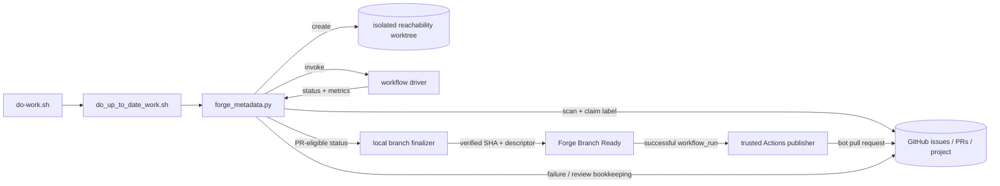

# AR-forge-architecture: Forge architecture

This document describes the high-level implementation shape of Forge:
which component owns each phase of the issue resolution defined in
§FS-forge-issue-resolution-goal, where extensibility lives, and which
boundaries keep generated work reviewable. The behavior Forge must satisfy is
defined by §FS-forge-functional-spec; this file records the implementation
structure chosen to satisfy it, with the workflow catalog in
§FS-forge-workflow-spec-catalog as the behavior surface.

## Architecture Map

| ID | Concern |
| --- | --- |
| §AR-forge-workflow-pipeline | the end-to-end pipeline of one workflow run, step by step |
| §AR-forge-control-plane | how the worker loop, dispatcher, GitHub queues, and worktrees compose |
| §AR-forge-workflow-boundary | how workflow drivers turn a claimed issue into an isolated workflow run |
| §AR-forge-strategy-agent-boundary | how strategy configuration, workflow engines, agents, and post-generation interventions are separated |
| §AR-forge-verification-publication-boundary | why PR creation is a publication step after verification, not part of generation |

## AR-forge-workflow-pipeline: Forge Workflow architecture

This section is the single authoritative picture of what runs during one Forge
workflow, in order, and which component owns each step. It is the diagram
contributors should trust when they ask *what actually happens between a labeled
issue and a bot pull request* (§FS-forge-issue-resolution-goal). Steps that are
gates rather than components are written below as pseudo-methods: the name fixes
the contract, the contract text fixes what the step must do, and the citation
fixes where the behavior is specified. Code coverage improvement
(§WF-code-coverage-improvement) has its own pipeline and is not covered here.

Every method carries one label: **Algorithmic** — deterministic code decides,
no model is involved; **Neural** — a model decides, by design, because the
decision cannot be made mechanically; **Neural in the worst case** — a
deterministic path runs first and a model is reached only when that path does
not converge. The labels are the standing audit that judgment is spent only
where it is unavoidable (§root/PRCPL-prefer-algorithmic), and a step that drifts
from `Algorithmic` to `Neural` is a design regression, not an implementation
detail.

The run is shown as a sequence. Every step is a method with a contract below;
GitHub covers both the API surface and the repository Actions, which publish
asynchronously after the run has finished:

```mermaid
%%{init: {"themeVariables": {"noteBkgColor": "#eef2f7", "noteTextColor": "#0f172a", "noteBorderColor": "#94a3b8"}}}%%
sequenceDiagram
    autonumber
    participant D as forge_metadata
    participant DR as workflow driver
    participant WC as workflow core
    participant AG as agent
    participant GH as GitHub

    rect rgba(148, 163, 184, 0.12)
    Note over D,GH: claim
    D->>D: check_host_requirements()
    D->>D: check_strategy_and_model()
    D->>GH: scan_issue_queue(label, priority)
    GH-->>D: candidate issues
    D->>GH: claim_issue()
    GH-->>D: assigned, status In Progress
    D->>D: check_issue_form()
    alt issue is malformed, or routes to no single driver
        D->>GH: release_claim()
    end
    D->>D: create_issue_workspace()
    D->>DR: route_to_driver(coordinates, strategy)
    end

    rect rgba(148, 163, 184, 0.12)
    Note over D,GH: setup
    DR->>DR: normal_setup(coordinates, strategy)
    DR->>AG: neural_setup(coordinates, strategy, PreparedRun)
    AG-->>DR: prepared or failed
    opt agent timed out, or returned an unusable setup result
        AG-->>DR: RUN_STATUS_FAILURE
        DR-->>D: failed
    end
    DR->>DR: check_setup(NeuralSetupResult)
    opt a required setup input or action is missing
        DR-->>D: failed
    end
    DR->>WC: run_workflow_engine(agent)
    end

    rect rgba(148, 163, 184, 0.12)
    Note over D,GH: fix
    opt issue reports a failure to repair (fails-* queue)
        WC->>AG: fix_reported_failure()
        AG-->>WC: reported failure passes, or budget exhausted
        WC->>WC: native_trace_gate()
        opt native trace gate still reports missing metadata
            WC->>AG: agent_fix()
            AG-->>WC: repaired or failed
            opt agent could not repair the gate failure
                WC-->>DR: RUN_STATUS_FAILURE
                DR-->>D: failed
            end
        end
    end
    end

    rect rgba(148, 163, 184, 0.12)
    Note over D,GH: explore
    alt report lists classes with uncovered dynamic access
        loop bulk pass, up to max-optimistic-iterations
            WC->>AG: generate_tests(report_with_every_class)
            AG-->>WC: failed task or pass
            WC->>WC: refresh_dynamic_access_report()
            alt bulk pass gained coverage
                WC->>WC: commit_bulk_pass()
                WC->>WC: native_trace_gate()
                opt native trace gate still reports missing metadata
                    WC->>AG: agent_fix()
                    AG-->>WC: repaired or failed
                    opt agent could not repair the gate failure
                        WC-->>DR: RUN_STATUS_FAILURE
                        DR-->>D: failed
                    end
                end
            else bulk pass reached no nativeTest in its budget
                WC->>WC: reset_to_bulk_checkpoint()
            end
        end
        loop each class still uncovered
            WC->>WC: select_next_uncovered_class()
            WC->>AG: generate_tests(single_class_report)
            AG-->>WC: failed task or pass
            alt test task fails before nativeTest is reached
                WC->>AG: send_failure_output(class budget)
            else nativeTest ran, metadata is observable
                WC->>WC: refresh_dynamic_access_report()
            end
            alt class gained covered dynamic access
                WC->>WC: commit_class()
            else class exhausted its iteration budget
                WC->>WC: reset_to_class_checkpoint()
            end
            opt batch of 5 committed classes, or all classes terminal
                WC->>WC: native_trace_gate()
                opt native trace gate still reports missing metadata
                    WC->>AG: agent_fix()
                    AG-->>WC: repaired or failed
                    opt agent could not repair the gate failure
                        WC-->>DR: RUN_STATUS_FAILURE
                        DR-->>D: failed
                    end
                end
            end
        end
    else library produces no dynamic-access report
        WC->>AG: run_basic_iterative_fallback()
    end
    end

    rect rgba(148, 163, 184, 0.12)
    Note over D,GH: finalization
    WC-->>DR: terminal run status
    DR->>DR: finalize_run()
    DR->>DR: local_ci_check()
    opt gate fails
        DR->>AG: agent_fix(gate records)
        AG-->>DR: repaired or failed
        DR->>DR: local_ci_check()
        opt gate still fails
            DR-->>D: human-intervention handoff
        end
    end
    DR->>DR: local_review()
    opt review does not approve
        DR->>AG: agent_fix(findings)
        AG-->>DR: repaired or failed
        DR->>DR: local_ci_check()
        DR->>DR: local_review()
        opt repair failed, or the re-run does not pass
            DR->>DR: reset to the verified pre-repair commit
        end
    end
    end

    rect rgba(148, 163, 184, 0.12)
    Note over D,GH: publication
    DR->>GH: push_verified_branch(descriptor)
    DR-->>D: finished
    D->>D: close_out_issue()
    GH->>GH: validate_publication_sha()
    GH->>GH: open_pull_request()
    end
```

The banded segments in the sequence are the run's logical phases. The five
durable ones — `setup`, `fix`, `explore`, `finalization`, `publication` — are
recorded in the continuation marker, so a failed run resumes at the phase that
failed rather than from the start (§FS-forge-run-continuation). `claim` is not
one of them: it runs before a run exists, in the dispatcher
(§AR-forge-control-plane).

### check_host_requirements()

**Algorithmic.**

A blocking, deterministic host gate that runs before any issue is claimed, so a
misconfigured host never consumes a queue item (§FS-forge-host-requirements).
Every capability the run depends on is verified at the process boundary before
the first side effect (§root/PRCPL-verify-inputs). It must verify, and report as
one manifest:

- **Tooling on PATH**: Python, `git`, `gh`, `pi`, `codex`, the Docker CLI,
  `grype`, and the repository's Gradle wrapper.
- **Agents are really usable**, not merely installed: Pi authenticated against
  its provider with unattended tool approval, and Codex configured for
  unattended runs (`approval=never`, `sandbox=danger-full-access`).
- **GitHub is alive and authorized**: `gh` authenticated, repository
  Contents/Issues/Pull-requests write, and Projects write on the tracked
  project board.
- **Every Java lane**: `GRAALVM_HOME`, `GRAALVM_HOME_25_0`, and
  `GRAALVM_HOME_LATEST_EA` must each point at a GraalVM containing Native Image
  and the reachability-metadata schema. Version matching against the repository
  pin is `strict` by default and can be relaxed per run with
  `--graalvm-version-check {strict,warn,off}`; Native Image and the schema stay
  mandatory in every mode.
- **Filesystem writability** for the Forge checkout, both `.git` directories,
  `local_repositories/`, and temporary Gradle state.
- **Network reachability** on 443, through the configured proxy when one is
  set: `github.com`, `api.github.com`, `chatgpt.com`, `services.gradle.org`,
  `repo.maven.apache.org`, `plugins.gradle.org`, `registry-1.docker.io`,
  `auth.docker.io`.
- **Git transport** to the monitored branch from each checkout, and access to
  the Docker daemon.

Checks are scoped to the queues the run actually enables: a review-only run does
not require the issue-work GraalVM lanes or Docker.

### check_strategy_and_model()

**Algorithmic.**

Every enabled issue queue resolves its configured strategy name against the
registry before scanning starts, and a strategy bundle is rejected on load
unless it names a model and carries the prompts and parameters its workflow
engine declares as required (§FS-forge-run-requirements.1,
§STRAT-forge-predefined-strategy-contract). The bundle is an input like any
other and is validated before scanning rather than at first use
(§root/PRCPL-verify-inputs). An unknown strategy is a worker
configuration error, not a per-issue failure.

### claim_issue() → check_issue_claimable()

**Algorithmic.**

Claiming is orchestration, never workflow logic (§AR-forge-control-plane,
§ORCH-forge-orchestration-spec). The issue payload is re-read at claim time
against live GitHub state rather than trusted from the scan
(§FS-forge-run-requirements.2), and must still be open, still carry the
queue label, be unassigned or assigned only to the authenticated user, have no
open blockers, and sit in project status `Todo`. Only then is it assigned,
moved to `In Progress`, and given an isolated worktree plus scratch metrics
repository. A `resumable` issue additionally requires a valid continuation
marker on a preserved branch (§FS-forge-run-continuation), and a
`chunked-dynamic-access` issue requires its exhaust report
(§WF-dynamic-access-exhaust-report).

### check_issue_form()

**Algorithmic.**

The queue label decides the workflow, so the issue must be unambiguous before a
driver starts (§FS-forge-run-requirements.3, §WF-forge-workflow-drivers.2). The
issue is the run's input, and a malformed one is rejected at the boundary
instead of failing inside a driver (§root/PRCPL-verify-inputs):

- **The title must resolve to Maven coordinates** `group:artifact:version`; a
  title that does not is rejected without claiming.
- **The coordinate must be fetchable.** Parsing is not resolution: the gate
  requests the coordinate's POM from Maven Central and then from the Confluent
  fallback (§root/AR-build-infrastructure.1), and a coordinate no repository
  publishes is rejected without claiming. This reuses the artifact fetch that
  Native Image eligibility already performs
  (`utility_scripts/native_image_artifact.py`) and asks it only whether the
  artifact exists, so the answer costs one request against a URL derived
  entirely from the coordinate.
- **`fails-*` issues must resolve a current `latest` metadata version** for the
  coordinate, because a repair workflow is defined as a move from the currently
  supported version to the requested one.
- **`library-update-request` must resolve to exactly one driver.** When the
  requested version already has a test suite it routes to coverage improvement;
  otherwise the nearest compatible supported suite is probed with compile, JVM
  test, and native test, and the first failing stage selects the repair driver
  (`fix_javac_fail`, `fix_java_run_fail`, `fix_ni_run`). The decision is
  persisted as a route sidecar so publication reports the same workflow that
  ran.
- **Exactly one workflow label**, and for `fails-*` a requested version strictly
  above the current `latest`. *These two rules are contract, not yet enforced in
  code*: today a multi-labeled issue is processed once per queue that matches it,
  and a non-newer `fails-*` version is only caught later by the driver. Both are
  mechanically decidable, so both belong in this gate
  (§root/PRCPL-prefer-algorithmic); enforcing them here is
  §ROADMAP-forge-issue-form-enforcement.

Each rule is a named check, and the gate returns the name of the one that
failed together with the value that failed it — the rules are decided one at a
time from the payload, so no inference is needed to say which one it was. That
name selects a predefined comment posted to the issue, so the reporter learns
what to fix (§FS-forge-run-requirements.3). Posting is keyed on rule and
offending value, and a rejection that happens after the claim releases it
through `release_claim()` before commenting, so the issue is back in `Todo`
when the comment lands. A form rejection applies no `human-intervention` label:
the defect is in the issue, not in anything Forge generated
(§FS-human-intervention-policy).

### create_issue_workspace()

**Algorithmic.**

The dispatcher, not the driver, prepares the ground a run executes on: an
isolated worktree of the reachability repository, a scratch metrics repository,
and the per-run setup-evidence directory. It also validates that the issue
GraalVM lanes are present before any driver is invoked
(§FS-forge-run-requirements.4, §AR-forge-control-plane,
§ORCH-forge-orchestration-spec). Drivers are given the resulting paths.

### route_to_driver()

**Algorithmic.**

Routing and driver invocation are one step: the dispatcher resolves the issue
label to exactly one driver script under `ai_workflows/drivers/` and calls it
with two explicit run inputs — resolved coordinates and the validated strategy —
plus the worktree, metrics and setup-evidence paths, issue context, and
continuation marker (§ORCH-forge-orchestration-spec). Routing is by issue label
only, never by PR label, and the driver does not re-implement queue policy. The
driver returns a terminal status and its durable run evidence.

### normal_setup()

**Algorithmic.**

`normal_setup(coordinates, strategy, run_context) -> PreparedRun` performs the
run-shaped work that requires no model: create or check out the feature branch,
scaffold a new library or copy the supported version for a repair, resolve the
test and metadata directories (§AR-forge-workflow-boundary). Its output is the
only valid input to `neural_setup()`.

Two things in the current implementation sit on the wrong side of this line:
drivers re-resolve repository paths (with a clone fallback, because a driver is
still runnable standalone), and each driver pins the GraalVM environment per
Gradle command instead of inheriting one environment decided at claim time.
Ownership as specified here is dispatcher-side, and closing the gap — including
removing standalone driver execution entirely — is
§ROADMAP-forge-dispatcher-owned-run-preconditions.

### neural_setup()

**Neural.** The artifact and source preparation inside the segment is
algorithmic, but the segment is neural because the agent decides what
additional library preparation is required.

`neural_setup(PreparedRun) -> NeuralSetupResult` is one call across the agent
boundary, and it is where **every** setup step performed by a model happens:
artifact URL population, source-context download, the library-preparation
decision, and application of its typed actions. No model-driven setup work runs
before `normal_setup()` or between `neural_setup()` and `check_setup()`. The
agent receives the coordinates, strategy, prepared tree, issue context, artifact
evidence, and source context. Returned dependency, Docker-image, and advisory
fields are typed and structurally validated
(§ORCH-forge-orchestration-spec.1.1, §root/PRCPL-verify-inputs).

The agent running this step must have web tooling: resolving artifact URLs,
downloading sources, and deciding what a library needs to build require reading
upstream repositories, Maven Central, and library documentation. A strategy that
maps this step onto an agent without web access is misconfigured, and
`check_host_requirements()` verifies the configured setup agent is usable before
any issue is claimed.

Each step writes its artifact to a place fixed by the coordinate: URL population
into the coordinate's `index.json`, source context into the directory that entry
names, the preparation decision into the run's preflight JSON, its typed actions
into the test `build.gradle` and the image allow-list. `NeuralSetupResult` is the
set of those paths, so continuation state and metrics point at the same files —
not a description of what they contain (§WF-forge-workflow-drivers.1). The step
fails the same way `agent_fix()` does: a timeout or an unusable response is
`RUN_STATUS_FAILURE` to the driver, and the driver reports the run as failed to
`forge_metadata` — never a successful `no_action` decision. The result is
persisted in continuation state so a resumed run does not repeat a completed
neural setup (§FS-forge-run-continuation).

Today `forge_metadata` invokes the preflight agent before driver dispatch, and the
fix drivers try to apply its decision before copying or creating the target
version. Artifact URL population and source download happen later. Moving the
agent invocation behind `normal_setup()` and making the driver own the whole
neural segment is §ROADMAP-forge-algorithmic-then-neural-setup.

### check_setup()

**Algorithmic.**

`check_setup(NeuralSetupResult) -> ReadyRun | FAILED` opens each artifact the
setup steps were supposed to produce and confirms it was properly generated: the
coordinate's `index.json` parses and carries its four URLs, the source context is
present where that entry names, the preflight JSON parses and validates against
its schema, and each decided action is in the tree
(§WF-forge-workflow-drivers.1). Paths come from the coordinate and the run
context, not from anything the agent returned, so the check cannot be pointed
somewhere convenient. A missing, unparseable, or incomplete artifact is a setup
failure.

On success it captures the recovery checkpoint after all setup edits and returns
`ReadyRun`. Only that output may initialize the workflow agent and call
`run_workflow_engine()`. `FAILED` returns to `forge_metadata` with the setup
evidence and leaves the setup phase pending for continuation.

### run_workflow_engine()

**Algorithmic.** The engine is a state machine; the neural work is in the steps
it invokes (§AR-forge-strategy-agent-boundary).

The driver hands the agent, rendered prompts, workflow parameters, repository
paths, and run metadata to the registered workflow engine and gets one terminal
run status back (§WF-forge-workflow-engine). The engine owns run state —
checkpoints, prompt/command cycles, gate interpretation, retry budgets, metrics
— and the driver owns everything around it. The exploration loop the diagrams
above trace — class selection, checkpoints, `commit_class()`,
`reset_to_class_checkpoint()`, `refresh_dynamic_access_report()`, and the
`run_basic_iterative_fallback()` path a library with no dynamic-access signal
takes instead — is engine-owned and specified in full by
§WF-dynamic-access-iterative-strategy and
§WF-dynamic-access-fallback-and-failure. Only the steps with a contract of their
own are listed here.

### fix_reported_failure()

**Neural.** Reproduction and the pass/fail verdict are deterministic; the repair
itself is the agent's.

A `fails-*` issue is a repair run: the engine reproduces the reported failure,
sends it to the agent, and iterates until the failing task passes or the budget
is exhausted (§WF-java-fail-fix-workflow, §WF-native-image-run-fix-workflow).
Whether exploration follows is a strategy decision, not a workflow rule. A bare
repair engine completes the fix phase and marks explore skipped. A composite
bundle — the strategies whose workflow is the composite engine and that name a
`primary-workflow` — runs the repair first and then the dynamic-access loop on
the same run, and defers exploration when the uncovered-class count exceeds the
configured threshold (§WF-dynamic-access-composite-strategy). A plain
dynamic-access engine has no repair step and marks the fix phase skipped.

### generate_tests()

**Neural.** Writing a test that reaches an uncovered call site is the judgment
Forge exists to buy; the attempt loop around it is deterministic.

One step, two scopes, decided by the argument: `report_with_every_class` is the
bulk pass over the whole dynamic-access report, and `single_class_report` is one
class of it (§WF-dynamic-access-bulk-strategy,
§WF-dynamic-access-iterative-strategy). Nothing else differs — same prompt
rendering, same test budget, same verdict rules — so the two exploration stages
are one step called with a different slice of the same report.

One attempt is: render the dynamic-access prompt for that scope and send it
through the agent, which runs `./gradlew test -Pcoordinates=<library>` itself up
to the configured test budget. A failure *before* `nativeTest` is fed back to the
agent as another attempt. Reaching `nativeTest` — passing or failing — ends the
test loop and hands the decision to the coverage report and the native-test gate,
never to the agent.

### agent_fix()

**Neural.** The repair is the agent's; every decision around it is not
(§root/PRCPL-prefer-algorithmic).

Three unrelated steps need the same arrangement — a deterministic check has
failed, let an agent try once — so it is written once here and cited rather than
restated three times. It is not a phase and has no slot of its own:
`native_trace_gate()` reaches it as step 3, `local_ci_check()` on a failed
check, and `local_review()` on a non-approval. Wherever it is called the terms
are the same:

1. **Only after a deterministic step has failed.** The agent is never asked for
   something a check, a trace, or a gate could have produced, and never runs
   speculatively ahead of one.
2. **On that step's own evidence.** The failing step's records are the input —
   gate output, verification records, review findings — not a summary of them
   and not the run's history.
3. **One bounded attempt**, against the step's configured budget.
4. **The step re-runs, and its verdict decides.** What the agent reports having
   done settles nothing; the deterministic re-run is the answer
   (§root/PRCPL-verify-inputs). A repair the re-run does not confirm is a
   failure of the step that called for it.

A repair may only make the failing check pass on its merits. Deleting or
neutering the failing test, relaxing the assertion, or removing the coordinate
from the lane is not a repair — it is the failure suppressing its own evidence,
which is why the native-test gate forbids that rescue outright
(§WF-native-test-verification-gate).

Failure is uniform with the rest of the pipeline: an agent timeout or an
unusable response is `RUN_STATUS_FAILURE` to the driver, which reports the run
as failed to `forge_metadata` — never a degraded pass. What each caller does
with a failed repair is the caller's contract, and they differ because a failed
repair means something different at each: the gate resets to its checkpoint and
fails the run, because metadata it rejected must not publish; `local_ci_check()`
hands off for human intervention, because the branch is not publishable; and
`local_review()` resets to the verified pre-repair commit and publishes with the
verdict recorded, because the branch is publishable and merely flagged.

The name is this document's. No symbol reads `agent_fix`: it is a contract two
implementations are measured against, the way `native_trace_gate()` names what
the code calls `native_test_verification_gate`. `run_codex_metadata_fix`
(`ai_workflows/core/fix_metadata_codex.py`) conforms — it is the gate's step 3,
repairing metadata only after tracing has observed everything it can, with the
gate re-running to decide. `run_pi_post_generation_fix`
(`ai_workflows/core/fix_post_generation_pi.py`) does not: it deletes the
offending failing tests, reruns, and returns `success_with_intervention`. The
deletion is recorded in the publication descriptor as
`post_generation_intervention`, so it is visible — but the branch publishes
anyway and the defect the deleted test was reporting is gone, which is term 4
inverted, the agent's account standing in for a verdict the check never gave.
Finalization still runs it, because the gate does not yet run in every lane
(§ROADMAP-forge-native-finalization).

### native_trace_gate()

**Neural in the worst case.** Steps 1 and 2 observe metadata deterministically;
the agent is reached only for what neither observed
(§root/PRCPL-prefer-algorithmic).

The gate is the one place metadata is produced and proven, and it is the same
ordered contract wherever it runs (§WF-native-test-verification-gate). It is
always:

1. `generateMetadata` — JVM-agent metadata for the coordinate, staged outside
   the durable `metadata/` tree, then validated by a test run.
2. Native tracing — the `runNativeTraceImage` observe-record-rebuild loop,
   built with `--exact-reachability-metadata` and
   `-H:MissingRegistrationReportingMode=Exit` so an access that no metadata
   backs is a hard miss rather than a silent registration. This is the only
   source of metadata a JVM-mode agent run cannot observe
   (§WF-native-trace-gradle-tasks).
3. Agent fix — invoked **only** when the coordinate still fails after 1 and 2,
   and only with the runtime-observed metadata from those steps in hand.

The order is the contract: the agent is never asked to invent metadata that a
deterministic step could have observed. Staged metadata becomes durable only
after a passing validation path, and the durable merged form is re-verified
afterwards.

In exploration the gate runs on batches of committed classes rather than after
every class, flushing when the batch reaches
`native-test-verification-batch-size` (default 5), at the end of the class list,
or at a chunk boundary. `FAILED` is a hard error, not a degraded pass: the
calling workflow returns a run failure and resets the branch to its checkpoint.
Because everything upstream is designed to prevent metadata errors from
surviving this far, a run that reaches step 3 — at most once per invocation —
must be failing for one of two reasons: the class iteration budget was exhausted
at an iteration boundary, or the native-image run failed for a reason that is
not a missing-metadata error. Any other routing to the agent is a defect here,
not normal operation.

**Every workflow ends with this gate.** Native Image must always work, so no
run may hand a branch to publication carrying metadata this gate has not passed
— and that holds identically for a new library, a coverage improvement, and each
of the three repair workflows (§WF-forge-workflow-drivers). The per-batch
invocations exploration makes are extra invocations of the same contract, not a
substitute for the terminal one: a batch gate proves the classes committed so
far, while the terminal gate proves what the run is actually about to publish.
A workflow that ends without it publishes metadata that no native run has ever
checked.

Today it does not run everywhere. It lives in the dynamic-access strategies and
nowhere else, so exploration is the only phase with all three steps; a `java-run`
repair reaches it only when its composite bundle runs the dynamic-access engine,
`javac` and native-image-run repairs never trace at all, and finalization
(§WF-forge-workflow-drivers.3) runs step 1 and then goes straight to the agent.
Making the gate the terminal step of every workflow is
§ROADMAP-forge-native-finalization.

The short name is this document's; the spec ID and the implementation read
`native_test_verification_gate` (§WF-native-test-verification-gate).

### finalize_run()

**Neural in the worst case.** The sequence is fixed Gradle work; an agent enters
only when a step still fails.

Finalization is the fixed end-of-generation sequence and must run in this order
for every finalization library (§WF-forge-workflow-drivers.3):

1. `native_trace_gate()`, once per finalization lane — current-defaults on the
   latest GraalVM, `future-defaults-all` on the latest EA build, and
   current-defaults on GraalVM 25. The lanes live here, in generation, because
   the pre-publication gate no longer reproduces the native test matrix
   (§FS-local-ci-equivalent-verification.1). Each lane is its own proof: the
   image mode and the toolchain change which accesses the binary needs, so
   metadata proven in one lane is not proven in another. This is also the
   terminal gate invocation every workflow shares — finalization is the one
   phase all five drivers reach, so it is where a repair workflow that never
   explored still proves its metadata on Native Image.
2. `./gradlew splitTestOnlyMetadata`, then reject any legacy
   `native-image.properties`-era test config the run touched.
3. `./gradlew checkMetadataFiles`, retried behind up to three Codex metadata-fix
   attempts.
4. Style fix and checks (Checkstyle, Spotless).
5. Generated-test quality screening: suspicious targets fail the run for human
   review instead of shipping.
6. `./gradlew generateLibraryStats`.
7. Commit the iteration, staging the coordinate's `tests/src`, the whole
   `metadata/` tree, and the coordinate's `stats/`.

Run alone, `generateMetadata` produces the JVM agent's
approximation and nothing that checks it, so a lane failure on top of it is
handed to an agent that has never seen a native run — exactly the inversion the
gate's ordering forbids. It is step 1 *of the gate*, backed by tracing, or it is
not run.

A finalization failure leaves the phase pending so a resumed run repeats it
(§FS-forge-run-continuation).

Today no lane runs the gate. Finalization runs `./gradlew generateMetadata
--agentAllowedPackages=fromJar` once, then each of the three lanes as a bare
`./gradlew test` under its own environment, and gives every lane the same
recovery ladder: a Codex metadata fix, rerun, then Pi deleting the offending
failing tests, rerun. Native tracing appears in no lane, so the metadata each
lane is judged against is never observed under the mode that lane runs. A lane
rescued by Pi returns `success_with_intervention` and the deletion is recorded
in the publication descriptor as `post_generation_intervention` — visible, but
still published, and the code defect the deleted test was reporting is gone.
That is why the gate forbids Pi outright
(§WF-native-test-verification-gate). Replacing the per-lane ladder with a
per-lane gate is §ROADMAP-forge-native-finalization.

### local_ci_check()

**Algorithmic, neural in the worst case.** The checks are deterministic; the
agent is reached only for what a check has already failed
(§root/PRCPL-prefer-algorithmic).

Before the push that makes a branch PR-eligible, the pre-publication gate runs
the cross-cutting checks a single-library generation cannot settle by itself
(§FS-local-ci-equivalent-verification.2): index-file validation against the
rebased master state, and the Docker-image vulnerability scan when the diff
touches image allow-lists. Library-scoped verification belongs to
`finalize_run()`, not here. The gate also classifies paths changed outside the
target library and flags human intervention. Opting into full reproduction adds
the changed-metadata native test matrix and the Spring AOT smoke tests.

A failure gets one `agent_fix()` on the terms that step sets out — after the
check has failed, on that check's own records, one attempt, and the gate re-runs
to decide. An index bucket another merged PR moved and a newly flagged image are
exactly the failures a bounded repair settles; a re-run that still fails is the
human-intervention handoff that happens today (§FS-human-intervention-policy).

### local_review()

**Neural.** Judging whether a diff satisfies the review rules is what no gate
can decide; the evidence it judges on is assembled algorithmically.

Planned, not implemented (§ROADMAP-forge-local-branch-review). A second review
of the branch before it is pushed, run cold — a detached worktree at the
verified commit, no shared session with the run that produced it — over
`base_ref..HEAD`, under the same `skills/review-*/SKILL.md` rules the
post-push PR reviewer applies, with the local evidence a PR reviewer never
sees: the `local_ci_check()` records and the resolved descriptor statistics.
The verdict travels in the publication descriptor rather than blocking the
push, so a PR opens already carrying its review label.

A non-approval gets one `agent_fix()` on the same terms, with the findings as
its evidence. Because a repair changes the tree that was verified,
`local_ci_check()` and the review both re-run over it — nothing may be pushed
that the gates have not passed over, which is what `publish_branch()` depends
on. A finding must not destroy an otherwise publishable run, so a repair that
does not pass the re-run resets to the verified pre-repair commit and the branch
publishes with the verdict recorded, rather than failing the run.

### publish_branch()

**Algorithmic.**

Publication is separated from generation and never runs with publisher
credentials (§AR-forge-verification-publication-boundary,
§GIT-forge-publication). "Publish" means *make PR-eligible*, and that is the
push at the end: nothing leaves the machine before `local_ci_check()` and
`local_review()` have passed over the tree that will be pushed.

Locally, the run switches to a unique branch named
`ai/<producer>/<suffix>-<publication-id>`, stages only expected paths, rebases
onto the PR base ref — the checks must judge the rebased tree, because index
validation is against current master — then writes the publication descriptor,
which carries library stats, dynamic-access evidence, the verification record,
and the review verdict, commits once, and pushes.

The push is observed by the unprivileged **Forge Branch Ready** workflow, which
validates the descriptor and diff as data. Only its successful completion
triggers the privileged **Forge Open PR** workflow, which loads publisher code
from the default branch, takes a short-lived token, revalidates the exact head
SHA, and opens the pull request as `graalvmbot` with the stats and generation
summary rendered from the descriptor (§GIT-actions-publication). For chunked
dynamic-access work, only the final chunk may close the issue
(§WF-chunked-dynamic-access-pr-linking).

### close_out_issue()

**Algorithmic.**

After the driver returns, the dispatcher owns the GitHub bookkeeping the run
must not do for itself: unassign the issue, move the project item to the status
the terminal run status implies, apply review or human-intervention labels, and
clean up the worktree (§ORCH-forge-orchestration-spec). A chunk-ready run leaves
the issue open for its next chunk (§WF-chunked-dynamic-access-pr-linking).

## AR-forge-control-plane: Worker loop and dispatcher own queue control

Forge is shaped as a small control plane around independent workflow entry
scripts, serving §FS-forge-issue-resolution-goal. `do-work.sh` is the stable
shell entrypoint. It forwards arguments to `do_up_to_date_work.sh`, which keeps
the local Forge checkout up to date, honors stop files, applies worker limits,
and invokes `forge_metadata.py` for one work cycle, as described in
§DW-do-work-loop. The dispatcher owns GitHub queue scanning, issue claiming,
worktree creation, workflow routing, review queues, project status updates, and
cleanup; its behavior and implementation are specified in
§ORCH-forge-orchestration-spec. After the dispatcher observes a PR-eligible
status, the git-scripts component (§GIT-forge-publication) finalizes and pushes
one verified branch and descriptor. Repository Actions then hand the exact SHA
to trusted default-branch publisher code (§GIT-actions-publication), which owns
PR creation and publication-related GitHub mutations. The dispatched workflows
are defined separately, in §WF-forge-workflow-system and
§WF-forge-workflow-architecture.

The dispatcher routes issue work by issue labels, not by PR labels:

| Issue label | Workflow driver | Successful PR label |
| --- | --- | --- |
| `library-new-request` | `ai_workflows/drivers/add_new_library_support.py` | `library-new-request` |
| `library-update-request` | `ai_workflows/drivers/improve_library_coverage.py`, or a missing-version compatibility repair driver | `library-update-request` |
| `fails-javac-compile` | `ai_workflows/drivers/fix_javac_fail.py` | `fixes-javac-fail` |
| `fails-java-run` | `ai_workflows/drivers/fix_java_run_fail.py` | `fixes-java-run-fail` |
| `fails-native-image-run` | `ai_workflows/drivers/fix_ni_run.py` | `fixes-native-image-run-fail` |

The control plane treats a claimed issue as exclusive work. Claiming,
assignment checks, worktree creation, and final unassignment all belong in
`forge_metadata.py` and the GitHub helper layer rather than in individual
workflow engines. Workflow drivers should receive already-resolved
coordinates, paths, and strategy names; they should not reimplement queue
policy.

## AR-forge-workflow-boundary: Workflow drivers compose setup, workflow engine, and metrics

Workflow drivers are single-run boundaries, as defined by
§WF-forge-workflow-drivers. They translate a claimed issue into one isolated
run by creating or checking out the feature branch, preparing source context and
required directories, loading the named predefined strategy, running the
selected workflow engine, finalizing metadata, and writing schema-validated
metrics. Repository paths and the pinned GraalVM environment are consumed, not
resolved: drivers still resolve both today, and moving that ownership to the
dispatcher is §ROADMAP-forge-dispatcher-owned-run-preconditions.

The workflow driver owns run setup and finalization; the workflow engine owns
the state-machine-like issue-resolution process described in
§WF-forge-workflow-architecture. The predefined strategy supplies configuration:
which workflow engine, agent backend, model, prompt set, and workflow
parameters are used for the run. This keeps every workflow aligned with the
same repository, metrics, and local verification contracts
(§FS-local-ci-equivalent-verification) while letting operators select different
service profiles through configuration.

The reachability repository must be present as a complete checkout or worktree
for every generated artifact. Forge does not run Gradle-backed testing,
dynamic-access reporting, metadata generation, or native tracing inside copied
per-library fragments. That architecture keeps generated tests, metadata,
Gradle build logic, stats, and Forge logs in one filesystem context.

## AR-forge-strategy-agent-boundary: Strategies configure workflows, agents edit code

Registered workflow implementations own the generation loop. The codebase
currently names their base class `WorkflowStrategy`, but architecturally those
classes are workflow engines: they decide which prompt to send next, which
Gradle command to run, how to interpret output, when to reset to a checkpoint,
and which terminal status to return. Agents own only the editing and
command-execution interface exposed by `Agent`: prompts, context management,
token accounting, and test-command execution.
§root/PRCPL-prefer-algorithmic

This boundary lets a predefined strategy bind a workflow engine, agent, model,
prompt-template set, workflow parameters, MCPs, and optional persistent
instructions without changing the workflow driver or the workflow implementation.
The workflow driver loads that bundle from `strategies/predefined_strategies.json`;
it does not hard-code model-specific behavior.

Post-generation recovery is built into the workflow base class, not a pluggable
registry and not selected per strategy. What that recovery *is* belongs to
`native_trace_gate()`: metadata is observed before it is invented, and a
residual failure is a run failure. Today the base class instead runs a fixed
Codex-then-Pi ladder, once for each finalization lane — current-defaults,
`future-defaults-all`, and current-defaults on GraalVM 25 — whenever that lane's
`./gradlew test` fails: a Codex metadata fix, then Pi deleting the offending
failing tests as a last resort, recorded as a post-generation intervention (see
the intervention glossary in §FS-forge-functional-spec). Deleting a failing test
hides the defect the gate exists to surface, which is why the gate admits no Pi;
replacing the ladder with a per-lane gate is
§ROADMAP-forge-native-finalization.

Dynamic-access and native-test behavior stay in workflow specs, not in this
architecture file. The architecture only fixes the boundaries: workflow engines
call shared utilities for dynamic-access reports, and native test verification
is a reusable gate (§WF-native-test-verification-gate) that drives native
tracing and Codex recovery through the Gradle task contract in
§WF-native-trace-gradle-tasks. The concrete agent API and Pi adapter are
documented in §AR-agent-api, and the
strategy bundles that bind these pieces live in the strategy registry
(§STRAT-forge-predefined-strategy-contract, §STRAT-workflow-strategy-registry).

## AR-forge-verification-publication-boundary: Local verification hands data to trusted publication

Forge separates generation from publication. A workflow may edit tests,
metadata, index files, stats, metrics, and logs while it runs. After the
dispatcher observes a PR-eligible status, local branch finalization stages only
expected paths, rebases, runs the pre-publication gate required by
§FS-local-ci-equivalent-verification, writes the durable
descriptor, commits once, and pushes the unique `ai/**` branch. It does not
render or create a PR and never receives publisher credentials
(§GIT-shared-publication-pipeline, §GIT-publication-descriptor).

The unprivileged Branch Ready workflow observes the push without secrets and
validates the branch as data. Only its successful completion triggers the
privileged workflow. That workflow loads publisher code and templates from the
default branch, obtains a short-lived GitHub App token, revalidates the exact
head SHA and all trust inputs, and performs PR and publication follow-up
mutations (§GIT-actions-publication). This two-stage shape prevents feature
branch code from running with publisher credentials.

This boundary is especially important for chunked dynamic-access work. A
non-final chunk records a publication identity known before the commit,
publishes a reviewable PR that references the issue, and carries the
exhaust-report state needed by the next run, as specified in
§WF-dynamic-access-exhaust-report. The final chunk is the only one allowed to
close the issue. The publication layer must preserve that issue linking
contract instead of treating every successful chunk as a completed issue
(§WF-chunked-dynamic-access-pr-linking).

Shared repository edits are allowed only when local verification proves they
are necessary, and they must be surfaced in metrics and PR text for maintainer
review. Local finalization is therefore not a blind `git add .`; the descriptor
records the verified evidence. The trusted publisher derives workflow-specific
templates, labels, reviewers, and human-intervention visibility from that
validated evidence rather than accepting arbitrary GitHub instructions from the
branch.
