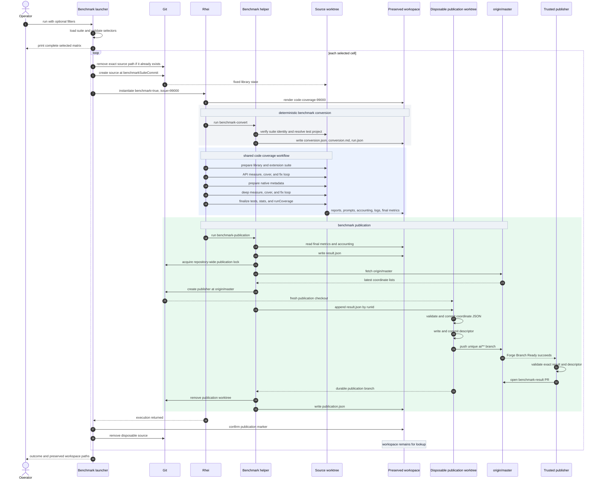
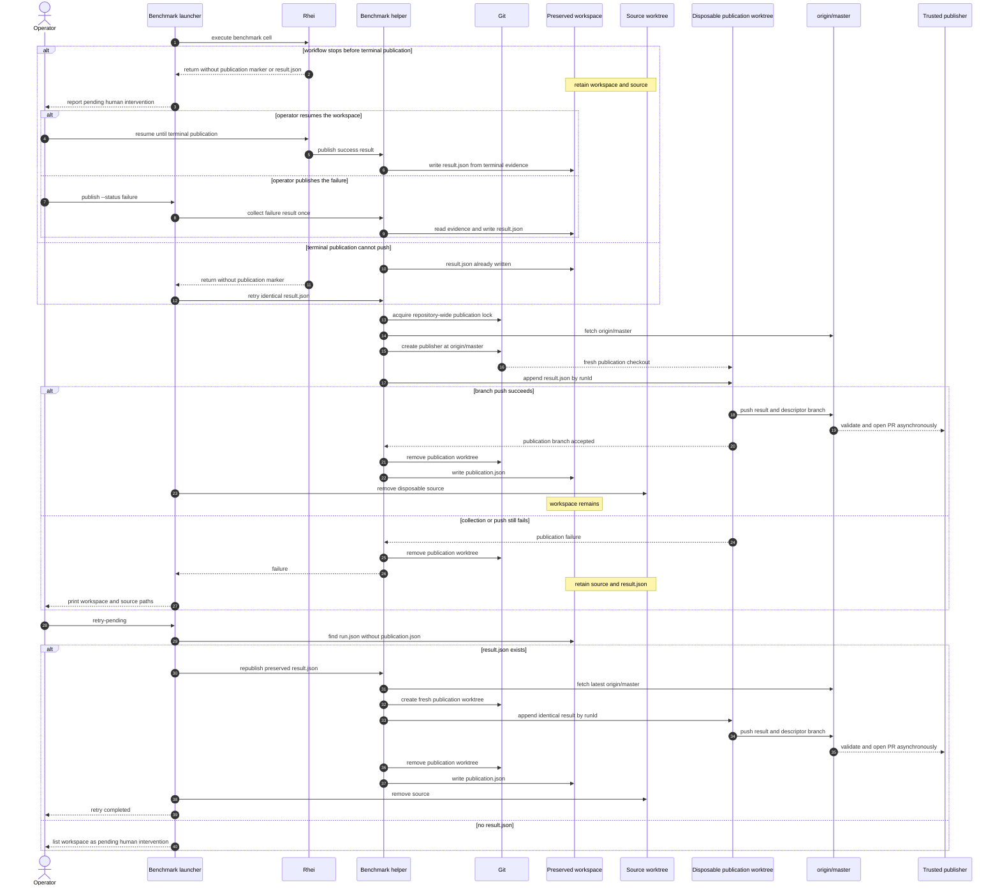

# AR-code-coverage-benchmarking: Code coverage benchmark architecture

The code coverage benchmark is a control plane around the existing Rhei code
coverage improvement workflow. It does not implement another coverage engine.
The runner owns repeatable inputs, matrix expansion, worktree isolation,
portable metrics, and publication; Rhei owns preparation, API coverage,
native-metadata preparation, deep coverage, and finalization. This split
implements §FS-code-coverage-benchmarking while preserving
§AR-code-coverage-improvement.

## 1. Components and identity

| Component | Responsibility |
| --- | --- |
| `run-code-coverage-benchmark.sh` | Stable operator entry point for execution and pending-publication retry. |
| `code_coverage_suite.json` | Fixed suite commit, libraries, agent/model/provider tuples, and thinking levels. |
| `code_coverage_benchmark.py` | Matrix validation, worktrees, Rhei launch, conversion, metrics, publication, and retry. |
| Code coverage Rhei template | Switches conversion and publication behavior through the `benchmark` input. |
| Source worktree | Disposable checkout of the fixed `benchmarkSuiteCommit`. |
| Rhei workspace | Permanent local record keyed by `runId` and named `code-coverage-99000`. |
| Publication worktree | Fresh checkout of `origin/master` used to append one result and push its descriptor-backed PR branch, then removed. |
| Trusted Actions publisher | Validates the exact result and descriptor from default-branch code and opens the benchmark-result PR. |

Two commits describe different axes:

| Identity | Meaning | Update rule |
| --- | --- | --- |
| `benchmarkSuiteCommit` | Repository and library state being measured. | Fixed in the checked-in suite and changed only intentionally. |
| `runnerCommit` | Implementation that orchestrated and measured the run. | Resolved from the clean runner checkout at launch. |

Merged coverage improvements do not move an existing benchmark input. A newer
runner may still execute the old suite and records both identities.
§FS-code-coverage-benchmarking.1

The two identities map onto two directories, and the conversion record keeps
them apart. `worktreePath` is the pinned source worktree — the library state
under measurement — while `workPath` is the Forge tree the measurement helpers
are imported and executed from. In the issue-driven flow both live in the same
worktree, because it branches from `master` and its helpers are already current.
A benchmark cell is the case where they diverge, so `workPath` is the runner's
Forge path there and the pin is left holding only its input.
§FS-code-coverage-benchmarking.1

## 2. Cell execution sequence

The runner prints the complete selection before creating worktrees. Every cell
gets a unique parent and first passes a source-worktree gate: an entry at its
exact `source/` path is removed, then Git must create the fixed-suite worktree.
A failed gate skips that cell before Rhei and the matrix continues. Successful
cells get a preserved workspace; publication creates another short-lived
worktree only while appending that cell's result.
§FS-code-coverage-benchmarking.2



The source worktree supplies the fixed repository state and the Forge helpers
that belong to it. Benchmark conversion and publication execute from
`runnerCommit`, so orchestration can improve without changing the input.
Middle Rhei tasks resolve their coverage helpers from the fixed source
worktree.

## 3. Failure and retry sequence

A source-worktree gate failure happens before this sequence: the launcher
reports the skipped cell and continues without creating a Rhei workspace or
benchmark result. §FS-code-coverage-benchmarking.2

The terminal program is the only automatic collection path. The launcher
checks for a publication marker after Rhei returns. When the marker is missing
but the workflow already wrote its result, the launcher retries Git
publication of that exact record; when no result exists, it publishes nothing
and reports the run as pending human intervention with the workspace and
source paths preserved. The operator then resumes the workspace until terminal
publication, or explicitly publishes the failure.
§FS-code-coverage-benchmarking.3



`result.json` is written at most once, before Git publication, and is
immutable for its `runId` whatever its status: a retry either finds an
identical merged entry, reuses its exact remote publication branch, or
proposes the same object, and different data with the same `runId` is an
integrity error. Immutability is safe because no record is written
automatically at a stop — a record exists only when the workflow reached
terminal publication or the operator explicitly published a failure.
§FS-code-coverage-benchmarking.3

## 4. Data locations

Local evidence and portable comparison data have different homes:

```text
forge/local_repositories/code_coverage_benchmarks/
  <runId>/
    source/                       # removed only after publication
    code-coverage-99000/          # always retained
      index.rhei.md
      states.yaml
      tasks/
      runtime/
        accounting/
        code-coverage/
          benchmark/
            run.json              # local identity and absolute paths
            result.json           # normalized portable result
            publication.json      # written after push
          finalization/
          validation/
          discovery/
          prompts/
          fixes/
          work/
        logs/
```

Only portable result lists and their coordinate-local publication descriptors
enter the publication branch:

```text
code-coverage-benchmarks/
  <group>/
    <artifact>/
      <version>.json
stats/
  <group>/
    <artifact>/
      <version>/forge-publication.json
```

`run.json` may contain machine-specific paths because it drives recovery.
`result.json` contains no absolute paths; `runId` and
`workspaceName` are its local lookup key. Logs, prompts, reports, PGO
profiles, snapshots, and work notes remain in the workspace and are not staged.
§FS-code-coverage-benchmarking.5

## 5. Metrics derivation

Collection joins existing deterministic evidence rather than asking an agent to
summarize itself. §FS-code-coverage-benchmarking.4

| Result field | Source |
| --- | --- |
| Identity, commits, configured agent/model/thinking | `runtime/code-coverage/benchmark/run.json` |
| Coverage before/after, gains, and `allMethods` | Final `runCoverage`; partial runs use recorded JaCoCo checkpoints. |
| API/deep `coverPasses` | Phase stop-decision records. |
| API/deep `fixInvocations` | Rhei `api-fix` and `deep-fix` invocation records. |
| Input, cached-input-read, and output tokens | Rhei cover/fix invocation accounting for that phase. |
| Observed model | Rhei invocation accounting rather than the configured alias. |
| Failure phase | Last recorded Rhei task transition. |

API spans `runStart` to `afterApiPhase`, deep spans
`afterApiPhase` to `final`, and total spans `runStart` to
`final`. All use the whole-run denominator from
§AR-code-coverage-improvement.4.1.

Conversion, preparation, finalization, and publication tokens are excluded from
the initial metric. Missing partial evidence is `null`, never zero.
`checkedInAllMethods` keeps the suite snapshot and
`measuredAllMethodsDifference` exposes a changed measured universe.

### 5.1 Final-metrics contract ownership

The runner owns the final coverage metrics contract, and owns it by
construction rather than by convention. `utility_scripts/code_coverage_finalize.py`
writes `schemaVersion`, `schemas/code_coverage_final_metrics_schema.json`
constrains it, and `code_coverage_benchmark.py` reads the record during
publication. All three resolve from the runner: the first two through `workPath`,
the third because publication always ran from the runner.

Resolving the writer and its validator from the pinned worktree is what made a
schema change landing between the pin and the run fatal. The two pinned ends
agreed with each other, so finalization validated its own output honestly and
every in-run gate passed; only the reader was current, and the disagreement
surfaced at the terminal publication state with the whole execution already paid
for. Nothing forbade that split, because nothing said which commit owned the
record.

Comparing the pinned and runner schema versions at launch would not be a
safeguard against this. The suite commit deliberately does not advance
(§FS-code-coverage-benchmarking.1), so a pin older than the current schema is
the normal state, and refusing on that difference would refuse every valid
campaign. One resolution source, not an equality check, is what keeps the
contract whole. §FS-code-coverage-benchmarking.1

## 6. Publication boundary

Publication never edits the runner or source checkout. Each attempt creates a
fresh linked worktree from the fetched `origin/master` beside the run workspace
and removes it after that attempt. No publishing checkout is reused or reset.

Publication is serialized by a lock in the repository common Git directory.
Under that lock, every attempt:

1. Fetches `origin/master`.
2. Creates a disposable worktree at `origin/master`.
3. Upserts the preserved `result.json` object by `runId`.
4. Sorts by timestamp and `runId`.
5. Validates the complete coordinate list.
6. Commits only that coordinate JSON path.
7. Writes and validates a descriptor containing the exact result and path.
8. Commits the descriptor as the tip commit.
9. Pushes the unique `ai/**` publication branch.
10. Removes the publication worktree.

Trusted Actions then validates that the branch is exactly the base list plus the
descriptor's result and opens the pull request; feature-branch code never gets
publication credentials. A retry reuses an identical remote branch or accepts
an identical result already merged into `origin/master`; a conflicting entry is
rejected. The publication marker is last, so its presence means the portable
result is durable on a publication branch or already merged and source cleanup
may begin. Publication-worktree cleanup failure is operational state and must
not reclassify a successful result. §FS-code-coverage-benchmarking.3

## 7. Configuration and extension

The suite JSON is the single checked-in place to change the fixed commit,
libraries, checked-in method totals, agent/model/provider mappings, or thinking
levels. The CLI filters configured tuples rather than creating arbitrary
cross-products: `--model gpt-5.6-sol` selects Pi, while explicitly pairing
that model with Claude Code is rejected before mutation.

Advanced metrics can extend the schema and collector without changing the Rhei
task graph. Runtime archive storage can add a portable archive reference while
the workspace remains the complete local record. Future concurrency belongs in
the runner but must retain unique run parents and serialized publication.
