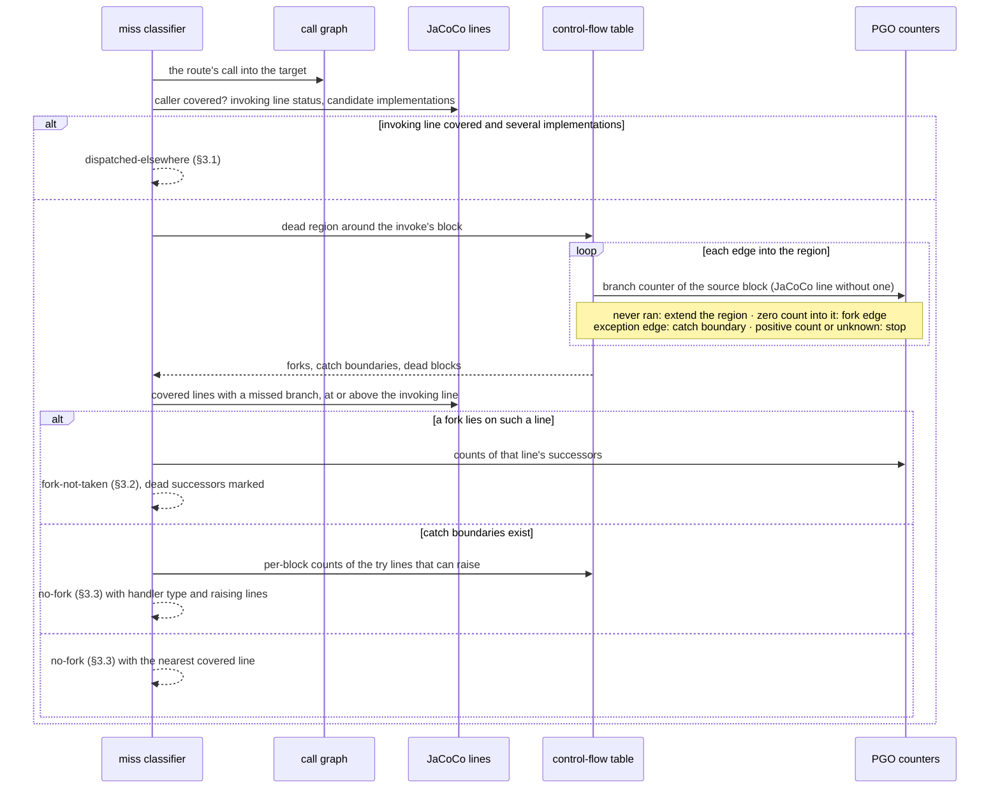

# AR-code-coverage-deep-navigation: Deep-phase navigation evidence

The deep phase prompts the JaCoCo-uncovered methods of its target universe:
library-internal methods, and the public methods the API phase left uncovered
(§AR-code-coverage-improvement.4.2). This document specifies the evidence that
steers the agent toward them and what each piece may be used for. None of it
changes coverage: JaCoCo is the sole metric, and every source here is
navigation only (§GOAL-maximize-library-coverage).

## 1. Evidence sources

Four sources feed navigation. Each answers one question the others cannot:

| Source | Answers | Blind to |
| --- | --- | --- |
| Analysis call-tree CSV dump | what can call what | whether a call ever happens |
| Sampled stacks (`samplingProfiles`) | where execution runs hot | cold code, which is every target |
| Instrumented counters (`conditionalProfiles`, `virtualInvokeProfiles`) | how often each branch successor ran; which receiver types each virtual call site saw | branches the compiler removed |
| Bytecode control-flow table | where each branch leads | how often anything ran |

JaCoCo is exact but boolean per line: it says a line's branches were partly
missed, never which successor, how often the taken side ran, or which
implementation answered a virtual call. A sampler has counts, but a timer misses
cold code, and every deep target is cold by definition. Instrumented counters
close both gaps.

### 1.1 One build, one run

The PGO lane's native test image is built with `--pgo-instrument` and
`--pgo-sampling` together, and one run of the suite dumps one `.iprof` that
carries both the sampled and the instrumented sections. The call-tree CSVs come
from the same build, so the static graph, the samples, and the counters always
describe the same image. The instrumented run is slower than a sampled one;
next to a native build that already takes minutes, one slower run per deep pass
is an acceptable price for exact counts.

### 1.2 Counter semantics

The compiler instruments code after inlining, so one bytecode position appears
once per inlining context. Counters are folded back onto the position they
describe — the leaf method and bci of each context — and summed. A branch
counter records one count per successor, keyed by the successor's bci; a
virtual-call counter records one count per receiver type.

A zero count means the suite never went there, not that the code is unreachable;
classification still decides reachability. A missing counter is not a zero: the
compiler folds branches whose outcome it proves at build time, compiles some
conditions into branch-free code, merges a branch on an inlined call's result
into the callee's own branch, and drops successors it proves impossible in
every compiled context. Evidence without a counter falls back to JaCoCo's line
status. A profile without counters — a
sampling-only build writes the counter sections empty — degrades to
line-level hints, and the report says so in a caveat rather than silently.

### 1.3 Control-flow table

The bytecode call-graph extractor (§AR-code-coverage-improvement.3) also writes
each method's branch instructions, their successor bcis, and its basic blocks
with exception edges. A method has a row when it holds a conditional branch or
an exception table; one with neither can hold no fork and no catch boundary.
Only this table says where a branch leads; JaCoCo reports per-line totals, and
the profile names successor bcis without saying what lies behind them.

A block's exception edges are marked apart from its normal ones. Bytecode has no
try/catch instruction, only an exception table of `[from, to)` ranges and their
handlers; the table's range bounds and handler entries cut blocks, so every
block lies wholly inside or outside each range and its handlers are a property
of the block. A block that ends in a return or throw inside a `try` therefore
has exception edges only, and no normal exit. Each exception edge names the
handler's caught type, `any` for a catch-all, and a block holding an
instruction that can raise a caught exception — a call or a `throw` — is
marked, so a hint can say where the exception has to come from.

javac plumbing is marked the way JaCoCo filters it, so the branches a hint lists
match the ones JaCoCo counts. A String switch's `hashCode` switch and the
`equals` checks that follow it are plumbing; the switch on the resulting case
index is the real decision. The hidden `default` of an exhaustive switch, which
throws `MatchException` or `IncompatibleClassChangeError`, is a synthetic
successor no test can reach.

## 2. Routes and ranking

A prompted route crosses exactly one JaCoCo-uncovered method, its target, and
the method that calls the target on the route is one JaCoCo reports covered —
not merely one a sampler saw. Miss classification judges that call site (§3);
a caller that never ran leaves it judging code that never executed, with no
fork or dispatch to name. Route search therefore never continues out of an
uncovered method, and only a covered method may make the last call.

The covered prefix is the shortest one from a sampled frame or, when no
sampled frame joins, from a public API inventory entry JaCoCo reports covered,
and it governs routing and ranking only. It may be any length: no method on it
is JaCoCo-uncovered, so it only shows the agent how existing tests reach the
caller. Only a route from a sampled frame enters the agent prompt: its observed
path is the evidence the agent follows, and a public-entry route has none to
show. Public-entry routes stay ranked in the JSON report and enter the prompt
once a later run samples a frame on their covered prefix.

`Observed` shows every library frame of the group's most frequent sampled
stack, from the frame the test calls directly down to the group's divergence,
the route's first method and its observed callee. It names frames without
lines, repeats the owner only when it changes, reads a constructor as
`Type(...)`, and drops synthetic frames: factory stubs, lambda forms, and
reflection accessors. The group ends with the test frames that make that call,
under `Called from test`. Its header names the test method JUnit invoked and
its file, relative to the indexed test project the prompt states once near its
top. One step follows per test frame in call order, `line N: method()`, or
`line N: lambda` for a lambda body, each indented one level deeper than the
step that calls it; a frame in another file adds `in <file>`. A frame is a test
frame when its source file exists in a test suite, not by its package, since a
coverage test may live in a test-only package. The stack is the most frequent
one that reaches the group, a coverage-suite test preferred: a regular-suite
test is shown only when no coverage-suite test reaches the group, and a second
test, if shown, gets its own block. A group whose samples have no test frame
keeps the chain from the stack's outermost library frame and gets no test
block. A step's line comes from the sample's bci through the line table of the
compiled test class `codeCoverageTest` leaves in the worktree build output, and
is shown only if the instruction at that bci still invokes the frame the sample
shows next; otherwise the step reads `line ?`. A resource closed by
try-with-resources resolves to the line javac attributes the implicit `close()`
to. The block says that the test reached the observed frame, not necessarily
the branch line below it, which comes from JaCoCo counters.

A method JaCoCo does not report takes the status, and for classification the
lines, of the source-level method it stands for
(§AR-code-coverage-improvement.4.2.1): a factory stub those of its constructor,
whose body the image attributes to the stub, and a generated lambda class those
of the method creating it. One that stands for nothing JaCoCo reports — a JDK,
dependency, or test frame, or a bridge — has neither. A route may pass through
it, but it never makes the last call, since classification would find no JaCoCo
line there to judge.

A target absent from the static graph remains JaCoCo-uncovered but is recorded
as not present in the current graph. A target present in the graph without such
a route remains in the full JSON report as a no-route candidate: it lies more
than one uncovered call past executed code, and becomes routable once a pass
covers a caller. Neither condition changes its JaCoCo status, and only targets
routed from a sampled frame enter the agent prompt. On a kafka-streams 3.6.2 replay the earlier
rule, which let a route cross uncovered methods, routed 907 internal targets,
622 of them through an uncovered method and 658 classified `no-fork`; this rule
routes 250 internal and 314 public targets, 45 of them `no-fork`, while
`fork-not-taken` moves only from 171 internal targets to 167.

The prompt navigation stays compact and groups paths that share a divergence:

```text
Observed:
JsonApi.read(...) → Parser.parse(...) → parseJson(...)

Uncovered paths:
Parser.parse(...) → parseCSV(...)
Parser.parse(...) → parseXML(...)

Branches not taken:
  `com/example/Parser.java:40` (1 of 3 taken)
    branch 2 at line 43: parseCSV(...) at line 43
    branch 3 at line 45: parseXML(...) at line 45

Called from test `JsonApiTest.readsObjects()` in `src/test/java/com/example/JsonApiTest.java`:
  line 31: readsObjects()
      line 52: readAll()
```

`Observed` is sampled guidance only. Every `Uncovered paths` target is
uncovered according to exact JaCoCo evidence. The agent must reach internal
methods through the shown public behavior rather than invoke implementation
methods directly.

The prompt Markdown carries this navigation and nothing else. Totals, the count
of paths left out, and caveats about missing evidence stay in the JSON report,
where operators read them: text the agent cannot act on only lengthens the
prompt.

### 2.1 Unobserved dispatch steps

A virtual call site with a receiver histogram ran in the instrumented image. An
edge from that site to an implementation no observed receiver resolves to
(§3.1) is an **unobserved dispatch step**: the static graph allows it, the run
shows it never happened there. Route search prefers, among equally short routes,
the one with fewer unobserved steps. A route that still needs one keeps it — the
agent may yet make the site dispatch there — but the prompt names the step, so
the route stops claiming the run went that way. A site without a histogram makes
no claim: the compiler devirtualizes a site it proves monomorphic and profiles
nothing there.

### 2.2 Ranking

Distance is the primary ranking key. Every route has exactly one uncovered
call, so distance counts no obstacles; it measures how far the shown evidence
starts from the caller, and at distance 1 the caller is itself the sampled
frame or public entry. Equal-distance ties break, in order, on
fewer unobserved dispatch steps, a sampled join before a public-entry join, the
higher reach count of the target's diagnosis (§3), the higher sample count, and
the canonical id. The reach count is how often the fork ran, or how often the
dispatch site ran: how much existing test traffic arrives where the target
diverges. It measures how easy the divergence point is to get to, not how hard
it is to flip, so it only orders ties and never overrides distance.

## 3. Miss classification

Every prompted target carries a deterministic miss classification derived from
JaCoCo source-line instruction and branch counters, the fan-out of the route's
call into the target, and — when present — the control-flow table and the
counters. Classification judges the one call the route makes into the target,
whose caller §2 guarantees is covered; when the route reaches a constructor
through a factory stub, that is the route's call into the stub. No other call
site of the target is consulted, so the prompt's route and its diagnosis always
describe the same call. A caller judged on borrowed lines (§2) is read in line
order, since the invoke's bytecode index is its own, not the lending method's.
The Markdown prompt and the full JSON report carry the same classification.



### 3.1 Dispatched elsewhere

A covered invoking line with an uncovered target and more than one candidate
implementation is `dispatched-elsewhere`, and names the site's other candidates,
including candidates owned by the coverage suite. With a receiver histogram the
hint also states how often the site dispatched and to which receiver types.

A receiver resolves to a candidate through the library type hierarchy: its own
class, then its superclass chain, then a unique interface default. A candidate
is labelled with its dispatch count, or as never dispatched at this site, only
when every observed receiver resolves; one unresolved receiver leaves every
candidate unlabelled rather than guessed.

### 3.2 Fork not taken

The fork is found by walking the method's control flow backwards from the
invoking bci, through blocks that never executed. Every edge from an executed
block into that dead region was never taken, and a branch instruction on such
an edge is a fork: it ran, and the successor that leads to the invoke has a
zero count. The fork line is the nearest covered line, at or above the
invoking line, that JaCoCo reports with a missed branch and that holds a fork
branch. The invoking line itself qualifies when a fork branch on it precedes
the invoke, as in a conditional expression. Because the walk never enters
executed code, a loop cannot carry it around, and `a || b` yields its two
conditions as two forks on one line.

A block executed when its branch counter is positive; without a counter, when
JaCoCo covers its line. A block that ran but whose every normal successor
lies in the dead region decided nothing: it left by an exception, and the walk
stops there without a fork. JaCoCo's line status cannot tell such a block from
one that never ran on a line holding several blocks, so without a counter the
walk passes through it. A positive count into a block the walk believed dead
is contradictory evidence, and the walk stops there without a fork. An
exception edge (§AR-code-coverage-deep-navigation.1.3) is never walked: nothing
says which block of the `try` would have raised, so every block under the
`try` is a catch boundary (§AR-code-coverage-deep-navigation.3.3), reported as
the calls in the `try` range that ran, each at its own line, without counts, and
the fork is sought along normal edges only. Without a
control-flow table for the method, the nearest covered line with a missed
branch is the fork, as before.

The prompt lists a fork once per `Observed` group, after the group's routes
(§AR-code-coverage-deep-navigation.3.3), under its location and JaCoCo's
taken/total for the line, with no reach or successor counts. Under it come only
the branches that lead to a target: successors of the line's non-plumbing
branch instructions that land in the dead region, and so reach the invoking
bci. Each reads
`branch <n> at line <landing line>: <uncovered method> at line <call line>`,
which says both which branch to drive and which call waits behind it, and two
branches leading to the same call are both listed. A successor is what JaCoCo
calls a branch, and `<n>` is its position among every successor of the line's
instructions in bytecode order. A branch is labelled by the line it lands on,
not by true/false or by case key: javac's jump sense does not map to the source
condition, and enum, String, and pattern switches switch on synthetic keys. One
that lands on a later branch instruction of the same line, as the first
condition of `a && b` does, reads `branch 1 at condition 2 of line 313: …`. A
location is the JaCoCo source path relative to the library source root, which
the prompt states once near its top as an absolute path, so the agent opens the
file without fetching the sources again; when the root or the file under it is
missing, the location is the file name alone, and a prompt none of whose
locations resolve states no root:

```text
Branches not taken:
  `org/h2/engine/Database.java:313` (2 of 4 taken)
    branch 2 at line 320: deleteOldTempFiles() at line 320
    branch 4 at line 320: deleteOldTempFiles() at line 320
```

The numbers are bytecode order and carry no meaning of their own; the landing
line and the call do. The JSON report keeps every successor with its count. A
switch is one decision, so its successor counts sum to the fork's reach count.
A branch instruction's reach count is the sum of its successor counts; the
fork's is the largest across its instructions. JaCoCo's taken/total stays the
authority on the line; the listed branches are navigation.

### 3.3 No fork

When no fork exists — the dead region around the invoke is entered only by
exception edges or from blocks that ran and left by an exception — `no-fork`
names the nearest covered line and explains that the target requires an
exception or external event.

When the region is entered through catch handlers, the hint goes further. Its
item names the call and the handler it waits behind, with the handler's line
and caught type. Below it comes one line per call in that handler's `try` range
that executed: the call's own line, from its bci through the line table, not
the line where its bytecode block starts, since one block can span lines. A
call executed when its block's count, propagated forward from the branch
counters along normal edges, is above zero, or, for a block without a count,
when JaCoCo covers the call's line. The lines carry no counts, and a block
without a call is not listed: a call that ran is where the exception could have
come from. Calls are named from the call graph where it has the site, and the
JSON report keeps each `try` line with its count as well.

```text
Reached only through an exception:
  `org/h2/command/Command.java:208`: Database.shutdownImmediately() in catch (OutOfMemoryError) at line 202
    line 190: CommandList.query(...) never threw it
    line 191: SimpleResult.isLazy() never threw it
```

A group lists its routes first, under `Uncovered paths`, and its diagnoses
after them in one section per cause: `Branches not taken`
(§AR-code-coverage-deep-navigation.3.2), then
`Reached only through an exception`, which holds every `no-fork` target, then
`Dispatched elsewhere` (§AR-code-coverage-deep-navigation.3.1). Each item starts with the call's
location and method, so it is clear which route it belongs to. A
`dispatched-elsewhere` item keeps its receiver and candidate lines with their
counts, since the receiver histogram is what the agent acts on.

## 4. Group sessions

A deep pass prompts up to 200 targets (§AR-code-coverage-improvement.4.2), and
one agent session per pass wastes most of them: on the h2 2.1.210 benchmark a
session touched 1 to 29 of about 100 owner classes, covering 40 to 80% of a
group it picked up but 14% of the prompt. A pass therefore runs its prompt as
small sessions, one after another, before it measures again, and every prompted
target lands in exactly one session. A target's group is the owner class of the
first method on its prompted route, where a test enters the library, so targets
that share it share a test setup. An owner group of at least 10 targets is a
*monolith* session, cut into sessions of at most 25 with a remainder below 10
joining the pool; every smaller group joins the pool, which is ordered by
package and then prompt order and packed into *mixed* sessions of at most 25;
sessions run in the order of their best-ranked target. The kind follows the
routes a session holds and is recorded beside it in the discovery report: a
monolith prompt asks for one test class for its entry, a mixed prompt says to
expect more than one. Measurement writes the sessions as an ordered queue and
hands control to a dispatch program state, which removes the first session,
writes its prompt as the cover handoff (§AR-code-coverage-improvement.5.2) and
exits 10, or exits 0 on an empty queue so measurement runs again; the cover
state returns to the dispatcher. The queue is the whole loop state, and a
session leaves it before its agent runs, so a failed session is not repeated
in the pass. Every session but the last mixed one holds at least 10 targets, so
a pass has at most 200 / 10 + 1 = 21 sessions; the cover state's visit cap is
the iteration budget times 21, the dispatcher's adds one empty-queue visit per
pass, and the template's transition and invocation bounds cover that ceiling,
which the machine running the workflow must allow. A session writes every test
first, then runs the coverage suite until it passes, and is stopped after 45
minutes, moving on to the next session rather than retrying; its tests stay in
the worktree for the next session's suite run or the measurement's repair
state. A pass is still one JaCoCo measurement and one entry in the yield
series, so attempt counts and the marginal-yield stop
(§AR-code-coverage-improvement.4.3) see what they saw before, and the API phase
keeps one session per pass.

## 5. Boundaries

- Counters and control flow never change coverage status, the deep universe,
  or attempt state; they choose forks, label hints, and order ties.
- A route or candidate the counters never observed is labelled, not removed;
  the static graph and JaCoCo still decide what may be prompted.
- Instrumented counters are an Oracle GraalVM feature, as sampling already is.
