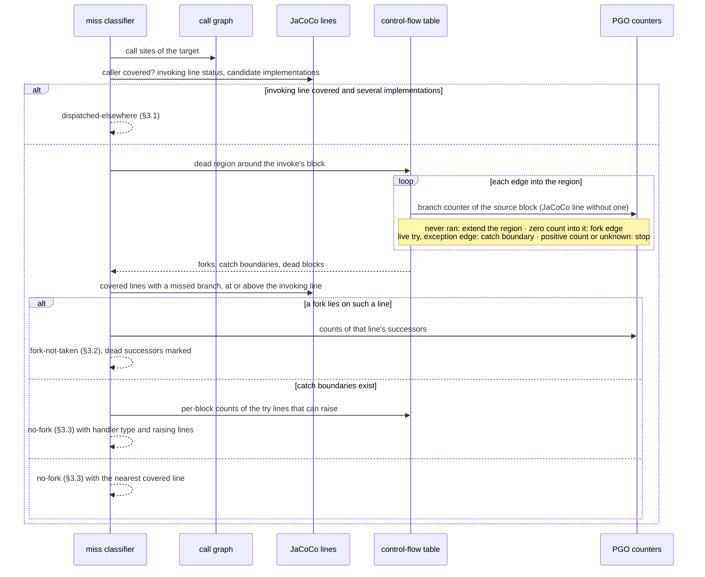

# AR-code-coverage-deep-navigation: Deep-phase navigation evidence

The deep phase prompts the JaCoCo-uncovered methods of its target universe:
library-internal methods, and the public methods the API phase left uncovered
(§AR-code-coverage-improvement.4.2). This document specifies the evidence that
steers the agent toward them and what each piece may be used for. None of it
changes coverage: JaCoCo is the sole metric, and every source here is
navigation only (§GOAL-maximize-library-coverage).

## 1. Evidence sources

Four sources feed navigation. Each answers one question the others cannot:

| Source | Answers | Blind to |
| --- | --- | --- |
| Analysis call-tree CSV dump | what can call what | whether a call ever happens |
| Sampled stacks (`samplingProfiles`) | where execution runs hot | cold code, which is every target |
| Instrumented counters (`conditionalProfiles`, `virtualInvokeProfiles`) | how often each branch successor ran; which receiver types each virtual call site saw | branches the compiler removed |
| Bytecode control-flow table | where each branch leads | how often anything ran |

JaCoCo is exact but boolean per line: it says a line's branches were partly
missed, never which successor, how often the taken side ran, or which
implementation answered a virtual call. A sampler has counts, but a timer misses
cold code, and every deep target is cold by definition. Instrumented counters
close both gaps.

### 1.1 One build, one run

The PGO lane's native test image is built with `--pgo-instrument` and
`--pgo-sampling` together, and one run of the suite dumps one `.iprof` that
carries both the sampled and the instrumented sections. The call-tree CSVs come
from the same build, so the static graph, the samples, and the counters always
describe the same image. The instrumented run is slower than a sampled one;
next to a native build that already takes minutes, one slower run per deep pass
is an acceptable price for exact counts.

### 1.2 Counter semantics

The compiler instruments code after inlining, so one bytecode position appears
once per inlining context. Counters are folded back onto the position they
describe — the leaf method and bci of each context — and summed. A branch
counter records one count per successor, keyed by the successor's bci; a
virtual-call counter records one count per receiver type.

A zero count means the suite never went there, not that the code is unreachable;
classification still decides reachability. A missing counter is not a zero: the
compiler folds branches whose outcome it proves at build time, compiles some
conditions into branch-free code, merges a branch on an inlined call's result
into the callee's own branch, and drops successors it proves impossible in
every compiled context. Evidence without a counter falls back to JaCoCo's line
status. A profile without counters — a
sampling-only build writes the counter sections empty — degrades to
line-level hints, and the report says so in a caveat rather than silently.

### 1.3 Control-flow table

The bytecode call-graph extractor (§AR-code-coverage-improvement.3) also writes
each method's branch instructions, their successor bcis, and its basic blocks
with exception edges. Only this table says where a branch leads; JaCoCo reports
per-line totals, and the profile names successor bcis without saying what lies
behind them.

A block's exception edges are marked apart from its normal ones. Bytecode has no
try/catch instruction, only an exception table of `[from, to)` ranges and their
handlers; the table's range bounds and handler entries cut blocks, so every
block lies wholly inside or outside each range and its handlers are a property
of the block. A block that ends in a return or throw inside a `try` therefore
has exception edges only, and no normal exit. Each exception edge names the
handler's caught type, `any` for a catch-all, and a block holding an
instruction that can raise a caught exception — a call or a `throw` — is
marked, so a hint can say where the exception has to come from.

javac plumbing is marked the way JaCoCo filters it, so the branches a hint lists
match the ones JaCoCo counts. A String switch's `hashCode` switch and the
`equals` checks that follow it are plumbing; the switch on the resulting case
index is the real decision. The hidden `default` of an exhaustive switch, which
throws `MatchException` or `IncompatibleClassChangeError`, is a synthetic
successor no test can reach.

## 2. Routes and ranking

A prompted route crosses exactly one JaCoCo-uncovered method, its target, and
the method that calls the target on the route is one JaCoCo reports covered —
not merely one a sampler saw. Miss classification judges that call site (§3);
a caller that never ran leaves it judging code that never executed, with no
fork or dispatch to name. Route search therefore never continues out of an
uncovered method, and only a covered method may make the last call.

The covered prefix is the shortest one from a sampled frame or, when no
sampled frame joins, from a public API inventory entry JaCoCo reports covered.
It may be any length: no method on it is JaCoCo-uncovered, so it only shows
the agent how existing tests reach the caller.

A method JaCoCo does not report takes the status, and for classification the
lines, of the source-level method it stands for
(§AR-code-coverage-improvement.4.2.1): a factory stub those of its constructor,
whose body the image attributes to the stub, and a generated lambda class those
of the method creating it. One that stands for nothing JaCoCo reports — a JDK,
dependency, or test frame, or a bridge — has neither. A route may pass through
it, but it never makes the last call, since classification would find no JaCoCo
line there to judge.

A target absent from the static graph remains JaCoCo-uncovered but is recorded
as not present in the current graph. A target present in the graph without such
a route remains in the full JSON report as a no-route candidate: it lies more
than one uncovered call past executed code, and becomes routable once a pass
covers a caller. Neither condition changes its JaCoCo status, and only routed
targets enter the agent prompt. On a kafka-streams 3.6.2 replay the earlier
rule, which let a route cross uncovered methods, routed 907 internal targets,
622 of them through an uncovered method and 658 classified `no-fork`; this rule
routes 250 internal and 314 public targets, 45 of them `no-fork`, while
`fork-not-taken` moves only from 171 internal targets to 167.

The prompt navigation stays compact and groups paths that share a divergence:

```text
Observed:
Parser.parse(...) → parseJson(...)

Uncovered paths:
Parser.parse(...) → parseCSV(...)
Parser.parse(...) → parseXML(...)
```

`Observed` is sampled guidance only. Every `Uncovered paths` target is
uncovered according to exact JaCoCo evidence. The agent must reach internal
methods through the shown public behavior rather than invoke implementation
methods directly.

### 2.1 Unobserved dispatch steps

A virtual call site with a receiver histogram ran in the instrumented image. An
edge from that site to an implementation no observed receiver resolves to
(§3.1) is an **unobserved dispatch step**: the static graph allows it, the run
shows it never happened there. Route search prefers, among equally short routes,
the one with fewer unobserved steps. A route that still needs one keeps it — the
agent may yet make the site dispatch there — but the prompt names the step, so
the route stops claiming the run went that way. A site without a histogram makes
no claim: the compiler devirtualizes a site it proves monomorphic and profiles
nothing there.

### 2.2 Ranking

Distance is the primary ranking key. Every route has exactly one uncovered
call, so distance counts no obstacles; it measures how far the shown evidence
starts from the caller, and at distance 1 the caller is itself the sampled
frame or public entry. Equal-distance ties break, in order, on
fewer unobserved dispatch steps, a sampled join before a public-entry join, the
higher reach count of the target's diagnosis (§3), the higher sample count, and
the canonical id. The reach count is how often the fork ran, or how often the
dispatch site ran: how much existing test traffic arrives where the target
diverges. It measures how easy the divergence point is to get to, not how hard
it is to flip, so it only orders ties and never overrides distance.

## 3. Miss classification

Every prompted target carries a deterministic miss classification derived from
JaCoCo source-line instruction and branch counters, the target's reverse
call-site fan-out, and — when present — the control-flow table and the counters.
Only sites whose caller JaCoCo reports covered are judged, and the route
guarantees at least one (§2). A site is found through the target's source-level
method, so a constructor reached through a factory stub is judged at the stub's
callers. A caller judged on borrowed lines (§2) is read in line order, since the
invoke's bytecode index is its own, not the lending method's. The strongest
diagnosis across those sites wins. The Markdown prompt
and the full JSON report carry the same classification.

For one call site the decision runs as follows; the sections below give each
step's rules.



### 3.1 Dispatched elsewhere

A covered invoking line with an uncovered target and more than one candidate
implementation is `dispatched-elsewhere`, and names the site's other candidates,
including candidates owned by the coverage suite. With a receiver histogram the
hint also states how often the site dispatched and to which receiver types.

A receiver resolves to a candidate through the library type hierarchy: its own
class, then its superclass chain, then a unique interface default. A candidate
is labelled with its dispatch count, or as never dispatched at this site, only
when every observed receiver resolves; one unresolved receiver leaves every
candidate unlabelled rather than guessed.

### 3.2 Fork not taken

The fork is found by walking the method's control flow backwards from the
invoking bci, through blocks that never executed. Every edge from an executed
block into that dead region was never taken, and a branch instruction on such
an edge is a fork: it ran, and the successor that leads to the invoke has a
zero count. The fork line is the nearest covered line, at or above the
invoking line, that JaCoCo reports with a missed branch and that holds a fork
branch. The invoking line itself qualifies when a fork branch on it precedes
the invoke, as in a conditional expression. Because the walk never enters
executed code, a loop cannot carry it around, and `a || b` yields its two
conditions as two forks on one line.

A block executed when its branch counter is positive; without a counter, when
JaCoCo covers its line. A block that ran but whose every normal successor
lies in the dead region decided nothing: it left by an exception, and the walk
stops there without a fork. JaCoCo's line status cannot tell such a block from
one that never ran on a line holding several blocks, so without a counter the
walk passes through it. A positive count into a block the walk believed dead
is contradictory evidence, and the walk stops there without a fork. An
exception edge (§AR-code-coverage-deep-navigation.1.3) is walked only out of a
block that never executed: a handler cannot have been entered from a `try`
body that never ran, so the fork lies above the `try`. An exception edge out
of a block that ran is a catch boundary (§AR-code-coverage-deep-navigation.3.3),
not a fork. Without a control-flow table for the method, the nearest covered
line with a missed branch is the fork, as before.

The hint lists every successor of every non-plumbing branch instruction on
the fork line, one numbered item per successor in bytecode order. A successor
is what JaCoCo calls a branch, so the numbered items add up to the taken/total
on the header line. Each item is labelled by the line it lands on, not by
true/false or by case key: javac's jump sense does not map to the source
condition, and enum, String, and pattern switches switch on synthetic keys. A
successor that lands on a later branch instruction of the same line, as the
first condition of `a && b` does, is labelled by that condition's position.
Each item carries its count, and those that land in the dead region, and so
reach the invoking bci, carry a target marker:

```text
fork `Database.java:313` reached 40,182×, 2 of 4 branches taken
  branch 1 → condition 2 ×40,182
  branch 2 → line 320 ×0 ← target
  branch 3 → line 314 ×40,182
  branch 4 → line 320 ×0 ← target
```

The numbers are bytecode order and carry no meaning of their own; the landing
line, the count, and the marker do. A switch is one decision, so its successor
counts sum to the fork's reach count. A branch instruction's reach count is the
sum of its successor counts; the fork's is the largest across its instructions.
JaCoCo's taken/total stays the authority on the line; the numbered list is
navigation.

### 3.3 No fork

When no fork exists — the dead region around the invoke is entered only by
exception edges or from blocks that ran and left by an exception — `no-fork`
names the nearest covered line and explains that the target requires an
exception or external event.

When the region is entered through catch handlers from code that ran, the hint
goes further. It names each handler's line and caught type, and under it every
line of the `try` range that ran and can raise the exception, with its own
count: the range's paths run different numbers of times, and only the one
holding the throwing call matters.

```text
reached only through catch (NumberFormatException) at line 8
  line 4 `String.isEmpty` ran 8,000,100×, never threw it
  line 7 `Integer.parseInt` ran 8,000,000×, never threw it
```

A line's count is propagated forward from the branch counters along normal
edges; a line whose count cannot be derived shows none. Calls are named from
the call graph where it has the site. When no line in the range can raise, every
line that ran is listed.

## 4. Boundaries

- Counters and control flow never change coverage status, the deep universe,
  or attempt state; they choose forks, label hints, and order ties.
- A route or candidate the counters never observed is labelled, not removed;
  the static graph and JaCoCo still decide what may be prompted.
- Instrumented counters are an Oracle GraalVM feature, as sampling already is.
