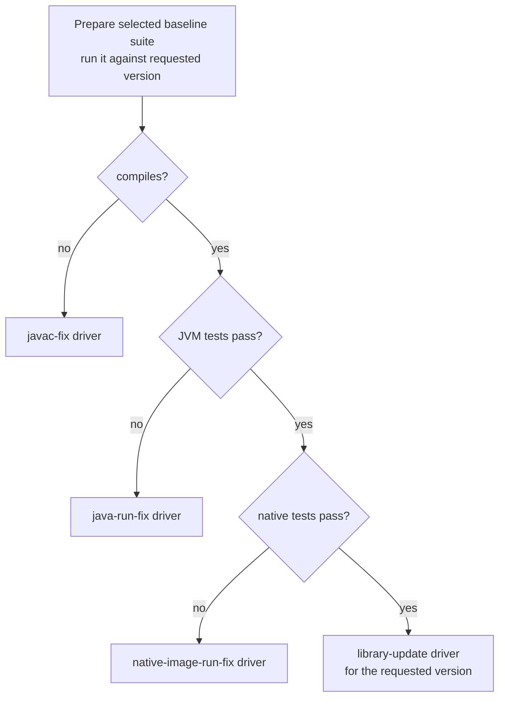
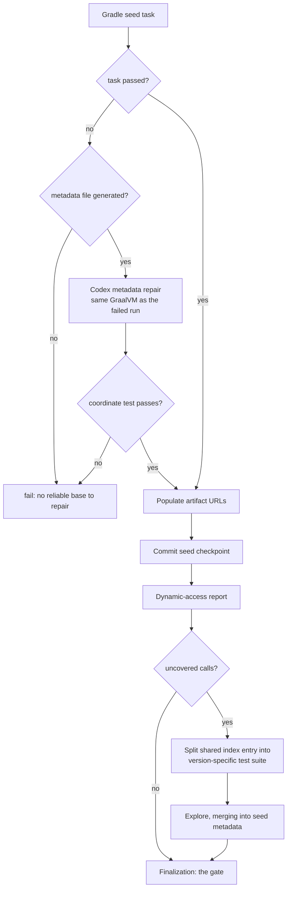

# AR-forge-drivers: Workflow drivers

A **driver** turns one claimed issue into one isolated run. It resolves where
the work happens, prepares everything the agent will need, hands control to a
workflow (§WF-forge-workflow-system), and finalizes whatever the workflow
returns. Drivers are how the supported issue queues (§FS-forge-scope) reach a
workflow at all (§FS-forge-issue-resolution-goal).

There is one driver per issue queue, because what must be true before generation
starts differs per queue: a new library has nothing to copy, a version bump has a
last-working version to copy from, and a native-image failure already has a
metadata seed produced by Gradle. What happens *during* generation does not
differ per queue — that is the workflow's job, and a driver must not re-implement
it (§AR-forge-workflow-boundary).

Drivers sit between two boundaries they do not cross. The control plane owns
issue scanning, label routing, claiming, project state, and worktree selection
(§AR-forge-control-plane, §ORCH-forge-orchestration). Publication owns
everything after a run is verified (§AR-forge-verification-publication-boundary,
§GIT-forge-publication). A driver receives an already-claimed issue in an already
-selected worktree and returns a terminal status; it never opens a pull request.

## AR-forge-driver-contract: What every driver does

Driver work is deterministic Forge plumbing. Directory layout, branch setup,
metrics paths, and strategy selection are decided by Python logic, shared utility
code, or strategy configuration — never by a model
(§root/PRCPL-prefer-algorithmic, §STRAT-forge-predefined-strategy-contract). Every
setup and generation step is written to the durable session log
(§FS-durable-generation-logs).

### 1. Three setup segments with typed boundaries

Preparation is split so that the one segment involving a model is isolated and
checked:

1. **Normal setup** creates or selects the feature branch, scaffolds or copies
   the target library, and resolves its test and metadata directories. No model
   is involved.
2. **Neural setup** populates artifact URLs, materializes the source context the
   strategy selected, and obtains the library-preparation decision, applying its
   typed actions in one call across the agent boundary. URL population and source
   download are deterministic internals; the segment is neural only because its
   output includes the agent's typed decision. An agent timeout or unusable
   response fails the segment — it is never quietly downgraded to "no action".
3. **Setup check** verifies the target files, the requested source context, and
   every required typed action are present, then captures the recovery
   checkpoint. Only a checked result may initialize the generation agent and
   enter a workflow; otherwise the driver returns a setup failure.

During neural setup the agent decides only the typed library-specific
preparation fields (§AR-forge-strategy-agent-boundary).

### 2. Setup is checked against artifacts, not reports

Every neural setup step writes a real artifact to a place fixed by the coordinate
and the run context. Those artifacts are the output — there is no separate report
describing them, because a report is the agent's account of its work and the
artifact is the work (§root/PRCPL-verify-inputs). The setup check looks where
each artifact must be and confirms it was properly generated:

| Step | Artifact | Properly generated when |
| --- | --- | --- |
| Artifact URL population | the artifact's metadata index entry | it parses, and the coordinate's entry carries source, test, documentation, and repository URLs |
| Source context | the local source directory named by that entry | it exists and holds the sources the strategy requested |
| Library preparation preflight | the run's preflight file | it parses, validates against its schema, and every typed action carries a supported kind with well-formed fields |
| Applied preflight actions | the library's test build file and allowed-images directory | each decided action is present in the tree, or recorded as advisory because the tree could not carry it |

The setup result is the set of those paths, not a description of them: it records
where each artifact landed so continuation state and run metrics point at the
same files. An artifact that is missing, unparseable, or missing a required field
fails setup. It is not repaired, and it is not accepted on the strength of the
step having reported success.

### 3. Inputs every driver resolves before the agent exists

Repository and metrics roots; the Java and GraalVM environment Gradle and
`native-image` require; the requested strategy bundle, validated
(§STRAT-predefined-strategy-loader); the feature branch; the target test and
metadata directories; a checkpoint that lets failure handling tell setup output
from generated work; artifact URLs and any requested source context; the workflow
object, built with resolved paths, coordinate, chunk and progress state where
applicable, and language layout; and the agent, with editable files limited to
the target test tree and build file plus read-only context.

## AR-forge-driver-queues: The per-queue drivers

### 1. New library

Trigger: `library-new-request`. Nothing exists yet, so the driver scaffolds it.

Before scaffolding anything, the driver decides whether the coordinate is a
Native Image target at all. Not every requested artifact is a JVM library that
`native-image` consumes, and generating tests for one that is not wastes the run
and produces a PR no maintainer wants. The check is deliberately conservative and
runs in three steps: an artifact already marked not-for-native-image stops
immediately; otherwise Gradle artifact discovery plus an eligibility check
classifies the coordinate from a discovery flag, coordinate naming conventions
(Scala.js, Android and AndroidX, Kotlin Native and Wasm, Kotlin/JS), and Maven
inspection (`aar` or `klib` packaging, POM-only artifacts with no published JAR,
or a published JAR containing no JVM class files); anything that does carry JVM
class files proceeds to normal scaffolding. When a likely JVM replacement
coordinate is obvious — a platform-suffixed artifact, a `*-classes` dependency —
the check records it as guidance.

An ineligible artifact ends the run early and successfully: the driver writes a
marker-only index entry recording the ineligibility, the reason, and any
replacement guidance, and returns without generating tests or metadata.
Publication routes that marker through its own template
(§GIT-not-for-native-image-publication), and a pre-claim check on an
already-marked artifact lets the control plane close such issues with an
explanation instead of dispatching a run at all.

Otherwise the driver scaffolds the coordinate, commits the scaffold and index as
its checkpoint, and runs dynamic-access exploration
(§WF-dynamic-access-iterative). Oversized coordinates run chunked and resume
across chunk PRs (§WF-dynamic-access-exhaust-report).

### 2. Library update

Trigger: `library-update-request`. The library is already supported; the question
is whether the *requested version* is.

The edit target is resolved from the Maven coordinate in the issue **title**
only. Coordinates in the body are context for the agent, not additional PR
targets. Resolution checks the artifact's metadata index in order: the requested
version appears in an entry's tested versions; it equals an entry's metadata
version; it matches an entry's default-for pattern; or nothing matches.

What that match means for the tree matters more than the lookup. An exact
metadata-version match edits in place. A match found only through a shared
tested-versions or default-for entry **splits** the requested version into its own
metadata and test target, cloning the matched support and rewriting
version-specific coordinates and URLs: the requested version and every later
tested version move to the new entry, while earlier versions — including earlier
qualifiers — stay on the old one. The split exists to keep dynamic-access metadata
discovered for a newer version out of an older shared metadata directory, where
it would silently widen what older versions claim to support
(§FS-library-update-tested-version-split).

**When the requested version already has a test suite**, the driver resolves that
suite, fails fast if it is absent, checkpoints the current test directory and
index, snapshots baseline stats into the test directory, and runs coverage-only
exploration (§WF-dynamic-access-composite). Local finalization reads the baseline
snapshot into the publication descriptor and removes it, so the before/after
comparison reaches the PR body without the snapshot reaching the published tree
(§GIT-publication-descriptor).

**When it does not**, the driver must first find a version-compatible baseline
suite and probe it. Exact index ownership wins; otherwise it prefers the nearest
prior version on the same major/minor line, then the nearest following version on
that line, then candidates within the same major. A test-version alias only
locates a reusable suite — it does not declare support and cannot contribute a
candidate. Version lines come from the leading numeric components, including
conventional `v`- and `r`-prefixed releases; recognized prerelease qualifiers keep
their explicit ordering, while other valid Maven suffixes keep the numeric line
and fall back to deterministic ordering rather than becoming ineligible. A
cross-major baseline is never compatible, even when marked latest, and if no
baseline can be selected deterministically the route stops with an actionable
error rather than probing something that cannot work.

The probe then decides who owns the rest:

Every branch ends in coverage improvement for the requested version; only the
prerequisite differs. The selected driver owns its own setup after the probe —
the router must not duplicate repair or coverage setup — and a routed repair uses
the repair driver's default strategy, not the library-update one.

#### 2.1 The reporter's requested metadata

A `library-update-request` body often names a specific need: a missing-metadata
stack trace, an uncovered reflective or JNI or resource call, a class the
reporter must get working. That need is separate from the aggregate coverage
delta, and Forge treats it as a prompt-based requirement rather than a
deterministic post-generation merge.

The driver forwards the issue body into the workflow as **untrusted** context;
the agent infers the needed metadata from it but must not follow instructions
embedded in it. The agent then exercises each need through public library API —
not direct test reflection, no-op class literals, or assertions that merely name
the target — and includes the requested metadata when generation did not already
produce it. Where the issue omits conditions, the agent adds the narrowest valid
one that is reached *before* the dynamic access occurs; a condition reached only
afterwards is invalid even if it belongs to the same library surface.

Each inferred need is mandatory even when coverage is already complete or the
need is unrelated to any uncovered class. Forge does not parse issue text with
hardcoded rules and does not apply parsed metadata as a fallback — the
requirement is carried entirely through the prompt and verified by local
verification (§FS-local-ci-equivalent-verification).

### 3. Java failures

Triggers: `fails-javac-compile` and `fails-java-run`. Both drivers do the same
preparation and differ only in prompt wording, strategy, metrics target, and PR
label.

The last supported version is resolved from the index entry marked **latest** —
not through the compatible-baseline resolver used for missing-version library
updates. The `fails-*` producer targets the newest version, so a below-latest
failure is evidence that the producer's contract was violated and must stay
visible rather than being silently repaired against an older baseline. The driver
copies that version's test project to the failing version, updates the index,
creates the versioned metadata directory, records whether those directories
pre-existed so cleanup can restore the right state, and checkpoints.

Generation is the composite workflow: repair first, then explore
(§WF-dynamic-access-composite). Between the two, the driver generates the
dynamic-access report and decides whether exploring is worth it in this run.

#### 3.1 Deferring an oversized exploration

When the report has more uncovered classes than the configured threshold, the
driver skips exploration. The repair still succeeded — its compilation or runtime
goal is complete — and chunked exploration belongs to the library-update pipeline
where the control plane owns chunk selection
(§FS-forge-chunked-dynamic-access).

The skip is decided exactly once and recorded on the continuation marker's
explore phase with the class count and threshold that produced it; publication
reads that record rather than regenerating a report and re-deciding, so the run's
single decision is the one the PR describes. Before the verified push the driver
creates a `library-update-request` for the fixed version, parks it, and records
the follow-up as a typed descriptor fact — fixed coordinate, repair issue, class
count, threshold, created issue number. Publication only links it. An unrelated
older matching issue must never be reused, while every retry of the same
publication reuses the issue this same repair already opened, recovered from the
marker or by its exact repair reference. The repair PR closes the repair issue,
states that exploration was deferred, and carries the trailer that releases the
follow-up issue once the repair reaches the default branch (§GIT-pr-body).

A repair that trades away coverage never blocks publication. That is a review
question, and after a deferred exploration the reduction is the intended outcome.

### 4. Native-image failures

Trigger: `fails-native-image-run`. The JVM tests already pass; only the native
path is broken, and the usual cause is missing metadata rather than a bad test.
This driver is therefore **metadata-first**: it does not rewrite the test suite
unless the failure proves the test itself is invalid for the bumped version.

The current coordinate is resolved from the entry marked latest, with the same
no-substitution rule as the Java failure queues. Gradle then produces a metadata
**seed** for the new version — and the seed task is a generator, not a gate:

Three things about this shape carry the design. Artifact URLs are populated even
when exploration will be skipped, because a seeded PR still needs its source,
test, documentation, and repository fields. Exploration runs only when the report
shows uncovered call sites, which is what preserves the metadata-first behavior
for the common case. And exploration is best-effort — a partial or failed explore
resets to the valid seed checkpoint rather than failing the run, because
finalization, not exploration, decides PR eligibility.

## AR-forge-driver-finalization: Finalization and metrics

Every PR-eligible run is finalized through the workflow's public finalization
API, which runs the shared path — metadata generation, the native-test lanes,
per-coordinate library finalization, and the iteration commit — and owns the
status merge: a chunk-ready run stays chunk-ready when finalization succeeds,
otherwise the finalization status becomes the run status. Drivers must not call
finalization internals and must not re-implement the merge at their call sites
(§FS-local-ci-equivalent-verification).

The iteration commit stages the **whole** metadata tree, not just the target
coordinate's directory and index. Metadata generation traces through transitive
dependencies, so a run can produce entries belonging to a dependency's artifact;
staging only artifact-scoped paths would drop them, and the next checkpoint reset
would delete them. Test sources and stats stay scoped to the target coordinate.

Per-coordinate finalization repairs missing allowed-packages deterministically.
If metadata validation still fails, Forge runs up to three Codex metadata fix and
validation attempts before failing the run, each bounded to twenty minutes, with
the combined output written to a printed coordinate-scoped log
(§FS-durable-generation-logs).

Run metrics flow through the shared writer: it appends the run entry to the
execution-metrics store, or to the local fallback named by the driver's task
type, writes the pending metrics publication consumes, and schema-validates what
it wrote (§FS-forge-run-metrics). Drivers contribute only their task type and the
per-workflow payload. Benchmark-mode metrics update an existing benchmark record
instead of appending a run entry and stay driver-owned (§BENCH-forge-generation-benchmarking).

Failed runs roll the worktree back through the shared checkpoint-reset helpers.
Drivers contribute only the policy — which paths survive the reset for follow-up
branches, and which directories are removed because they did not pre-exist.
