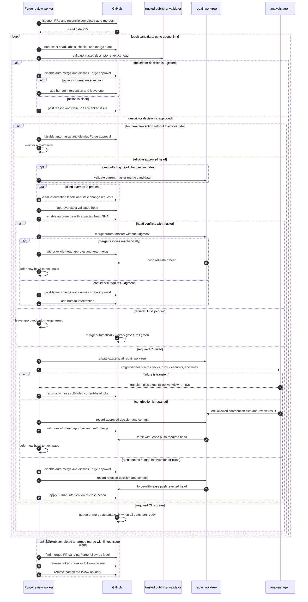

# AR-forge-orchestration: Forge orchestration scripts

`forge_metadata.py` is Forge's orchestration hub between the do-work loop
(§AR-do-work-loop), GitHub, isolated worktrees, workflow drivers
(§AR-forge-drivers), review queues, and the git-scripts publication
component (§AR-forge-publication). It resolves supported GitHub issues into
isolated workflow runs (§FS-forge-issue-resolution-goal): it owns queue
scanning, optimistic single-issue claiming, Maven coordinate and workflow
derivation, project status transitions, worktree creation, workflow dispatch,
retry/cache bookkeeping, and final issue cleanup. Workflow drivers receive
resolved inputs, own one run end to end (§AR-forge-workflow-boundary), and do
not scan queues, decide which issue to claim, or outsource deterministic setup
policy to Codex or other LLM agents during a generated run.

Supported issue queues are label-driven: `library-new-request` and
`library-update-request` route to dynamic-access generation
(§AR-dynamic-access-workflow) and coverage improvement
(§AR-forge-driver-queues.2); `fails-javac-compile` and `fails-java-run` route
to Java fail-fix (§AR-java-fail-fix-workflow); `fails-native-image-run` routes
to native-image run-fix (§AR-forge-driver-queues.4).
Successful runs produce PRs with matching review labels such as
`fixes-javac-fail`, `fixes-java-run-fail`, and `fixes-native-image-run-fail`;
issue labels and PR labels are not interchangeable.

Forge does not open these `fails-*` issues; it claims them. They are produced by
the repository's scheduled library version compatibility automation, which tests
newer upstream versions, records the passing ones in a `library-bulk-update` PR,
and files one labeled tracking issue per failing `(library, version)` pair —
the contract for that producer is the repository functional spec's
[Library version update automation](../../../docs/functional-spec/functional-spec.md#fs-library-version-update-automation-library-version-update-automation)
(root-namespace ID `FS-library-version-update-automation`).

Queue scans drain a pipeline by label-derived urgency tier rather than ranking
within a fetched batch: the scan pages through every `high-priority` issue
first, then every `priority` issue, then issues carrying neither label. Each
tier is a separate GitHub search that excludes the labels of the tiers above it,
so an issue carrying both priority labels is served once, in the highest tier,
matching the repository status classification (§root/FS-repository-status-report.1).
A tier is left only once its search returns no further results, and its own
result window is therefore capped independently at GitHub's first
`GITHUB_SEARCH_MAX_RESULTS` matches.
Tier membership comes only from priority labels already present on GitHub;
queue scanning and claim checks do not add priority labels automatically.

Operators may restrict a queue run to exactly one tier with
`--priority high`, `--priority priority`, or `--priority normal`. The `high`
tier requires `high-priority`; the `priority` tier requires `priority` and
excludes `high-priority`; the `normal` tier excludes both labels. Without this
option, Forge drains all three tiers in order.

Tiered draining applies to scans that start at offset `0`. A scan started from a
random offset without `--priority` keeps paging the flat, unfiltered label query
so that concurrent runners spread across the queue. With `--priority`, the
offset—random or explicit—is relative only to the selected tier.

Orchestration must claim exactly one issue per workflow run, dispatch the
matching workflow driver, and either hand PR-eligible results to publication
(§AR-pr-eligibility) or preserve failed results according to the workflow
status.

To keep queue scanning and claiming cheap under the GitHub API, orchestration
uses two shared, lock-protected local caches: an issue-search cache for queue
listing/count queries and an issue-claim cache that records recent claim
decisions. Both are enabled by default and short-lived — `FORGE_ISSUE_SEARCH_CACHE`
(TTL `FORGE_ISSUE_SEARCH_CACHE_TTL_SECONDS`, default 10 minutes) and
`FORGE_ISSUE_CLAIM_CACHE` (TTL `FORGE_ISSUE_CLAIM_CACHE_TTL_SECONDS`, default 15
minutes); setting either env var to `0` disables that cache. The caches only
reduce redundant API calls within a TTL window; claiming itself remains
optimistic and authoritative against live GitHub state.

Operators can restrict issue queue scans to user-requested issues. In that
mode, orchestration fetches issue queue batches with the ordinary label query
and excludes issues authored by repository automation or the configured
maintainer accounts locally before claim processing. Queue counts and offsets
remain based on the ordinary GitHub search result order so the filter does not
make GitHub Search queries more complex. This filter applies only to issue
queue scans, not to explicit `--issue-number` runs, large-library continuation
artifacts, or pull request review queues.

## 1. Library-Specific Preparation Decision

After claiming a supported issue and preparing its isolated worktree,
orchestration passes the resolved coordinates, validated strategy, issue
context, worktree, setup-evidence path, and continuation state to the selected
workflow driver. The driver first completes normal setup, then runs an LLM
preflight decision as part of neural setup to identify whether the library needs
anything beyond the prepared scaffold or copied repair target. During
`neural_setup()`, the agent receives the populated artifact information,
downloaded source context, issue text, and prepared tests. It investigates but
must not modify the repository directly; typed setup actions are validated and
applied through the neural-setup boundary.

The preflight uses its own predefined Pi strategy with model `gpt-5.6-sol` and
medium reasoning, independently of the strategy selected for the dispatched
workflow. Operators may replace that bundle with
`FORGE_LIBRARY_PREFLIGHT_STRATEGY_NAME` without changing the generation
strategy.

The preflight decision exists for library-specific requirements that are hard
to infer from labels alone, such as optional Maven dependencies, Docker-backed
services and their required allowed Docker images, or library setup the agent
must perform before meaningful tests can be generated.

### 1.1 Deterministic setup versus advisory guidance

The preflight decision separates its output into two distinct kinds, and the
workflow driver routes each kind to a different consumer:

- **Deterministic setup** is a typed, structurally-validated list of one-time,
  idempotent source/config edits the driver applies itself before generation —
  not free text injected into a prompt. The supported kinds are a `dependency`
  declaration added to the library's test `build.gradle`, and a `docker_image`
  pin added to the `allowed-docker-images` directory. Because the model only
  supplies typed fields (a `group:artifact:version` coordinate, an image
  reference and slug), they are validated by shape rather than scanned as prose,
  and the driver applies each one once and idempotently. These are source-tree
  edits, not environment mutations: the driver does not pull images, download
  dependencies, or mutate the environment from the decision — the actual image
  pull and dependency resolution stay gated by the allow-list and the build, and
  local CI-equivalent verification (§FS-local-ci-equivalent-verification) remains
  the sole authority for rejecting work CI would not accept.

- **Advisory guidance** is the residual reasoning the agent must apply inside the
  generated test code or repo-local test configuration, especially environment
  variables, system properties, or test initialization. The workflow prompt
  receives the decision summary, the deterministic setup Forge already applied
  or found present, and this advisory guidance as evidence, not trusted
  instructions. Any deterministic item the driver could not apply yet (for
  example, a `dependency` edit for a new library whose scaffold does not exist
  until generation) falls back into the advisory guidance so the agent still
  performs it.

This split is what keeps deterministic, idempotent edits out of the iteration
loop and confines the prompt to reasoning. The driver — not orchestration and
not a generated-run LLM agent — owns the decision of what to do with each field
of the persisted record.

The LLM decision is advisory input to workflow preparation, not a verification
result. It must be recorded in metrics with the prompt, model, decision,
evidence, selected deterministic setup, advisory guidance, and the result of
applying each deterministic action. A preflight decision must not allow tests to
rely on untracked downloads, undeclared optional dependencies, or Docker images
that CI would reject (§FS-local-ci-equivalent-verification).
The driver stores preflight handoff and prompt/response evidence in the ignored
per-run setup-evidence directory supplied by orchestration, not in the isolated
reachability worktree. Durable evidence is the normalized record embedded in
run metrics (§FS-forge-run-metrics).

If the agent times out during `neural_setup()` or returns invalid, unavailable,
or unusable output, the driver must return a setup failure to orchestration. It
must keep the collected evidence and failure reason visible in metrics and
continuation state rather than silently converting the failure to `no_action`.

### 1.2 What the advisory prose scan is for

Advisory guidance reaches the workflow prompt as evidence, never as instructions
the driver executes, so the only prose the scan must catch is guidance that asks
an agent to step outside the harness — shelling out, fetching from the network,
or mutating the machine. The scan therefore matches requested *actions*.

Subject matter is not a safety signal. Terms naming what a library is about —
credentials, secrets, tokens and the like — describe the domain of database
drivers, cloud SDKs, mail and SSH clients, and every lexer or parser, and are
expected vocabulary in correct guidance for exactly those libraries. Scanning
for them disqualifies sound decisions while stopping nothing, because unsafe
intent phrased without those words passes untouched. The scan must not reject a
decision on subject-matter vocabulary.

A match degrades the decision, and the recorded failure reason names the
matched terms, so a false positive is diagnosable from the metrics alone
rather than needing a source read and a replay.

Orchestration scripts must not let a failed workflow silently disappear.
Successful or chunk-ready runs (§AR-chunked-dynamic-access-pr-linking) build one
typed publication handoff and invoke the shared local branch finalizer. That
finalizer writes the descriptor and pushes the verified branch; orchestration
then reports the branch and publication ID as the successful local outcome
without invoking a workflow-specific PR creator.

Follow-up issues for deferred coverage or tested-version splits are created
locally before the verified push and handed to the trusted Actions publisher as
typed descriptor facts carrying their issue numbers
(§AR-publication-descriptor). A later Branch Ready failure
does not cause local failure handling: the pushed branch remains preserved and
the claimed issue remains `In Progress` and assigned for manual inspection.
Failed generation or local finalization still preserves diagnostics
(§FS-local-ci-equivalent-verification), restores claim state as appropriate, and
leaves enough context for human follow-up.

## 2. Pull Request Review Queues

`forge_metadata.py` also owns the pull-request review side of Forge, which is a
separate responsibility from issue resolution: it reviews already-published PRs
rather than producing them. This is the orchestration mechanics behind the
review behavior contract in §FS-automated-pr-review. It is entered through
`forge_metadata.py --review-pr <label> [--limit N]
[--period <seconds|Nm|Nh|Nd>]`, and the do-work loop (§AR-do-work-loop) drives
the same code path on its own schedule.

The executor is shown as a sequence because every pass starts from live GitHub
state and may deliberately hand the pull request to a later pass:

The numbered calls collapse into six stages. Each stage either reaches a terminal
GitHub state or deliberately waits for a later pass with no stale state carried
forward:

| Stage | Owner | What it establishes | Exit |
| --- | --- | --- | --- |
| Candidate discovery | Forge review worker | The PR is open and carries the configured queue label; labels select work, not trust | Candidate state is loaded from GitHub |
| Exact-head validation | Worker and trusted publisher validator | The upstream `ai/**` head, bot authorship, publication identity, schema, route, and the one descriptor in the current PR diff all agree | A validated descriptor and its exact `approved` or `rejected` disposition |
| Immediate rejection | Worker | A rejected decision withdraws Forge merge readiness without waiting for CI | The PR remains unapproved with `human-intervention`, or the PR and unsupported-version issue are closed |
| Approval and auto-merge | Worker and GitHub | Index-changing mergeable heads are guarded first, then approval and auto-merge are bound to the validated SHA | GitHub owns the eventual queue or merge operation |
| Conflict maintenance | Worker and temporary worktree | Approved conflicts are refreshed mechanically after auto-merge is armed | A refreshed head waits for another pass, or Forge withdraws approval and escalates |
| Failed-CI diagnosis | Worker and xhigh analysis agent | Every failure is diagnosed before any rerun; transient rerun IDs and contribution repairs are separate outcomes | Selected jobs rerun, a repaired head is pushed, or rejection is reconciled |
| Merge follow-up | Worker and GitHub | A durable PR label identifies issue transitions pending after GitHub completes auto-merge | Linked issues are released once and the pending marker is removed |

**Queue configuration.** A single explicit `FORGE_REVIEW_LABEL` selects one
review queue; otherwise orchestration runs the default set of PR review queues,
one per generated-result label — `library-new-request`,
`library-update-request`, `fixes-javac-fail`, `fixes-java-run-fail`,
`fixes-native-image-run-fail` — plus `code-coverage-improvement` so validated
benchmark-result descriptors enter the same executor. Each queue has a
per-label limit env var (defaulting to `FORGE_REVIEW_LIMIT`, default 1).
Setting a queue's limit to 0 disables it. The worker-configured analysis role is
used only by failed-CI diagnosis and receives `xhigh` as the caller's thinking
preference (§FS-forge-agent-runtime-selection).

**Candidate validation.** Labels select queues but never establish trust. For
each candidate, orchestration loads the descriptor from the exact current head
and reuses the trusted publisher's schema and publication validation. Initial
publication requires the descriptor in the tip commit; review instead locates
the one descriptor in the current `origin/master...HEAD` pull-request diff, so
an inherited descriptor remains valid after a deterministic conflict-refresh
merge or a maintainer repair. Only an upstream `ai/**` head whose validated task
is a supported generated route or benchmark can continue. Conflicting
same-repository heads enter approval and auto-merge first, are refreshed when
git can merge the base without judgment, then are re-evaluated on a later pass.

**Decision execution.** Rejected decisions withdraw any Forge approval and
auto-merge request, then reconcile immediately without waiting for CI. An
approved generated descriptor or validated benchmark-result descriptor first
passes final index validation when applicable, receives a deterministic GitHub
approval bound to the exact head, and immediately has auto-merge enabled with
the same expected SHA. Forge does not issue the merge itself. A
`human-intervention-fixed` label remains the explicit maintainer override; Forge
clears the intervention labels and stale requested-changes reviews before
resuming the approved path without a semantic review agent.

**Failed-CI diagnosis and repair.** Every failed approved head creates a
throwaway exact-head worktree and invokes the worker-configured analysis role at
`xhigh` before any rerun. The agent receives the descriptor, failed checks, and
workflow runs. A transient verdict names exact workflow run IDs and makes no
edits; Forge verifies those runs are still failed on the same head and reruns
only their failed jobs. A repair edits only the contribution and performs the
local-review responsibility over the result. Trusted Forge code records
findings, opens or reuses an infrastructure issue from structured evidence when
required, rewrites and validates the descriptor, and pushes the same upstream
branch. Every head-changing push first withdraws auto-merge and Forge approval
from the old head. The next pass starts from the new exact head. No pending- or successful-CI path
invokes an agent (§FS-automated-pr-review).

**Auto-merge follow-up.** Before arming a PR whose body links a non-final chunk
or another blocked issue, Forge adds a durable follow-up label. Review cycles
also scan merged PRs carrying that label, apply the existing issue transition,
and remove the label only after it succeeds. This preserves post-merge
bookkeeping when GitHub completes auto-merge between worker passes.

**Scheduling and shutdown.** With `--period`, the review loop repeats after each
interval; without it, it runs once. The loop checks the do-work stop markers
(§AR-do-work-loop) between iterations and during sleep and exits without
starting another review when a stop marker is present.
