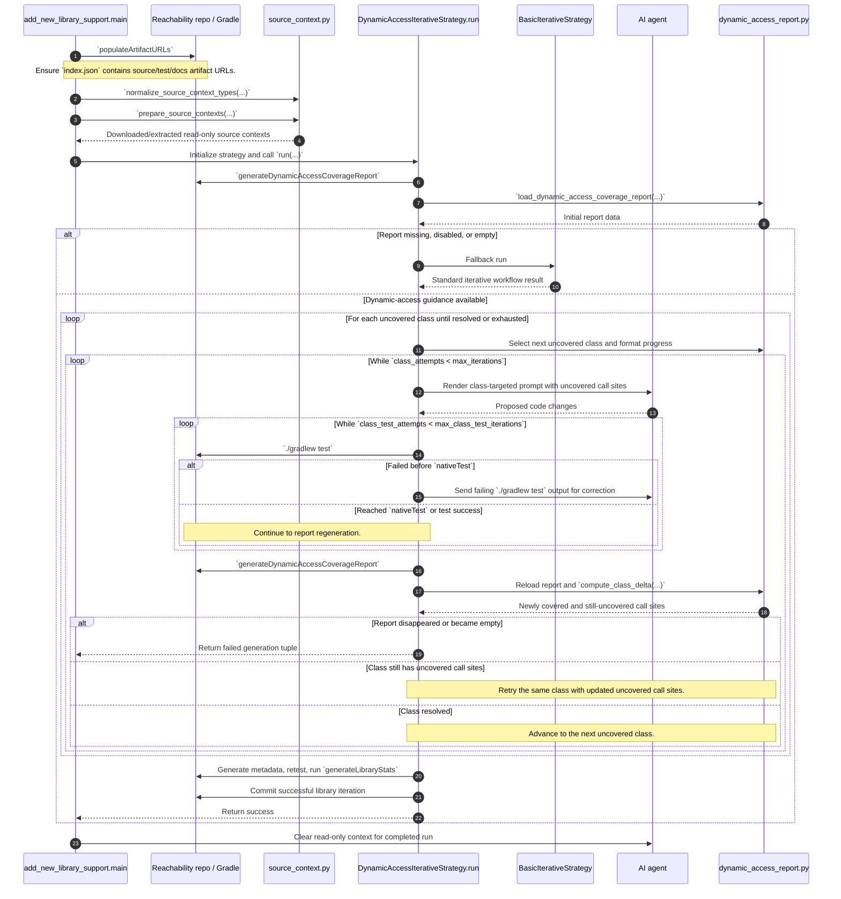

# Dynamic-access strategy internals (current PR)

Main functions added or updated in this PR:

- `ai_workflows/add_new_library_support.py`
  - `main(...)`: integrates source-context setup into the add-library workflow by calling `populate_artifact_urls(...)`, `normalize_source_context_types(...)`, and `prepare_source_contexts(...)`, then passes source-context metadata into the strategy and adds source files to agent read-only context.

- `ai_workflows/workflow_strategies/dynamic_access_iterative_strategy.py`
  - `run(...)`: runs a single generation attempt. It generates the initial dynamic-access report, falls back to `BasicIterativeStrategy` only if no usable guidance exists at the start, otherwise enters the dynamic-access class iteration immediately and counts success only after metadata generation, retest, `generateLibraryStats`, and a commit for the library iteration succeed.
  - `__init__(...)`: keeps the dynamic strategy config minimal by requiring only the class-specific dynamic-access prompt and dynamic-access-specific iteration limits, while providing internal defaults for the start-of-run basic fallback prompts and fallback iteration limits.
  - `_run_dynamic_access_phase(...)`: uncovered-class iteration using coverage deltas from dynamic-access reports; initializes `exhausted_classes = set()` for the phase, emits targeted prompts per uncovered class, includes the current uncovered dynamic-access call-site list in every prompt, retries `./gradlew test` failures inside a bounded per-class mini-loop by sending the failing output back to the agent, clears agent context after each class attempt sequence, treats the phase as successful once any dynamic-access call site becomes covered, enforces per-class prompt-attempt limits, and fails the generation if the dynamic-access report disappears mid-phase.
  - `_generate_dynamic_access_report(...)`: runs `generateDynamicAccessCoverageReport` and loads parsed report data from `dynamic-access-coverage.json`.
  - `_run_gradle_command(...)`: executes Gradle commands in the reachability repo with unified output handling.
  - `_format_progress(...)`: renders per-class progress summary (attempt count, newly covered call sites, remaining uncovered call sites) for prompt context.

- `utility_scripts/dynamic_access_report.py`
  - `load_dynamic_access_coverage_report(...)`: parses JSON report payload into typed dataclasses.
  - `compute_class_delta(...)`: compares previous/current report for one class and computes newly covered vs still-uncovered call sites.
  - `format_call_sites(...)`: converts uncovered/newly-covered call-site lists into prompt-ready bullet text.

- `utility_scripts/source_context.py`
  - `normalize_source_context_types(...)`: validates, normalizes, and deduplicates `source-context-types` strategy parameters.
  - `populate_artifact_urls(...)`: runs the Gradle `populateArtifactURLs` task to fill missing artifact URLs in `index.json`.
  - `prepare_source_contexts(...)`: resolves index entry and prepares download/extract contexts for requested source artifact types.
  - `load_index_entry(...)`: locates the matching metadata entry by `metadata-version` or `tested-versions`.
  - `download_source_artifact(...)`: downloads and extracts one artifact URL and reports availability/reason.
  - `extract_downloaded_artifact(...)`: unpacks `.jar`/`.zip`/`.tar.gz` or stores single-file payloads.

- `ai_workflows/workflow_strategies/workflow_strategy.py`
  - `_render_prompt(...)` (new): central helper that merges base strategy context with per-call dynamic values before loading a template. `dynamic_access_iterative_strategy.py` uses it for class-specific prompt content.

Sequence UML diagram (`dynamic_access_iterative` workflow):

