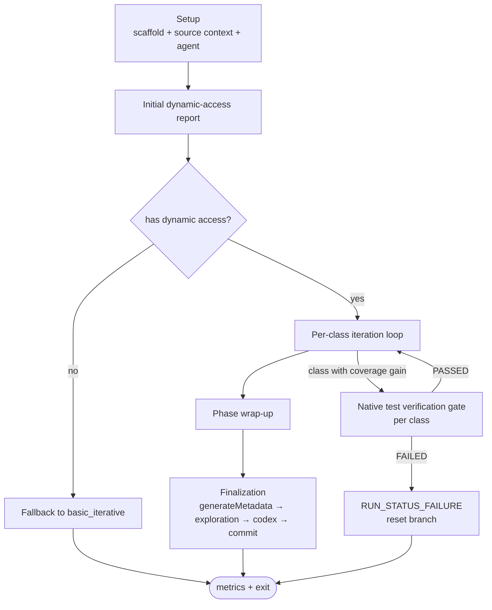
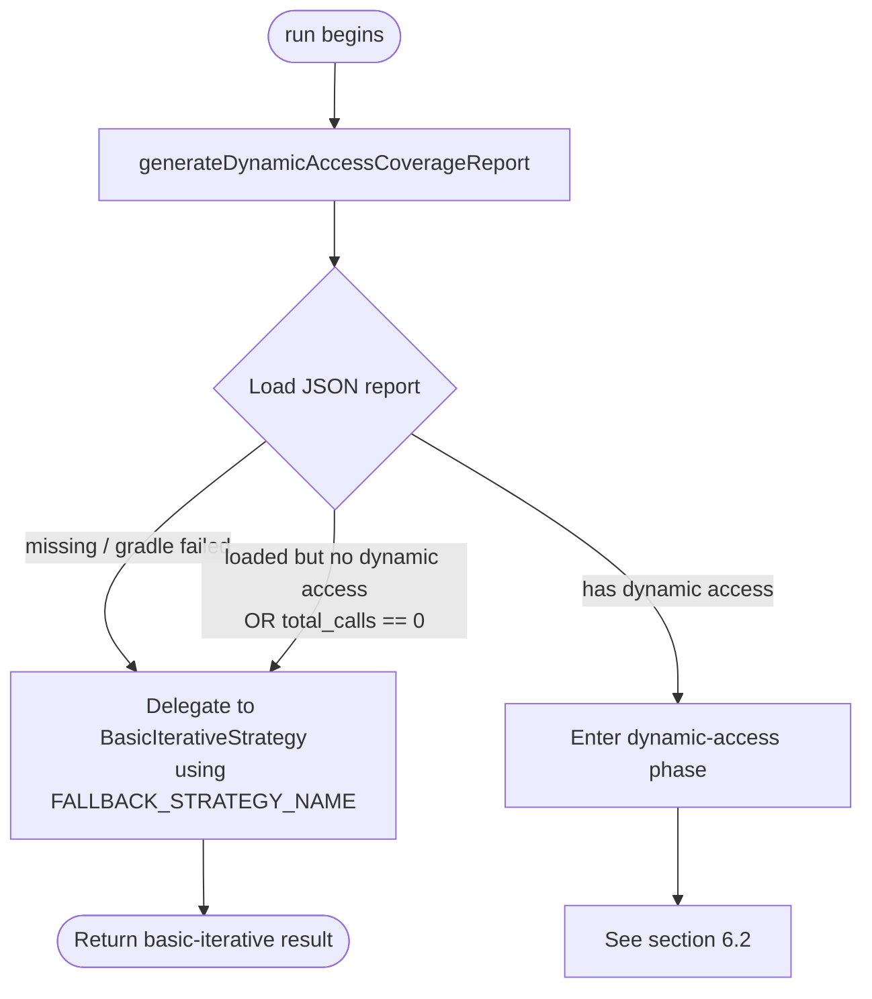
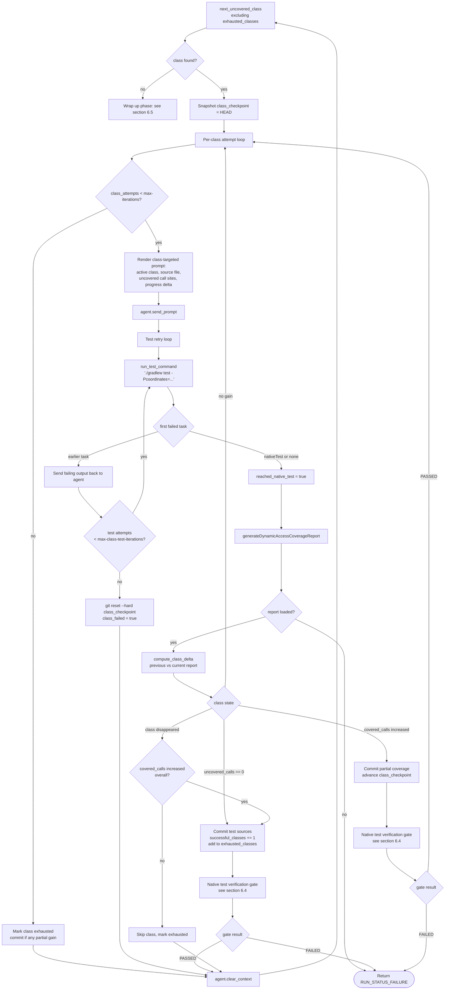
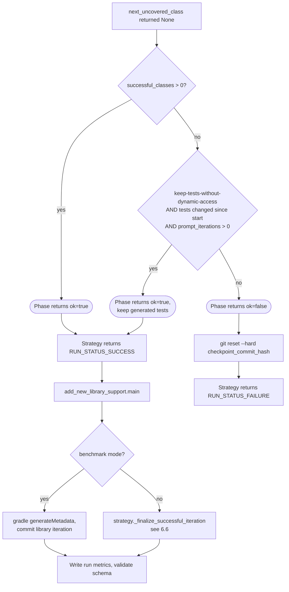
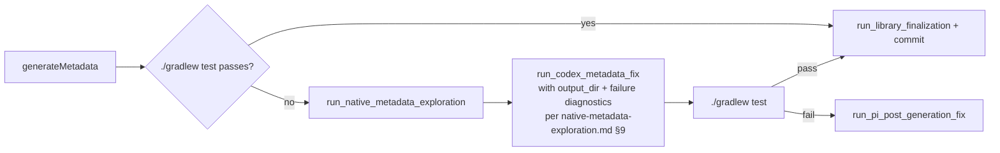

# Dynamic-Access Workflow Specification

> **See also:** [Architecture](architecture.md) ·
> [Native metadata exploration phase](native-metadata-exploration.md) ·
> [Native test verification gate](native-test-verification.md) ·
> [Java fail-fix workflow](fix-java-run-fail.md)

## 1. Purpose

The dynamic-access workflow (`workflow: dynamic_access_iterative`) generates
a JUnit/Kotlin/Scala test suite for a target library such that every
**dynamic-access call site** reported by the reachability repo's coverage tool
is exercised at runtime. Coverage of those call sites is required before
reachability metadata can be generated automatically. The workflow guides the
LLM agent class-by-class, feeding it the still-uncovered call sites for each
class until coverage is reached or the per-class budget is exhausted.

## 2. Inputs

| Input | Source | Required |
| --- | --- | --- |
| Maven coordinate | `--coordinates group:artifact:version` | yes |
| Reachability repo path | `--reachability-metadata-path` (default: parent checkout of `forge/`) | yes |
| Strategy name | `--strategy-name <dynamic_access_*>` | yes |
| Source-context types | strategy parameter `source-context-types` | yes |
| Per-class iteration cap | strategy parameter `max-iterations` | yes |
| Per-attempt test-retry cap | strategy parameter `max-class-test-iterations` | yes |
| Class iteration prompt | strategy `prompts["dynamic-access-iteration"]` | yes |
| Per-class native-test verification budget | strategy parameter `max-native-test-verification-iterations` | yes (default 100) |
| Native-test verification batch size | strategy parameter `native-test-verification-batch-size` | no (default 5; must be >= 1) |
| Keep tests without DA gain | `--keep-tests-without-dynamic-access` | no |

## 3. Outputs

- One **test class file per dynamic-access report class**, located under
  `tests/src/<group>/<artifact>/<version>/src/test/<lang>` in the reachability
  repo. Test class naming substitutes `$<digit>` with `Anonymous<digit>` and
  `$<name>` with `Inner<name>` to avoid `$` in filenames.
- One git commit per resolved (or partially resolved) class, on the feature
  branch.
- A final **metadata commit** produced by the standard `_finalize_successful_iteration`
  / `generateMetadata` step (in benchmark mode, only `generateMetadata` runs).
- A schema-validated metrics record under `<metrics_repo>/.../add_new_library_support.json`;
  by default, `<metrics_repo>` is the run worktree's `forge/` directory.

## 4. Preconditions and Setup

The following preconditions are established by `add_new_library_support.main`
*before* the strategy's `run(...)` is called:

1. Repository paths and GraalVM/Java environment resolved.
2. Feature branch `ai/add-lib-support-<group>-<artifact>-<version>` checked out.
3. Gradle `scaffold` task executed for the coordinate.
4. Gradle `populateArtifactURLs` task executed so that `index.json` carries
   `source-code-url`, `test-code-url`, and `documentation-url` as required.
5. `prepare_source_contexts(...)` has downloaded and extracted the artifacts
   declared by the strategy's `source-context-types`. Their files become the
   agent's read-only context.
6. Scaffold commit recorded as `checkpoint_commit_hash`. Failure recovery
   uses `git reset --hard <checkpoint_commit_hash>`.

## 5. State Model

For one strategy `run(...)` invocation:

- `current_report` — most recent `DynamicAccessCoverageReport` (`None` triggers
  fallback or hard failure depending on phase).
- `previous_report` — prior report; used for delta computation.
- `exhausted_classes: set[str]` — classes that have either been resolved or
  hit `max-iterations` without resolution. They are not retried.
- `class_checkpoint` — git SHA captured before each class attempt; used to
  roll back failed class iterations without losing previously committed
  classes.
- `prompt_iterations` — total agent prompts sent (returned to the caller as
  `global_iterations`).
- `successful_classes` — count of classes that contributed at least one newly
  covered call site and whose test changes were committed.

## 6. Workflow

At a glance:



The subsections below specify each box. §6.1 covers the fallback decision,
§6.2 the per-class loop, §6.3 mid-run report failures, §6.4 the per-class
native-test verification gate, §6.5 wrap-up, and §6.6 the finalization
order.

### 6.1 Phase 1 — Initial report and fallback decision



The fallback strategy is `basic_iterative_pi_gpt-5.4` (constant
`FALLBACK_STRATEGY_NAME` in `dynamic_access_iterative_strategy.py`). The
fallback runs only when no usable dynamic-access guidance exists at the
**start** of the run; once Phase 2 begins, a missing report mid-run is a hard
failure (see 6.3).

### 6.2 Phase 2 — Per-class iteration

The phase loops over uncovered classes selected from the current report,
skipping any class in `exhausted_classes`. For each selected class, an inner
loop sends the agent up to `max-iterations` targeted prompts; after each
prompt, tests are retried up to `max-class-test-iterations` times before the
class is rolled back.



Notes on the inner test-retry loop:

- "First failed task" is computed by parsing Gradle's failure summary. Tasks
  before `nativeTest` (typically `compileTestJava`, `test`, etc.) signal that
  the new code is broken and the agent receives the failing output. Reaching
  `nativeTest` is treated as success for this stage even if `nativeTest`
  itself fails — coverage data is the deciding signal.
- If the test retry budget is exhausted without ever reaching `nativeTest`,
  the class is rolled back to `class_checkpoint`, preserving prior committed
  classes.

### 6.3 Coverage report mid-run failure

A missing or unparsable `dynamic-access-coverage.json` after the initial
phase is a hard failure: the strategy returns `RUN_STATUS_FAILURE` with the
prompt-iteration count, and the entry script resets the branch to
`checkpoint_commit_hash`.

### 6.4 Per-class native-test verification gate

After every per-class iteration that committed a coverage gain — i.e. the
**Resolved** or **PartialCommit** branches in §6.2 — the strategy queues
one native-test verification step. When the queue reaches
`native-test-verification-batch-size` (default `5`), the strategy invokes
the [Native test verification gate](native-test-verification.md) for the
current coordinate with

```text
output_dir = tests/src/<group>/<artifact>/<version>/build/natively-collected/<class-key>/
```

where `<class-key>` is a sanitized form of the class name the per-class
iteration that triggered the batch flush just resolved or advanced, with a
batch suffix when the flush contains more than one class step. If the loop
finishes, or a large-library chunk boundary is reached, with fewer than the
configured number of queued class steps, the strategy flushes that partial
batch before returning. The gate always starts with the normal JVM-agent
metadata path:

```text
./gradlew generateMetadata -Pcoordinates=<g:a:v> --agentAllowedPackages=fromJar
./gradlew test -Pcoordinates=<g:a:v>
```

If the coordinate passes, the gate returns `PASSED` without native tracing.
If the test fails before `nativeTest`, the gate routes directly to Codex
because tracing cannot repair compilation or JVM-mode test failures. Native
tracing is used only as a fallback when `nativeTest` still fails after
JVM-agent metadata was generated. The fallback runs bounded
`runNativeTraceImage` cycles, feeds accepted trace dirs back through
`metadataConfigDirs`, and routes stalled, exhausted, timed-out, or otherwise
failed tracing to Codex. Pi is not part of this gate.

Effects within this workflow:

1. The gate keeps metadata cumulative. JVM-agent output is written to the
   durable `metadata/<group>/<artifact>/<version>/` directory; if native
   tracing was needed, the merged trace output is also folded into that
   durable metadata file before the next batch starts or before the phase
   returns.
2. The dynamic-access coverage report is regenerated **after** the gate so
   that any call sites covered by JVM-agent, traced, or Codex-supplied metadata are
   reflected in the next class's prompt delta.
3. **A `FAILED` gate result aborts the workflow with `RUN_STATUS_FAILURE`.**
   Native Image must always work; partial dynamic-access coverage with a
   broken `nativeTest` is not an acceptable terminal state. The entry
   script resets the feature branch to `checkpoint_commit_hash`, records
   the gate's `last_native_test_log_path` and `intervention_records` in
   the run metrics, and exits non-zero.

The gate is a reusable component (see
[native-test-verification.md](native-test-verification.md)) — the
[fix-java-run-fail](fix-java-run-fail.md) workflow uses the same gate as
its terminal success criterion.

### 6.5 Phase wrap-up and post-strategy finalization



### 6.6 Finalization order: metadata before codex fixup

`_finalize_successful_iteration` runs in this order:



The codex fixup **must not run before** the native metadata exploration phase
has run for the current iteration. This is a deliberate change from the
previous flow, which invoked codex fixup directly on test failure: the
natively-traced metadata is now a precondition because it gives codex a
high-signal, ground-truth input rather than asking it to invent metadata.

**Every exploration outcome routes through codex**, including
`BUILD_FAILED`. A failed exploration may indicate a non-metadata code
problem (a test that does not compile under tracing flags, a runtime crash
unrelated to missing metadata, etc.) that codex must investigate. The
exploration phase populates a `failure` block on the result object; the
caller passes both the merged `output_dir` (which may be partial or empty)
and the failure diagnostics into codex's prompt. See
[native-metadata-exploration.md §9](native-metadata-exploration.md) for the
contract.

The `--keep-tests-without-dynamic-access` flag is the only mechanism for
producing a successful run when no class achieved coverage gain. It is
intended for offline evaluation where partial test scaffolding is still
useful.

## 7. Required Components

| Component | Responsibility |
| --- | --- |
| `ai_workflows/add_new_library_support.py::main` | Setup, branch, scaffold, source-context preparation, agent init, post-strategy finalization, metrics. |
| `ai_workflows/workflow_strategies/dynamic_access_iterative_strategy.py` | The control loop described in section 6. |
| `utility_scripts/source_context.py` | `populate_artifact_urls`, `normalize_source_context_types`, `prepare_source_contexts`, `resolve_test_source_layout`. |
| `utility_scripts/dynamic_access_report.py` | `load_dynamic_access_coverage_report`, `compute_class_delta`, `format_call_sites`. |
| `utility_scripts/native_metadata_exploration.py` | `run_native_metadata_exploration` — the standalone trace loop used as a precondition to codex fixup at finalization, and the Gradle task contract reused by the verification gate's fallback. See [native-metadata-exploration.md](native-metadata-exploration.md). |
| `utility_scripts/native_test_verification.py` | `verify_native_test_passes` — the native-test gate invoked for each configured batch of classes with coverage gain; it runs JVM-agent metadata first, native tracing only as fallback, and Codex last. See [native-test-verification.md](native-test-verification.md). |
| `prompt_templates/dynamic_access/dynamic-access-iteration.md` | Per-class prompt template. |
| Reachability-repo Gradle tasks | `scaffold`, `populateArtifactURLs`, `generateDynamicAccessCoverageReport`, `test`, `nativeTest`, `generateMetadata`, `generateLibraryStats`. |

## 8. Acceptance Criteria

A `dynamic_access_iterative` run is a successful production of new library
support iff **all** of the following hold at exit:

1. The dynamic-access report at the end of Phase 2 contains zero uncovered
   classes that were not exhausted, **or** at least one class contributed a
   commit that increased covered call sites, **or**
   `--keep-tests-without-dynamic-access` was set and tests changed.
2. `_finalize_successful_iteration` (or, in benchmark mode, `generateMetadata`
   followed by a commit) returns success. In `_finalize_successful_iteration`,
   `run_native_metadata_exploration(...)` runs **before** any codex fixup; the
   fixup is invoked only when exploration returns `SUCCESS` or
   `BUDGET_EXHAUSTED`.
3. After each configured batch of per-class iterations that committed a
   coverage gain (Resolved or PartialCommit), and once more for any final
   partial batch, the [native test verification gate](native-test-verification.md)
   was invoked and returned `PASSED` or `PASSED_WITH_INTERVENTION`. A
   `FAILED` gate result aborts the run with `RUN_STATUS_FAILURE`.
4. The scaffold-placeholder quality gate
   (`cleanup_scaffold_placeholder_tests`) leaves no remaining placeholders.
5. The metrics record validates against the active schema.

Any deviation produces `RUN_STATUS_FAILURE` and a feature branch reset to the
scaffold checkpoint.
