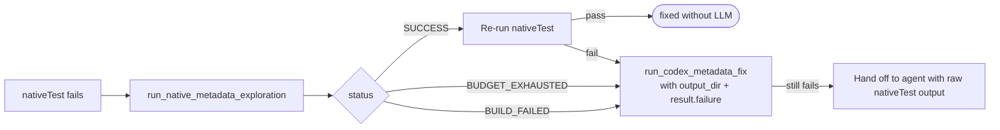

# fix-java-fails

> **See also:** [Architecture](architecture.md) ·
> [Dynamic-access workflow](../docs/dynamic-access-workflow.md) ·
> [Native metadata exploration phase](../docs/native-metadata-exploration.md) ·
> [Native test verification gate](../docs/native-test-verification.md)

## Problem

When a library version is bumped, tests can fail in two Java-specific ways:

- **Compilation failure**: `compileJava` or `compileTestJava` fails because APIs changed.
- **Runtime test failure**: compilation succeeds, but the Gradle `test` task fails at run time because of errors such as `NoSuchMethodError`, `ClassNotFoundException`, changed behavior, or new exceptions.

The existing `fix_javac_fail` workflow handles compilation failures. Runtime failures should use the same operational model, but with runtime-focused prompt wording, separate strategy names, separate metrics, and a separate PR label.

## Design

### Unified entry point

The preferred CLI is `ai_workflows/fix_java_fails.py`, with a required mutually exclusive mode flag:

```console
python3 ai_workflows/fix_java_fails.py \
  --javac \
  --coordinates <group:artifact:oldVersion> \
  --new-version <newVersion> \
  [--strategy-name NAME] \
  [--reachability-metadata-path /path/to/graalvm-reachability-metadata] \
  [--metrics-repo-path /path/to/metrics-storage] \
  [--docs-path /path/to/docs] \
  [-v]
```

```console
python3 ai_workflows/fix_java_fails.py \
  --java-run \
  --coordinates <group:artifact:oldVersion> \
  --new-version <newVersion> \
  [--strategy-name NAME] \
  [--reachability-metadata-path /path/to/graalvm-reachability-metadata] \
  [--metrics-repo-path /path/to/metrics-storage] \
  [--docs-path /path/to/docs] \
  [-v]
```

Defaults:

- `--javac`: `javac_iterative_with_coverage_sources_pi_gpt-5.4`
- `--java-run`: `java_run_iterative_with_coverage_sources_pi_gpt-5.4`

Compatibility entry points may remain:

- `ai_workflows/fix_java_javac_fail.py`

The compatibility scripts should preserve existing automation paths, but docs should point new usage to `fix_java_fails.py`.

### Relation between javac and java-run workflows

`java_run_iterative` and `javac_iterative` are thin registered specializations over a shared `JavaTestFixIterativeStrategy` implementation. Both workflows:

1. Run `./gradlew test -Pcoordinates=<library>` to collect failure output.
2. Render an initial prompt with source context and the raw Gradle output.
3. Send the prompt to the configured agent.
4. Loop by rerunning `./gradlew test`.
5. Treat `nativeTest` or no failed Gradle task as success.
6. Send subsequent failure output back to the agent until success or `max-test-iterations`.
7. Use the same finalization path to generate metadata, validate tests, collect stats, and commit.

The difference is workflow identity and prompt wording, not control flow:

- javac fixes uses compilation-failure wording and writes `fix_javac_fail.json`.
- java fixes runs uses runtime-failure wording and writes `fix_java_run_fail.json`.
- But these are resolved with prompts.
- Logs, task type, branch names, strategy names, and PR labels remain distinct

### Shared strategy implementation

We need unified workflow, because workflows are basically the same, only things is prompts that were changed. We should have type field in hte class so we can have disticntion between these for some  specialization.
Specializations provide only mode-specific constants:

- log prefix
- retry prompt title
- retry detail message
- whether to skip agent prompting if the initial test already reaches `nativeTest` or passes

This keeps the runtime and javac workflows behaviorally aligned.

### Shared orchestration

The common Java-fail orchestration lives in `ai_workflows/java_fail_workflow.py`. It owns:

- CLI parser construction for mode-specific compatibility scripts
- repository and metrics path resolution
- versioned test project copy/preparation
- metadata index and version directory setup
- source-context preparation
- strategy and agent initialization
- success finalization, rollback, and metrics writing

Mode-specific wrappers provide only a `JavaFailWorkflowConfig`.

### Orchestration script: `fix_java_run_fail.py`

Lives at `ai_workflows/fix_java_run_fail.py` as a compatibility entry point. It delegates to `java_fail_workflow.py` with runtime-fix configuration:

1. **Parse flags**: same CLI args as javac fix.
2. **Setup**: load strategy, resolve repo paths, set up GraalVM, chdir.
3. **Project preparation**: copy old version dir, update `gradle.properties`, create metadata dir, git checkpoint.
4. **Source context**: populate artifact URLs, download sources based on `source-context-types`.
5. **Test source layout**: resolve language and test source root.
6. **Strategy instantiation**: pass the same context as `fix_javac_fail`.
7. **Agent init**: use `task_type="fix-java-run-fail"`.
8. **Run workflow**: `strategy_obj.run(agent)`.
9. **Finalize**: same finalize, rollback, and metrics pattern.

`fix_java_fails.py --java-run` delegates to this implementation.

### Prompt template: `prompt_templates/fix-java-run/initial-with-sources.md`

```markdown
Task:
- Fix the runtime test failures for library version `{updated_library}`. Test was initially written for version `{old_version}`.
- The test compiles successfully but fails at run time against the new library version.

Source context:
{source_context_overview}

How to use the source context:
- Focus on source files for the classes explicitly named in the Gradle error output below.
- Look for API changes, including renamed methods, changed signatures, removed classes, changed behavior, or new exceptions that explain the runtime failures.
- Stop inspecting sources once you understand the cause of each failure. Then make the minimal edit.

Rules:
- Only edit files that are added to context. Modify `{build_gradle_file}` only if additional dependencies are required.
- Test that is fixed must maintain functional coverage. Never simplify the test to the point of triviality.
- Keep the test in `{test_language_display_name}` under `src/test/{test_source_dir_name}`.
- Follow idiomatic `{test_language_display_name}` coding conventions.
- Use only the provided library version and avoid all deprecated APIs.

Runtime error output:
{initial_error}
```

### Composite strategy support

The runtime strategy integrates with `IncreaseDynamicAccessCoverageStrategy` the same way `javac_iterative` does:

```json
{
  "name": "java_run_iterative_with_coverage_sources_pi_gpt-5.4",
  "workflow": "increase_dynamic_access_coverage",
  "primary-workflow": "java_run_iterative",
  "agent": "pi",
  "model": "oca/gpt-5.4",
  "prompts": {
    "initial": "prompt_templates/fix-java-run/initial-with-sources.md",
    "dynamic-access-iteration": "prompt_templates/dynamic_access/dynamic-access-iteration.md"
  },
  "parameters": {
    "max-test-iterations": 5,
    "max-iterations": 2,
    "max-class-test-iterations": 2,
    "source-context-types": ["main"]
  },
  "mcps": []
}
```

### Forge metadata integration

`forge_metadata.py` dispatches Java version-bump failures through the unified entry point:

- `--label fails-javac-compile` invokes `fix_java_fails.py --javac`.
- `--label fails-java-run` invokes `fix_java_fails.py --java-run`.
- `fails-java-run` is included in the recognized pipeline label set and `--label` choices.

Successful `fails-java-run` issues finalize with `git_scripts/make_pr_java_run_fix.py`.

### Git script

`git_scripts/make_pr_java_run_fix.py` mirrors the javac PR script:

- stages the versioned tests, metadata index, metadata version directory, and stats
- creates branch `ai/<gh-login>/fix-java-run-<group>-<artifact>-<newVersion>`
- includes generation stats, stats comparison, and a diff between old and new tests
- uses the `fixes-java-run-fail` PR label
- reads pending metrics and commits successful run metrics to `stats/<group>/<artifact>/<version>/execution-metrics.json`

### Metrics

Runtime fixes use the same metrics shape as javac fixes but write to `fix_java_run_fail.json` in the metrics directory.

`utility_scripts/metrics_writer.py` exposes `create_java_run_fix_run_metrics_output_json`, which reuses the javac fix metrics construction because the output contract is the same.

### Forge metadata

We need to wire these new changes with the forge_metadata.py and do_my_work scripts

### Integration with the native metadata exploration phase

When the runtime test failure occurs under `nativeTest` (rather than plain
JVM-mode `test`), the runtime fix workflow runs the
[Native Metadata Exploration phase](../docs/native-metadata-exploration.md)
as its **first corrective action**, before invoking the agent. This catches
the common case where the test is functionally correct but missing
reachability metadata for the new library version.



Rules:

- **Every exploration outcome routes through codex**, including
  `BUILD_FAILED`. A failed exploration may indicate a non-metadata code
  problem — for example, a test that does not compile under
  metadata-tracing flags, or a runtime crash unrelated to missing
  metadata. Codex receives the merged `output_dir` (possibly empty or
  partial) plus the `result.failure` diagnostics
  (`failed_task`, `failure_summary`, `failure_log_path`) per
  [docs/native-metadata-exploration.md §9](../docs/native-metadata-exploration.md).
- The agent is invoked only when codex fixup, given those inputs, still
  leaves `nativeTest` failing.
- Failures of plain `test` (compilation or JVM-mode runtime) bypass the
  exploration phase and use the existing prompt-driven flow described
  earlier in this document.
- The phase contract — inputs, outputs, statuses, output directory — is
  owned by the exploration spec. This section only specifies *when* the
  workflow calls it and *how* it routes the result.

### Terminal native-test verification gate

After the agent (or the codex/Pi cascade) produces its final edit, the
runtime fix workflow invokes the
[native test verification gate](../docs/native-test-verification.md) once
with `output_dir = tests/src/<group>/<artifact>/<version>/build/natively-collected/_global_/`
as the workflow's terminal success criterion. The gate iteratively re-runs
the trace loop and `./gradlew nativeTest` until the test passes or the
`max-native-test-verification-iterations` budget is exhausted. A `FAILED`
gate result aborts the workflow with `RUN_STATUS_FAILURE`; partial
recovery is not an acceptable terminal state. This is the same component
used by the [dynamic-access workflow](../docs/dynamic-access-workflow.md)
per-class gate, configured with a single global output directory instead
of a per-class one.
