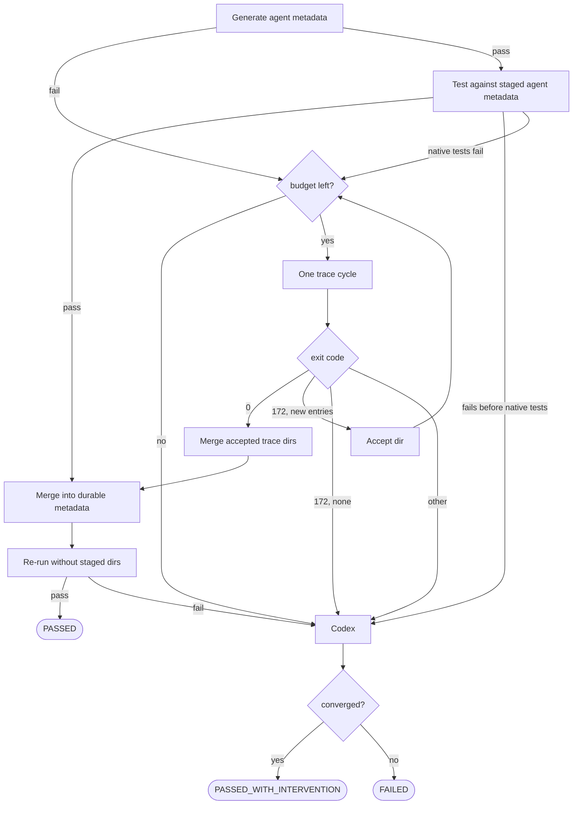

# FS-forge-functional-spec: Forge functional specification

This spec realizes the Forge direction set out in §GOAL-forge-direction, in
service of §GOAL-maximize-library-coverage and
§GOAL-shorten-issue-to-shipped-metadata.

## FS-forge-issue-resolution-goal: Forge issue resolution goal

The `forge/` directory automates the end-to-end resolution of supported GitHub
issue queues in the
[`oracle/graalvm-reachability-metadata`](https://github.com/oracle/graalvm-reachability-metadata)
repository (hereafter "the reachability repo"), so its supported-library surface
can grow faster than maintainers can investigate each request by hand
(§GRUND-forge-motivation). For a claimed issue, Forge composes LLM-based
code-generation agents with the reachability repo's own build, test,
metadata-generation, and reporting pipelines to generate or repair the library
tests and GraalVM reachability metadata the issue needs. A successful run
produces a verified `ai/**` branch with metrics and a durable publication
descriptor. Trusted GitHub Actions publisher code from the default branch then
creates the bot-authored pull request with enough context for maintainer review;
review and repository CI remain the final merge boundary.
This shortens the path described in §GOAL-shorten-issue-to-shipped-metadata.

A supported issue starts from a work label such as `library-new-request`,
`library-update-request`, `fails-javac-compile`, `fails-java-run`, or
`fails-native-image-run`. §FS-forge-scope enumerates the queues Forge resolves,
and §FS-forge-scope.1 records where the `fails-*` work comes from. Forge drains
each pipeline by priority tier rather than by scan batch: every `high-priority`
issue first, then every `priority` issue, then the remaining issues.

## FS-forge-scope: Supported issue queues

The project covers these supported issue-resolution queues
(§FS-forge-issue-resolution-goal), in service of
§GOAL-maximize-library-coverage.

1. **New library support** (`library-new-request`) — generate a JUnit (or
   Kotlin/Scala) test suite, produce reachability metadata, and open a PR for
   a previously unsupported library.
2. **Coverage improvement** — increase dynamic-access coverage of
   already-supported libraries (via the `library-update-request` pipeline).
3. **Code coverage improvement** — planned workflow that creates new tests for
   already-supported libraries and uses GraalVM PGO runtime profiles to broaden
   ordinary API and execution coverage beyond dynamic-access call coverage.
4. **Java compilation fixes** (`fails-javac-compile`) — repair test sources that
   no longer compile against a bumped library version.
5. **Java runtime fixes** (`fails-java-run`) — repair JVM-mode test
   failures that surface when raising a tested library to a new version.
6. **Native-image runtime fixes** (`fails-native-image-run`) — update
   reachability metadata so `nativeTest` passes against the new library
   version, using the native metadata exploration phase.

Successful fixes use the matching PR labels (`library-new-request`,
`library-update-request`, `fixes-javac-fail`, `fixes-java-run-fail`, or
`fixes-native-image-run-fail`) so review automation can validate the result
(§FS-automated-pr-review).

Out of scope: anything that does not produce reachability metadata or its
supporting tests for the reachability repo.

### 1. Origin of the `fails-*` queues

Every `fails-*` queue originates from a failed version update, not from a human
report. The reachability repo's scheduled library version compatibility
automation bulk-tests newer upstream versions of already-supported libraries; it
records the versions that pass in a single `library-bulk-update` PR and files one
`fails-*` tracking issue per `(library, version)` whose update failed, labeled by
the stage that broke (`fails-javac-compile`, `fails-java-run`,
`fails-native-image-build`, or `fails-native-image-run`). Forge claims those
issues; it never opens them. The producer's contract is the reachability repo's
Library version update automation (§root/FS-library-version-update-automation).

## FS-forge-glossary: Glossary

| Term | Definition |
| --- | --- |
| **Reachability metadata** | JSON describing reflection, JNI, resource, serialization, and proxy access for a library, consumed by GraalVM `native-image`. |
| **Reachability repo** | Local checkout or worktree of `oracle/graalvm-reachability-metadata`. The build and metadata-generation Gradle tasks run inside it. The parent checkout of `forge/` is used by default. |
| **Forge metrics directory** | The `forge/` subdirectory of the reachability checkout, used as the transient staging area for a run's in-flight metrics (`.pending_metrics.json`) until local finalization writes the publication descriptor. Durable per-library run metrics persist to `stats/<group>/<artifact>/<version>/execution-metrics.json` (§FS-forge-run-metrics). |
| **Forge publication descriptor** | Versioned, schema-validated JSON committed at `stats/<group>/<artifact>/<version>/forge-publication.json`. It is the durable, branch-controlled data handoff from locally verified Forge generation to the trusted Actions publisher (§GIT-publication-descriptor). |
| **Forge publication ID** | A run-unique identity derived before the publication commit and recorded in the descriptor. Chunked runs also record it and the unique head branch in their exhaust report so a later run can resolve the preceding PR without committing a GitHub-assigned PR number after publication (§GIT-chunked-linking). |
| **Forge Actions publisher** | Default-branch code triggered through a successful unprivileged Branch Ready run. It treats the feature branch as data, revalidates the exact head SHA and descriptor, renders the PR, and performs publication-related GitHub mutations with a short-lived GitHub App token (§GIT-actions-publication). |
| **Coordinate** | Maven coordinate of the target library, formatted `group:artifact:version`. |
| **Agent** | LLM-driven code editor (Codex or Pi) registered through [ai_workflows/agents/](../../ai_workflows/agents/). Each implements `send_prompt`, `run_test_command`, and `clear_context`; the concrete API and Pi adapter are documented by §AR-agent-api. |
| **Workflow driver** | Deterministic script in the `drivers/` subdirectory of [ai_workflows/](../../ai_workflows/) that prepares the working environment, directories, branch/context, strategy bundle, workflow engine, agent, and metrics for one claimed unit of work. The driver runs Forge plumbing; Codex or another LLM agent should not decide that setup during a generated run. Specified by §AR-forge-drivers. |
| **Workflow engine** | A registered state-machine-like workflow implementation among the core workflow objects in [ai_workflows/core/](../../ai_workflows/core/), such as `basic_iterative` or `dynamic_access_iterative`. The engine owns prompts, command execution, retries, transitions, and terminal status selection for one run. |
| **Predefined strategy** | Named configuration bundle in [strategies/predefined_strategies.json](../../strategies/predefined_strategies.json). It selects the workflow engine, agent backend, model, prompts, workflow parameters, optional MCPs, and optional persistent instructions. Selected via `--strategy-name`. |
| **Post-generation intervention** | The built-in recovery sequence the workflow base class runs when the post-iteration `./gradlew test` still fails during finalization. It is a fixed Codex-then-Pi lane, not a pluggable registry and not selected per strategy: a Codex metadata fix runs first (using the `fix-missing-reachability-metadata` skill, pinned to the run's GraalVM); only if that does not recover does Pi remove the offending failing tests as a last resort. When recovery makes the post-generation test pass, the run reports `SUCCESS_WITH_INTERVENTION_STATUS` and the intervention record (stage, intervention file, analysis) is saved for the run metrics and PR body. The base class runs this lane once per GraalVM test lane (current defaults and `future-defaults-all` on the latest GraalVM, plus current defaults on the GraalVM 25 toolchain). |
| **Human intervention** | A maintainer follow-up signal applied through the `human-intervention` issue or PR label when Forge has evidence that generated work, repository automation, or library execution semantics require human judgment. It is distinct from post-generation intervention, which is an automated recovery step. The policy is defined in §FS-human-intervention-policy. |
| **Dynamic access** | Reflection, JNI, resource access, serialization, or proxy use that GraalVM `native-image` cannot determine statically. |
| **Dynamic-access report** | JSON written by Gradle task `generateDynamicAccessCoverageReport` to `tests/src/<group>/<artifact>/<version>/build/reports/dynamic-access/dynamic-access-coverage.json`, listing classes and per-class call sites that require dynamic-access metadata, marked covered/uncovered. |
| **Dynamic-access exhaust report** | Durable coordinate-scoped JSON state for chunked dynamic-access work. It records the coordinate, issue number, class threshold, completed/skipped/exhausted/failed classes, and latest publication ID/branch. It is stored with the target test suite so orchestration can find it from the coordinate. It does not predefine chunks; each resume regenerates the report and filters processed classes. Legacy PR-number/commit fields remain readable during migration. Specified by §WF-dynamic-access-exhaust-report. |
| **Chunked dynamic-access workflow** | Dynamic-access generation mode for oversized `library-new-request` issues and `library-update-request` issues routed to dynamic-access coverage improvement. `forge_metadata.py` owns the class threshold decision and passes the current chunk size to the workflow. The workflow processes at most that many uncovered classes, publishes that chunk, then resumes after the chunk PR merges. PR linking rules are in §WF-chunked-dynamic-access-pr-linking. |
| **Source context** | Read-only files supplied to the agent. Types: `main` (library source), `test` (upstream tests), `documentation` (Javadoc). Selected by the strategy parameter `source-context-types`. |
| **Library update target** | The metadata and test directories selected for a `library-update-request` coordinate (§AR-forge-driver-queues.2). Resolution records the requested coordinate, match type (`tested-version`, `metadata-version`, `default-for`, or `new-version`), matched index entry, resolved metadata version, resolved test version, and edit directories. |

## FS-forge-requirements: Requirement gates

Forge validates two kinds of requirement, split by the question each answers.
**Host requirements** (§FS-forge-host-requirements) are what the machine must
provide before any work is claimed — tools, credentials, Java lanes, filesystem,
network, environment, and the repository checkouts Forge runs in. They are the
same for every issue. **Run requirements** (§FS-forge-run-requirements) are what
one work cycle must resolve for itself — the strategy it will run, the issue it
may claim, the form of that issue, and the run context a driver is handed. Each
is a gate, and they run in that order (§AR-forge-workflow-pipeline).

## FS-forge-host-requirements: Host requirements

§GOAL-shorten-issue-to-shipped-metadata §root/PRCPL-verify-inputs

Before Forge performs a self-update, queries queue state, claims an issue,
creates a review worktree, or invokes an agent, it must validate every host
capability the invoked mode needs, and it must do so without invoking a model or
mutating GitHub. This section is the complete list: what `forge_metadata.py`
needs in order to work is what the host requirements gate checks, and the
requirement has exactly one definition, so a repeated check elsewhere resolves
to the same rule rather than a second one.

The host must provide:

- **Executables on `PATH`**: the selected Python interpreter, `git`, the GitHub
  CLI, Pi, Codex, the Docker CLI, the pinned `grype` release, and the selected
  repository's Gradle wrapper.
- **A usable GitHub account**: the CLI authenticated, `Contents`, `Issues`, and
  `Pull requests` write on the repository, and `Projects` write on the tracked
  project board — read access alone is not enough, because Forge assigns and
  labels issues, comments, pushes generated branches, submits reviews, and
  merges eligible pull requests. The local process never holds the Forge
  publisher App credentials: it neither opens pull requests nor creates
  publication follow-up issues.
- **Agents that are usable, not merely installed**: Pi authenticated against its
  provider with unattended tool approval, Codex configured for unattended runs,
  and a writable state directory for each.
- **Every Java lane**, each pointing at a GraalVM distribution that provides
  Native Image and contains the reachability-metadata schema the checked-out
  repository requires: `GRAALVM_HOME` at the latest published GraalVM GA
  release, `GRAALVM_HOME_LATEST_EA` at the newest published Oracle GraalVM EA
  build, and `GRAALVM_HOME_25_0` at the repository-pinned 25.0.x release in
  `graalvm-versions.json`. The operator updates the pinned value deliberately;
  GA and EA freshness are resolved from their authoritative release metadata on
  every run. `GRAALVM_HOME` and `JAVA_HOME` are aligned to one distribution, and
  a review-only host needs a working JDK on `JAVA_HOME` instead of the lanes.
  Every agent repair step runs against the exact distribution whose Gradle or
  Native Image failure triggered it — the selected `GRAALVM_HOME`, `JAVA_HOME`,
  and full `native-image --version` output go into the agent's instructions and
  its environment — and Forge fails rather than reproducing or verifying against
  a different installation.
- **Access to the Docker daemon**, not just the client.
- **Filesystem write access** to the Forge checkout, the `.git` directory of
  every checkout the run writes branches into, `local_repositories`, and
  temporary Gradle state.
- **Network reachability** on 443 to GitHub, the agent provider, the Gradle
  distribution and plugin services, Maven Central, and the Docker registry and
  its auth endpoint. Reachability is checked over the route Forge's own tools
  take — directly, or through the proxy the environment configures for HTTPS —
  so a proxied host is not reported as offline.
- **Git transport** to the monitored branch from every checkout the run uses.
- **A complete reachability repository** for anything that runs its Gradle
  tasks: testing, dynamic-access reporting, native metadata exploration,
  metadata generation, and final verification must run inside a whole
  `graalvm-reachability-metadata` checkout or worktree — repository root,
  `gradlew`, Gradle build logic, shared test infrastructure, `metadata/`,
  `tests/`, and `forge/` when the run records metrics, logs, or resumable
  state — never in a copied per-library directory, an extracted dependency
  artifact, or any partial tree. Isolated worktrees, resumable artifacts, and
  archives must each preserve that whole context; missing repository context is
  a hard setup failure.

Two path sets are validated for what each owns. Forge-owned paths — the Forge
checkout, its `local_repositories`, the pinned GraalVM configuration, and the
self-update remote — always resolve from the checkout that contains Forge.
Repository-owned paths — the Gradle wrapper, the Git metadata generated branches
are written into, and the origin remote they are pushed to — resolve from the
repository the run selected, which may be a different checkout. The selected
repository is therefore resolved before the gate runs, so a run against another
checkout can neither pass on a broken target nor be rejected because an
unrelated parent checkout is broken.

Requirements are scoped to what the invoked mode actually does: a review-only
run does not need the issue-work Java lanes, Codex, or Docker; an issue run
needs everything its enabled queues select; a fixture-testing run needs no live
GitHub access, because it mutates no GitHub state. Only the release-version
comparison for the Java lanes is relaxable, and relaxing it never waives Native
Image or the reachability-metadata schema.

The gate must always print an operator-facing report. Each entry names the
capability, whether the invoked mode requires it, the exact executable,
environment variable, path, host, or permission checked, and — on failure —
exactly one concrete `Fix:` instruction, with current and required values shown
explicitly and command output reduced to the relevant fact.

The gate runs at the start of every work-starting `forge_metadata.py`
invocation, not only from the worker loop, and because the worker re-execs
itself between cycles, every new worker process revalidates the host before
doing more work. Any failed required check stops the run with a non-zero exit
before the first work cycle. Capabilities the mode does not need are reported as
not required, a relaxed version mismatch does not fail startup, and commands
that start no work — stop, resume, help, cache maintenance — do not run the gate
at all.

## FS-forge-run-requirements: Run requirements

A satisfied host says nothing about whether a given cycle may do work. Before a
run reaches a workflow driver, four things must be resolved and verified, each
before the side effect it protects, and each by deterministic code rather than
by an agent (§root/PRCPL-prefer-algorithmic, §root/PRCPL-verify-inputs). 
A run requirement that cannot be satisfied must fail where it is checked, naming what was missing or ambiguous,
and must leave GitHub in the state it found: a rejection after a claim releases
the claim and returns the issue to `Todo` rather than failing the issue.

### 1. Strategy and model

Every enabled queue must resolve its configured strategy name against the
registry before scanning begins, and a strategy bundle must be rejected on load
unless it names a model and carries the prompts and parameters its workflow
engine declares as required (§STRAT-forge-predefined-strategy-contract). An
unresolvable strategy or model is a worker configuration error: the worker must
exit before it scans a queue, not fail one issue at a time.

### 2. Issue claimability

Claiming is exclusive, and the decision must be made against live GitHub state
rather than the scan results that led to it (§ORCH-forge-orchestration-spec).
The issue payload is re-read at claim time and must still be open, still carry
the queue label, be unassigned or assigned only to the authenticated user, carry
no open blockers, and sit in project status `Todo`. A `resumable` issue
additionally requires a valid continuation marker on a preserved branch
(§FS-forge-run-continuation), and a `chunked-dynamic-access` issue requires its
exhaust report (§WF-dynamic-access-exhaust-report). Only once every condition
holds may the issue be assigned and moved to `In Progress`.

### 3. Issue form

The queue label decides the workflow, so the issue must be unambiguous before a
driver starts (§AR-forge-driver-queues). The title must resolve to Maven
coordinates and those coordinates must resolve to a published artifact; a
`fails-*` issue must resolve a current `latest` metadata version for the
coordinate and must request a version strictly above it; a
`library-update-request` must resolve to exactly one driver, recorded so
publication reports the workflow that actually ran; and an issue must carry
exactly one workflow label. The last three are contract that no code enforces
today, which §ROADMAP-forge-issue-form-enforcement closes.

**Coordinates resolve when the artifact is fetchable.** A title that parses as
`group:artifact:version` has satisfied a regular expression, not the
requirement. The run needs an artifact the build can actually resolve, so the
gate confirms the coordinate is published in one of the repositories the
harness resolves against — Maven Central, then the Confluent fallback
(§root/AR-build-infrastructure.1). A typo in a group, an artifact that was
never published, or a version that does not exist upstream is decidable from
the repository's own layout, so it is decided here rather than surfacing later
as a Gradle resolution error inside a run that already holds a claim, a project
transition, and a worktree (§root/PRCPL-verify-inputs). Only the artifact's
existence is checked — its content is a driver concern, and Native Image
eligibility remains where it is (§AR-forge-driver-queues).

**A rejection is reported on the issue.** Every rule above is decided from the
issue payload and the repository, so when one fails the gate knows exactly
which rule failed and what value failed it. That is what the reporter needs and
what a worker log does not give them: an issue rejected in silence is rescanned
and re-rejected every cycle, and nothing about it changes because nobody was
told. The rejection therefore posts one predefined comment naming the failed
rule, quoting the offending value, and stating what the issue must carry
instead. The comment is per (rule, offending value), so a rescan of an
unchanged issue posts nothing and an edited title is judged afresh.

A form rejection is not a workflow failure: it is an input defect outside
Forge's generation boundary, so it carries no `human-intervention` label and
preserves no branch (§FS-human-intervention-policy). Like every requirement
here it leaves GitHub as it found it — a rejection reached after a claim
releases the claim and returns the issue to `Todo`.

### 4. Run context

A driver must be handed a complete run context and must not resolve, clone, or
re-derive any part of it: the resolved coordinates, validated strategy,
isolated reachability worktree, scratch metrics repository, setup-evidence
directory, issue context, one GraalVM environment pinned for the whole run, and
the continuation marker (§FS-forge-run-continuation). The driver owns normal
and neural setup inside that context, including the persisted library
preparation result; it does not own queue policy or repository resolution. The
gap between this requirement and the current implementation is
§ROADMAP-forge-dispatcher-owned-run-preconditions.

## FS-forge-outputs: Run outputs

- **Per-run metrics record** persisted to
  `stats/<group>/<artifact>/<version>/execution-metrics.json`, as required by
  §FS-forge-run-metrics.
- **Durable session and generation logs** for every agent session,
  generation attempt, deterministic Gradle command, metadata fixup, native
  trace cycle, and local verification gate that contributes to the run, as
  required by §FS-durable-generation-logs.
- **Generated tests + metadata + index.json** committed on a per-run feature
  branch in the reachability repo, named `ai/<authenticated-login>/<suffix>`
  where `<suffix>` is workflow-specific and encodes the coordinate (e.g.
  `add-lib-support-<group>-<artifact>-<version>` for new-library support,
  `improve-coverage-…`, `fix-javac-…`, `fix-java-run-…`,
  `fix-native-image-run-…`, `not-for-native-image-…`). Publication branches are
  unique per publication ID and are pushed directly to
  `oracle/graalvm-reachability-metadata` so the repository's `push` workflow can
  observe them.
- **Pull request** created asynchronously by the trusted Forge Actions
  publisher after Branch Ready accepts the exact pushed SHA.

### FS-forge-run-output-legibility: Legible run output

The run's own output is an output of the run. Whoever is running generation
watches it live, so it must answer two questions at a glance: which concrete
step the run is in right now, and — when the run stops — what exactly failed.
Clarity is the requirement, not volume: a wall of text that has to be read
backwards to locate the current step fails this section as surely as silence
does. This is the live counterpart of the durable record required by
§FS-durable-generation-logs, and it keeps the loop short as called for by
§GOAL-shorten-issue-to-shipped-metadata.

1. **Every step announces itself once.** On entering a pipeline step, the run
   prints one line naming the phase and the step (`setup/neural_setup`,
   `explore/native_trace_gate`, `finalization/local_ci_check`, …) and the
   operand it is working on. The reader must never have to infer the current
   step from incidental output such as a Gradle banner or an agent's prose.
2. **Every failure names its location and its cause.** A failing run states the
   phase, the step, the operand, and the concrete reason it stopped, in that
   order, before any surrounding detail — the same pair required everywhere a
   failure surfaces by §ROADMAP-forge-failure-locates-phase-and-step. A failure
   reported only as a status, a stack trace, or a generic message does not
   satisfy this requirement.
3. **The inside of a step stays quiet.** Work within a step is reported by
   outcome, not by narration: one line per completed unit (a generated class, a
   passed gate, a trace cycle) and nothing per intermediate operation. Repeated
   or retried work says that it is a retry and which attempt it is, so a
   stalled loop is visible as a loop.
4. **Detail lives in the logs, not in the terminal.** Full agent conversations,
   Gradle output, and native-image output are written to the durable logs; the
   run output prints the path to the relevant log instead of reproducing it, so
   a maintainer can escalate from the summary to the evidence in one step
   (§FS-durable-generation-logs).

## FS-forge-run-metrics: Per-run metrics record
§GOAL-minimize-generation-cost

Every run must persist a per-library metrics record to
`stats/<group>/<artifact>/<version>/execution-metrics.json` so cost, token,
coverage, and status evidence stays attached to the library version it describes
(§GOAL-maximize-library-coverage). During a run, in-flight metrics are staged
transiently in the Forge metrics directory as `.pending_metrics.json` and
consumed while constructing the durable publication descriptor; they are not a
durable output. Benchmark-mode runs
instead record durable, schema-validated metrics under
`benchmarks/benchmark_results/` (§BENCH-forge-generation-benchmarking.4).
Run metrics may identify the generated metadata artifact, but must not record a
single test-file artifact: the version-controlled test tree and pull-request
diff are the authoritative set of test files for the run.
When a failed run is preserved for continuation, `.pending_metrics.json` carries
the accumulated token, cached-token, cost, and iteration counters for the
preserved work. Any later resumed run for the same library must add its current
counters to the pending counters before writing durable metrics or publication
metrics, so repeated continuation attempts do not reset usage accounting.

## FS-durable-generation-logs: Durable generation and session logs

Every Forge session and generation step must be logged and saved to a stable
path because durable logs are the primary debugging surface for generated work.
This includes agent prompts and responses, session or thread identifiers,
persistent-instruction state, Gradle command output, metadata-fix output,
native tracing output, post-generation intervention output, and local
verification output.

Logs must be scoped by task and coordinate where possible, and the workflow
must print or record the log path so a maintainer can inspect the exact
conversation or command that produced a generated artifact; the live run output
that points at those paths is specified by §FS-forge-run-output-legibility.
A workflow must not rely on transient terminal output as the only record of a
generation step.
If a run fails or times out, the saved logs are part of the diagnostic artifact
set that allows maintainers or a later Forge run to continue from evidence,
keeping the loop short as called for by §GOAL-shorten-issue-to-shipped-metadata.

## FS-forge-publication-readiness: Publication readiness

Generation ending is not the same as a run being publishable. Everything a run
must still satisfy between a finished working tree and a merged pull request is
grounded here: the verification it must pass (§FS-local-ci-equivalent-verification),
the tested-version split its result must record
(§FS-library-update-tested-version-split), the review it receives before the
push (§FS-local-branch-review), when the result needs maintainer judgment rather
than another automated attempt (§FS-human-intervention-policy), and the
automated review the published PR receives (§FS-automated-pr-review).

## FS-local-ci-equivalent-verification: Local pre-publication verification

Every Forge task must pass local verification before it is allowed to produce a
PR-eligible result. Verification is split into two tiers along the boundary
between what a single-library generation can settle on its own and what it
cannot: a library-scoped tier that runs during generation and finalization
(§FS-local-ci-equivalent-verification.1), and a cross-cutting gate that runs
before publication (§FS-local-ci-equivalent-verification.2).

Local verification runs must be non-privileged in both tiers. Forge must not
invoke `sudo`, must not run scripts that invoke `sudo`, and must not prompt for
an administrator password during local automation. CI-only host mutation steps
that require elevated privileges, such as changing system Docker networking,
must be replaced by no-sudo local gates or omitted from local execution. A
command that would require `sudo` is a local verification failure, not an
interactive prompt.

Forge must record local verification commands and outcomes in run metrics and
the publication descriptor so the trusted renderer includes them in the PR
description. A task must not push a publication descriptor, mark a project item
`Done`, return `RUN_STATUS_SUCCESS`, return `SUCCESS_WITH_INTERVENTION_STATUS`,
or return `RUN_STATUS_CHUNK_READY` until both tiers have passed. If Forge cannot
complete either tier, the workflow must return `RUN_STATUS_FAILURE` and preserve
enough diagnostics for human follow-up.

### 1. Generation and finalization

Library-scoped correctness is established during generation and finalization,
because a single-library generation owns and can fully settle these checks.
Forge runs the generated tests for the coordinate under the CI native-image
surface: current GraalVM defaults and the `future-defaults-all` mode on the
latest GraalVM, plus current defaults on the GraalVM 25 toolchain (selected by
`GRAALVM_HOME_25_0`). Each native lane may run a bounded metadata/intervention
fixup and retry, so a regression that only appears under future defaults or on
GraalVM 25 is caught before publication. Finalization then validates the
coordinate's metadata with `checkMetadataFiles`, derives missing
`allowed-packages`, applies and checks style, regenerates library stats, and
rejects legacy test-only Native Image configuration: if uncommitted or changed
`META-INF/native-image` test configuration files appear under the generated test
sources, the run fails rather than publishing them, because that config form is
no longer accepted and the reachability metadata belongs in the coordinate's
`metadata/` directory.

### 2. Pre-publication gate

Before a task may produce a PR-eligible result, Forge must also pass a
pre-publication gate. This tier exists because the generated branch is rebased
onto the current `master` before publication, and some checks can then fail for
reasons no single-library generation could have settled: they depend on
repository state that only exists once the branch sits on top of the latest
`master`. An index-file bucket that another merged PR has since changed, a newly
flagged Docker image, or a stray edit outside the coordinate's library scope can
break the whole PR even though the generated metadata and tests are themselves
valid. The gate therefore runs exactly the post-rebase, cross-cutting checks:
index-file validation (`validateIndexFiles`, an aggregate over the rebased
`master` state), Docker-image vulnerability scanning when allowed-image files
change, and the human-intervention classification that detects changes outside
the coordinate's library scope.

The gate intentionally does not re-run the library-scoped checks that
finalization (§FS-local-ci-equivalent-verification.1) already established, and by
default it does not re-run the native test matrix or the Spring AOT smoke tests,
which the generation lanes and repository CI cover. Forge must, however, expose
an opt-in full-reproduction option (`reproduce_full_ci`) for operators and
programmatic callers that need to reproduce the expensive per-PR CI surface
locally: when enabled, the gate additionally expands the changed-metadata native
test matrix, pre-pulls Docker images for coordinates that declare them, runs the
generated tests under the CI native-image mode matrix, and runs Spring AOT smoke
verification when metadata changes affect Spring AOT projects.

If the gate fails, Forge must run one bounded agent repair before the run is
handed off, on the same terms as every other agent repair in the pipeline: the
agent is reached only after a check has failed, is given that check's records as
its evidence, gets one attempt, and the gate then re-runs. The repair may touch
generated library-scoped files, or shared repository files when the failure is
caused by the repository itself. The outcome is decided by the deterministic
re-run and never by the agent's account of what it repaired
(§root/PRCPL-verify-inputs); a re-run that still fails is a handoff under
§FS-human-intervention-policy. A finding from the pre-push review is not a
failed check and does not reach this repair; §FS-local-branch-review states what
answers it, and re-runs this gate when it has. After the gate passes, Forge must
algorithmically compare the final PR diff with the expected library-scoped
paths. If any shared repository file changed, the PR must be labeled
`human-intervention` and the verification metrics and PR description must list
the repository-level paths that require maintainer review, following
§FS-human-intervention-policy.

## FS-native-test-verification-gate: Native test verification gate

Metadata production for a coordinate begins with an *approximation*. The JVM
`native-image-agent`, and any metadata an agent wrote by hand, record only the
reflection, resource, proxy, and serialization accesses observed while the test
suite runs on HotSpot. Two classes of access slip past that: accesses the suite
never exercised on HotSpot, and accesses whose reachability differs only under
closed-world native compilation. Both surface as native test failures *after*
metadata generation reported success — the agent can fail to produce the metadata
the native image actually needs.

The gate closes those gaps with **runtime truth** rather than more inference. It
runs a real native image with metadata tracing enabled, records what the
execution actually touches, and re-supplies it until the binary stops missing
metadata. It is what proves a coordinate's test binary passes on Native Image,
and every workflow ends on it (§WF-forge-workflow-engine.2,
§WF-native-test-verification-callers). Native Image must always work, so `FAILED`
is a hard error: the caller returns a failure status and resets its branch to its
checkpoint.

### 1. Observe, record, rebuild

Two native-image behaviors cooperate in a single execution. **Exact reachability
metadata with exit-on-miss** makes the image treat any access not backed by
supplied metadata as a hard miss rather than silently registering it: the binary
exits `ExitStatus.MISSING_METADATA` (172) and prints the exact missing entry the
instant it hits one. **Metadata tracing support** makes that same execution write
what it observed into a per-cycle trace directory.

So one run both detects a miss and records it. Feeding that directory into the
next build makes the next cycle aware of the previously missed access. Iterating
walks the metadata from the agent's approximation to the exact set the image
requires; exit `0` means nothing missed.

Recovery is therefore ordered: **JVM agent, then native tracing, then Codex.**
Tracing must not run before the agent step. Only when the loop still cannot make
the binary pass does the residual failure go to Codex, because at that point it
is evidence of a code or test defect rather than a metadata gap. Pi is never
invoked — its role elsewhere is to remove failing tests, exactly the wrong move
when the failure is a real defect that must surface.

### 2. Inputs and budget

The caller supplies the coordinate, the reachability repo path, and an absolute
staging root namespaced per class for the per-class caller and per coordinate
otherwise. Agent metadata is staged under `agent` and merged trace metadata under
`trace`; durable repository metadata is written only after the final merge
succeeds and the durable re-run passes.

Condition packages, when not supplied, are derived from the coordinate's
`user-code-filter.json` after the agent step has had a chance to refresh it,
excluding obvious generated-test packages, and fall back to the coordinate's
group. They follow the library's code, not its Maven coordinate: Maven groups are
frequently not Java package roots — an `org.apache.tomcat.embed` artifact executes
`org.apache.catalina`, `org.apache.coyote`, and `org.apache.tomcat` code — and
tracing needs a condition class that is actually on the access stack before the
access occurs.

The outer budget is the strategy parameter
`max-native-test-verification-iterations`, default 40
(§STRAT-predefined-strategy-parameter-families). Convergence is expected within a
handful of cycles; the default is a soft cap, not a target, and each cycle
rebuilds the image, so wall-clock cost is dominated by build time. A per-cycle
timeout, default 30 minutes, caps the preflight test invocation and each trace
cycle; a timeout is treated as a non-zero exit.

### 3. The loop

The staging root and its per-cycle runs directory are reset at the start of every
invocation, so no stale entry leaks across runs.

The agent step runs first, always. If it fails, tracing starts with no accepted
trace directories. If it succeeds, the coordinate is tested against the staged
agent metadata; a failure *before* the native tests is a code or test problem and
goes straight to Codex, and a native-test failure enters the trace loop.

**A pass must survive finalization.** When the coordinate passes against staged
metadata, the gate merges it into durable repository metadata and re-runs the
tests *without* staged directories. Only that durable re-run returns `PASSED`;
otherwise the finalized metadata goes to Codex. This catches merge-time condition
invalidation, where raw staged metadata passes but the merged result leaves an
access behind an unsatisfied condition. A trace-backed pass takes the same route:
merge accepted trace directories, merge into durable metadata, re-run.

Each trace cycle is one Gradle invocation, rebuilding with every accepted
directory so far, and routes on the binary's exit code:

| Exit | Meaning | Action |
| --- | --- | --- |
| `0` | accumulated metadata and the code under test are sufficient | merge, finalize, return `PASSED` |
| `172`, new entries | the cycle captured a missing access | accept the directory, continue |
| `172`, no new entries | tracing stalled: the run reported a miss it did not record | open a Native Image tracing ticket, route to Codex |
| other non-zero | the code is broken in a way more metadata cannot fix | route to Codex |

A `172` with no new entries is a Native Image tracing defect, not a library
metadata gap — the run already proved the access happens and named it. The gate
prints accumulated progress and the failure-log tail so the defect is reproducible
upstream, then falls back so the run still makes progress.

**Inactive conditions are too-late conditions.** When GraalVM reports that
metadata for an access exists but is inactive because its runtime conditions were
not satisfied, the repair must move or duplicate that metadata under a condition
reached *before* the access — usually inferred from the library frame performing
it. Reusing the unsatisfied condition is invalid: it preserves the same timing
failure.

The result carries the status (`PASSED`, `PASSED_WITH_INTERVENTION`, or
`FAILED`), the staging root, the cycles consumed, the ordered trace directories
that produced 172, at most one intervention record, and the last relevant Gradle
log path with the binary's parsed exit code — the log path is **required** when
the status is `FAILED`, and callers surface it in run metrics and the PR body
(§FS-forge-run-metrics).

### 4. Codex, and the one carve-out

Codex is terminal when invoked. It has full repository write access through the
`fix-missing-reachability-metadata` skill, validates its own work, and the gate
does not re-verify or re-run a trace cycle afterwards — that would produce a
Codex/verify ping-pong on a real code defect. Its exit decides between
`PASSED_WITH_INTERVENTION` and `FAILED`.

Everything reaching Codex — exhausted budget (reason `metadata-gap-exhausted`),
stalled progress, trace timeouts, non-172 failures — arrives with a reproduction
command including the accepted trace directories. The Codex process and its
instructions must pin the GraalVM and Java homes and the full native-image version
to the exact distribution the failed command used, and must fail rather than
reproduce or verify against a different installation. Accumulated directories are
not discarded before Codex runs; its fixes are additive.

**Final merge failures are the only carve-out.** If the trace-output merge or the
final durable merge fails, the gate returns `FAILED` directly without invoking
Codex. These are infrastructure problems downstream of a successful validation
path — a merge task, a filesystem write, malformed metadata input — and Codex
cannot repair the metadata pipeline itself. Every other failure mode routes
through Codex first.

### 5. Gradle task contract

Tracing shells out **only** to the Gradle wrapper; it must never invoke
`native-image` or `native-image-utils` directly. Rebuilding inside the loop is the
point: metadata collected by an earlier pass unlocks code paths only later builds
reach. The reachability repo must provide three tasks (§root/TCK-test-harness);
which flags they pass and where they put the binary is a Gradle-side concern.

| Task | Properties | Contract |
| --- | --- | --- |
| `nativeTraceImage` | `-Pcoordinates` (required), `-PmetadataConfigDirs` (optional, → `-H:ConfigurationFileDirectories`) | Adds `-H:+MetadataTracingSupport`. Produces a binary at a path derivable from the coordinate alone. Non-zero exit is a build failure. |
| `runNativeTraceImage` | `-Pcoordinates`, `-PtraceMetadataPath` (→ `-XX:TraceMetadata=path=…`, fresh per cycle), `-PtraceMetadataConditionPackages` (→ `-XX:TraceMetadataConditionPackages`) all required; `-PmetadataConfigDirs` optional | Adds `-H:+MetadataTracingSupport` so the tracer writes at runtime, *and* `--exact-reachability-metadata` with `-H:MissingRegistrationReportingMode=Exit` so the reporter exits 172 on a miss. No caller-supplied program arguments. Runs with `ignoreExitValue=true`; the gate recovers the real code from Gradle's `finished with non-zero exit value N` line. |
| `mergeNativeTraceMetadata` | `-PinputDirs`, `-PoutputDir` (contents replaced) | Wraps `native-image-utils generate` and is the **only** point at which that tool is invoked. |

**The tracer must record whatever the reporter reports missing.** When the
reporter prints a missing entry, the same invocation must add the equivalent entry
to the directory named by `-PtraceMetadataPath`, with the metadata kind, condition
package, and target identity matching what the merge later consumes — otherwise
the loop has not produced a trustworthy runtime-observed signal and the gate falls
back rather than converging.

Toolchain configuration — GraalVM home, Java home, the native-image binary,
`native-image-utils` — is the reachability repo's responsibility; the gate does
not export, override, or check it beyond what Gradle requires. All three tasks
must accept `--no-daemon` and be idempotent across invocations on the same
coordinate, so a rerun is possible after the gate exits whatever its status.

The gate is composed from these tasks and owns no domain logic of its own. It
must not depend on any workflow implementation or on the post-generation
intervention lane, so that every caller gets identical behavior.

## FS-local-branch-review: Local pre-push branch review

Every generated branch must be reviewed before it is pushed, and not only after
it has become a pull request (§FS-automated-pr-review). The pre-push review is
the cheaper of the two: the working tree that generation verified is still on
disk, the local gate records still exist, and the branch can still be corrected
without a maintainer's queue being involved. Planned, not implemented
(§ROADMAP-forge-local-branch-review).

**Placement.** The review runs inside publication, after the pre-publication
gate of §FS-local-ci-equivalent-verification.2 has passed and the descriptor
input has resolved, and before the descriptor is written. It therefore judges
`base_ref..HEAD` — the eventual pull-request diff minus the descriptor commit —
with the local evidence the post-push reviewer never sees: the gate records and
the resolved render statistics.

**Isolation and rules.** The review must run cold: a worktree detached at the
verified commit, in a session carrying no part of the generation transcript. A
review that shares context with the run that produced the branch inherits the
justifications that run already accepted, and its verdict then carries no
information. It applies the same review rules the post-push reviewer applies,
selected by the run's `task_type` so that one rule set governs both reviews, and
the same blocking discipline: a finding is a concrete violation of an enumerated
rule, never a self-formed judgment about test quality.

**Outcomes.** The review has exactly three outcomes and must never fail the run:
the branch is approved; a finding is repaired; or a finding the reviewer cannot
repair publishes flagged for a maintainer under §FS-human-intervention-policy.
Publication proceeds in all three — a review must never be able to withhold work
that verification already passed. A reviewer that cannot be reached at all —
failed authentication, a non-zero exit, a timeout, or a verdict Forge cannot
read — is the third outcome and not an error: an outage must cost one labeled
pull request, never a stalled queue.

**A finding is answered by the reviewer.** A review finding is not a failed
deterministic check, and it must not be routed to the bounded agent repair of
§FS-local-ci-equivalent-verification.2: nothing can re-run to confirm that a rule
violation is gone, so the only party that can answer a finding is the reviewer
that formed it. On a finding the reviewer must both record it and, when it can,
correct it in the worktree in the same pass.

**Findings record.** Every finding must be appended to the tracked
`forge/FINDINGS.md`, including one the reviewer went on to fix and one it could
not fix. A defect is only legible as a recurrence if the resolved instances were
written down too. Forge renders each entry from a title and a body the reviewer
supplies, so the file's shape cannot drift across runs, and a reviewer that is
unavailable takes a fixed title, whose recurrence measures the outage. Because
`forge/FINDINGS.md` lies outside every library-scoped path, the diff
classification of §FS-local-ci-equivalent-verification.2 must treat it as
expected publication output; otherwise a run that re-runs the gate after writing
it would report repository-level changes that did not happen.

**What the reviewer returns.** The reviewer's output is a single structured
verdict written to a path Forge supplies, and it is the only channel by which
its judgment reaches the run. It must carry the decision, a review comment
stating what was checked and concluded, the finding as a reusable title and a
body, and — when the reviewer corrected the finding — a fix note describing what
it changed and why. All five are the reviewer's own: the decision is a judgment
against the review rules, and the fix note describes an edit only the reviewer
made, so Forge must record both as returned and must not recompute or overwrite
either. A verdict that is missing, unreadable, or carries no decision is the
degraded case below, not a default.

**What Forge derives.** Forge owns everything downstream of that verdict. It
renders the `forge/FINDINGS.md` entry from the returned title and body rather
than letting the reviewer write the file, so the record's shape cannot drift
across runs. It stages and commits the changed paths itself, so a repair has one
form. And it decides from the paths changed against the verified commit, less
`forge/FINDINGS.md`, whether finalization and the gate must run again: a changed
tree must be re-run over, an unchanged one must not be, because re-running the
gates over a tree that already passed them spends native-image compilation on
nothing. That is a question about the tree, not about the verdict — it selects
which steps run, and never edits what the reviewer decided.

**Finalization and the gate run again.** A repaired tree must pass finalization
(§FS-local-ci-equivalent-verification.1) and the pre-publication gate
(§FS-local-ci-equivalent-verification.2) again before it is pushed; nothing may
be pushed that the gates have not passed over, and a review repair can break
either tier. Both are deterministic checks, so a failure of either — not the
finding — is what earns one bounded agent repair on the terms
§FS-local-ci-equivalent-verification.2 sets out. A repaired tree that still fails
either must be reset to the verified pre-repair commit — the tree the gate
cleared before the review ran — and that tree is what publishes: a review finding
must not destroy an otherwise publishable run. The reset discards only what the
review wrote to gate-covered paths. The findings entry survives it and is
committed on top of the restored tree, and so does the verdict, unedited: the
reviewer judged and repaired in good faith, and a reset does not make its
decision wrong. What Forge adds is its own fact — that the repair was reverted,
and which step it broke — recorded beside the verdict, and the run's verification
record must describe the restored tree rather than the discarded one. That fact
is what flags the branch, because the tree being published is no longer the one
the reviewer approved; the human-intervention signal is therefore a reverted
repair or a decision that was not an approval, and never a rewriting of the
latter into the former.

**Where the review is kept.** The review is an agent session and is logged like
every other one (§FS-durable-generation-logs): the prompt, the response, and the
repair pass that follows a finding must be written to the run's durable task
logs, scoped by task and coordinate, and never left as terminal output. That log
stays on the machine that ran it. What reaches a reader of the pull request is
therefore only what is committed: the finding, in `forge/FINDINGS.md`, and the
verdict, on the descriptor. Because those two are the whole public record, the
descriptor's review field must also carry the session log path, as the
verification records already do for each command they run, so a maintainer with
access to the machine can reach the conversation the verdict came from.

**The verdict outlives the phase that produced it.** The review runs before the
descriptor is written, so the descriptor cannot be where the verdict is kept
until then. Forge must stage it with the run's other in-flight publication data
in the Forge metrics directory (§FS-forge-run-metrics), which is what descriptor
construction already consumes, so a publication that resumes after the review
(§FS-forge-run-continuation) reconstructs the verdict rather than re-running the
reviewer or publishing without it.

**Verdict.** The verdict must travel on the publication descriptor as its own
field rather than folded into the human-intervention modifier, so triage can
still tell repository-level surgery, a severe metadata drop, and a review
finding apart, and the publisher must render it into the pull-request body as a
Local Agent Review section, because triage reads the body before it reads
anything else. The rendered section must show the reviewer's own words — its
comment, its finding, and its fix note — together with the fact Forge owns: which
tree publishes, the repaired one or the restored one. When the reviewer was
unavailable there are no words to show, and the section must say that this, and
not a finding, is why the branch did not carry an approval.

The descriptor is validated by the publisher against the schema on the default
branch (§GIT-actions-publication), which admits no unknown fields, so the field
and the renderer that reads it must reach the default branch before any run
emits them; a run that emits a field the published schema does not know fails
publication outright. Until they have landed, the review may still run: the
finding is committed markdown that needs no schema, and the human-intervention
signal reaches the pull request through the modifier that already exists.

## FS-library-update-tested-version-split: Library-update tested-version split

A `library-update-request` entry often lists several tested versions of the same
library at once (for example `["1.1", "1.2", "1.3"]`). When a coverage-improvement
run regenerates the JVM tests for such an entry, the new tests can pass on the
entry's own version yet stop compiling or running against a *later* tested
version. Forge must catch that break before the branch becomes PR-eligible and
split the entry, so the PR keeps the regenerated progress for the versions that
still pass while the repository keeps its existing support for the rest.

**Version sweep.** Before publication (§FS-local-ci-equivalent-verification),
Forge runs a Java-only sweep. It runs `javaTest` for the changed coordinate once
per tested version, walking the entry's `tested-versions` in order with
`GVM_TCK_LV` set to each version, and stops at the first version that fails. The
sweep is deliberately narrower than full CI — it skips the native-image matrix —
because it only needs to catch JVM test code that no longer works on a later
version.

**Progress output.** Forge must report the sweep on the CLI: the changed
coordinate, how many versions it will check, each version as it starts, the log
path for that version, and whether the version passed or failed. When every
version passes, the output must say plainly that no split is needed.

**Outcome.** If the *first* version fails there is no passing prefix to keep, so
Forge fails publication instead of splitting. If a *later* version fails, Forge
splits the index entry at that first failing version into two entries:

| | `metadata-version` | `tested-versions` | `latest` | contents |
|---|---|---|---|---|
| **Current entry** | unchanged | the passing prefix | kept unless it moves to the successor | the regenerated metadata and tests from this PR |
| **Successor entry** | the first failing version | the failing version and every later one | inherited when the split entry had `latest: true` | baseline metadata and tests copied from the PR base commit |

**Successor contents.** The successor entry must preserve the repository's
pre-generation support for the failing range. Forge copies the metadata and test
directories from the PR base commit entry that originally covered the failing
version — using that entry's `metadata-version` and `test-version` when present —
into `metadata/<group>/<artifact>/<failing-version>` and
`tests/src/<group>/<artifact>/<failing-version>`. The PR then ships the new
generated progress for the passing prefix and keeps baseline support for the
successor range. Forge regenerates library stats for the failing version after
creating the successor entry and publishes them under
`stats/<group>/<artifact>/<failing-version>`.

**Follow-up issue.** On every split, Forge also opens a `library-update-request`
issue for the successor metadata version and holds it in `In Progress` so the
queue cannot claim it early. The PR references this issue but does not close it,
through the `Refs:` line and `Forge-Unblocks-Issue:` trailer of §GIT-pr-body.
Once the PR merges, Forge releases the issue — clearing its assignees and moving
its project status to `Todo` — so the successor update enters normal processing.

## FS-human-intervention-policy: Human intervention policy

The `human-intervention` label is a maintainer follow-up signal, not a generic
failure label. Forge must apply it only when the available evidence shows that
the work cannot be safely completed or trusted without human judgment about the
generated code, repository automation, metadata, or library behavior.

Valid human-intervention cases are semantic or generation failures inside
Forge's responsibility boundary, including:

- Generated tests, metadata, or workflow edits fail local verification in a way
  that points to the generated artifact or repository automation rather than a
  transient external service.
- The workflow cannot converge after its configured generation, retry, and
  recovery limits, and the saved logs point to a real library/test/metadata
  problem that needs maintainer analysis.
- Dynamic-access coverage remains missing or suspiciously low after a
  successful generation path, making the result misleading without manual
  follow-up.
- Local CI-equivalent verification passes only after shared repository files
  changed, so a maintainer must review repository-level effects before merge.
- Publication detects a severe metadata, test, or coverage anomaly that makes
  the PR unsafe to auto-review as a normal generated result.
- The pre-push review found something it could not correct, or its repair did
  not survive finalization and the gate, so the branch publishes with the
  finding still open (§FS-local-branch-review).

Forge must not use `human-intervention` for failures that are only external or
transient infrastructure conditions. The issue-side classification is by failure
origin, not by log keywords: a workflow failure is **logical** — and gets the
label — when it comes from the driver script, the core workflow, or the local
CI-equivalent verification (compile, test, native-test, and finalization gates),
which includes the rare case of an agent timeout. A workflow failure is
**external** — and must not get the label — only when it surfaces as a typed
exception from the dependency boundary Forge itself crosses: GitHub (`gh`: rate
limits and 5xx/network) as `GitHubError` / `GitHubRateLimitExceeded`, remote
git operations (push/pull/fetch/clone/ls-remote) as `GitTransportError`, and a
Gradle build that never left configuration as `GradleBootstrapFailure`. Maven
Central and Docker registry failures have no such boundary — Gradle owns them
inside `./gradlew test` and they reach Forge only as an opaque CI-check `rc != 0`,
indistinguishable from a real test failure once the in-workflow retries have run —
so they are not special-cased and fall through to the safe logical default. When a
failure is external, Forge takes no issue action: it applies no
`human-intervention` label and posts no comment, and silently releases the issue
claim (status back to `Todo`, assignees cleared) so the issue is retried later.
Rate limits and shared bootstrap failures additionally stop the current run for
a later retry.

The label can appear on issues or pull requests. On an issue, it means Forge
could not safely produce a PR-ready result and posted enough diagnostics for a
maintainer to continue. On a pull request, it means Forge produced a reviewable
artifact, but some part of the result needs explicit maintainer judgment before
normal review automation may treat it as safe. The companion
`human-intervention-fixed` PR label means a maintainer has addressed the manual
follow-up and review automation may resume after normal merge gates pass. The
resulting labeled backlog is drained by automated resolution, not per-item
manual triage. The preserved work branch
additionally carries a continuation marker, so a later run can resume the issue
from the phase that failed instead of regenerating from scratch
(§FS-forge-run-continuation).

## FS-automated-pr-review: Automated pull request review

Forge review automation processes open pull requests by their PR labels after
CI has completed. It is the second review a generated branch receives; the first
runs before the push, against evidence this one cannot see
(§FS-local-branch-review). It is a PR review workflow, not an issue-resolution
workflow:
it must inspect an already published PR, use an isolated review worktree,
compare the PR diff and status checks against the label-specific review rules,
and submit either an approval or a requested-changes review on GitHub.

Review labels select the review rule set. `library-new-request`,
`library-update-request`, `fixes-javac-fail`, `fixes-java-run-fail`,
`fixes-native-image-run-fail`, and bulk-update review labels each have their
own review expectations. The review prompt or skill must apply the rules for
the PR's label rather than using generic code-review judgment alone.

Review automation must skip PRs already labeled `human-intervention`. That
label means maintainer judgment is required before normal automated review may
continue, per §FS-human-intervention-policy. A PR labeled
`human-intervention-fixed` is the explicit maintainer signal that manual
follow-up has been completed; review automation may then dismiss stale
requested-changes reviews, approve, and merge only after normal merge gates
pass, including the index validation safeguard for index-changing pull
requests.

Bot authorship does not disqualify the maintainer recorded as the descriptor's
`producer` from reviewing the PR. Review eligibility continues to exclude only
the authenticated review worker when that same account is the GitHub PR author;
it does not treat descriptor provenance as authorship.

Before launching a review agent, Forge must validate GitHub CLI authentication
in the orchestration process and use Pi's deterministic authentication check for
the configured review provider and model. Neither check may invoke a model.
The review agent must run in an execution environment that can use the
authenticated `gh` session without an interactive approval boundary; either
authentication failure must stop the queue before the agent starts.

Automated review may add or request the `human-intervention` PR label only when
the applicable label-specific review rules say the result cannot be handled by
a normal approval or requested-changes review. Review uncertainty, transient CI
noise, GitHub status/API failures, Maven download failures, or other external
infrastructure errors must not be converted into `human-intervention` unless
the review rules identify a semantic generated-result, repository-automation,
metadata, or library-execution problem that requires maintainer judgment
(§FS-human-intervention-policy).

## FS-forge-run-status: Run status semantics

Every workflow records one of these statuses:

| Status | Meaning |
| --- | --- |
| `RUN_STATUS_SUCCESS` | All generation gates and the local CI-equivalent verification passed; metadata and tests committed (see §FS-local-ci-equivalent-verification). |
| `SUCCESS_WITH_INTERVENTION_STATUS` | Tests succeeded after the built-in post-generation recovery modified the working tree (a Codex metadata fix, then Pi removing failing tests as a last resort), and the local CI-equivalent verification (§FS-local-ci-equivalent-verification) passed. The intervention's record is included in the run-metrics and PR description. PR-eligible; distinct from the `human-intervention` label unless §FS-human-intervention-policy separately requires that label. |
| `RUN_STATUS_CHUNK_READY` | A chunked dynamic-access run reached a reviewable class boundary and §FS-local-ci-equivalent-verification passed for the current part. The current part is PR-eligible, and the issue must not be resumed until the part PR has merged. |
| `RUN_STATUS_FAILURE` | The workflow could not converge or a quality gate failed; the feature branch is reset to its workflow recovery checkpoint and no PR is opened. Iterative dynamic-access exploration advances that checkpoint after each committed class (§WF-dynamic-access-fallback-and-failure); other workflows retain their specified checkpoint behavior. |

The exit code is `0` for PR-eligible statuses and `1` for failure.

## FS-forge-chunked-dynamic-access: Chunked dynamic-access semantics

- `FORGE_DYNAMIC_ACCESS_CHUNK_CLASS_THRESHOLD` configures the class-count threshold
  used by `forge_metadata.py` for `library-new-request` issues and
  `library-update-request` issues routed to dynamic-access coverage improvement,
  and the post-repair exploration decision for `fails-javac-compile` and
  `fails-java-run` issues.
  The implementation-defined default is `15`.
  If the current dynamic-access report has more uncovered classes than this
  threshold, Forge uses chunked mode for new-library and library-update work.
  Java-fix reports cannot be generated before their primary repair succeeds, so
  `forge_metadata.py` passes the threshold to their shared driver; the composite
  workflow evaluates it immediately after the repair and skips oversized
  exploration. Before the verified push, Forge creates or reuses a new
  `library-update-request` for the fixed version, parks it until the repair
  merges, and records the issue number as a typed follow-up fact in the
  descriptor; the Actions publisher only references it. That issue then enters
  the ordinary library-update workflow, where dispatcher-owned chunking
  regenerates the report and selects chunks. The skip is decided exactly once:
  the composite records it on the continuation marker's `explore` phase, and
  descriptor creation reads that phase instead of regenerating a report. The
  marker also records the created issue number, so retries of one publication
  ID reuse one follow-up issue. For ordinary chunked runs, `forge_metadata.py`
  still computes the concrete chunk size rather than passing a generic workflow
  policy.

For `library-new-request` issues and `library-update-request` issues routed to
dynamic-access coverage improvement, `forge_metadata.py` must run or refresh the
dynamic-access report before choosing the execution mode. If the current report
has more uncovered dynamic-access classes than the configured class threshold,
`forge_metadata.py` must invoke the matching orchestration script with chunking
flags: issue number and current chunk size.
The current chunk size is normally equal to the threshold; when fewer
unexhausted classes remain than the threshold, it is equal to the remaining
class count. For example, with threshold `15` and `22` uncovered classes, the
first chunk size is `15` and the second chunk size is `7`.

Chunked mode is automatic after the issue is marked with the
`chunked-dynamic-access` label. The normal project status remains the run-state
signal: `Todo` means Forge may claim the next chunk, `In Progress` means a chunk
is currently being generated or reviewed, and the final PR's `Fixes: #<issue>`
transition moves the issue to `Done`. If a non-final chunk PR has failed CI and
no failed-job rerun remains available, Forge must move the issue back to `Todo`
and mark that PR for human follow-up so a replacement chunk can be generated.
Forge must not require an explicit resume-state CLI flag; the exhaust report
location must be derived from the coordinate and loaded automatically by the
orchestration scripts, as specified by §WF-dynamic-access-exhaust-report. When
the issue is being resumed from a preserved failed-run continuation marker,
Forge may proceed without a coordinate-local exhaust report and use
`explore.exhaustedClasses` from the marker as the processed-class set for the
resumed run (§FS-forge-run-continuation.2).

Chunk PRs use `Refs: #<issue>` until the final chunk. Only the final chunk PR
may use `Fixes: #<issue>` and move the issue to `Done`. Non-final chunk PRs
must commit enough exhaust-report state for the next run to skip classes already
completed, skipped, exhausted, or failed in earlier chunks
(§WF-chunked-dynamic-access-pr-linking).

Before the single verified push, every chunk also records its publication ID
and unique publication branch in the exhaust report. The publisher repeats the
ID in a machine-readable PR-body trailer. A later chunk loads the merged report,
resolves the preceding PR by the exact head branch, verifies the matching
publication ID and merged state, and checks that the merge commit is an ancestor
of its new base. Forge must not create a second post-publication commit merely
to store a GitHub-assigned PR number.

## FS-forge-workflow-spec-catalog: Workflow specifications

The whole workflow system contract is §WF-forge-workflow-system. Each supported
queue (§FS-forge-scope) is entered by a deterministic workflow driver
(§AR-forge-drivers) that prepares one run and delegates to the workflow
engine governed by a workflow spec. The driver scripts and the workflow specs
they run:

| Queue | Driver script | Workflow spec |
| --- | --- | --- |
| `library-new-request` | `add_new_library_support.py` | new library support (§AR-forge-driver-queues.1), which runs dynamic-access generation plus native metadata tracing and verification |
| `library-update-request` | `improve_library_coverage.py`, or the missing-version router | dynamic-access coverage improvement (§AR-forge-driver-queues.2), Java repair (§WF-java-fail-fix-workflow), or native-image run repair (§AR-forge-driver-queues.4) depending on the compatibility probe |
| `fails-javac-compile` | `fix_javac_fail.py` | Java failure repair (§WF-java-fail-fix-workflow) |
| `fails-java-run` | `fix_java_run_fail.py` | Java failure repair (§WF-java-fail-fix-workflow) |
| `fails-native-image-run` | `fix_ni_run.py` | native-image run repair (§AR-forge-driver-queues.4) |
| code coverage improvement (planned) | — | code coverage improvement (§CC-code-coverage-improvement) |

Each engine is bound to a named configuration bundle defined by
§STRAT-forge-predefined-strategy-contract. The `basic_iterative` engine is not a
separate queue: it is the most basic workflow and the fallback the dynamic-access
workflow delegates to when a library turns out to have no dynamic access
(§WF-basic-iterative).

Forge benchmarking is a top-level benchmark contract because it compares
generation strategies across multiple `library-new-request` targets
(§BENCH-forge-generation-benchmarking) and records cost (in service of
§GOAL-minimize-generation-cost), token, iteration, LOC, coverage (in service
of §GOAL-maximize-library-coverage), dynamic-access, and metadata metrics.

The implementation roadmap orders the first known Forge spec gaps to close; see
§ROADMAP-forge-implementation.
