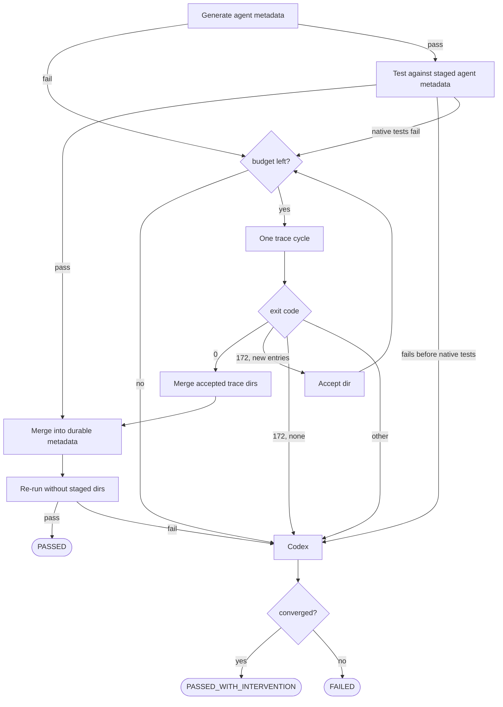

# FS-forge-publication-readiness: Publication readiness

Generation ending is not the same as a run being publishable. Everything a run
must still satisfy between a finished working tree and a merged pull request is
grounded here: the verification it must pass (§FS-local-ci-equivalent-verification),
the tested-version split its result must record
(§FS-library-update-tested-version-split), the review it receives before the
push (§FS-local-branch-review), when the result needs maintainer judgment rather
than another automated attempt (§FS-human-intervention-policy), and the
automated review the published PR receives (§FS-automated-pr-review).

Publication readiness is consumed once per publication branch. After the
trusted publisher opens the matching Forge pull request, identified by the
exact head branch and publication ID, later pushes maintain that pull request;
they are not new publication attempts and must not re-enter descriptor
validation or privileged publication. This remains true when a force-pushed
rebase makes GitHub's path comparison observe publication descriptors that
arrived from the base branch. An open or merged matching Forge pull request is
a successful no-op; an ambiguous match or a matching pull request closed
without merge still fails for inspection. §GOAL-shorten-issue-to-shipped-metadata

## FS-local-ci-equivalent-verification: Local pre-publication verification

Every Forge task must pass local verification before it is allowed to produce a
PR-eligible result. Verification is split into two tiers along the boundary
between what a single-library generation can settle on its own and what it
cannot: a library-scoped tier that runs during generation and finalization
(§FS-local-ci-equivalent-verification.1), and a cross-cutting gate that runs
before publication (§FS-local-ci-equivalent-verification.2).

Local verification runs must be non-privileged in both tiers. Forge must not
invoke `sudo`, must not run scripts that invoke `sudo`, and must not prompt for
an administrator password during local automation. CI-only host mutation steps
that require elevated privileges, such as changing system Docker networking,
must be replaced by no-sudo local gates or omitted from local execution. A
command that would require `sudo` is a local verification failure, not an
interactive prompt.

Forge must record local verification commands and outcomes in run metrics and
the publication descriptor so the trusted renderer includes them in the PR
description. A task must not push a publication descriptor, mark a project item
`Done`, return `RUN_STATUS_SUCCESS`, return `SUCCESS_WITH_INTERVENTION_STATUS`,
or return `RUN_STATUS_CHUNK_READY` until both tiers have passed. If Forge cannot
complete either tier, the workflow must return `RUN_STATUS_FAILURE` and preserve
enough diagnostics for human follow-up.

### 1. Generation and finalization

Library-scoped correctness is established during generation and finalization,
because a single-library generation owns and can fully settle these checks.
Forge runs the generated tests for the coordinate under the CI native-image
surface: current GraalVM defaults and the `future-defaults-all` mode on the
latest GraalVM, plus current defaults on the GraalVM 25 toolchain (selected by
`GRAALVM_HOME_25_0`). Each native lane may run a bounded metadata/intervention
fixup and retry, so a regression that only appears under future defaults or on
GraalVM 25 is caught before publication. Finalization then validates the
coordinate's metadata with `checkMetadataFiles`, derives missing
`allowed-packages`, applies and checks style, regenerates library stats, and
rejects legacy test-only Native Image configuration: if uncommitted or changed
`META-INF/native-image` test configuration files appear under the generated test
sources, the run fails rather than publishing them, because that config form is
no longer accepted and the reachability metadata belongs in the coordinate's
`metadata/` directory.

### 2. Pre-publication gate

Before a task may produce a PR-eligible result, Forge must also pass a
pre-publication gate. This tier exists because the generated branch is rebased
onto the current `master` before publication, and some checks can then fail for
reasons no single-library generation could have settled: they depend on
repository state that only exists once the branch sits on top of the latest
`master`. An index-file bucket that another merged PR has since changed, a newly
flagged Docker image, or a stray edit outside the coordinate's library scope can
break the whole PR even though the generated metadata and tests are themselves
valid. The gate therefore runs exactly the post-rebase, cross-cutting checks:
index-file validation (`validateIndexFiles`, an aggregate over the rebased
`master` state), Docker-image vulnerability scanning when allowed-image files
change, and the human-intervention classification that detects changes outside
the coordinate's library scope.

The gate intentionally does not re-run the library-scoped checks that
finalization (§FS-local-ci-equivalent-verification.1) already established, and by
default it does not re-run the native test matrix or the Spring AOT smoke tests,
which the generation lanes and repository CI cover. Forge must, however, expose
an opt-in full-reproduction option (`reproduce_full_ci`) for operators and
programmatic callers that need to reproduce the expensive per-PR CI surface
locally: when enabled, the gate additionally expands the changed-metadata native
test matrix, pre-pulls Docker images for coordinates that declare them, runs the
generated tests under the CI native-image mode matrix, and runs Spring AOT smoke
verification when metadata changes affect Spring AOT projects.

If the gate fails, Forge must run one bounded agent repair before the run is
handed off, on the same terms as every other agent repair in the pipeline: the
agent is reached only after a check has failed, is given that check's records as
its evidence, gets one attempt, and the gate then re-runs. The repair may touch
generated library-scoped files, or shared repository files when the failure is
caused by the repository itself. The outcome is decided by the deterministic
re-run and never by the agent's account of what it repaired
(§root/PRCPL-verify-inputs); a re-run that still fails is a handoff under
§FS-human-intervention-policy. A finding from the pre-push review is not a
failed check and does not reach this repair; §FS-local-branch-review states what
answers it, and re-runs this gate when it has. After the gate passes, Forge must
algorithmically compare the final PR diff with the expected library-scoped
paths. If any shared repository file changed, the PR must be labeled
`human-intervention` and the verification metrics and PR description must list
the repository-level paths that require maintainer review, following
§FS-human-intervention-policy.

## FS-native-test-verification-gate: Native test verification gate

Metadata production for a coordinate begins with an *approximation*. The JVM
`native-image-agent`, and any metadata an agent wrote by hand, record only the
reflection, resource, proxy, and serialization accesses observed while the test
suite runs on HotSpot. Two classes of access slip past that: accesses the suite
never exercised on HotSpot, and accesses whose reachability differs only under
closed-world native compilation. Both surface as native test failures *after*
metadata generation reported success — the agent can fail to produce the metadata
the native image actually needs.

The gate closes those gaps with **runtime truth** rather than more inference. It
runs a real native image with metadata tracing enabled, records what the
execution actually touches, and re-supplies it until the binary stops missing
metadata. It is what proves a coordinate's test binary passes on Native Image,
and every workflow ends on it (§AR-forge-workflow-engine.2,
§AR-native-test-verification-callers). Native Image must always work, so `FAILED`
is a hard error: the caller returns a failure status and resets its branch to its
checkpoint.

### 1. Observe, record, rebuild

Two native-image behaviors cooperate in a single execution. **Exact reachability
metadata with exit-on-miss** makes the image treat any access not backed by
supplied metadata as a hard miss rather than silently registering it: the binary
exits `ExitStatus.MISSING_METADATA` (172) and prints the exact missing entry the
instant it hits one. **Metadata tracing support** makes that same execution write
what it observed into a per-cycle trace directory.

So one run both detects a miss and records it. Feeding that directory into the
next build makes the next cycle aware of the previously missed access. Iterating
walks the metadata from the agent's approximation to the exact set the image
requires; exit `0` means nothing missed.

Recovery is therefore ordered: **JVM agent, then native tracing, then Codex.**
Tracing must not run before the agent step. Only when the loop still cannot make
the binary pass does the residual failure go to Codex, because at that point it
is evidence of a code or test defect rather than a metadata gap. Pi is never
invoked — its role elsewhere is to remove failing tests, exactly the wrong move
when the failure is a real defect that must surface.

### 2. Inputs and budget

The caller supplies the coordinate, the reachability repo path, and an absolute
staging root namespaced per class for the per-class caller and per coordinate
otherwise. Agent metadata is staged under `agent` and merged trace metadata under
`trace`; durable repository metadata is written only after the final merge
succeeds and the durable re-run passes.

Condition packages, when not supplied, are derived from the coordinate's
`user-code-filter.json` after the agent step has had a chance to refresh it,
excluding obvious generated-test packages, and fall back to the coordinate's
group. They follow the library's code, not its Maven coordinate: Maven groups are
frequently not Java package roots — an `org.apache.tomcat.embed` artifact executes
`org.apache.catalina`, `org.apache.coyote`, and `org.apache.tomcat` code — and
tracing needs a condition class that is actually on the access stack before the
access occurs.

The outer budget is the strategy parameter
`max-native-test-verification-iterations`, default 40
(§FS-predefined-strategy-parameter-families). Convergence is expected within a
handful of cycles; the default is a soft cap, not a target, and each cycle
rebuilds the image, so wall-clock cost is dominated by build time. A per-cycle
timeout, default 30 minutes, caps the preflight test invocation and each trace
cycle; a timeout is treated as a non-zero exit.

### 3. The loop

The staging root and its per-cycle runs directory are reset at the start of every
invocation, so no stale entry leaks across runs.

The agent step runs first, always. If it fails, tracing starts with no accepted
trace directories. If it succeeds, the coordinate is tested against the staged
agent metadata; a failure *before* the native tests is a code or test problem and
goes straight to Codex, and a native-test failure enters the trace loop.

**A pass must survive finalization.** When the coordinate passes against staged
metadata, the gate merges it into durable repository metadata and re-runs the
tests *without* staged directories. Only that durable re-run returns `PASSED`;
otherwise the finalized metadata goes to Codex. This catches merge-time condition
invalidation, where raw staged metadata passes but the merged result leaves an
access behind an unsatisfied condition. A trace-backed pass takes the same route:
merge accepted trace directories, merge into durable metadata, re-run.

Each trace cycle is one Gradle invocation, rebuilding with every accepted
directory so far, and routes on the binary's exit code:

| Exit | Meaning | Action |
| --- | --- | --- |
| `0` | accumulated metadata and the code under test are sufficient | merge, finalize, return `PASSED` |
| `172`, new entries | the cycle captured a missing access | accept the directory, continue |
| `172`, no new entries | tracing stalled: the run reported a miss it did not record | open a Native Image tracing ticket, route to Codex |
| other non-zero | the code is broken in a way more metadata cannot fix | route to Codex |

A `172` with no new entries is a Native Image tracing defect, not a library
metadata gap — the run already proved the access happens and named it. The gate
prints accumulated progress and the failure-log tail so the defect is reproducible
upstream, then falls back so the run still makes progress.

**Inactive conditions are too-late conditions.** When GraalVM reports that
metadata for an access exists but is inactive because its runtime conditions were
not satisfied, the repair must move or duplicate that metadata under a condition
reached *before* the access — usually inferred from the library frame performing
it. Reusing the unsatisfied condition is invalid: it preserves the same timing
failure.

The result carries the status (`PASSED`, `PASSED_WITH_INTERVENTION`, or
`FAILED`), the staging root, the cycles consumed, the ordered trace directories
that produced 172, at most one intervention record, and the last relevant Gradle
log path with the binary's parsed exit code — the log path is **required** when
the status is `FAILED`, and callers surface it in run metrics and the PR body
(§FS-forge-run-metrics).

### 4. Codex, and the one carve-out

Codex is terminal when invoked. It has full repository write access through the
`fix-missing-reachability-metadata` skill, validates its own work, and the gate
does not re-verify or re-run a trace cycle afterwards — that would produce a
Codex/verify ping-pong on a real code defect. Its exit decides between
`PASSED_WITH_INTERVENTION` and `FAILED`.

Everything reaching Codex — exhausted budget (reason `metadata-gap-exhausted`),
stalled progress, trace timeouts, non-172 failures — arrives with a reproduction
command including the accepted trace directories. The Codex process and its
instructions must pin the GraalVM and Java homes and the full native-image version
to the exact distribution the failed command used, and must fail rather than
reproduce or verify against a different installation. Accumulated directories are
not discarded before Codex runs; its fixes are additive.

**Final merge failures are the only carve-out.** If the trace-output merge or the
final durable merge fails, the gate returns `FAILED` directly without invoking
Codex. These are infrastructure problems downstream of a successful validation
path — a merge task, a filesystem write, malformed metadata input — and Codex
cannot repair the metadata pipeline itself. Every other failure mode routes
through Codex first.

### 5. Gradle task contract

Tracing shells out **only** to the Gradle wrapper; it must never invoke
`native-image` or `native-image-utils` directly. Rebuilding inside the loop is the
point: metadata collected by an earlier pass unlocks code paths only later builds
reach. The reachability repo must provide three tasks (§root/AR-test-harness);
which flags they pass and where they put the binary is a Gradle-side concern.

| Task | Properties | Contract |
| --- | --- | --- |
| `nativeTraceImage` | `-Pcoordinates` (required), `-PmetadataConfigDirs` (optional, → `-H:ConfigurationFileDirectories`) | Adds `-H:+MetadataTracingSupport`. Produces a binary at a path derivable from the coordinate alone. Non-zero exit is a build failure. |
| `runNativeTraceImage` | `-Pcoordinates`, `-PtraceMetadataPath` (→ `-XX:TraceMetadata=path=…`, fresh per cycle), `-PtraceMetadataConditionPackages` (→ `-XX:TraceMetadataConditionPackages`) all required; `-PmetadataConfigDirs` optional | Adds `-H:+MetadataTracingSupport` so the tracer writes at runtime, *and* `--exact-reachability-metadata` with `-H:MissingRegistrationReportingMode=Exit` so the reporter exits 172 on a miss. No caller-supplied program arguments. Runs with `ignoreExitValue=true`; the gate recovers the real code from Gradle's `finished with non-zero exit value N` line. |
| `mergeNativeTraceMetadata` | `-PinputDirs`, `-PoutputDir` (contents replaced) | Wraps `native-image-utils generate` and is the **only** point at which that tool is invoked. |

**The tracer must record whatever the reporter reports missing.** When the
reporter prints a missing entry, the same invocation must add the equivalent entry
to the directory named by `-PtraceMetadataPath`, with the metadata kind, condition
package, and target identity matching what the merge later consumes — otherwise
the loop has not produced a trustworthy runtime-observed signal and the gate falls
back rather than converging.

Toolchain configuration — GraalVM home, Java home, the native-image binary,
`native-image-utils` — is the reachability repo's responsibility; the gate does
not export, override, or check it beyond what Gradle requires. All three tasks
must accept `--no-daemon` and be idempotent across invocations on the same
coordinate, so a rerun is possible after the gate exits whatever its status.

The gate is composed from these tasks and owns no domain logic of its own. It
must not depend on any workflow implementation or on the post-generation
intervention lane, so that every caller gets identical behavior.

## FS-local-branch-review: Local pre-push branch review

Every generated branch except a `code-coverage-improvement` branch must be reviewed
before it is pushed, and not only after it has become a pull request
(§FS-automated-pr-review). The pre-push review is the cheaper of the two: the
working tree that generation verified is still on disk, the local gate records
still exist, and the branch can still be corrected without a maintainer's queue
being involved. The shared publication pipeline implements this phase before it
writes the descriptor. Code-coverage publication is temporarily excluded: its
phase-boundary coverage evidence cannot yet be reconstructed after reviewer
edits to tests, so it must not emit a review verdict until that workflow owns
durable phase snapshots.

**Placement.** The review runs inside publication, after the pre-publication
gate of §FS-local-ci-equivalent-verification.2 has passed and the descriptor
input has resolved, and before the descriptor is written. It therefore judges
`base_ref..HEAD` — the eventual pull-request diff minus the descriptor commit —
with the local evidence the post-push reviewer never sees: the gate records and
the resolved render statistics.

**Isolation and rules.** The review must run cold: a worktree detached at the
verified commit, in a session carrying no part of the generation transcript. A
review that shares context with the run that produced the branch inherits the
justifications that run already accepted, and its verdict then carries no
information. Forge invokes it through the worker-configured analysis role
rather than selecting an agent backend, model, or provider locally
(§FS-forge-agent-runtime-selection). The caller supplies the review prompt and
detached worktree while the centralized runtime owns execution and logging.
The reviewer applies the same review rules the post-push reviewer applies,
selected by the run's `task_type` so that one rule set governs both reviews, and
the same blocking discipline: a finding is a concrete violation of an enumerated
rule, never a self-formed judgment about test quality.

**Outcomes.** The review has exactly three outcomes and must never fail the run:
the branch is approved; a finding is repaired; or a finding the reviewer cannot
repair publishes flagged for a maintainer under §FS-human-intervention-policy.
Publication proceeds in all three — a review must never be able to withhold work
that verification already passed. A reviewer that cannot be reached at all —
failed authentication, a non-zero exit, a timeout, or a verdict Forge cannot
read — is the third outcome and not an error: an outage must cost one labeled
pull request, never a stalled queue.

**A finding is answered by the reviewer.** A review finding is not a failed
deterministic check, and it must not be routed to the bounded agent repair of
§FS-local-ci-equivalent-verification.2: nothing can re-run to confirm that a rule
violation is gone, so the only party that can answer a finding is the reviewer
that formed it. On a finding the reviewer must both record it and, when it can,
correct it in the worktree in the same pass.

**Findings record.** Every finding must be appended to the tracked
`forge/FINDINGS.md`, including one the reviewer went on to fix and one it could
not fix. A defect is only legible as a recurrence if the resolved instances were
written down too. Forge renders each entry from a title and a body the reviewer
supplies, so the file's shape cannot drift across runs, and a reviewer that is
unavailable takes a fixed title, whose recurrence measures the outage. Because
`forge/FINDINGS.md` lies outside every library-scoped path, the diff
classification of §FS-local-ci-equivalent-verification.2 must treat it as
expected publication output; otherwise a run that re-runs the gate after writing
it would report repository-level changes that did not happen.

**What the reviewer returns.** The reviewer's output is a single structured
verdict written to a path Forge supplies, and it is the only channel by which
its judgment reaches the run. It must carry the decision, a review comment
stating what was checked and concluded, the finding as a reusable title and a
body, and — when the reviewer corrected the finding — a fix note describing what
it changed and why. All five are the reviewer's own: the decision is a judgment
against the review rules, and the fix note describes an edit only the reviewer
made, so Forge must record both as returned and must not recompute or overwrite
either. A verdict that is missing, unreadable, or carries no decision is the
degraded case below, not a default.

**What Forge derives.** Forge owns everything downstream of that verdict. It
renders the `forge/FINDINGS.md` entry from the returned title and body rather
than letting the reviewer write the file, so the record's shape cannot drift
across runs. It stages and commits the changed paths itself, so a repair has one
form. And it decides from the paths changed against the verified commit, less
`forge/FINDINGS.md`, whether finalization and the gate must run again: a changed
tree must be re-run over, an unchanged one must not be, because re-running the
gates over a tree that already passed them spends native-image compilation on
nothing. That is a question about the tree, not about the verdict — it selects
which steps run, and never edits what the reviewer decided.

**Finalization and the gate run again.** A repaired tree must pass finalization
(§FS-local-ci-equivalent-verification.1) and the pre-publication gate
(§FS-local-ci-equivalent-verification.2) again before it is pushed; nothing may
be pushed that the gates have not passed over, and a review repair can break
either tier. Both are deterministic checks, so a failure of either — not the
finding — is what earns one bounded agent repair on the terms
§FS-local-ci-equivalent-verification.2 sets out. A repaired tree that still fails
either must be reset to the verified pre-repair commit — the tree the gate
cleared before the review ran — and that tree is what publishes: a review finding
must not destroy an otherwise publishable run. The reset discards only what the
review wrote to gate-covered paths. The findings entry survives it and is
committed on top of the restored tree, and so does the verdict, unedited: the
reviewer judged and repaired in good faith, and a reset does not make its
decision wrong. What Forge adds is its own fact — that the repair was reverted,
and which step it broke — recorded beside the verdict, and the run's verification
record must describe the restored tree rather than the discarded one. That fact
is what flags the branch, because the tree being published is no longer the one
the reviewer approved; the human-intervention signal is therefore a reverted
repair or a decision that was not an approval, and never a rewriting of the
latter into the former.

**Where the review is kept.** The review is an agent session and is logged like
every other one (§FS-durable-generation-logs): the prompt, the response, and the
repair pass that follows a finding must be written to the run's durable task
logs, scoped by task and coordinate, and never left as terminal output. That log
stays on the machine that ran it. What reaches a reader of the pull request is
therefore only what is committed: the finding, in `forge/FINDINGS.md`, and the
verdict, on the descriptor. Because those two are the whole public record, the
descriptor's review field must also carry the session log path, as the
verification records already do for each command they run, so a maintainer with
access to the machine can reach the conversation the verdict came from.

**The verdict outlives the phase that produced it.** The review runs before the
descriptor is written, so the descriptor cannot be where the verdict is kept
until then. Forge must stage it with the run's other in-flight publication data
in the Forge metrics directory (§FS-forge-run-metrics), which is what descriptor
construction already consumes, so a publication that resumes after the review
(§FS-forge-run-continuation) reconstructs the verdict rather than re-running the
reviewer or publishing without it.

**Verdict.** The verdict must travel on the publication descriptor as its own
field rather than folded into the human-intervention modifier, so triage can
still tell repository-level surgery, a severe metadata drop, and a review
finding apart, and the publisher must render it into the pull-request body as a
Local Agent Review section, because triage reads the body before it reads
anything else. The rendered section must show the reviewer's own words — its
comment, its finding, and its fix note — together with the fact Forge owns: which
tree publishes, the repaired one or the restored one. When the reviewer was
unavailable there are no words to show, and the section must say that this, and
not a finding, is why the branch did not carry an approval.

The descriptor is validated by the publisher against the schema on the default
branch (§AR-actions-publication), which admits no unknown fields, so the field
and the renderer that reads it must reach the default branch before any run
emits them; a run that emits a field the published schema does not know fails
publication outright. Until they have landed, the review may still run: the
finding is committed markdown that needs no schema, and the human-intervention
signal reaches the pull request through the modifier that already exists.

## FS-library-update-tested-version-split: Library-update tested-version split

A `library-update-request` entry often lists several tested versions of the same
library at once (for example `["1.1", "1.2", "1.3"]`). When a coverage-improvement
run regenerates the JVM tests for such an entry, the new tests can pass on the
entry's own version yet stop compiling or running against a *later* tested
version. Forge must catch that break before the branch becomes PR-eligible and
split the entry, so the PR keeps the regenerated progress for the versions that
still pass while the repository keeps its existing support for the rest.

**Version sweep.** Before publication (§FS-local-ci-equivalent-verification),
Forge runs a Java-only sweep. It runs `javaTest` for the changed coordinate once
per tested version, walking the entry's `tested-versions` in order with
`GVM_TCK_LV` set to each version, and stops at the first version that fails. The
sweep is deliberately narrower than full CI — it skips the native-image matrix —
because it only needs to catch JVM test code that no longer works on a later
version.

**Progress output.** Forge must report the sweep on the CLI: the changed
coordinate, how many versions it will check, each version as it starts, the log
path for that version, and whether the version passed or failed. When every
version passes, the output must say plainly that no split is needed.

**Outcome.** If the *first* version fails there is no passing prefix to keep, so
Forge fails publication instead of splitting. If a *later* version fails, Forge
splits the index entry at that first failing version into two entries:

| | `metadata-version` | `tested-versions` | `latest` | contents |
|---|---|---|---|---|
| **Current entry** | unchanged | the passing prefix | kept unless it moves to the successor | the regenerated metadata and tests from this PR |
| **Successor entry** | the first failing version | the failing version and every later one | inherited when the split entry had `latest: true` | baseline metadata and tests copied from the PR base commit |

**Successor contents.** The successor entry must preserve the repository's
pre-generation support for the failing range. Forge copies the metadata and test
directories from the PR base commit entry that originally covered the failing
version — using that entry's `metadata-version` and `test-version` when present —
into `metadata/<group>/<artifact>/<failing-version>` and
`tests/src/<group>/<artifact>/<failing-version>`. The PR then ships the new
generated progress for the passing prefix and keeps baseline support for the
successor range. Forge regenerates library stats for the failing version after
creating the successor entry and publishes them under
`stats/<group>/<artifact>/<failing-version>`.

**Follow-up issue.** On every split, Forge also opens a `library-update-request`
issue for the successor metadata version and holds it in `In Progress` so the
queue cannot claim it early. The PR references this issue but does not close it,
through the `Refs:` line and `Forge-Unblocks-Issue:` trailer of §AR-pr-body.
Once the PR merges, Forge releases the issue — clearing its assignees and moving
its project status to `Todo` — so the successor update enters normal processing.

## FS-human-intervention-policy: Human intervention policy

The `human-intervention` label is a maintainer follow-up signal, not a generic
failure label. Forge must apply it only when the available evidence shows that
the work cannot be safely completed or trusted without human judgment about the
generated code, repository automation, metadata, or library behavior.

Valid human-intervention cases are semantic or generation failures inside
Forge's responsibility boundary, including:

- Generated tests, metadata, or workflow edits fail local verification in a way
  that points to the generated artifact or repository automation rather than a
  transient external service.
- The workflow cannot converge after its configured generation, retry, and
  recovery limits, and the saved logs point to a real library/test/metadata
  problem that needs maintainer analysis.
- Dynamic-access coverage remains missing or suspiciously low after a
  successful generation path, making the result misleading without manual
  follow-up.
- Local CI-equivalent verification passes only after shared repository files
  changed, so a maintainer must review repository-level effects before merge.
- Publication detects a severe metadata, test, or coverage anomaly that makes
  the PR unsafe to auto-review as a normal generated result.
- The pre-push review found something it could not correct, or its repair did
  not survive finalization and the gate, so the branch publishes with the
  finding still open (§FS-local-branch-review).

Forge must not use `human-intervention` for failures that are only external or
transient infrastructure conditions. The issue-side classification is by failure
origin, not by log keywords: a workflow failure is **logical** — and gets the
label — when it comes from the driver script, the core workflow, or the local
CI-equivalent verification (compile, test, native-test, and finalization gates),
which includes the rare case of an agent timeout. A workflow failure is
**external** — and must not get the label — only when it surfaces as a typed
exception from the dependency boundary Forge itself crosses: GitHub (`gh`: rate
limits and 5xx/network) as `GitHubError` / `GitHubRateLimitExceeded`, remote
git operations (push/pull/fetch/clone/ls-remote) as `GitTransportError`, and a
Gradle build that never left configuration as `GradleBootstrapFailure`. Maven
Central and Docker registry failures have no such boundary — Gradle owns them
inside `./gradlew test` and they reach Forge only as an opaque CI-check `rc != 0`,
indistinguishable from a real test failure once the in-workflow retries have run —
so they are not special-cased and fall through to the safe logical default. When a
failure is external, Forge takes no issue action: it applies no
`human-intervention` label and posts no comment, and silently releases the issue
claim (status back to `Todo`, assignees cleared) so the issue is retried later.
Rate limits and shared bootstrap failures additionally stop the current run for
a later retry.

The label can appear on issues or pull requests. On an issue, it means Forge
could not safely produce a PR-ready result and posted enough diagnostics for a
maintainer to continue. On a pull request, it means Forge produced a reviewable
artifact, but some part of the result needs explicit maintainer judgment before
normal review automation may treat it as safe. The companion
`human-intervention-fixed` PR label means a maintainer has addressed the manual
follow-up and review automation may resume after normal merge gates pass. The
resulting labeled backlog is drained by automated resolution, not per-item
manual triage. The preserved work branch
additionally carries a continuation marker, so a later run can resume the issue
from the phase that failed instead of regenerating from scratch
(§FS-forge-run-continuation).

## FS-automated-pr-review: Automated pull request review

Forge review automation processes open pull requests by their PR labels only
after CI has completed successfully. A pull request with running checks waits;
a pull request with failed checks is handled by deterministic CI-failure
follow-up and must not launch a review agent. It is the second review a
generated branch receives; the first runs before the push, against evidence
this one cannot see (§FS-local-branch-review). It is a PR review workflow, not
an issue-resolution workflow:
it must inspect an already published PR, use an isolated review worktree,
compare the PR diff and status checks against the label-specific review rules,
and submit either an approval or a requested-changes review on GitHub.

Review labels select the review rule set. `library-new-request`,
`library-update-request`, `fixes-javac-fail`, `fixes-java-run-fail`,
`fixes-native-image-run-fail`, and bulk-update review labels each have their
own review expectations. The review prompt or skill must apply the rules for
the PR's label rather than using generic code-review judgment alone.

Review automation must skip PRs already labeled `human-intervention`. That
label means maintainer judgment is required before normal automated review may
continue, per §FS-human-intervention-policy. A PR labeled
`human-intervention-fixed` is the explicit maintainer signal that manual
follow-up has been completed; review automation may then dismiss stale
requested-changes reviews, approve, and merge only after normal merge gates
pass, including the index validation safeguard for index-changing pull
requests.

Bot authorship does not disqualify the maintainer recorded as the descriptor's
`producer` from reviewing the PR. Review eligibility continues to exclude only
the authenticated review worker when that same account is the GitHub PR author;
it does not treat descriptor provenance as authorship.

Before launching a review agent, Forge must validate GitHub CLI authentication
in the orchestration process and deterministically validate the worker-configured
analysis agent, model, and provider. Neither check may invoke a model. The
review agent is trusted automation acting on Forge's behalf: it must run in an
execution environment that can use the authenticated `gh` session without an
interactive approval boundary, inspect the live pull request and its checked-out
diff, and submit the approval or requested-changes review itself. Forge does not
parse an agent verdict and resubmit it through a second GitHub client. An
authentication failure, timeout, or unsuccessful agent turn must stop processing
that review rather than being treated as an approval.

Automated review may add or request the `human-intervention` PR label only when
the applicable label-specific review rules say the result cannot be handled by
a normal approval or requested-changes review. Review uncertainty, transient CI
noise, GitHub status/API failures, Maven download failures, or other external
infrastructure errors must not be converted into `human-intervention` unless
the review rules identify a semantic generated-result, repository-automation,
metadata, or library-execution problem that requires maintainer judgment
(§FS-human-intervention-policy).

**A conflict that needs no judgment is resolved, not escalated.** A pull request
whose only merge conflict is the shared findings ledger must not be left for a
maintainer. Because every branch records its finding at the same offset in the
append-only `forge/FINDINGS.md` (§FS-local-branch-review), any two open pull
requests conflict there, and each merge re-conflicts the rest; keeping both
entries is the only correct resolution, so the repository configures git to
take it without asking. Conflict refresh is deterministic queue maintenance,
not review: before CI state can make a pull request eligible for an agent,
Forge must merge the base branch into a conflicting same-repository head and
push the result when that merge left no conflict behind. A merge that still
conflicts — in the ledger or in any other file — is a real disagreement over
content and takes the human-intervention path instead, as does a head Forge
cannot push to. Pushing restarts the pull request's checks, so review and merge
belong to a later pass: Forge must re-read the review decision and checks after
pushing rather than carrying pre-push state forward, which also means an
approval dismissed by the push is re-earned by the normal review path rather
than assumed.
