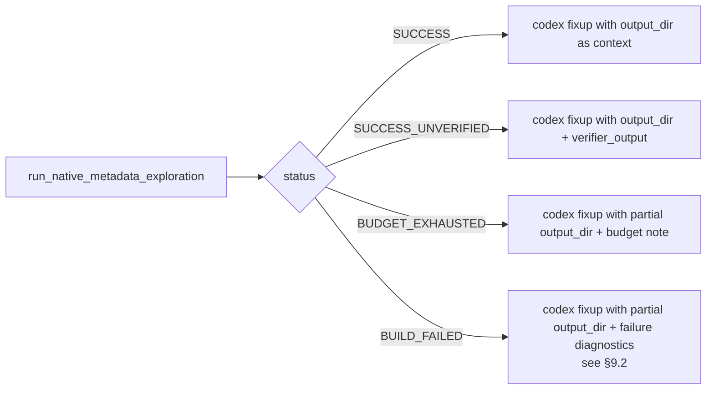

# Native Metadata Exploration Phase — Specification

At a glance:

```text
   setup (clear output_dir + runs_dir)
       |
       v
  +-------------------------------------------+
  | iteration loop                            |
  |   nativeTraceImage   (cfg = prior runs)   |
  |   runNativeTraceImage -> metadata-run-i   |
  |   converged?  -- yes -->  break           |
  |   build_failed? -- yes -->  break         |
  |   budget_exhausted? -- yes -->  break     |
  +-------------------+-----------------------+
                      |
                      v
            mergeNativeTraceMetadata
            (only if any run accepted)
                      |
                      v
       (optional) verifyExactReachabilityMetadata
                      |
                      v
        result = status + output_dir + failure
                      |
                      v
              caller -> codex fixup
              (every status, including BUILD_FAILED)
```

> **See also:** [Project overview](overview.md) ·
> [Dynamic-access workflow](dynamic-access-workflow.md) ·
> [Java fail-fix workflow](fix-java-run-fail.md)

## 1. Purpose

This phase produces reachability metadata for the target library by **running a
native image with metadata tracing enabled** rather than by static analysis or
agent inference. The traced metadata is written to a caller-supplied output
directory (see §4) and is then available to downstream steps — notably the
codex metadata fixup — as additional, ground-truth context.

The phase is reusable and self-contained: it has no knowledge of which
workflow invokes it. Callers are responsible for sequencing it with their own
steps; this spec only describes the phase contract. Integration is documented
in the calling specs (linked above and listed in §8).

## 2. Execution Model

The contract this phase implements is the GraalVM `MetadataTracingSupport`
recipe. The key insight is that **rebuilding inside the loop matters**:
metadata collected by an earlier pass unlocks code paths that only later
image builds reach. There are no caller-supplied "scenarios" — there is one
binary invocation, repeated until **a run discovers no new metadata** (the
convergence signal) or the iteration budget is exhausted.

The phase **must not** shell out to `native-image` or `native-image-utils`
directly. All native-toolchain steps are mediated by Gradle tasks in the
reachability repo (see §7). The Python phase orchestrates the loop and the
convergence check; every individual build, run, and merge is a `./gradlew`
invocation.

Pseudo-code (the Python phase mirrors this):

```text
run_dirs = []
for i in 0..max_iterations:
    config_dirs = run_dirs                  # raw, never merged
    rc = ./gradlew nativeTraceImage \
            -Pcoordinates=<g:a:v> \
            -PmetadataConfigDirs=<config_dirs joined by ',' or empty>
    if rc != 0: return BUILD_FAILED

    run_i = "<runs_dir>/metadata-run-<i>"
    ./gradlew runNativeTraceImage \
        -Pcoordinates=<g:a:v> \
        -PtraceMetadataPath=<run_i> \
        -PtraceMetadataConditionPackages=<group>
    # exit code is informational only

    if iteration_added_no_new_entries(run_i, run_dirs):
        break                                # convergence
    run_dirs.append(run_i)

if len(run_dirs) > 0:
    ./gradlew mergeNativeTraceMetadata \
        -PinputDirs=<run_dirs joined by ','> \
        -PoutputDir=<output_dir>

if verify and len(run_dirs) > 0:
    ./gradlew verifyExactReachabilityMetadata \
        -Pcoordinates=<g:a:v> \
        -PmetadataConfigDirs=<output_dir> \
        -PexactPackages=<group>
```

The phase does **not** accept a list of run arguments — the test binary is
invoked the same way every iteration; only the metadata already collected
changes between iterations.

## 3. Inputs

| Input | Source | Notes |
| --- | --- | --- |
| Coordinate `group:artifact:version` | Caller | Identifies the test module under `tests/src/<group>/<artifact>/<version>`. |
| Reachability repo path | Caller | Working directory for Gradle. |
| **Output directory** | **Caller** | Absolute path to the directory that the final merge writes into. Caller is responsible for choosing a path that is unique to the (library, class) it is exploring for; see §4. |
| Condition packages | Strategy parameter `trace-condition-packages` | Mapped to `-XX:TraceMetadataConditionPackages=...`. Defaults to `[group]`. |
| Iteration budget | Strategy parameter `max-trace-iterations` | Default 5. Caps the build/run loop. |

Notably absent: any list of run arguments, scenarios, or test selectors. The
binary is invoked exactly the same way each iteration.

## 4. Output

The phase writes its final merged metadata to **the caller-supplied output
directory**. The phase does not pick or default this path — that is a
deliberate choice so that concurrent invocations for different libraries or
different classes within the same library do not stomp on each other.

The recommended convention for callers in this project is:

```text
tests/src/<group>/<artifact>/<version>/build/natively-collected/<class-key>/
```

where `<class-key>` is a sanitized form of the dynamic-access class the
caller is currently working on (or a literal string like `_global_` for
phases that are not class-scoped, e.g. native-run failure fix). The
`build/` segment keeps these artifacts under Gradle's clean target.

Inside the output directory, the layout is the standard
`META-INF/native-image/...` structure emitted by
`native-image-utils generate`:

```text
<output_dir>/
  reachability-metadata.json
  ...
```

Per-iteration raw traces (`metadata-run-<i>/`) are written under a sibling
working directory chosen by the phase (under
`<output_dir>/../runs/`, exact path returned in the result) and are kept
until the phase exits so callers can inspect them. They are not part of the
caller-visible contract beyond their existence in the result object.

The output directory is **not** the canonical metadata path and is not
committed as a metadata release. It is a build artifact consumed by:

- The codex metadata fixup, as additional read-only context.
- Diagnostics emitted into the run-metrics record.

The canonical metadata under `metadata/<group>/<artifact>/<version>/` continues
to be produced by `generateMetadata`.

## 5. Phase Workflow

```mermaid
flowchart TD
    Start([invoke metadata exploration]) --> Init[Remove output_dir and runs_dir<br/>run_dirs = [], i = 0]
    Init --> Loop[Iteration i]
    Loop --> Build[gradlew nativeTraceImage<br/>-PmetadataConfigDirs=run_dirs<br/>if non-empty — raw, no merge]
    Build --> BuildOK{task ok?}
    BuildOK -- no --> BuildFail([return BUILD_FAILED])
    BuildOK -- yes --> Run[gradlew runNativeTraceImage<br/>-PtraceMetadataPath=run-i<br/>-PtraceMetadataConditionPackages=&lt;packages&gt;<br/>task exit code is informational only]
    Run --> Delta{run-i contains entries<br/>not already in run_dirs?}
    Delta -- no --> Converged[Phase converged —<br/>no new metadata]
    Delta -- yes --> Append[run_dirs += run-i]
    Append --> Budget{i + 1 &lt; max-trace-iterations?}
    Budget -- yes --> Next[i = i + 1]
    Next --> Loop
    Budget -- no --> Cap[Budget exhausted]
    Cap --> FinalMerge
    Converged --> FinalMerge[**Single** gradlew mergeNativeTraceMetadata<br/>-PinputDirs=run-0,...,run-N<br/>-PoutputDir=output_dir]
    FinalMerge --> Verify[Optional: gradlew verifyExactReachabilityMetadata<br/>-PmetadataConfigDirs=output_dir<br/>-PexactPackages=&lt;packages&gt;]
    Verify --> VerOK{task ok?}
    VerOK -- yes --> Done([return SUCCESS<br/>or BUDGET_EXHAUSTED])
    VerOK -- no --> Soft([return SUCCESS_UNVERIFIED])
```

Per-iteration semantics:

- All toolchain steps go through Gradle. The phase invokes `./gradlew
  nativeTraceImage`, `./gradlew runNativeTraceImage`, `./gradlew
  mergeNativeTraceMetadata`, and (optionally) `./gradlew
  verifyExactReachabilityMetadata`. No direct call to `native-image` or
  `native-image-utils` ever appears in the phase implementation.
- The image is **rebuilt every iteration** with all prior raw
  `metadata-run-<i>` directories passed through
  `-PmetadataConfigDirs=run-0,run-1,...`. The Gradle task is responsible
  for translating that into `-H:ConfigurationFileDirectories=...`. No
  merging is required for the build to consume them.
- The traced run's **task exit code is ignored** for termination purposes.
  A run that crashes can still discover new metadata before crashing; that
  trace is kept.
- **Convergence is the termination condition**: when an iteration's
  `metadata-run-<i>` contains no entries that are not already present in the
  union of `metadata-run-0 … metadata-run-<i-1>`, the phase converges. This
  check operates on the raw per-run directories produced by Gradle; no
  merge artifact is produced or required during the loop.
- **Merging happens only once, after the loop terminates.** A single
  `./gradlew mergeNativeTraceMetadata` invocation produces the final
  `<output_dir>`. No intermediate merged directory ever exists.
- The final merge runs whenever **at least one** `metadata-run-<i>` was
  accepted, regardless of how the loop terminated. A later iteration's
  build failure does not throw away earlier successful traces — those are
  still merged into `<output_dir>` so callers (and codex) get whatever
  partial signal exists. The merge is only skipped if no iteration
  produced new metadata.

Status enumeration:

| Status | Meaning | Caller action |
| --- | --- | --- |
| `SUCCESS` | The phase converged (no new metadata in the last iteration) and (when `verify=True`) the `--exact-reachability-metadata` build succeeded. | Pass the output directory to codex fixup as additional read-only context. |
| `SUCCESS_UNVERIFIED` | The phase converged but the verifier build failed. | Pass output directory + verifier output to codex fixup. |
| `BUDGET_EXHAUSTED` | `max-trace-iterations` reached before convergence; the final merge still ran on whatever was collected. | Pass the partial output directory to codex fixup, plus a note that the budget was exhausted. |
| `BUILD_FAILED` | The trace image build failed in some iteration. The merge ran on prior accepted traces (if any); the output directory may be empty or partial. | Pass whatever was merged plus the failure diagnostics to codex fixup — see §9. The build failure may be a non-metadata problem that codex must resolve. |

**Every status routes through codex fixup.** Failure of the exploration
phase is no longer a reason to skip codex. Instead, the failure
diagnostics become part of codex's input — see §9 for the contract.

## 6. Reusable Implementation Surface

A new module owns this phase:

```text
utility_scripts/native_metadata_exploration.py
```

Public entry:

```python
def run_native_metadata_exploration(
    reachability_repo_path: str,
    coordinate: str,                          # "group:artifact:version"
    output_dir: str,                          # absolute; caller-chosen, see §4
    condition_packages: list[str] | None = None,
    max_iterations: int = 5,
    verify: bool = True,
) -> NativeExplorationResult: ...
```

The phase **does not invent** `output_dir`. It is required, and the caller
is responsible for namespacing it per (library, class) to avoid concurrent
clobbering.

`NativeExplorationResult` carries:

- the status,
- the absolute path to the output directory (echoes the caller's input),
- the absolute path to the per-iteration runs directory (`runs/`),
- the per-iteration build/run log paths,
- the verifier output (if `verify=True`),
- the iteration count actually used,
- **`failure`** — populated whenever the status is not `SUCCESS`. Carries:
  - `failed_task` — the Gradle task name that triggered the status
    (`nativeTraceImage`, `runNativeTraceImage`,
    `mergeNativeTraceMetadata`, or `verifyExactReachabilityMetadata`),
  - `failed_iteration` — the iteration index when applicable, or `None`
    for merge / verifier failures,
  - `failure_log_path` — absolute path to the persisted Gradle output for
    the failing task,
  - `failure_summary` — short string extracted from the log (first failed
    Gradle subtask, or the first `BUILD FAILED` block), suitable for
    embedding in a codex prompt without dumping the full log.

Even when `status == BUILD_FAILED`, `output_dir` is still populated
whenever earlier iterations produced accepted traces; callers must inspect
both `failure` and `output_dir`.

The module must not depend on any workflow strategy. Sequencing with
`generateMetadata`, codex fixup, agent hand-off, etc. is the caller's
responsibility and is documented in the calling specs (see §8).

## 7. Required Gradle Support

The phase shells out **only** to `./gradlew`. The reachability repo must
provide the following tasks. They are the contract surface of this phase;
their internal implementation (which native-image flags they pass, where
they put the resulting binary, etc.) is a Gradle-side concern.

### 7.1 `nativeTraceImage`

Builds the test module's native image with metadata-tracing support
enabled.

| Property | Required | Meaning |
| --- | --- | --- |
| `-Pcoordinates=<group:artifact:version>` | yes | Identifies the test module to build. |
| `-PmetadataConfigDirs=<dir1,dir2,...>` | no | Comma-separated absolute paths translated to `-H:ConfigurationFileDirectories=...`. Omitted on the first iteration. |

Behavior:

- The task adds `-H:+UnlockExperimentalVMOptions
  -H:+MetadataTracingSupport -H:-UnlockExperimentalVMOptions` (or the
  equivalent supported invocation) to the native-image build.
- The task produces a binary at a path the next task can locate using only
  `-Pcoordinates=...` (i.e., the path is derivable from the coordinates;
  the phase does not pass the binary path back in).
- A non-zero task exit code is mapped to `BUILD_FAILED`.

### 7.2 `runNativeTraceImage`

Runs the binary produced by `nativeTraceImage` once, capturing traced
metadata to a caller-specified directory.

| Property | Required | Meaning |
| --- | --- | --- |
| `-Pcoordinates=<group:artifact:version>` | yes | Same coordinates used to build. |
| `-PtraceMetadataPath=<absolute path>` | yes | Becomes `-XX:TraceMetadata=path=...`. Must be a fresh per-iteration directory. |
| `-PtraceMetadataConditionPackages=<pkg1,pkg2,...>` | yes | Becomes `-XX:TraceMetadataConditionPackages=...`. |

Behavior:

- The task always invokes the binary the same way. There are no
  caller-supplied program arguments.
- The task's exit code is **informational only**. It is logged and
  surfaced in the result, but it does not drive termination.

### 7.3 `mergeNativeTraceMetadata`

Wraps `native-image-utils generate`. Invoked **once** per phase
invocation, after the loop has terminated.

| Property | Required | Meaning |
| --- | --- | --- |
| `-PinputDirs=<dir1,dir2,...>` | yes | Absolute paths of every accepted `metadata-run-<i>` directory. |
| `-PoutputDir=<absolute path>` | yes | Caller-supplied output directory (§4). Pre-existing contents are replaced. |

Behavior:

- The task fails the phase with a non-`SUCCESS` status only if the merge
  itself fails (the existing status enum does not currently distinguish
  this; an implementation note: treat a merge failure as
  `SUCCESS_UNVERIFIED` and surface the task output in the result).
- The task is the **only** point at which `native-image-utils` is invoked.

### 7.4 `verifyExactReachabilityMetadata` (optional)

Used only when the caller passes `verify=True`.

| Property | Required | Meaning |
| --- | --- | --- |
| `-Pcoordinates=<group:artifact:version>` | yes | Same coordinates. |
| `-PmetadataConfigDirs=<absolute path>` | yes | Typically the phase's output directory. |
| `-PexactPackages=<pkg1,pkg2,...>` | yes | Becomes `--exact-reachability-metadata=...`. |

A failing verifier task downgrades the phase status from `SUCCESS` to
`SUCCESS_UNVERIFIED`.

### 7.5 General requirements

- `gh` / `gradle` toolchain configuration (GraalVM home, Java home, native
  image binary, `native-image-utils` location) is the reachability repo's
  responsibility. The Python phase does not export, override, or check any
  toolchain environment variables beyond what Gradle already requires.
- All four tasks must accept being invoked with `--no-daemon` and must be
  idempotent across phase invocations on the same coordinate (i.e., a
  rerun must be possible after the phase exits, regardless of status).

Concrete Gradle wiring is out of scope for this spec but is a prerequisite
for implementation.

## 8. Callers

This phase is invoked from the following workflows. Each calling spec owns
its own sequencing diagram and its own rules for what to do with each
status; this list is informational only.

| Caller | Where the integration is specified |
| --- | --- |
| Dynamic-access workflow — after every per-class iteration, and as a precondition for codex fixup inside finalization | [dynamic-access-workflow.md §6.4 and §6.6](dynamic-access-workflow.md) |
| Native-run failure fix workflow — first corrective action when `nativeTest` fails | [fix-java-run-fail.md](fix-java-run-fail.md) |

## 9. Failure Handoff to Codex Fixup

A failed exploration is **not** evidence that the problem is purely a
metadata gap. The Gradle tasks fail for a wide range of reasons:

- A test class does not compile under metadata-tracing flags.
- The trace binary crashes immediately for reasons unrelated to missing
  metadata (e.g. a missing dependency, a wrong main class, a JVM-only
  test that does not run under native image at all).
- `--exact-reachability-metadata` fails because the test exercises a
  package outside the configured condition packages.
- The merge task hits a malformed per-run trace.

Some of these are non-metadata code problems that only the agent can fix.
Therefore the phase produces a **diagnostic-rich result on every status**
and the calling specs must treat every status as eligible for codex
fixup.

### 9.1 Phase responsibilities

The phase itself never invokes codex (this remains a hard rule — see
§10). On any non-`SUCCESS` outcome it must:

1. Persist the full Gradle stdout/stderr of the failing task to a stable
   absolute path under the runs directory.
2. Populate `result.failure.failed_task`, `failed_iteration`,
   `failure_log_path`, and `failure_summary` (§6).
3. Run the final merge if any prior iteration produced new traces, so
   `result.output_dir` carries whatever partial signal exists.
4. Return; the caller decides how to use the result.

### 9.2 Caller responsibilities

When a caller routes the result to `run_codex_metadata_fix(...)`, the
codex invocation must receive, at minimum:

- The coordinate.
- `result.output_dir` (added to read-only context, even if empty or
  partial — codex must be told this is "natively-collected metadata so
  far, may be incomplete").
- `result.failure.failure_summary` (always inlined into the prompt so
  codex sees what failed in plain text).
- `result.failure.failure_log_path` (added to read-only context so codex
  can read the full failing build log when the summary is insufficient).

The recommended prompt shape for codex when status is not `SUCCESS`:

```text
Native metadata exploration for {coordinate} did not converge cleanly.

Final status: {status}
Failed task: {failure.failed_task}
Iteration: {failure.failed_iteration}
Summary: {failure.failure_summary}

Partially-collected metadata is in:
  {output_dir}
The full failing build log is in:
  {failure.failure_log_path}

Investigate the failure. If it is a missing-metadata problem, complete
the metadata under {coordinate} using the partial output as a starting
point. If it is a non-metadata code problem (compilation error, wrong
main class, native-incompatible test code, etc.), fix the underlying
issue in the test sources first; metadata can be regenerated afterwards.
```

The current `run_codex_metadata_fix(reachability_repo_path, coordinates)`
helper takes only the coordinate. To support the handoff, it must be
extended to accept the result object (or the relevant fields) and render
this prompt accordingly. That extension is a follow-up implementation
task; this spec defines the contract.

### 9.3 Routing rule



There is no longer a "skip codex" branch. The only reason for a caller
not to call codex is that the test already passed without intervention
(in which case the exploration phase is not invoked in the first place).

## 10. Acceptance Criteria

A `run_native_metadata_exploration(...)` invocation is correct iff:

1. The phase shells out **only** to `./gradlew`. It must not invoke
   `native-image`, `native-image-utils`, or any other toolchain binary
   directly. The four Gradle tasks listed in §7 are the entire toolchain
   surface.
2. The caller-supplied `output_dir` and the sibling per-run directory are
   removed (or recreated empty) at the start of the call so no stale
   entries leak across runs.
3. Each iteration **rebuilds** the trace image by invoking `./gradlew
   nativeTraceImage`, passing all prior raw `metadata-run-<i>` directories
   as `-PmetadataConfigDirs=run-0,run-1,...` from the second iteration
   onward. The first iteration omits `-PmetadataConfigDirs`.
4. Each iteration runs the binary exactly once via `./gradlew
   runNativeTraceImage`, with `-PtraceMetadataPath=` pointing at a fresh
   per-iteration path under the runs directory.
5. The `runNativeTraceImage` task exit code does not affect termination.
6. **Convergence check** — after each run, the phase compares the new
   `metadata-run-<i>` to the union of prior `metadata-run-<j>` directories.
   If `metadata-run-<i>` contains no entries that are not already present
   in that union, the loop terminates with convergence.
7. The loop also terminates when (a) the iteration budget is exhausted, or
   (b) `nativeTraceImage` fails.
8. **`./gradlew mergeNativeTraceMetadata` is invoked at most once per
   phase invocation**, after the loop terminates, with `-PinputDirs=`
   listing every accepted `metadata-run-<i>` and
   `-PoutputDir=<output_dir>`. The merge runs whenever at least one
   iteration produced new metadata, **regardless of how the loop
   terminated** — a later `BUILD_FAILED` does not discard earlier
   successful traces. The merge is skipped only when no iteration
   produced new metadata, in which case `<output_dir>` is left empty.
9. When `verify=True` and the merge ran, `./gradlew
   verifyExactReachabilityMetadata` is invoked exactly once. Its result
   determines whether the phase returns `SUCCESS` or `SUCCESS_UNVERIFIED`.
10. On any non-`SUCCESS` status, the result's `failure` field is
    populated with `failed_task`, `failed_iteration` (when applicable),
    `failure_log_path` (an absolute path to a persisted Gradle log), and
    a short `failure_summary`. This information is the sole contract for
    callers handing the failure off to codex fixup (§9).
11. The function returns the status enum, the absolute output directory,
    the absolute per-run directory, and (on failure) the diagnostic
    fields described in §6 and §9.
12. No code path inside the phase shells out to the codex fixup, the
    agent, or any LLM. The phase is purely deterministic. Routing the
    result to codex is the caller's responsibility.
