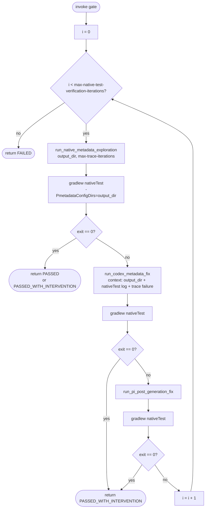

# Native Test Verification — Specification

> Built on top of the [Native metadata exploration](native-metadata-exploration.md)
> trace loop introduced in
> [oracle/graalvm-reachability-metadata#3379](https://github.com/oracle/graalvm-reachability-metadata/pull/3379).
>
> **See also:** [Dynamic-access workflow](dynamic-access-workflow.md) ·
> [Java fail-fix workflow](fix-java-run-fail.md) ·
> [Workflow strategies & interventions](workflow-strategies.md).

## 1. Purpose

The verification gate ensures that `./gradlew nativeTest` passes for a given
coordinate by iteratively combining the trace loop with the existing codex /
Pi recovery cascade. It is the per-class success criterion for the
dynamic-access workflow and a reusable terminal gate for any workflow whose
acceptance contract is "Native Image tests must pass" — for example, the
native-run failure fix workflow after the agent has produced its last edit.

Native Image must always work. A gate result of `FAILED` is therefore a hard
error: the calling workflow must return `RUN_STATUS_FAILURE` and reset the
branch to its checkpoint.

## 2. Inputs

| Input | Source | Notes |
| --- | --- | --- |
| Coordinate `group:artifact:version` | Caller | Same as the trace loop. |
| Reachability repo path | Caller | Working directory for Gradle. |
| Output directory | Caller | Absolute path. The caller picks a path namespaced per (library, class) for the dynamic-access caller, or per coordinate for non-class-scoped callers — same convention as [native-metadata-exploration.md §4](native-metadata-exploration.md#4-output). |
| Condition packages | Strategy parameter `trace-condition-packages` | Default `[group]`. Forwarded to the trace loop. |
| Outer budget | Strategy parameter `max-native-test-verification-iterations` | Default **100**. Caps the outer trace → verify → recover cycles. Intentionally large: every cycle is cheap once the trace loop has converged once. |
| Inner trace budget | Strategy parameter `max-trace-iterations` | Default 5. Forwarded to each inner trace-loop call. |

## 3. Outputs

`NativeTestVerificationResult` carries:

- `status` — `PASSED`, `PASSED_WITH_INTERVENTION`, or `FAILED`.
- `output_dir` — merged trace metadata (echoes the caller's input; populated
  whenever any inner trace iteration produced new metadata).
- `iterations_used` — number of outer cycles consumed.
- `last_native_test_log_path` — absolute path to the final `nativeTest` log.
  Required when status is `FAILED`; callers surface it in run metrics and
  the PR description.
- `intervention_records` — ordered list of
  `{stage, kind: "codex" | "pi", log_path}` entries describing every
  recovery step that ran.

## 4. Loop



Per-cycle semantics:

- **Trace first, every cycle.** After codex or Pi modify the working tree,
  a fresh trace pass may discover metadata reachable only by the modified
  code. The trace loop converges internally, so re-running it is cheap when
  nothing relevant changed.
- **Verify against the merged trace dir.** `nativeTest` is invoked with
  `-PmetadataConfigDirs=<output_dir>` so the verification reflects what the
  trace loop produced — independent of
  `metadata/<group>/<artifact>/<version>` state, which is regenerated only
  at finalization.
- **Recovery cascade mirrors `codex_then_pi`.** Codex first, then Pi if
  codex cannot recover. The gate reuses
  [`run_codex_metadata_fix`](../ai_workflows/fix_metadata_codex.py) and
  [`run_pi_post_generation_fix`](../ai_workflows/fix_post_generation_pi.py),
  so the failure-handoff contract from
  [native-metadata-exploration.md §9](native-metadata-exploration.md#9-failure-handoff-to-codex-fixup)
  carries over unchanged.
- **Hard fail on exhaustion.** Reaching
  `max-native-test-verification-iterations` returns `FAILED`. The caller
  must propagate this as `RUN_STATUS_FAILURE` and reset the branch to its
  checkpoint.

## 5. Reusable Implementation Surface

```text
utility_scripts/native_test_verification.py
```

Public entry:

```python
def verify_native_test_passes(
    reachability_repo_path: str,
    coordinate: str,
    output_dir: str,
    condition_packages: list[str] | None = None,
    max_iterations: int = 100,
    max_trace_iterations: int = 5,
) -> NativeTestVerificationResult: ...
```

The module composes existing helpers and owns no domain logic of its own:

- [`run_native_metadata_exploration`](native-metadata-exploration.md) — the
  PR #3379 trace loop.
- `./gradlew nativeTest -Pcoordinates=... -PmetadataConfigDirs=<output_dir>`.
- `run_codex_metadata_fix` and `run_pi_post_generation_fix`.

It must not depend on any workflow strategy or post-generation intervention,
and it must not be invoked from inside the trace loop (per
[native-metadata-exploration.md §10.12](native-metadata-exploration.md#10-acceptance-criteria)
the loop stays deterministic).

## 6. Callers

| Caller | Where in flow | Output-dir convention |
| --- | --- | --- |
| `dynamic_access_iterative` per-class loop ([dynamic-access-workflow.md §6.2 / §6.4](dynamic-access-workflow.md)) | After every class with a coverage gain (Resolved or PartialCommit) | `tests/src/<group>/<artifact>/<version>/build/natively-collected/<class-key>/` |
| `fix_java_run_fail` native-mode path ([fix-java-run-fail.md](fix-java-run-fail.md)) | After the agent's final edit, as the success gate | `tests/src/<group>/<artifact>/<version>/build/natively-collected/_global_/` |

The dynamic-access caller invokes the gate per class; the fix-native-run
caller invokes it once per workflow run. Both treat `FAILED` as a hard
workflow failure.

## 7. Acceptance Criteria

A `verify_native_test_passes(...)` invocation is correct iff:

1. Each outer cycle invokes `run_native_metadata_exploration` at least
   once.
2. Each outer cycle invokes
   `./gradlew nativeTest -PmetadataConfigDirs=<output_dir>` exactly once
   immediately after the trace pass; further `nativeTest` invocations only
   occur when codex or Pi modified the working tree.
3. `PASSED` (or `PASSED_WITH_INTERVENTION`) is returned only when a
   `nativeTest` invocation in that cycle exited 0.
4. The function honors `max-native-test-verification-iterations` and never
   exceeds the configured outer budget.
5. On `FAILED`, the result includes a non-empty
   `last_native_test_log_path` and the full ordered
   `intervention_records` list.
6. Callers that observe `FAILED` propagate `RUN_STATUS_FAILURE` and reset
   the feature branch to their checkpoint.
