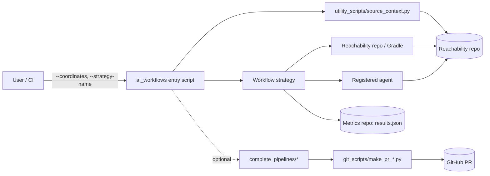
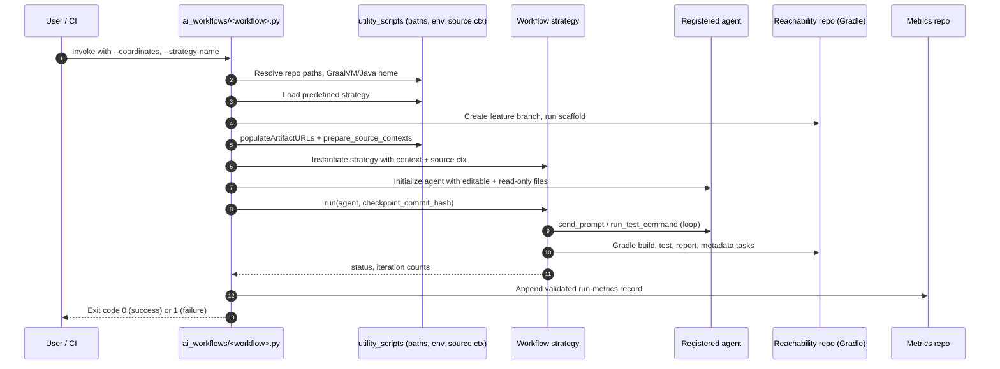

# Metadata Forge — Specification

## 1. Purpose

Metadata Forge automates the production and maintenance of GraalVM
**reachability metadata** for community Java/Kotlin/Scala libraries. It composes
LLM-based code-generation agents with deterministic build, test, and reporting
pipelines from the
[`oracle/graalvm-reachability-metadata`](https://github.com/oracle/graalvm-reachability-metadata)
repository (hereafter "the reachability repo") to produce metadata, tests, and
PRs ready for human review.

## 2. Scope

The project covers three primary task families:

1. **New library support** — generate a JUnit (or Kotlin/Scala) test suite,
   produce reachability metadata, and open a PR for a previously unsupported
   library.
2. **Library version bumps** — fix Java compilation and runtime failures that
   occur when raising a tested library to a new version.
3. **Coverage improvement** — increase dynamic-access coverage of
   already-supported libraries.

Out of scope: anything that does not produce reachability metadata or its
supporting tests for the reachability repo.

## 3. Glossary

| Term | Definition |
| --- | --- |
| **Reachability metadata** | JSON describing reflection, JNI, resource, serialization, and proxy access for a library, consumed by GraalVM `native-image`. |
| **Reachability repo** | Local checkout or worktree of `oracle/graalvm-reachability-metadata`. The build and metadata-generation Gradle tasks run inside it. The parent checkout of `forge/` is used by default. |
| **Metrics root** | Directory that stores per-run results validated against [schemas/](../schemas/). By default, this is the run worktree's `forge/` directory. |
| **Coordinate** | Maven coordinate of the target library, formatted `group:artifact:version`. |
| **Agent** | LLM-driven code editor (Aider, Codex, or Pi) registered through [ai_workflows/agents/](../ai_workflows/agents/). Each implements `send_prompt`, `run_test_command`, `clear_context`. |
| **Workflow strategy** | A registered control loop in [ai_workflows/workflow_strategies/](../ai_workflows/workflow_strategies/) (e.g. `basic_iterative`, `dynamic_access_iterative`). |
| **Predefined strategy** | Named, fully parameterized combination of agent + workflow strategy + prompts + parameters in [strategies/predefined_strategies.json](../strategies/predefined_strategies.json). Selected via `--strategy-name`. |
| **Dynamic access** | Reflection, JNI, resource access, serialization, or proxy use that GraalVM `native-image` cannot determine statically. |
| **Dynamic-access report** | JSON written by Gradle task `generateDynamicAccessCoverageReport` to `tests/src/<group>/<artifact>/<version>/build/reports/dynamic-access/dynamic-access-coverage.json`, listing classes and per-class call sites that require dynamic-access metadata, marked covered/uncovered. |
| **Source context** | Read-only files supplied to the agent. Types: `main` (library source), `test` (upstream tests), `documentation` (Javadoc). Selected by the strategy parameter `source-context-types`. |

## 4. Component Layout

```text
forge/
├─ ai_workflows/          # Workflow entry points and pluggable agents/strategies
│  ├─ agents/             # Agent implementations (aider, codex, pi)
│  └─ workflow_strategies/# Strategy implementations (basic_iterative, dynamic_access_iterative, ...)
├─ complete_pipelines/    # End-to-end: workflow + PR creation
├─ git_scripts/           # Branch, push, and PR-opening helpers
├─ utility_scripts/       # Source-context, metrics, schema, and report helpers
├─ strategies/            # `predefined_strategies.json`
├─ prompt_templates/      # Templates loaded by strategies
├─ schemas/               # JSON schemas for metrics validation
└─ docs/                  # This specification
```

## 5. High-Level Architecture



Key invariants:

- The agent **never** invokes Gradle directly. Build/test commands are issued
  by the strategy via `agent.run_test_command(...)`, which returns combined
  output to the strategy for analysis.
- All generated changes must live under the per-library directory
  `tests/src/<group>/<artifact>/<version>` of the reachability repo, plus that
  library's `metadata/<group>/<artifact>/index.json`.
- Every successful run writes a metrics record that validates against
  [schemas/evaluation_output_schema.json](../schemas/).

## 6. Top-Level Run Sequence



## 7. Configuration Contracts

### 7.1 CLI inputs (common to all entry scripts)

- `--coordinates <group:artifact:version>` — required.
- `--reachability-metadata-path` — overrides default reachability-repo clone.
- `--metrics-repo-path` — overrides default metrics-repo clone.
- `--in-metadata-repo` — deprecated compatibility no-op. Forge always runs
  from `graalvm-reachability-metadata/forge`, defaults the target repository
  to the parent checkout, and stores successful run metrics under
  `stats/<group>/<artifact>/<version>/execution-metrics.json`.
- `--strategy-name <name>` — selects an entry from `predefined_strategies.json`.
- `--docs-path` — additional read-only files for agent context.
- `-v` / `--verbose` — verbose agent output.
- `--keep-tests-without-dynamic-access` — only honored by dynamic-access
  strategies; see [dynamic-access-workflow.md](dynamic-access-workflow.md).

### 7.2 Predefined strategy schema

Each entry in `strategies/predefined_strategies.json` must provide:

- `name` — unique identifier passed via `--strategy-name`.
- `agent` — registered agent name (`aider`, `codex`, `pi`).
- `workflow` — registered workflow strategy name.
- `model` — agent-visible model identifier.
- `prompts` — map of prompt-key → template path. Required keys depend on the
  workflow (e.g., `dynamic_access_iterative` requires
  `dynamic-access-iteration`).
- `parameters` — workflow-specific parameters (iteration limits,
  `source-context-types`, etc.).
- `mcps` — optional list of MCP server names.

### 7.3 Environment

- Either `GRAALVM_HOME` or `JAVA_HOME` must point to a GraalVM distribution.
  Both variables are then aligned to that distribution. If neither does, the
  workflow exits with an error.
- `gh` CLI authenticated against the reachability repo is required for any
  script in `git_scripts/` or `complete_pipelines/`.

## 8. Outputs

- **Per-run metrics record** appended to
  `<metrics_repo>/{script_run_metrics,benchmark_run_metrics}/<workflow>.json`,
  schema-validated. Successful run metrics are written under
  `stats/<group>/<artifact>/<version>/execution-metrics.json`.
- **Generated tests + metadata + index.json** committed on the feature branch
  `ai/add-lib-support-<group>-<artifact>-<version>` in the reachability repo.
- **Pull request** (only when invoked through `complete_pipelines/` or
  `git_scripts/make_pr_*.py`).

## 9. Failure Semantics

Every workflow returns one of three statuses:

| Status | Meaning |
| --- | --- |
| `RUN_STATUS_SUCCESS` | All gates passed; metadata and tests committed. |
| `SUCCESS_WITH_INTERVENTION_STATUS` | Tests succeeded after a post-generation manual or scripted intervention; PR-eligible. |
| `RUN_STATUS_FAILURE` | The workflow could not converge or a quality gate failed; the feature branch is reset to the scaffold checkpoint and no PR is opened. |

The exit code is `0` for the first two and `1` for failure.

## 10. Workflow Specifications

- [Dynamic access workflow](dynamic-access-workflow.md) — guided test
  generation driven by the dynamic-access coverage report.
- [Native metadata exploration phase](native-metadata-exploration.md) —
  reusable phase that traces the test binary with `MetadataTracingSupport`
  and writes its results to a caller-supplied output directory. Used by the
  dynamic-access workflow after every iteration and by the native-run
  failure fix workflow.
- [Java compilation / runtime failure fix workflow](fix-java-run-fail.md)
  — version-bump fix workflow shared by `fix_javac_fail` and
  `fix_java_run_fail`. Integrates with the metadata exploration phase when
  the failure surfaces under `nativeTest`.
- (Future) Basic iterative workflow.
