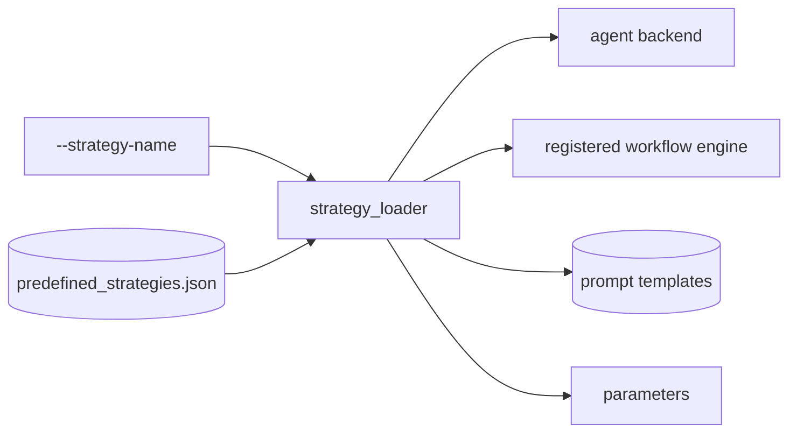

# STRAT-workflow-strategy-registry: Predefined strategy configuration architecture

The Forge strategy component is the set of named configuration bundles in
`forge/strategies/predefined_strategies.json`. A bundle does not define a new
project goal (§FS-forge-issue-resolution-goal) or workflow contract; it selects
a registered workflow engine, agent backend, model, prompt set, parameters,
optional MCPs, and optional persistent instructions for one run, following
§STRAT-forge-predefined-strategy-contract and preserving the boundary in
§AR-forge-strategy-agent-boundary.

This architecture is split into the normative configuration contract
(§STRAT-forge-predefined-strategy-contract), the loading boundary
(§STRAT-predefined-strategy-loader), bundle field shape
(§STRAT-predefined-strategy-fields), a representative configuration example
(§STRAT-predefined-strategy-example), the Java fail-fix composite case
(§STRAT-java-fail-fix-composite-strategy-config), parameter families
(§STRAT-predefined-strategy-parameter-families), and the extension rule
(§STRAT-predefined-strategy-extension).

## STRAT-forge-predefined-strategy-contract: Predefined strategy configuration contract

Each predefined strategy is a named configuration bundle, not a standalone
behavior contract. The bundle selects one registered workflow engine, one agent
backend, one model, prompt templates, workflow parameters, optional MCPs, and
optional persistent instructions. Workflow drivers and orchestration select these bundles by name
with `--strategy-name`; the behavior they execute remains defined by the
selected workflow contract (§WF-forge-workflow-system), while the selected
backend must satisfy the agent API specified in §AR-agent-api.

Each entry in `strategies/predefined_strategies.json` must provide:

- `name` — unique identifier passed via `--strategy-name`.
- `agent` — registered agent name (`codex`, `pi`).
- `workflow` — registered workflow engine name.
- `model` — agent-visible model identifier.
- `prompts` — map of prompt-key → template path. Required keys depend on the
  workflow (e.g., `dynamic_access_iterative` requires
  `dynamic-access-iteration`).
- `persistent-instructions` — optional prompt-template path for durable,
  workflow-wide rules that should be passed to the agent backend's persistent
  instruction layer instead of a normal user prompt. The template is rendered
  with the same substitution context as workflow prompts.
- `parameters` — workflow-specific parameters (iteration limits,
  `source-context-types`, and post-generation recovery tuning such as
  `post-generation-timeout-seconds` and `post-generation-test-output-chars`,
  etc.).
- `mcps` — optional list of MCP server names.

There is no `post-generation-intervention` bundle field. The post-generation
recovery sequence (Codex metadata fix, then Pi as a last resort) is built into
the workflow base class and is not selected per strategy; see the
**Post-generation intervention** glossary entry in §FS-forge-functional-spec.

## STRAT-predefined-strategy-loader: Strategy loading boundary

Workflow drivers pass `--strategy-name` to the strategy loader, which resolves the
matching JSON object, validates it against the schema, instantiates the selected
agent, resolves the registered workflow engine named by `workflow`, and
passes the prompt and parameter maps into that implementation. The loader owns
configuration selection; workflow architecture owns how the selected workflow
engine uses the configuration (see §AR-forge-workflow-boundary and
§WF-forge-workflow-architecture), including the dynamic-access strategy family
defined in §WF-dynamic-access-strategy-family that shares this loader.

## STRAT-predefined-strategy-fields: Strategy bundle fields

Every bundle has the same architectural shape: `name` is the externally
selected key; `workflow` selects a registered workflow engine; `agent` and
`model` select the editor backend and model; `prompts` maps workflow prompt
keys to template files; `parameters` supplies workflow limits and source
context choices; `mcps` enables optional MCP servers; and
`persistent-instructions` adds durable agent rules when present. Post-generation
recovery is built into the workflow base class and is not a bundle field
(§STRAT-forge-predefined-strategy-contract).

The currently configured source-context choices are `main`, `test`, and
`documentation`. The currently configured agent backends are `pi` and `codex`.
The currently configured workflows are `basic_iterative`,
`dynamic_access_iterative` (§WF-dynamic-access-workflow),
`optimistic_dynamic_access`, `increase_dynamic_access_coverage`
(§WF-improve-library-coverage), `javac_iterative`, and `java_run_iterative`
(§WF-java-fail-fix-workflow).

## STRAT-predefined-strategy-example: Representative predefined strategy bundle

The exact active bundle list lives in `forge/strategies/predefined_strategies.json`;
this document keeps one representative example to show the architecture shape
defined in §STRAT-forge-predefined-strategy-contract without duplicating the
configuration file. `library_update_dynamic_access_bulk_pi_gpt-5.5` selects the
`optimistic_dynamic_access` workflow (§WF-improve-library-coverage), the `pi`
agent, model `oca/gpt-5.5`, main-source read-only context, the
`optimistic-dynamic-access-iteration` prompt, and parameters for optimistic
iterations, test retries, source-context materialization, and the native-test
verification retry budget (§WF-native-test-verification-callers).

## STRAT-java-fail-fix-composite-strategy-config: Java fail-fix composite strategy configuration

Java fail-fix strategy bundles (§WF-java-fail-fix-workflow) that should repair
the version-bump failure and then improve dynamic-access coverage use the
`increase_dynamic_access_coverage` workflow (§WF-improve-library-coverage) as
the configured bundle workflow. The bundle's primary workflow is
`javac_iterative` for compilation-failure issues and `java_run_iterative` for
JVM runtime-failure issues; after that primary workflow succeeds, the composite
workflow engine runs the dynamic-access coverage phase defined by
§WF-dynamic-access-workflow. The concrete bundle names, prompt template paths,
models, and iteration limits remain configuration data in
`forge/strategies/predefined_strategies.json`, not workflow-spec content.

## STRAT-predefined-strategy-parameter-families: Parameter families

The basic iterative bundles set `max-test-iterations`,
`max-failed-generations`, and `max-successful-generations`. Java-fix bundles
set `max-test-iterations` and `source-context-types`. Per-class dynamic-access
bundles set `max-iterations`, `max-class-test-iterations`, and
`source-context-types`. Optimistic dynamic-access bundles set
`max-optimistic-iterations`, `max-test-iterations`, and `source-context-types`;
Graphify variants also set `graphify-context`, and
`library_update_dynamic_access_bulk_pi_gpt-5.5` also sets
`max-native-test-verification-iterations`, used by
§WF-native-test-verification-callers. Composite coverage bundles combine the
primary workflow's limits with dynamic-access limits so the selected primary
workflow can run first and the coverage phase
(§WF-improve-library-coverage) can run afterward.

## STRAT-predefined-strategy-extension: Adding or changing a strategy bundle

Changing a strategy means changing a predefined configuration entry
(§STRAT-forge-predefined-strategy-contract) unless the desired behavior cannot
be expressed by selecting an existing registered workflow, prompt set,
parameters, agent, model, MCP list, or persistent instructions. New behavior
belongs in the workflow
architecture first (§WF-forge-workflow-architecture); the strategy configuration
should only expose it as a named bundle after the workflow contract and
implementation boundary are clear (§AR-forge-extension-points).
