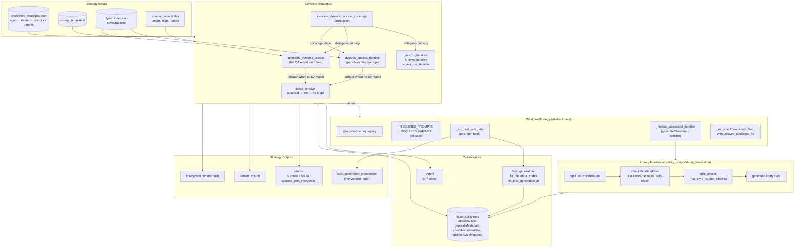

# Workflow Strategies

> **See also:** [Architecture](architecture.md) · [Functional spec](functional-spec.md) ·
> [Dynamic-access strategy](dynamic-access-strategy.md)

A *workflow strategy* is the control loop that drives an
[`Agent`](../ai_workflows/agents/agent.py) through generation, build, and test
iterations for one library. Each entry script in `ai_workflows/` instantiates
exactly one strategy (resolved via `--strategy-name` against
[`predefined_strategies.json`](../strategies/predefined_strategies.json)) and
calls its `run(agent, ...)` method.

This document describes the strategy registry, the responsibilities shared by
the base class, and the concrete strategies shipped today.

## 1. Component Diagram

## 2. Base Class Contract

[`WorkflowStrategy`](../ai_workflows/workflow_strategies/workflow_strategy.py)
provides:

- **Registry**: `@WorkflowStrategy.register("name")` adds the subclass to
  `_registry`; `WorkflowStrategy.get_class("name")` resolves it.
- **Validation**: subclasses declare `REQUIRED_PROMPTS` and `REQUIRED_PARAMS`;
  `__init__` raises if the strategy config from `predefined_strategies.json`
  is missing any.
- **Prompt rendering**: `_load_prompt` / `_render_prompt` substitute base
  context (`library`, `version`, …) plus per-iteration extras into templates
  loaded by [`strategy_loader`](../utility_scripts/strategy_loader.py).
- **Post-generation hook**: `_run_test_with_retry(library)` runs
  `./gradlew test`. On failure it invokes
  [`fix_metadata_codex`](../ai_workflows/fix_metadata_codex.py); if Codex
  doesn't converge, it falls back to
  [`fix_post_generation_pi`](../ai_workflows/fix_post_generation_pi.py),
  which removes failing tests and writes an intervention report. Returns
  `RUN_STATUS_SUCCESS`, `RUN_STATUS_FAILURE`, or
  `SUCCESS_WITH_INTERVENTION_STATUS` and populates
  `self.post_generation_intervention`.
- **Iteration finalization**: `_finalize_successful_iteration` runs
  `generateMetadata` (with `--agentAllowedPackages=fromJar`),
  `_run_test_with_retry`, then delegates to
  [`library_finalization.run_library_finalization`](../utility_scripts/library_finalization.py)
  before committing the iteration. Returns
  `(status, checkpoint_commit_hash)`.
- **Library finalization** (shared utility): in order,
  `./gradlew splitTestOnlyMetadata`, `checkMetadataFiles` with
  allowed-packages auto-repair, `run_style_fix_and_checks`, and
  `./gradlew generateLibraryStats`. Any failure aborts the iteration.
- **Allowed-packages auto-repair**:
  `_run_check_metadata_files_with_allowed_packages_fix` (used by
  `library_finalization`) runs `checkMetadataFiles` and, on `TypeReached:`
  errors, appends missing packages to the library's `index.json` (up to
  3 attempts).

All concrete strategies expect `library` (coordinates),
`reachability_repo_path`, and a starting `checkpoint_commit_hash`.

## 3. Concrete Strategies

### 3.1 `basic_iterative`

[`basic_iterative_strategy.py`](../ai_workflows/workflow_strategies/basic_iterative_strategy.py)

- **Required prompts**: `initial`, `after-successful-iteration`,
  `after-failed-iteration`.
- **Required params**: `max-test-iterations`, `max-failed-generations`,
  `max-successful-generations`.
- **Loop**: outer counters track failed and successful generations. The inner
  test loop (`max-test-iterations` per generation) tries to either reach
  `nativeTest` or pass tests. On a non-`nativeTest` failure the agent receives
  the test output via `after-failed-iteration`; on success the iteration is
  finalized, committed, the checkpoint advances, and the agent context is
  cleared. Repeated failures reset the working tree to the checkpoint and
  increment the failed counter.
- **Stops**: when `max-failed-generations` or `max-successful-generations` is
  reached.
- **Returns**: `(status, global_iterations, unittest_number)`.

### 3.2 `dynamic_access_iterative`

[`dynamic_access_iterative_strategy.py`](../ai_workflows/workflow_strategies/dynamic_access_iterative_strategy.py)

- **Required prompts**: `dynamic-access-iteration`.
- **Required params**: `max-iterations` (per uncovered class),
  `max-class-test-iterations`.
- **Loop**: parses `dynamic-access-coverage.json`; iterates over classes with
  uncovered call sites. For each class it renders the iteration prompt with
  uncovered call-site lists and the coverage delta, runs the inner test loop,
  regenerates the report on success, and advances the checkpoint when
  coverage increases (even partially). A class is "exhausted" after
  `max-iterations` without progress.
- **Composition**: when no DA report exists or it has zero DA calls, falls
  back to `basic_iterative` via
  `load_strategy_by_name("basic_iterative_pi_gpt-5.4")`.
- **Returns**: `(status, global_iterations, 1)`.

### 3.3 `optimistic_dynamic_access`

[`optimistic_dynamic_access_strategy.py`](../ai_workflows/workflow_strategies/optimistic_dynamic_access_strategy.py)

- **Required prompts**: `optimistic-dynamic-access-iteration`.
- **Required params**: `max-optimistic-iterations`, `max-test-iterations`.
- **Loop**: each outer iteration shows the agent the *full* DA report (all
  uncovered call sites) in a single prompt, then runs the inner test loop. On
  success the report is regenerated and the iteration is committed. Stops
  early when every call site is covered.
- **Composition**: same DA-missing fallback to `basic_iterative` as above.
- **Returns**: `(status, prompt_iterations, successful_iterations)`.

### 3.4 `increase_dynamic_access_coverage` (composite)

[`increase_dynamic_access_coverage_strategy.py`](../ai_workflows/workflow_strategies/increase_dynamic_access_coverage_strategy.py)

- **Required prompts / params**: none directly — both are delegated to the
  primary workflow.
- **Behaviour**: instantiates a primary strategy (named via
  `primary-workflow` in the strategy config — e.g. `javac_iterative`,
  `java_run_iterative`, or `optimistic_dynamic_access`) and runs it. If the
  primary succeeds, runs `dynamic_access_iterative`'s per-class coverage
  phase to lift coverage further. If the primary fails, returns its result
  unchanged. Iteration counts are merged.
- **Intervention**: inherits the primary's `post_generation_intervention` if
  it set one.

### 3.5 `javac_iterative` / `java_run_iterative`

[`java_fix_iterative_strategy.py`](../ai_workflows/workflow_strategies/java_fix_iterative_strategy.py)

- Two registrations of the same base — `javac_iterative` (compile-fix mode)
  and `java_run_iterative` (JVM-runtime-fix mode). They differ only in
  prompt context and log prefix.
- **Required prompts**: `initial`. **Required params**: `max-test-iterations`.
- **Loop**: runs an initial Gradle test, ships the captured error to the
  agent via the `initial` prompt, then loops (up to `max-test-iterations`):
  re-run the test; if `nativeTest` is reached or the build passes, return
  success; otherwise feed the failure output back to the agent and retry. No
  internal checkpointing — these strategies operate on PRs that already have
  a baseline. The agent context is cleared at the end.
- **Returns**: `(status, global_iterations)`.
- **Inputs**: expects `updated_library` (the new coordinates) and
  `reachability_repo_path`.

## 4. Predefined Strategies

[`predefined_strategies.json`](../strategies/predefined_strategies.json)
binds each workflow strategy to an agent, a model, prompt template paths, and
parameter values. The `--strategy-name` passed to an entry script names one
of these bundles. Examples grouped by underlying workflow strategy:

| Workflow strategy | Predefined strategy entries |
| --- | --- |
| `basic_iterative` | `basic_iterative_pi_gpt-5.4`, `codex_iterative_codex_gpt-5.4` |
| `dynamic_access_iterative` | `dynamic_access_main_sources_*`, `dynamic_access_test_sources_*`, `dynamic_access_documentation_sources_*`, `dynamic_access_main_sources_with_tests_*`, `dynamic_access_main_sources_with_documentation_*`, `dynamic_access_main_sources_with_tests_and_documentation_*`, `dynamic_access_test_sources_with_documentation_*` (each with `pi`/`codex` agent and a model suffix) |
| `optimistic_dynamic_access` | (selected internally as the primary in composite entries) |
| `increase_dynamic_access_coverage` | `javac_iterative_with_coverage_sources_pi_gpt-5.4`, `javac_iterative_with_coverage_sources_pi_gpt-5.5`, `java_run_iterative_with_coverage_sources_pi_gpt-5.5`, `optimistic_dynamic_access_iterative_pi_gpt-5.4` |
| `javac_iterative` | `javac_iterative_sources_pi_gpt-5.4` |
| `java_run_iterative` | `java_run_iterative_sources_pi_gpt-5.4` |

Naming convention: `<workflow>_<source-context>_<agent>_<model>`. The
`source-context` segment selects which JARs (main / tests / documentation /
combinations) `source_context` materializes for the agent.

## 5. Adding a New Strategy

1. Subclass `WorkflowStrategy` under
   [`ai_workflows/workflow_strategies/`](../ai_workflows/workflow_strategies/).
2. Decorate the class with `@WorkflowStrategy.register("name")` and declare
   `REQUIRED_PROMPTS` / `REQUIRED_PARAMS`.
3. Implement `run(agent, **kwargs)`. Reuse `_run_test_with_retry`,
   `_finalize_successful_iteration`, and
   `_run_check_metadata_files_with_allowed_packages_fix` rather than
   reimplementing build/commit logic.
4. Add prompt templates under [`prompt_templates/`](../prompt_templates/).
5. Add one or more entries to
   [`strategies/predefined_strategies.json`](../strategies/predefined_strategies.json)
   that bind the new workflow name to an agent, model, prompts, and
   parameters.
