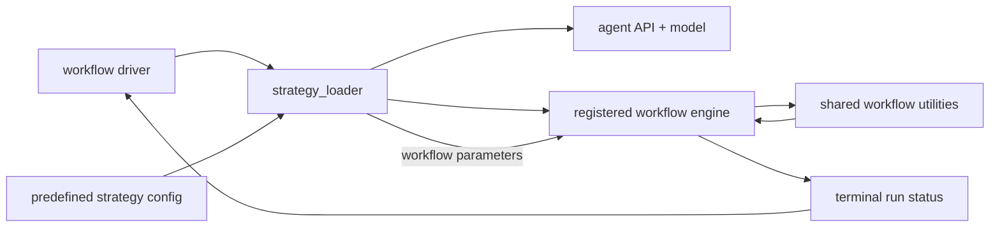

# WF-forge-workflow-system: Forge workflow system specification

Forge workflows are the behavioral contracts for resolving supported issue
queues (§FS-forge-issue-resolution-goal). A workflow defines the inputs it
accepts, the generated tests and metadata it may change, the verification gates
it must pass, and the terminal status it returns to orchestration
(§ORCH-forge-orchestration-spec). Every workflow must preserve durable logs
(§FS-durable-generation-logs) for each agent session, generation step, and
deterministic command that contributes to the run. Workflow specs describe what
must happen; the implementation architecture is described below
(§WF-forge-workflow-architecture) and in the per-component architecture docs.

The workflow spec set covers workflow drivers (§WF-forge-workflow-drivers),
new library support (§WF-add-new-library-support, with its basic-iterative
fallback §WF-basic-iterative), dynamic-access generation
(§WF-dynamic-access-workflow), Java failure repair
(§WF-java-fail-fix-workflow), native-image run repair
(§WF-native-image-run-fix-workflow), native metadata tracing and verification
(§WF-native-metadata-tracing), dynamic-access coverage improvement
(§WF-improve-library-coverage), and planned code coverage improvement
(§WF-code-coverage-improvement).

# WF-forge-workflow-architecture: Forge workflow system architecture

The workflow layer is Forge's core execution layer. Implementation
(§WF-forge-workflow-system) is split between driver scripts
(§WF-forge-workflow-drivers, §AR-forge-workflow-boundary), predefined strategy
configuration (§AR-forge-strategy-agent-boundary), registered workflow engines,
shared utility modules, and publication handoff
(§AR-forge-verification-publication-boundary, §GIT-forge-publication). Workflow
drivers perform setup and finalization for one claimed issue; the selected
workflow engine owns the state-machine-like process that sends prompts through
the agent API (§AR-agent-api), runs verification commands, interprets results,
advances or retries states, and returns a terminal run status; predefined
strategies select which workflow, agent, model, prompts, and workflow parameters
are used for that run. Shared utilities provide source context, dynamic-access
report parsing, native metadata exploration, native-test verification, metrics,
and quality checks; git scripts publish only PR-eligible results.

The layer should model issue resolution as a bounded state machine: prepare
context, call the configured agent with workflow-specific prompts, run the next
deterministic gate, decide whether to retry, advance, fail, or succeed, then
report one terminal status to the workflow driver. Strategy configuration
(§STRAT-forge-predefined-strategy-contract, §STRAT-workflow-strategy-registry)
is data that chooses the engine and its parameters; it is not the place where
issue-resolution behavior lives, and queue dispatch stays in the orchestration
layer (§ORCH-forge-orchestration-spec). The planned code coverage workflow
follows the same split (§WF-code-coverage-improvement-architecture).

## WF-forge-workflow-engine: Workflow engines own run state

Registered workflow engines live under `ai_workflows/core/` — the core
workflow objects of the system. `ai_workflows/workflow_strategies/` is a
compatibility import layer after the relocation by
§ROADMAP-forge-ai-workflows-structure. Architecturally they are workflow
implementations. A workflow engine receives an agent, rendered prompt
configuration, workflow parameters, repository paths, coordinate context, and
run metadata. It owns the ordered run state: checkpointing, prompt/command
cycles, local gate interpretation, retry budgets, failure handoff, metrics
updates, and terminal status selection. The agent object is the backend-neutral
API described by the agent architecture, not a workflow-specific implementation
detail (§AR-agent-api).

Workflow drivers should not embed workflow state machines
(§WF-forge-workflow-drivers, §AR-forge-workflow-boundary).
They prepare the environment, resolve the configured bundle, instantiate the
selected workflow engine, and finalize metrics and generated artifacts after
the engine returns. Queue claiming and PR publication remain outside the
workflow engine (§AR-forge-verification-publication-boundary).

## WF-forge-workflow-strategy-config: Strategies configure workflow runs

A predefined strategy (§STRAT-forge-predefined-strategy-contract) is the named
configuration surface for a workflow run. It selects the registered workflow
engine, agent backend, model, prompt templates, workflow parameters, optional
MCPs, and optional persistent instructions. Changing a strategy should change how an existing workflow is
parameterized or which engine it selects; changing workflow behavior belongs
in the workflow implementation and its spec first
(§STRAT-workflow-strategy-registry).

Workflow parameters are interpreted by the selected workflow engine. For
example, retry budgets, source-context selections, dynamic-access limits, and
verification limits tune transitions inside the engine's state machine. The
strategy bundle stores those values so operators can select a repeatable
service profile without changing the implementation
(§STRAT-forge-predefined-strategy-contract).
