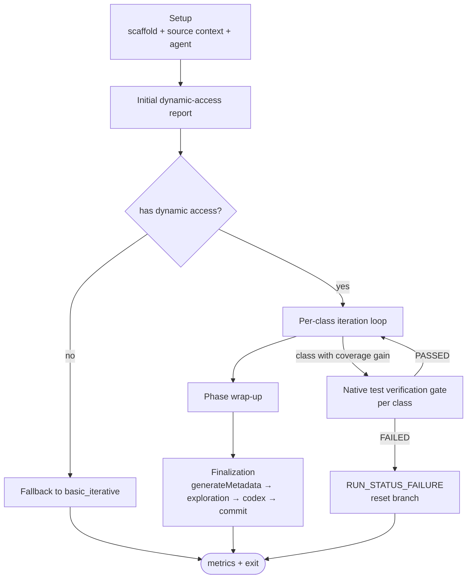
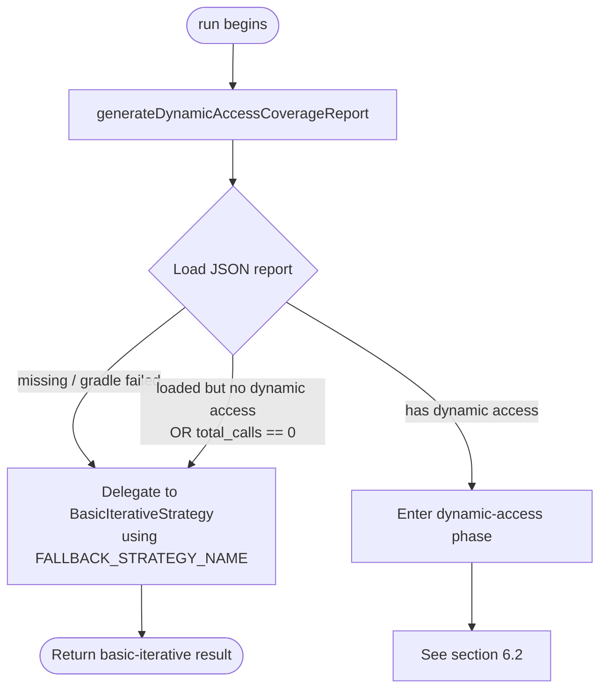
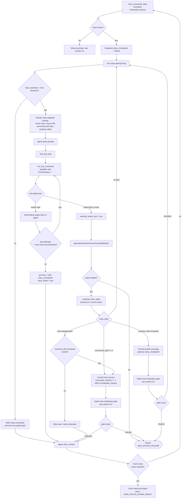
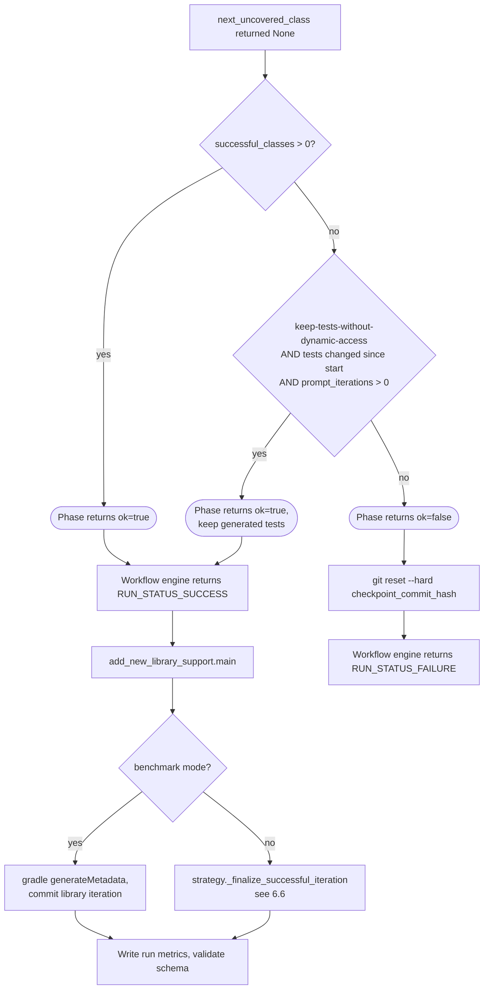
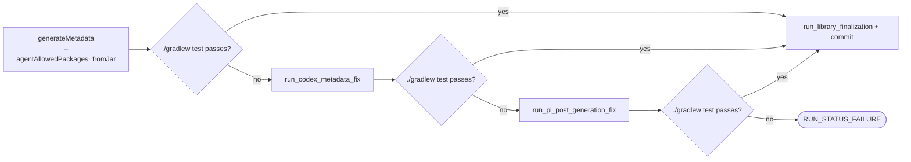

# WF-dynamic-access-workflow: Dynamic-access workflow specification

The dynamic-access workflow is part of the Forge workflow system
(§WF-forge-workflow-system).

## 1. Purpose

The dynamic-access workflow family generates or improves JUnit/Kotlin/Scala
tests for a target library so that **dynamic-access call sites** reported by
the reachability repo's coverage tool are exercised at runtime. Coverage of
those call sites is required before reachability metadata can be generated
automatically. Dynamic-access strategies may work class-by-class, across the
whole report in one broad pass, or as a composite that runs a broad pass before
class-by-class refinement (§GOAL-maximize-library-coverage).

### WF-dynamic-access-strategy-family: Dynamic-access strategy family

Forge currently has three registered dynamic-access workflow engines:

| Registered workflow | Role | Strategy examples |
| --- | --- | --- |
| `dynamic_access_iterative` | Per-class dynamic-access generation or refinement. It selects one uncovered class at a time, prompts with that class's remaining call sites, verifies coverage deltas, and commits resolved or partially resolved class progress (§WF-dynamic-access-iterative-strategy). | `dynamic_access_*`, `library_update_pi_gpt-5.5` |
| `optimistic_dynamic_access` | Bulk dynamic-access generation or refinement. It gives the agent the full dynamic-access report and asks for a broad coverage pass, then verifies tests, regenerates the report, commits the attempt, and runs the native-test verification gate (§WF-dynamic-access-bulk-strategy). | `dynamic_access_bulk_*`, `dynamic_access_graphify_bulk_*`, `library_update_dynamic_access_bulk_pi_gpt-5.5` |
| `increase_dynamic_access_coverage` | Composite coverage workflow. It optionally runs a configured primary workflow first, then runs the iterative dynamic-access phase against any remaining uncovered call sites (§WF-dynamic-access-composite-strategy). | `optimistic_dynamic_access_iterative_*`, `library_update_optimistic_pi_gpt-5.5`, Java-fix composite strategies |

All three engines are selected by predefined strategy bundles. The strategy
bundle chooses the engine, agent, model, prompt templates, source-context
types, retry budgets, optional Graphify context, and native-test verification
budget; the workflow engine owns the behavior described in this document
(§STRAT-forge-predefined-strategy-contract).

#### WF-dynamic-access-iterative-strategy: Iterative dynamic-access strategy

`dynamic_access_iterative` is the required engine when Forge must make
class-scoped, reviewable progress through a dynamic-access report. It generates
the initial dynamic-access report, falls back to the basic iterative workflow
only when no usable report exists at the start, then loops over uncovered
classes. Each selected class receives bounded prompt attempts, bounded test
repair attempts, coverage-delta checks, per-class checkpointing, and native-test
verification after each configured batch of coverage-gain commits.

The iterative engine may return `RUN_STATUS_CHUNK_READY` when chunked issue
orchestration gave it a class limit and the current chunk passed all local
verification gates. Otherwise it returns success only when the dynamic-access
phase made acceptable progress and finalization succeeds.

#### WF-dynamic-access-bulk-strategy: Bulk dynamic-access strategy

`optimistic_dynamic_access` is the bulk engine. It is used when Forge should
give the agent the full dynamic-access report and ask for a broad pass rather
than guiding it class by class. Bulk strategies are useful as a fast first
attempt, for library-update coverage improvement, and for Graphify-assisted
runs where a larger source graph is supplied as context
(§GOAL-shorten-issue-to-shipped-metadata).

The bulk engine refreshes the dynamic-access report before prompting. If the
initial report is missing, unparsable, disabled, or empty, it falls back to the
basic iterative metadata flow. After a bulk prompt, test failures before
`nativeTest` are sent back to the agent until the configured test-retry budget
is exhausted. If the test-retry budget is exhausted before reaching
`nativeTest`, the engine resets to its checkpoint and may try the next bulk
iteration. Once an iteration reaches `nativeTest`, it regenerates the report,
commits the test-source attempt, and runs the native-test verification gate.
A failed native-test gate is a hard workflow failure. The bulk engine succeeds
only if at least one bulk iteration reached this accepted state.

#### WF-dynamic-access-composite-strategy: Composite dynamic-access strategy

`increase_dynamic_access_coverage` is the composite engine. If the strategy
defines `primary-workflow`, the composite runs that workflow first. A failing
primary workflow is returned unchanged and the dynamic-access coverage phase is
skipped. A successful primary workflow is followed by the iterative
dynamic-access phase, using the same strategy bundle's dynamic-access prompt
and limits. If no `primary-workflow` is configured, the composite starts
directly with the iterative dynamic-access phase.

The composite engine is used for two different service profiles: optimistic
plus iterative strategies, where the bulk engine is the primary and the
iterative phase refines remaining call sites; and library-update coverage
strategies, where Forge improves dynamic-access coverage on existing tests
without first generating a new library test suite.

### WF-dynamic-access-fallback-and-failure: Required fallback and failure behavior

Dynamic-access fallback is intentionally narrow. The iterative and bulk engines
may delegate to the basic iterative metadata workflow only when the initial
dynamic-access report cannot provide guidance: the Gradle report task fails,
the report file is missing or unparsable, dynamic-access reporting is disabled,
or the report has zero dynamic-access calls. Once a dynamic-access phase has
started from a usable report, losing the report is a workflow failure, not a
fallback condition.

Dynamic-access workflows must fail when any of these conditions occur:

1. A required native-test verification gate returns `FAILED`.
2. The dynamic-access report disappears or becomes unreadable after the
   workflow has started using dynamic-access guidance.
3. The iterative phase makes no acceptable progress and
   `--keep-tests-without-dynamic-access` was not requested.
4. Final metadata generation, local CI-equivalent verification, or metrics
   validation fails.
5. Chunked mode reaches a chunk boundary but cannot pass the local
   CI-equivalent verification required for a reviewable chunk PR.

Failures return `RUN_STATUS_FAILURE` and the driver resets the feature
branch to the scaffold checkpoint. A composite workflow with a primary workflow
preserves and returns the primary workflow failure instead of starting the
dynamic-access coverage phase.

## 2. Inputs

Every dynamic-access run shares a small set of inputs; the rest are supplied by
the selected strategy bundle and differ by engine. The sections below state
what each engine *needs*, rather than enumerating every context key the
driver may thread through.

### 2.1 Common to every engine

| Input | Source |
| --- | --- |
| Maven coordinate `group:artifact:version` | `--coordinates` |
| Reachability repo path | `--reachability-metadata-path` (default: parent checkout of `forge/`) |
| Strategy bundle | `--strategy-name <name>`, selecting one dynamic-access bundle |
| Source-context types | strategy parameter `source-context-types`; downloaded into the agent's read-only context (§4) |
| Native-test verification budget | strategy parameter `max-native-test-verification-iterations` (default 100) |

### 2.2 Iterative engine (`dynamic_access_iterative`)

The per-class engine additionally needs a per-class attempt cap
(`max-iterations`), a per-class test-repair cap (`max-class-test-iterations`),
the class prompt template (`prompts["dynamic-access-iteration"]`, see §6.2),
and an optional native-test batch size (`native-test-verification-batch-size`,
default 5, must be `>= 1`). `--keep-tests-without-dynamic-access` is honored
only by this engine.

### 2.3 Bulk engine (`optimistic_dynamic_access`)

The bulk engine needs a bulk-iteration cap (`max-optimistic-iterations`), a
bulk test-repair cap (`max-test-iterations`), and the full-report prompt
template (`prompts["optimistic-dynamic-access-iteration"]`).

### 2.4 Composite engine (`increase_dynamic_access_coverage`)

The composite engine reuses the iterative engine's inputs and adds an optional
`primary-workflow` field naming the workflow to run before the iterative
coverage phase.

### 2.5 Chunked issue runs

Issue-driven runs add a chunk class count computed by `forge_metadata.py`. It
is required only for chunked `library-new-request` / `library-update-request`
work and is absent for direct CLI invocations.

## 3. Outputs

- New or updated test sources under
  `tests/src/<group>/<artifact>/<version>/src/test/<lang>` in the reachability
  repo. Iterative generation creates one test class file per dynamic-access
  report class; bulk generation may edit or create tests across the coordinate
  in one broad pass. Iterative test class naming substitutes `$<digit>` with
  `Anonymous<digit>` and `$<name>` with `Inner<name>` to avoid `$` in filenames.
- Iterative runs produce one git commit per resolved or partially resolved
  class. Bulk runs produce one commit per accepted broad-pass iteration.
- A final **metadata commit** produced by the standard `_finalize_successful_iteration`
  / `generateMetadata` step (in benchmark mode, only `generateMetadata` runs).
- A per-run metrics record persisted to
  `stats/<group>/<artifact>/<version>/execution-metrics.json`; in-flight metrics
  are staged transiently in the run worktree's `forge/` directory as
  `.pending_metrics.json`.
- For chunked issue runs, an updated dynamic-access exhaust report that records
  the classes already completed, skipped, exhausted, or failed and the current
  chunk PR/commit metadata needed by Forge to resume safely after merge
  (§WF-dynamic-access-exhaust-report).

## 4. Preconditions and Setup

The following preconditions are established by `add_new_library_support.main`
*before* the strategy's `run(...)` is called:

1. Repository paths and GraalVM/Java environment resolved.
2. Feature branch `ai/add-lib-support-<group>-<artifact>-<version>` checked out.
3. Gradle `scaffold` task executed for the coordinate.
4. Gradle `populateArtifactURLs` task executed so that `index.json` carries
   `source-code-url`, `test-code-url`, and `documentation-url` as required.
5. `prepare_source_contexts(...)` has downloaded and extracted the artifacts
   declared by the strategy's `source-context-types`. Their files become the
   agent's read-only context.
6. Scaffold commit recorded as `checkpoint_commit_hash`. Failure recovery
   uses `git reset --hard <checkpoint_commit_hash>`.

## 5. State Model

### 5.1 Core per-run state

State held for one strategy `run(...)` invocation, independent of chunking:

- `current_report` — most recent `DynamicAccessCoverageReport` (`None` triggers
  fallback or hard failure depending on phase).
- `previous_report` — prior report; used for delta computation.
- `exhausted_classes: set[str]` — classes resolved, or retried up to
  `max-iterations` without resolution, during *this* run. They are not retried
  again within the run.
- `class_checkpoint` — git SHA captured before each class attempt; used to roll
  back a failed class iteration without losing previously committed classes.
- `prompt_iterations` — total agent prompts sent (returned to the caller as
  `global_iterations`).
- `successful_classes` — count of classes that contributed at least one newly
  covered call site and whose test changes were committed.

### 5.2 Chunked-run state

Chunked issue runs layer two more fields on top of the core state; direct CLI
runs never populate them (§WF-dynamic-access-exhaust-report):

- `chunk_exhaust_report` — durable, coordinate-derived state persisted across
  chunk PRs. At run start it seeds `exhausted_classes` with the classes earlier
  chunks already completed, skipped, exhausted, or failed, and it is updated as
  the current chunk processes each class. It is the durable counterpart of the
  in-memory `exhausted_classes` set — the two are kept distinct on purpose:
  `exhausted_classes` is what *this* run must skip, while the exhaust report is
  what *every future* run must skip.
- `chunk_class_count` — maximum number of newly selected dynamic-access classes
  this chunk may process. `forge_metadata.py` computes it from the global class
  threshold and the number of unexhausted classes remaining. A class is never
  split across chunks.

## 6. Workflow

At a glance:



The subsections below specify each box. §6.1 covers the fallback decision,
§6.2 the per-class loop, §6.3 mid-run report failures, §6.4 the per-class
native-test verification gate, §6.5 wrap-up, and §6.6 the finalization
order.

### 6.1 Phase 1 — Initial report and fallback decision



The fallback strategy is `basic_iterative_pi_gpt-5.4` (constant
`FALLBACK_STRATEGY_NAME` in `dynamic_access_iterative_strategy.py`). The
fallback runs only when no usable dynamic-access guidance exists at the
**start** of the run; once Phase 2 begins, a missing report mid-run is a hard
failure (see 6.3).

### 6.2 Phase 2 — Per-class iteration

The phase loops over uncovered classes selected from the current report,
skipping any class in `exhausted_classes`. For each selected class, an inner
loop sends the agent up to `max-iterations` targeted prompts; after each
prompt, tests are retried up to `max-class-test-iterations` times before the
class is rolled back. In chunked issue mode, the loop also stops after
processing the `chunk_class_count` selected classes for the current invocation.



Notes on the inner test-retry loop:

- "First failed task" is computed by parsing Gradle's failure summary. Tasks
  before `nativeTest` (typically `compileTestJava`, `test`, etc.) signal that
  the new code is broken and the agent receives the failing output. Reaching
  `nativeTest` is treated as success for this stage even if `nativeTest`
  itself fails — coverage data is the deciding signal.
- If the test retry budget is exhausted without ever reaching `nativeTest`,
  the class is rolled back to `class_checkpoint`, preserving prior committed
  classes.
- In chunked mode, "processed" means a selected class was completed, skipped,
  exhausted, or failed and recorded in the exhaust report. Classes from prior
  chunks are never selected again unless a human edits the exhaust report.

#### Class prompt shape

Each attempt renders the strategy's `dynamic-access-iteration` template. The
template is deliberately narrow: it names one class, shows the agent what its
last attempt changed, and lists exactly the call sites still missing. A
rendered prompt looks like:

```text
Task:
Improve test coverage for the active dynamic-access class in `com.example:lib:1.2.3`.

Source Context:
<one line per prepared artifact — the read-only sources from §4>

Active class:
- Class: com.example.internal.BeanReader
- Source file: com/example/internal/BeanReader.java

Progress since the previous dynamic-access report:
+3 call sites newly covered on this class (attempt 2)

Remaining uncovered dynamic-access call sites for this class:
- BeanReader.read(JsonParser) -> java.lang.Class.forName
- ...

Rules:
- Add or refine tests so execution reaches the remaining uncovered call sites.
- Focus on the active class only.
```

| Field | Filled from | What it tells the agent |
| --- | --- | --- |
| `{library}` | the run coordinate | The `group:artifact:version` under test. |
| `{source_context_overview}` | `prepare_source_contexts` (§4) | Which read-only sources it may consult. |
| `{active_class_name}` | `next_uncovered_class` selection | The single class this attempt must cover. |
| `{active_class_source_file}` | the class's resolved source path | Where the uncovered code lives. |
| `{dynamic_access_progress}` | `compute_class_delta(previous, current)` | What the *previous* attempt covered — the feedback signal that coverage is moving (or stalled). |
| `{uncovered_dynamic_access_calls}` | `format_call_sites` of the class's remaining sites | The exact call sites the new tests must reach. |

The bulk engine renders `optimistic-dynamic-access-iteration` instead, which
replaces the per-class `{active_class_*}` and `{uncovered_dynamic_access_calls}`
fields with the full dynamic-access report.

### 6.3 Coverage report mid-run failure

A missing or unparsable `dynamic-access-coverage.json` after the initial
phase is a hard failure: the workflow engine returns `RUN_STATUS_FAILURE` with
the prompt-iteration count, and the workflow driver resets the branch to
`checkpoint_commit_hash`.

### 6.4 Per-class native-test verification gate

After every per-class iteration that committed a coverage gain — i.e. the
**Resolved** or **PartialCommit** branches in §6.2 — the workflow engine queues
one native-test verification step (§WF-native-test-verification-callers). When
the queue reaches `native-test-verification-batch-size` (default `5`), the
workflow engine invokes the native test verification gate for the current
coordinate (§WF-native-test-verification-gate) with

```text
output_dir = tests/src/<group>/<artifact>/<version>/build/natively-collected/<class-key>/
```

where `<class-key>` is a sanitized form of the class name the per-class
iteration that triggered the batch flush just resolved or advanced, with a
batch suffix when the flush contains more than one class step. If the loop
finishes, or a chunk class boundary is reached, with fewer than the configured
number of queued class steps, the strategy flushes that partial batch before
returning. The gate always starts with the normal JVM-agent metadata path, but
writes that output to a per-gate staging directory:

```text
./gradlew generateMetadata -Pcoordinates=<g:a:v> --agentAllowedPackages=fromJar --metadataOutputDir=<output_dir>/agent
./gradlew test -Pcoordinates=<g:a:v> -PmetadataConfigDirs=<output_dir>/agent
```

If the coordinate passes, the gate returns `PASSED` without native tracing.
If the test fails before `nativeTest`, the gate routes directly to Codex
because tracing cannot repair compilation or JVM-mode test failures. Native
tracing is used only as a fallback when `nativeTest` still fails after
JVM-agent metadata was generated. The fallback runs bounded
`runNativeTraceImage` cycles, feeds accepted trace dirs back through
`metadataConfigDirs`, and routes stalled, exhausted, timed-out, or otherwise
failed tracing to Codex. Pi is not part of this gate.

Effects within this workflow:

1. The gate keeps metadata cumulative. JVM-agent output is written to the
   gate-local `<output_dir>/agent` directory; if native tracing was needed,
   merged trace output is written to `<output_dir>/trace`. Only after the
   gate passes are existing durable metadata, staged agent metadata, and
   staged trace metadata merged into the durable
   `metadata/<group>/<artifact>/<version>/` directory.
2. The dynamic-access coverage report is regenerated **after** the gate so
   that any call sites covered by JVM-agent, traced, or Codex-supplied metadata are
   reflected in the next class's prompt delta.
3. **A `FAILED` gate result aborts the workflow with `RUN_STATUS_FAILURE`**
   (§WF-native-test-verification-gate).
   Native Image must always work; partial dynamic-access coverage with a
   broken `nativeTest` is not an acceptable terminal state. The entry
   script resets the feature branch to `checkpoint_commit_hash`, records
   the gate's `last_native_test_log_path` and `intervention_records` in
   the run metrics, and exits non-zero.
4. Metadata remains cumulative across chunks. The gate's final durable merge
   includes any existing durable metadata from prior merged chunk PRs and the
   staged metadata generated for the current chunk.

The gate is a reusable component. The Java fail-fix workflow uses the same gate
as its terminal success criterion (§WF-native-test-verification-callers).

### 6.5 Phase wrap-up and post-workflow finalization



### 6.6 Finalization order

`_finalize_successful_iteration` runs in this order:



Finalization regenerates metadata, then runs the post-generation test lane
`_run_test_with_retry`: a failing `./gradlew test` triggers Codex metadata
fixup, and if Codex cannot recover, Pi removes the offending tests as a last
resort before the run fails. Native tracing is **not** part of finalization —
it runs earlier, in the per-class native test verification gate (§6.4,
§WF-native-test-verification-gate), which is where missing reachability
metadata is collected from a real native run.

The `--keep-tests-without-dynamic-access` flag is the only mechanism for
producing a successful run when no class achieved coverage gain. It is
intended for offline evaluation where partial test scaffolding is still
useful.

### 6.7 Chunked issue orchestration

Chunked mode applies only to issue-driven `library-new-request` and
`library-update-request` work. `forge_metadata.py` owns the class threshold and
is responsible for deciding whether to invoke the normal workflow or the
chunked workflow:

1. Claim the issue normally and keep the project item in `In Progress`.
2. Run setup far enough to generate or refresh the dynamic-access report for
   the target coordinate.
3. If the number of uncovered classes is within the configured threshold, invoke
   the normal orchestration script without chunk flags.
4. If the uncovered class count is greater than the threshold, add the
   `chunked-dynamic-access` issue label and invoke the same orchestration script
   with the issue number and current chunk class count.
5. The current chunk class count is normally the threshold. If the exhaust
   report shows fewer unexhausted classes remain than the threshold, pass the
   remaining class count instead. For example, with threshold `5` and `7`
   classes, Forge invokes one chunk with count `5` and a second chunk with
   count `2` (§WF-dynamic-access-exhaust-report).
6. The workflow loads the exhaust report from the coordinate-derived persistent
   location, regenerates the current dynamic-access report from the checked-out
   base, and selects the next uncovered classes not present in the exhaust
   report (§WF-dynamic-access-exhaust-report).
7. The workflow processes at most the current chunk class count. Each selected
   class owns all of its dynamic-access call sites; call sites inside one class
   must not be split across chunks.
8. After the chunk passes local CI-equivalent verification
   (§FS-local-ci-equivalent-verification), the git publication script opens a
   chunk PR using the linking contract in
   §WF-chunked-dynamic-access-pr-linking.
9. The issue project status controls continuation: `Todo` means Forge may claim
   the next chunk, `In Progress` means the current chunk is active. No separate
   ready/in-progress chunk labels are required.
10. Before resuming, Forge verifies that the latest recorded chunk PR commit is
    present in the base branch (§WF-dynamic-access-exhaust-report).

#### WF-chunked-dynamic-access-pr-linking: Chunk PR linking

After a chunk passes local CI-equivalent verification, PR creation must link the
chunk to the issue without completing it unless the chunk is final. Non-final
chunk PRs use `Refs: #<issue>` and commit the exhaust-report state required for
the next run to skip classes already completed, skipped, exhausted, or failed.
Only the final chunk PR may use `Fixes: #<issue>` and move the issue to `Done`.

#### WF-dynamic-access-exhaust-report: Dynamic-access exhaust report

The exhaust report is intentionally minimal. It stores enough state to avoid
reprocessing classes and to resume safely:

- coordinate and issue number
- class threshold and the current chunk count
- completed/skipped/exhausted/failed class names
- latest chunk PR number and commit

It does not store a precomputed chunk manifest. Every resume regenerates the
dynamic-access report and filters out classes recorded in the exhaust report.
The exhaust report path is not passed as an explicit resume-state argument. It
is derived from the coordinate and stored persistently with the library test
suite so that each merged chunk carries the state needed by the next run.
Global repository stats remain authoritative: `generateLibraryStats` reports
dynamic-access coverage against the full current dynamic-access surface, while
the chunk PR body may additionally report how many classes were processed in
that chunk and how many uncovered classes remain.

## 7. Required Components

| Component | Responsibility |
| --- | --- |
| `forge_metadata.py` | Issue queue orchestration. For `library-new-request` and `library-update-request`, owns the dynamic-access class threshold, computes the current chunk class count, passes chunk flags to the workflow drivers when needed, and adds the `chunked-dynamic-access` issue label. |
| `ai_workflows/drivers/add_new_library_support.py::main` | Driver setup, branch, scaffold, artifact URL population, source-context preparation, agent init, post-workflow finalization, metrics. |
| `ai_workflows/core/dynamic_access_iterative_strategy.py` | Iterative per-class engine: fallback selection, class prompting, coverage deltas, class checkpoints, native-test gate batching, chunk-ready returns. |
| `ai_workflows/core/optimistic_dynamic_access_strategy.py` | Bulk full-report engine: optimistic prompts, broad-pass test repair, report regeneration, commit attempts, global native-test gate. |
| `ai_workflows/core/increase_dynamic_access_coverage_strategy.py` | Composite engine: optional primary workflow followed by iterative dynamic-access refinement. |
| `ai_workflows/core/workflow_strategy.py` | Shared prompt rendering and workflow-engine base behavior. |
| `utility_scripts/source_context.py` | `populate_artifact_urls`, `normalize_source_context_types`, `prepare_source_contexts`, `resolve_test_source_layout`, index lookup, artifact download, and extraction. |
| `utility_scripts/dynamic_access_report.py` | `load_dynamic_access_coverage_report`, `compute_class_delta`, `format_call_sites`, `format_full_report`. |
| `utility_scripts/native_test_verification.py` | `verify_native_test_passes` — the native-test gate invoked for each configured batch of classes with coverage gain; it runs JVM-agent metadata first, native tracing only as fallback, and Codex last (§WF-native-test-verification-gate, §WF-native-metadata-tracing). |
| `prompt_templates/dynamic_access/dynamic-access-iteration.md` | Per-class prompt template. |
| `prompt_templates/dynamic_access/optimistic-dynamic-access-iteration*.md` | Full-report bulk prompt templates for new-library and library-update runs. |
| Reachability-repo Gradle tasks | `scaffold`, `populateArtifactURLs`, `generateDynamicAccessCoverageReport`, `test`, `nativeTest`, `generateMetadata`, `generateLibraryStats`. |

## 8. Acceptance Criteria

A dynamic-access run is a successful production or improvement of library
support iff **all** requirements for its selected engine hold at exit:

1. The selected engine obeyed the fallback and failure rules in
   §WF-dynamic-access-fallback-and-failure.
2. For an iterative phase, the dynamic-access report at the end of Phase 2 contains zero uncovered
   classes that were not exhausted, **or** at least one class contributed a
   commit that increased covered call sites, **or**
   `--keep-tests-without-dynamic-access` was set and tests changed.
3. For a bulk phase, at least one bulk iteration reached `nativeTest`,
   regenerated the dynamic-access report, committed the accepted attempt, and
   passed the native-test verification gate.
4. For a composite strategy with a primary workflow, the primary workflow
   returned success before any dynamic-access coverage phase started. If the
   primary failed, the composite result is that primary failure and no
   dynamic-access coverage phase is required.
5. `_finalize_successful_iteration` (or, in benchmark mode, `generateMetadata`
   followed by a commit) returns success. In `_finalize_successful_iteration`,
   a failing post-generation `./gradlew test` is repaired by Codex metadata
   fixup and, if needed, Pi before finalization commits (§6.6).
6. After each configured batch of per-class iterations that committed a
   coverage gain (Resolved or PartialCommit), and once more for any final
   partial batch, the native test verification gate was invoked and returned
   `PASSED` or `PASSED_WITH_INTERVENTION`. A
   `FAILED` gate result aborts the run with `RUN_STATUS_FAILURE`
   (§WF-native-test-verification-gate).
7. For chunked issue runs, the workflow processed no more than the configured
   number of newly selected classes, updated the exhaust report
   (§WF-dynamic-access-exhaust-report) with every
   completed/skipped/exhausted/failed class, and returned
   `RUN_STATUS_CHUNK_READY` only after local CI-equivalent verification passed
   (§FS-local-ci-equivalent-verification).
8. The scaffold-placeholder quality gate
   (`cleanup_scaffold_placeholder_tests`) leaves no remaining placeholders.
9. The generated-test validity gate (`collect_generated_test_validity_issues`)
   found no generated test that codifies a known version-specific broken-behavior
   path (for example asserting an exception the issue describes as a defect);
   such tests are routed for follow-up instead of being shipped as if the broken
   behavior were correct.
10. The metrics record validates against the active schema.

Any deviation produces `RUN_STATUS_FAILURE` and a feature branch reset to the
scaffold checkpoint.
