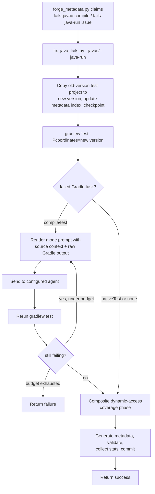

# WF-java-fail-fix-workflow: Java fail-fix workflow

The Java fail-fix workflow is part of the Forge workflow system
(§WF-forge-workflow-system).

## 1. Purpose

The Java fail-fix workflow repairs an already-supported library's test project
when a version bump breaks it on the JVM, before any native-image concern. It
covers two version-bump failure modes:

- **Compilation failure** — `compileJava` or `compileTestJava` fails because the
  bumped library changed its API.
- **Runtime test failure** — compilation succeeds, but the Gradle `test` task
  fails at run time with errors such as `NoSuchMethodError`,
  `ClassNotFoundException`, changed behavior, or new exceptions.

Both modes share one operational model: copy the last working version's test
project to the failing version, drive an agent to make the minimal edit that
makes the test compile and pass, and then improve dynamic-access coverage for
the new version through the composite phase (§WF-improve-library-coverage). The
modes differ in prompt wording, strategy names, metrics file, and PR label, not
in control flow. The compilation path is the original `fix_javac_fail` workflow;
the runtime path reuses the same model with runtime-focused wording.

A repaired test must keep meaningful functional coverage; the workflow must not
simplify a test to triviality just to make it pass
(§FS-local-ci-equivalent-verification).

## 2. Inputs

| Input | Source | Required |
| --- | --- | --- |
| Mode | `--javac` or `--java-run` (mutually exclusive) | yes |
| Current coordinate | `--coordinates group:artifact:oldVersion` | yes |
| New version | `--new-version <newVersion>` | yes |
| Strategy | `--strategy-name` (mode default below) | no |
| Reachability repo path | `--reachability-metadata-path` (default: parent checkout of `forge/`) | no |
| Metrics repo path | `--metrics-repo-path` | no |
| Docs path | `--docs-path` (extra read-only agent context) | no |
| Claimed issue label | `fails-javac-compile` or `fails-java-run` routed by `forge_metadata.py` | yes for issue-driven runs |

The preferred CLI is `ai_workflows/drivers/fix_java_fails.py`
(§WF-forge-workflow-drivers), with a required mutually exclusive mode flag:

```console
python3 ai_workflows/drivers/fix_java_fails.py \
  --javac \
  --coordinates <group:artifact:oldVersion> \
  --new-version <newVersion> \
  [--strategy-name NAME] \
  [--reachability-metadata-path /path/to/graalvm-reachability-metadata] \
  [--metrics-repo-path /path/to/metrics-storage] \
  [--docs-path /path/to/docs] \
  [-v]
```

```console
python3 ai_workflows/drivers/fix_java_fails.py \
  --java-run \
  --coordinates <group:artifact:oldVersion> \
  --new-version <newVersion> \
  [--strategy-name NAME] \
  [--reachability-metadata-path /path/to/graalvm-reachability-metadata] \
  [--metrics-repo-path /path/to/metrics-storage] \
  [--docs-path /path/to/docs] \
  [-v]
```

Mode defaults:

- `--javac`: `javac_iterative_with_coverage_sources_pi_gpt-5.4`
- `--java-run`: `java_run_iterative_with_coverage_sources_pi_gpt-5.4`

The mode-specific entry points `ai_workflows/drivers/fix_javac_fail.py` and
`ai_workflows/drivers/fix_java_run_fail.py` remain for focused mode invocation,
but new shared Java-fail usage should point at `fix_java_fails.py`. The
issue-driven path is dispatched by `forge_metadata.py` after the issue is
claimed and an isolated worktree is prepared by the workflow driver
(§ORCH-forge-orchestration-spec, §WF-forge-workflow-drivers).

## 3. Workflow

At a glance:



Required behavior — shared by both modes:

1. Copy or prepare the last supported version's test project against the failing
   version, update the metadata index, create the versioned metadata directory,
   and capture a checkpoint commit so failure handling can tell setup output
   from generated work (§WF-forge-workflow-drivers).
2. Run `./gradlew test -Pcoordinates=<library>` to collect failure output.
3. Render the mode's initial prompt with source context and the raw Gradle
   output, and send it to the configured agent.
4. Loop: rerun `./gradlew test` and send subsequent failure output back to the
   agent until the test passes or `max-test-iterations` is exhausted.
5. Treat reaching `nativeTest`, or no failed Gradle task, as JVM success.
6. After the JVM fix succeeds, run the dynamic-access coverage phase for the new
   version through the composite strategy, so a version-bump repair also leaves
   the new version better covered (§WF-improve-library-coverage,
   §STRAT-java-fail-fix-composite-strategy-config).
7. Finalize: generate metadata, validate tests, collect stats, and commit.

The only differences between the two modes are workflow identity and prompt
wording: javac fixes use compilation-failure wording and write
`fix_javac_fail.json`; java-run fixes use runtime-failure wording and write
`fix_java_run_fail.json`. Logs, task type, branch names, strategy names, and PR
labels stay distinct across modes (§FS-durable-generation-logs).

### Native test verification gate

When a runtime failure occurs under `nativeTest`, the common cause is missing
reachability metadata for the new library version. The runtime fix workflow does
not handle this itself: after the agent (or the configured post-generation
intervention) produces its final edit, it invokes the native test verification
gate once, with
`output_dir = tests/src/<group>/<artifact>/<version>/build/natively-collected/_global_/`,
as the workflow's terminal success criterion. The gate runs JVM-agent metadata
first, native tracing as a fallback, and Codex last, collecting missing
reachability metadata from a real native run (§WF-native-metadata-tracing). A
`FAILED` result aborts the workflow with `RUN_STATUS_FAILURE`, since partial
recovery is not an acceptable terminal state (§WF-native-test-verification-gate).
It is the same component the dynamic-access workflow drives per class, here
configured with a single global output directory instead of a per-class one
(§WF-native-test-verification-callers).

## 4. Outputs

Successful runs produce:

- A repaired, still-meaningful test project for the new version under
  `tests/src/<group>/<artifact>/<newVersion>/`.
- Updated metadata, index, and stats artifacts for the new version.
- Improved dynamic-access coverage for the new version from the composite phase
  (§WF-improve-library-coverage).
- Durable logs for the initial Gradle run, each agent turn, the coverage phase,
  and finalization (§FS-durable-generation-logs).
- Run metrics written to `fix_javac_fail.json` or `fix_java_run_fail.json`;
  `utility_scripts/metrics_writer.py` builds the java-run output via
  `create_java_run_fix_run_metrics_output_json`, reusing the javac construction
  because the output contract is identical.
- A PR-eligible result published by the mode's git script
  (§GIT-forge-publication): `git_scripts/make_pr_javac_fix.py` with the
  `fixes-javac-fail` label, or `git_scripts/make_pr_java_run_fix.py` with the
  `fixes-java-run-fail` label. The java-run script stages the versioned tests,
  metadata index, metadata version directory, and stats; creates branch
  `ai/<gh-login>/fix-java-run-<group>-<artifact>-<newVersion>`; includes
  generation stats, a stats comparison, and an old-vs-new test diff; and commits
  successful run metrics to
  `stats/<group>/<artifact>/<version>/execution-metrics.json`.

## 5. Failure Rules

The workflow fails when:

- The agent cannot make the test compile (javac mode) or pass (java-run mode)
  within `max-test-iterations`.
- The post-iteration native test verification gate returns `FAILED`
  (§WF-native-test-verification-gate).
- Finalization, metadata generation, validation, or stats collection fails.
- Required logs for the run are not preserved (§FS-durable-generation-logs).

Failures must not open a PR or mark the issue done; the saved logs and working
tree are the debugging surface for the next maintainer or Forge run
(§FS-local-ci-equivalent-verification, §FS-durable-generation-logs).

## 6. Implementation

### Shared strategy implementation

`java_run_iterative` and `javac_iterative` are thin registered specializations
over a shared `JavaTestFixIterativeStrategy` implementation, because their
control flow is identical and only the prompts differ. A mode field
distinguishes the specializations, which provide only mode-specific constants:
log prefix, retry prompt title, retry detail message, and whether to skip agent
prompting when the initial test already reaches `nativeTest` or passes. This
keeps the two workflows behaviorally aligned
(§STRAT-java-fail-fix-composite-strategy-config).

### Shared orchestration

The common Java-fail orchestration lives in
`ai_workflows/drivers/java_fail_workflow.py`.
It owns CLI parser construction for the mode-specific entry scripts,
repository and metrics path resolution, the versioned test-project
copy/preparation, metadata index and version-directory setup, source-context
preparation, strategy and agent initialization, and success finalization,
rollback, and metrics writing. Mode-specific wrappers provide only a
`JavaFailWorkflowConfig` (§WF-forge-workflow-drivers). The mode-specific entry
point `ai_workflows/drivers/fix_java_run_fail.py` delegates to it with
runtime-fix configuration (`task_type="fix-java-run-fail"`), and
`fix_java_fails.py --java-run` delegates to that same implementation.

### Prompt template

`prompt_templates/fix-java-run/initial-with-sources.md` drives the runtime mode:

```markdown
Task:
- Fix the runtime test failures for library version `{updated_library}`. Test was initially written for version `{old_version}`.
- The test compiles successfully but fails at run time against the new library version.

Source context:
{source_context_overview}

How to use the source context:
- Focus on source files for the classes explicitly named in the Gradle error output below.
- Look for API changes, including renamed methods, changed signatures, removed classes, changed behavior, or new exceptions that explain the runtime failures.
- Stop inspecting sources once you understand the cause of each failure. Then make the minimal edit.

Rules:
- Only edit files that are added to context. Modify `{build_gradle_file}` only if additional dependencies are required.
- Test that is fixed must maintain functional coverage. Never simplify the test to the point of triviality.
- Keep the test in `{test_language_display_name}` under `src/test/{test_source_dir_name}`.
- Follow idiomatic `{test_language_display_name}` coding conventions.
- Use only the provided library version and avoid all deprecated APIs.

Runtime error output:
{initial_error}
```

### Forge metadata integration

`forge_metadata.py` dispatches Java version-bump failures through the unified
entry point and the do-work loop (§ORCH-forge-orchestration-spec,
§DW-do-work-loop):

- `--label fails-javac-compile` invokes `fix_java_fails.py --javac`.
- `--label fails-java-run` invokes `fix_java_fails.py --java-run`.
- `fails-java-run` is included in the recognized pipeline label set and
  `--label` choices.
- Successful `fails-java-run` issues finalize with
  `git_scripts/make_pr_java_run_fix.py`.
