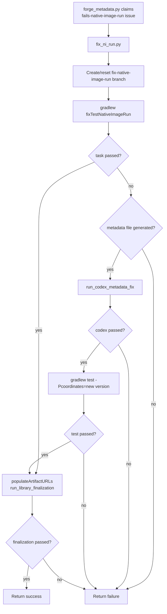

# WF-native-image-run-fix-workflow: Native-image run-fix workflow

The native-image run-fix workflow is part of the Forge workflow system
(§WF-forge-workflow-system).

## 1. Purpose

The native-image run-fix workflow resolves `fails-native-image-run` issues for
existing tested libraries whose JVM tests are already present but whose
`nativeTest` path fails after a version bump. Its job is to update the tested
version's reachability metadata and related index/stats artifacts so the full
coordinate test passes local CI-equivalent verification
(§FS-local-ci-equivalent-verification) and can be published under the
`fixes-native-image-run-fail` PR label (§GIT-forge-publication).

This workflow is metadata-first. It should not rewrite the test suite unless the
native-image failure proves that the existing test is invalid for the bumped
version rather than missing metadata.

## 2. Inputs

| Input | Source | Required |
| --- | --- | --- |
| Current coordinate | `--coordinates group:artifact:oldVersion` | yes |
| New version | `--new-version <version>` | yes |
| Reachability repo path | `--reachability-metadata-path` (default: parent checkout of `forge/`) | yes |
| Claimed issue label | `fails-native-image-run` routed by `forge_metadata.py` | yes for issue-driven runs |

The issue-driven path is dispatched by `forge_metadata.py`
(§ORCH-forge-orchestration-spec) after the issue is claimed and an isolated
worktree has been prepared by the workflow driver
(§WF-forge-workflow-drivers).

## 3. Workflow

At a glance:

Required behavior:

1. Create or reset a workflow branch named from the group, artifact, and target
   version before changing generated artifacts.
2. Run `./gradlew fixTestNativeImageRun
   -PtestLibraryCoordinates=<old-coordinate> -PnewLibraryVersion=<new-version>`
   in the complete reachability repo worktree.
3. If the Gradle task fails before producing
   `metadata/<group>/<artifact>/<newVersion>/reachability-metadata.json`, fail
   the workflow. There is no reliable generated metadata base for Codex to
   repair.
4. If metadata was generated but the Gradle task failed, invoke Codex metadata
   repair against the new coordinate using the same GraalVM environment as the
   failed Gradle run (§FS-durable-generation-logs).
5. After Codex repair succeeds, rerun
   `./gradlew test -Pcoordinates=<group>:<artifact>:<newVersion>`. If it still
   fails, fail the workflow instead of publishing a partial repair
   (§FS-local-ci-equivalent-verification).
6. Populate artifact URLs for the new coordinate and run the standard library
   finalization checks before returning success (§GIT-forge-publication).

## 4. Outputs

Successful runs produce:

- Updated metadata under `metadata/<group>/<artifact>/<newVersion>/`.
- Updated test/index/stats artifacts produced by the Gradle fix task and final
  library finalization.
- Durable logs for the Gradle fix task, Codex metadata fix when used, Gradle
  retest, and finalization (§FS-durable-generation-logs).
- A PR-eligible result for publication with the
  `fixes-native-image-run-fail` label (§GIT-issue-linking).

The workflow currently does not write the same metrics shape as the agent-based
Java fail-fix and dynamic-access workflows. When metrics are added, they must
follow the durable logging and local verification contracts before publication
(§FS-local-ci-equivalent-verification).

## 5. Failure Rules

The workflow fails when:

- `fixTestNativeImageRun` fails before producing the new version metadata file.
- Codex metadata repair exits non-zero or times out.
- The post-Codex `./gradlew test -Pcoordinates=<new-coordinate>` fails.
- Artifact URL population or library finalization fails.
- Required logs for the generation or repair path are not preserved.

Failures must not open a PR or mark the issue done. The saved logs and generated
working tree state are the debugging surface for the next maintainer or Forge
run (§FS-durable-generation-logs).
