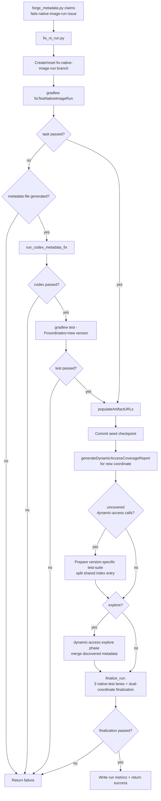

# WF-native-image-run-fix-workflow: Native-image run-fix workflow

The native-image run-fix workflow is part of the Forge workflow system
(§WF-forge-workflow-system).

## 1. Purpose

The native-image run-fix workflow resolves `fails-native-image-run` issues for
existing tested libraries whose JVM tests are already present but whose
`nativeTest` path fails after a version bump. Its job is to update the tested
version's reachability metadata and related index/stats artifacts so the full
coordinate test passes local CI-equivalent verification
(§FS-local-ci-equivalent-verification) and can be published under the
`fixes-native-image-run-fail` PR label (§GIT-forge-publication).

This workflow is metadata-first. It should not rewrite the test suite unless the
native-image failure proves that the existing test is invalid for the bumped
version rather than missing metadata.

## 2. Inputs

| Input | Source | Required |
| --- | --- | --- |
| Current coordinate | `--coordinates group:artifact:oldVersion` | yes |
| New version | `--new-version <version>` | yes |
| Reachability repo path | `--reachability-metadata-path` (default: parent checkout of `forge/`) | yes |
| Claimed issue label | `fails-native-image-run` routed by `forge_metadata.py` | yes for issue-driven runs |

The issue-driven path is dispatched by `forge_metadata.py`
(§ORCH-forge-orchestration-spec) after the issue is claimed and an isolated
worktree has been prepared by the workflow driver
(§WF-forge-workflow-drivers).

## 3. Workflow

`fixTestNativeImageRun` is a **seed generator, not a success gate**. A
`fixes-native-image-run-fail` fix is PR-eligible only after it passes the same
shared finalization path — including the three native-test lanes — as every
other Forge driver (§WF-dynamic-access-iterative-strategy,
§FS-local-ci-equivalent-verification.1). Finalization always runs; dynamic-access
exploration runs only when the new version has uncovered call sites.

At a glance:

Required behavior:

1. Create or reset a workflow branch named from the group, artifact, and target
   version before changing generated artifacts.
2. Run `./gradlew fixTestNativeImageRun
   -PtestLibraryCoordinates=<old-coordinate> -PnewLibraryVersion=<new-version>`
   in the complete reachability repo worktree to produce the **seed**.
3. If the Gradle task fails before producing
   `metadata/<group>/<artifact>/<newVersion>/reachability-metadata.json`, fail
   the workflow. There is no reliable generated metadata base for Codex to
   repair.
4. If metadata was generated but the Gradle task failed, invoke Codex metadata
   repair against the new coordinate using the same GraalVM environment as the
   failed Gradle run (§FS-durable-generation-logs), then rerun
   `./gradlew test -Pcoordinates=<group>:<artifact>:<newVersion>`. If it still
   fails, fail the workflow instead of publishing a partial repair.
5. Populate artifact URLs for the new coordinate before any source-context
   preparation, then commit the seed checkpoint. This runs even when exploration
   will be skipped, because the seeded PR still needs source, test,
   documentation, and repository URL fields.
6. **Coverage gate.** Generate the dynamic-access coverage report for the new
   coordinate (`generateDynamicAccessCoverageReport`). Exploration runs only when
   the report has dynamic access with uncovered call sites; an empty or
   fully-covered report skips exploration (and its suite preparation) entirely
   and proceeds straight to finalization, preserving the metadata-first behavior.
7. **Conditional exploration.** When uncovered calls exist, prepare a
   version-specific test-suite the same way the explore-then-finalize drivers do
   — the seed leaves the new version sharing the old version's test directory, so
   the shared index entry is split into a version-specific entry that creates
   `tests/src/<group>/<artifact>/<newVersion>/` while preserving the seed
   metadata and populated URL fields (§WF-improve-library-coverage). Then run the
   dynamic-access explore phase (§WF-dynamic-access-iterative-strategy) against
   the new version, *merging* any newly discovered metadata into the existing
   `metadata/<group>/<artifact>/<newVersion>/reachability-metadata.json`.
   Exploration is best-effort: a partial or failed explore does not abort the
   workflow, because a reset returns to the valid seed checkpoint and
   finalization is the gate.
8. **Mandatory finalization.** Run the shared `finalize_run` path
   (§WF-dynamic-access-iterative-strategy): `generateMetadata
   --agentAllowedPackages=fromJar` (the merge step that preserves seed/agent
   metadata), the three native-test lanes (current-defaults latest GraalVM,
   `future-defaults-all`, current-defaults on the GraalVM 25 toolchain —
   §FS-local-ci-equivalent-verification.1) for both the requested and resolved
   metadata coordinates, then `run_library_finalization` per coordinate. Its
   status decides PR eligibility (§GIT-forge-publication).
9. Write run metrics (previous-vs-new shape) to
   `stats/<group>/<artifact>/<metadataVersion>/execution-metrics.json` and the
   pending-metrics sidecar consumed by the PR step.

## 4. Outputs

Successful runs produce:

- Updated metadata under `metadata/<group>/<artifact>/<newVersion>/`, merged from
  the seed plus any dynamic-access discoveries.
- When exploration ran, a version-specific test project under
  `tests/src/<group>/<artifact>/<newVersion>/`; otherwise the metadata-first
  layout sharing the old version's test directory.
- Updated index/stats artifacts and dual-coordinate finalization output.
- Durable logs for the Gradle fix task, Codex metadata fix when used, Gradle
  retest, the explore phase, the three native-test lanes, and finalization
  (§FS-durable-generation-logs).
- Run metrics written to
  `stats/<group>/<artifact>/<metadataVersion>/execution-metrics.json` following
  the durable logging and local verification contracts
  (§FS-local-ci-equivalent-verification).
- A PR-eligible result for publication with the `fixes-native-image-run-fail`
  label (§GIT-issue-linking), whose body includes the run metrics and an
  old-vs-new test diff.

## 5. Failure Rules

The workflow fails when:

- `fixTestNativeImageRun` fails before producing the new version metadata file.
- Codex metadata repair exits non-zero or times out.
- The post-Codex `./gradlew test -Pcoordinates=<new-coordinate>` fails.
- The shared finalization path fails: any of the three native-test lanes, the
  dual-coordinate `run_library_finalization`, or artifact URL population
  (§FS-local-ci-equivalent-verification.1).
- Required logs for the generation, repair, or finalization path are not
  preserved.

A best-effort exploration that does not fully cover every uncovered call is **not**
a failure; only the mandatory finalization gate determines PR eligibility.

Failures must not open a PR or mark the issue done. The saved logs and generated
working tree state are the debugging surface for the next maintainer or Forge
run (§FS-durable-generation-logs).
