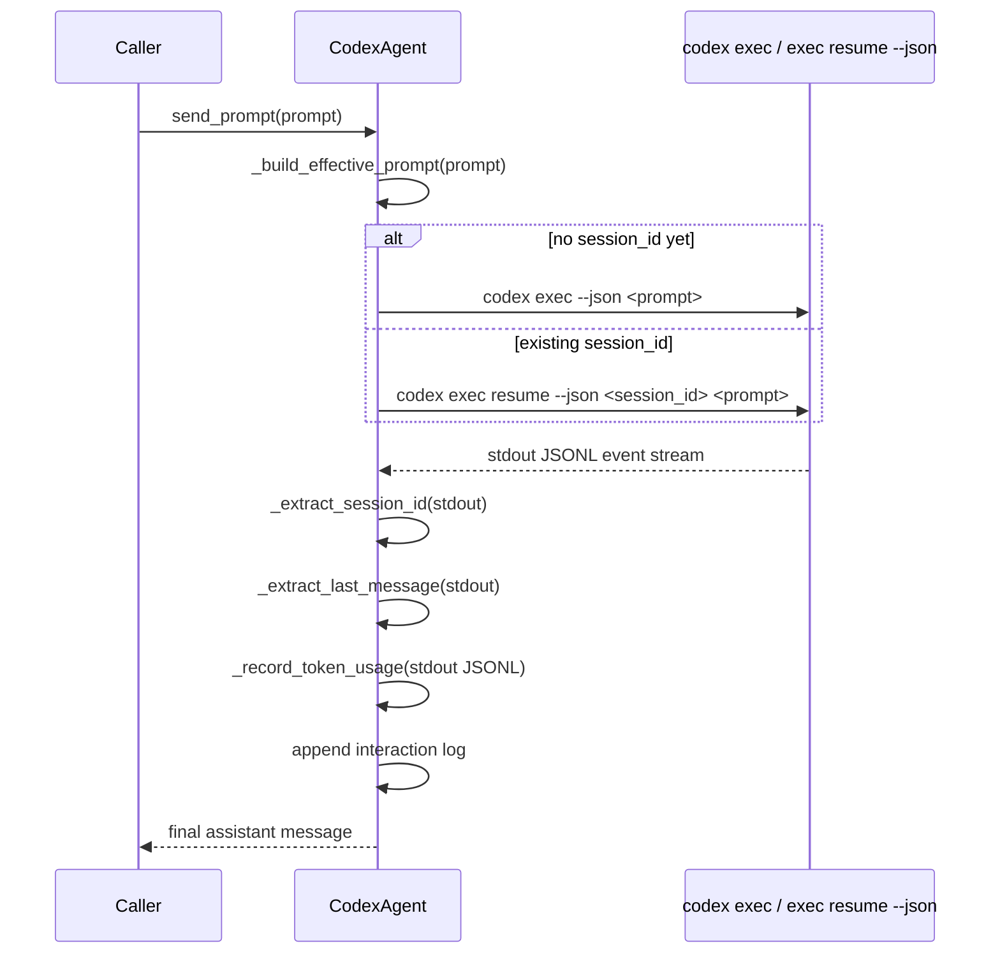

# CodexAgent `send_prompt()` Sequence

This diagram shows the current implementation.

- the first prompt uses `codex exec --json`
- follow-up prompts use `codex exec resume --json <session_id> <prompt>`
- `stdout` carries the session id, usage, and final assistant message

## The weird part

The only non-obvious part is that one JSON stream contains several concerns:

1. `stdout`
   - session id via `thread.started`
   - assistant reply via `item.completed`
   - usage via `turn.completed`

So `send_prompt()` has to parse JSONL rather than treat `stdout` as plain text.
